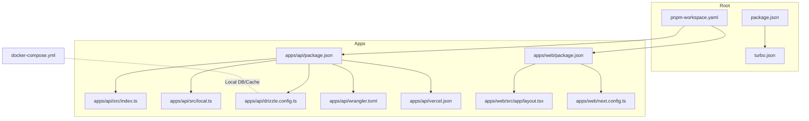
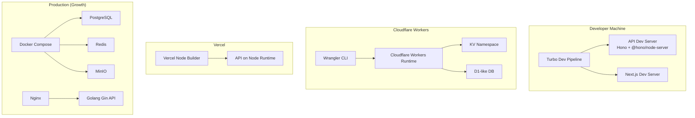
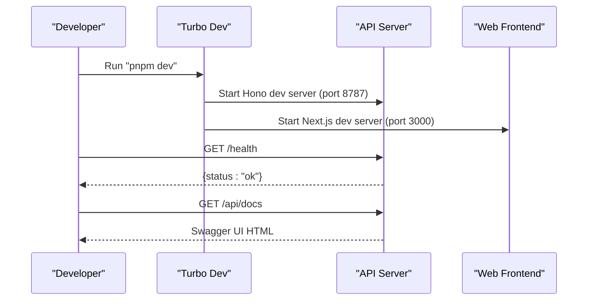
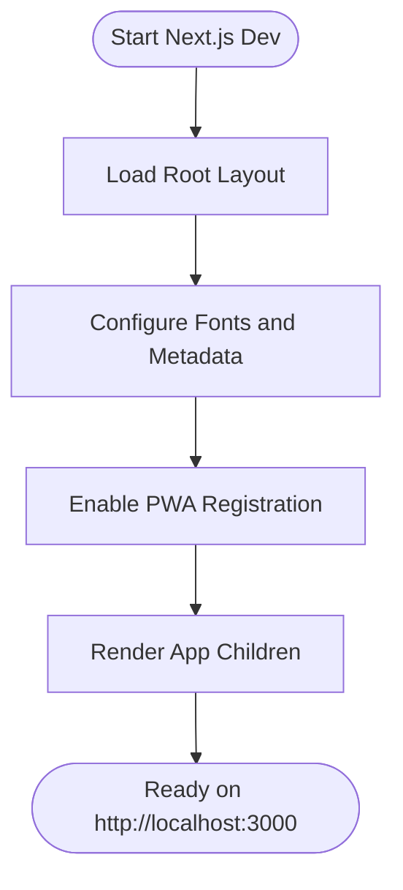
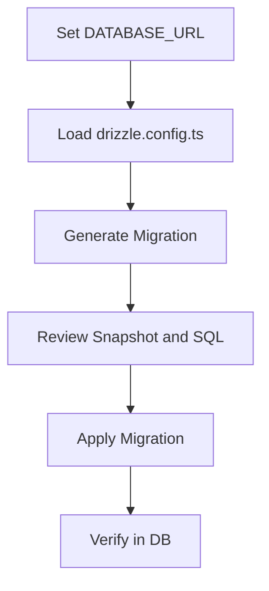
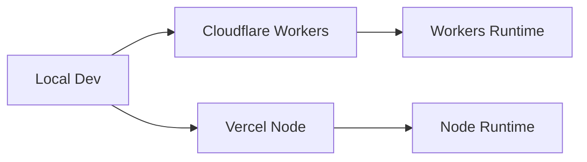
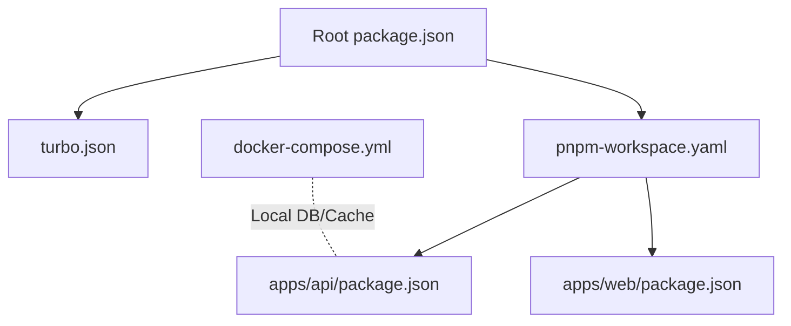

# Getting Started

<cite>
**Referenced Files in This Document**
- [README.md](file://README.md)
- [package.json](file://package.json)
- [pnpm-workspace.yaml](file://pnpm-workspace.yaml)
- [turbo.json](file://turbo.json)
- [apps/api/package.json](file://apps/api/package.json)
- [apps/api/src/index.ts](file://apps/api/src/index.ts)
- [apps/api/src/local.ts](file://apps/api/src/local.ts)
- [apps/api/drizzle.config.ts](file://apps/api/drizzle.config.ts)
- [apps/api/wrangler.toml](file://apps/api/wrangler.toml)
- [apps/api/vercel.json](file://apps/api/vercel.json)
- [apps/web/package.json](file://apps/web/package.json)
- [apps/web/src/app/layout.tsx](file://apps/web/src/app/layout.tsx)
- [apps/web/next.config.ts](file://apps/web/next.config.ts)
- [docker-compose.yml](file://docker-compose.yml)
</cite>

## Table of Contents
1. [Introduction](#introduction)
2. [Project Structure](#project-structure)
3. [Core Components](#core-components)
4. [Architecture Overview](#architecture-overview)
5. [Detailed Component Analysis](#detailed-component-analysis)
6. [Dependency Analysis](#dependency-analysis)
7. [Performance Considerations](#performance-considerations)
8. [Troubleshooting Guide](#troubleshooting-guide)
9. [Conclusion](#conclusion)
10. [Appendices](#appendices)

## Introduction
ARHAT POS is a cloud-based Point of Sale and business management platform designed for UMKM (small and medium enterprises). It integrates POS, inventory, customer relationship management (CRM), reporting, and WhatsApp automation into a single application. The project is built as a monorepo using pnpm workspaces and Turbo for optimized builds and development workflows. It consists of two primary applications:
- API server (Cloudflare Workers-based) under apps/api
- Web frontend (Next.js) under apps/web

The platform targets diverse business types including retail stores, cafes, restaurants, laundries, workshops, and multi-outlet businesses. It emphasizes real-time analytics, automated receipts, and scalable deployment options.

**Section sources**
- [README.md:1-574](file://README.md#L1-L574)

## Project Structure
The repository follows a monorepo layout with pnpm workspaces and Turbo pipeline orchestration:
- Root-level configuration defines engines, global scripts, and shared tooling.
- apps/api contains the backend service (Hono + Drizzle ORM + PostgreSQL via Supabase).
- apps/web contains the Next.js frontend with TypeScript, Tailwind CSS, and Shadcn/UI.
- packages holds shared configurations and UI components.
- docker-compose.yml defines local infrastructure for PostgreSQL and Redis for production-like environments.

Key workspace and pipeline files:
- pnpm-workspace.yaml: Declares packages and allows selective builds.
- turbo.json: Defines pipeline stages (build, lint, type-check, test, dev) and caching behavior.
- package.json: Root scripts delegate to Turbo for unified development commands.

**Diagram sources**
- [package.json:1-30](file://package.json#L1-L30)
- [pnpm-workspace.yaml:1-10](file://pnpm-workspace.yaml#L1-L10)
- [turbo.json:1-28](file://turbo.json#L1-L28)
- [apps/api/package.json:1-37](file://apps/api/package.json#L1-L37)
- [apps/api/src/index.ts:1-99](file://apps/api/src/index.ts#L1-L99)
- [apps/api/src/local.ts:1-8](file://apps/api/src/local.ts#L1-L8)
- [apps/api/drizzle.config.ts:1-13](file://apps/api/drizzle.config.ts#L1-L13)
- [apps/api/wrangler.toml:1-10](file://apps/api/wrangler.toml#L1-L10)
- [apps/api/vercel.json:1-16](file://apps/api/vercel.json#L1-L16)
- [apps/web/package.json:1-40](file://apps/web/package.json#L1-L40)
- [apps/web/src/app/layout.tsx:1-60](file://apps/web/src/app/layout.tsx#L1-L60)
- [apps/web/next.config.ts:1-17](file://apps/web/next.config.ts#L1-L17)
- [docker-compose.yml:1-43](file://docker-compose.yml#L1-L43)

**Section sources**
- [package.json:1-30](file://package.json#L1-L30)
- [pnpm-workspace.yaml:1-10](file://pnpm-workspace.yaml#L1-L10)
- [turbo.json:1-28](file://turbo.json#L1-L28)
- [docker-compose.yml:1-43](file://docker-compose.yml#L1-L43)

## Core Components
- API Server (apps/api)
  - Built with Hono framework, TypeScript, and Drizzle ORM.
  - Exposes REST endpoints grouped by modules (auth, products, transactions, analytics, inventory, customers, settings, users, shifts, whatsapp, raw materials).
  - CORS and logging middleware configured; health check endpoint included.
  - Local development server via @hono/node-server on port 8787 (or configurable via PORT).
  - Wrangler configuration for Cloudflare Workers deployment and Vercel configuration for Node runtime deployments.

- Web Frontend (apps/web)
  - Next.js 16 application with TypeScript, Tailwind CSS, and Shadcn/UI.
  - Global layout sets fonts, metadata, PWA manifest, and authentication provider.
  - Remote image pattern configured for Unsplash.

- Database and Migrations
  - Drizzle ORM configuration reads DATABASE_URL from environment variables.
  - Migrations stored under apps/api/migrations with schema snapshots and SQL scripts.

- Infrastructure
  - docker-compose defines PostgreSQL, Redis, and pgAdmin for local development and testing.

**Section sources**
- [apps/api/src/index.ts:1-99](file://apps/api/src/index.ts#L1-L99)
- [apps/api/src/local.ts:1-8](file://apps/api/src/local.ts#L1-L8)
- [apps/api/package.json:1-37](file://apps/api/package.json#L1-L37)
- [apps/web/package.json:1-40](file://apps/web/package.json#L1-L40)
- [apps/web/src/app/layout.tsx:1-60](file://apps/web/src/app/layout.tsx#L1-L60)
- [apps/api/drizzle.config.ts:1-13](file://apps/api/drizzle.config.ts#L1-L13)
- [apps/api/wrangler.toml:1-10](file://apps/api/wrangler.toml#L1-L10)
- [apps/api/vercel.json:1-16](file://apps/api/vercel.json#L1-L16)
- [apps/web/next.config.ts:1-17](file://apps/web/next.config.ts#L1-L17)
- [docker-compose.yml:1-43](file://docker-compose.yml#L1-L43)

## Architecture Overview
The system supports multiple deployment modes:
- Development: Turbo orchestrates parallel dev servers for API and web.
- Cloudflare Workers: API deployed via Wrangler to Workers with KV and D1-like storage.
- Vercel: Alternative Node runtime deployment for the API.
- Production (growth stage): Docker Compose for local infrastructure; future migration to Golang/Gin with Redis and MinIO.

**Diagram sources**
- [package.json:10-17](file://package.json#L10-L17)
- [apps/api/package.json:5-11](file://apps/api/package.json#L5-L11)
- [apps/api/wrangler.toml:1-10](file://apps/api/wrangler.toml#L1-L10)
- [apps/api/vercel.json:1-16](file://apps/api/vercel.json#L1-L16)
- [docker-compose.yml:1-43](file://docker-compose.yml#L1-L43)

## Detailed Component Analysis

### API Server Setup and Development
- Prerequisites
  - Node.js version requirement is specified at the root level.
  - pnpm version requirement is specified at the root level.
  - Cloudflare Wrangler CLI for Workers deployment (optional).
  - Optional: Docker for local DB/Cache during development.

- Environment Variables
  - DATABASE_URL must be set for Drizzle ORM to connect to PostgreSQL.
  - Optional: PORT for the local Node server (defaults to 8787).
  - Wrangler vars include NODE_ENV placeholder for Workers.

- Running Locally
  - Start both apps in parallel using Turbo’s dev command.
  - API server runs via @hono/node-server on port 8787 (or PORT).
  - Web frontend runs via Next.js dev server on port 3000.

- Accessing Modules
  - API base path: /api/*
  - Health check: GET /health
  - API Docs: GET /api/docs (Swagger UI served)

- Deployment
  - Cloudflare Workers: wrangler deploy
  - Vercel: Build and route configured via vercel.json

**Diagram sources**
- [package.json:10-17](file://package.json#L10-L17)
- [apps/api/src/local.ts:1-8](file://apps/api/src/local.ts#L1-L8)
- [apps/api/src/index.ts:42-78](file://apps/api/src/index.ts#L42-L78)
- [apps/web/package.json:5-9](file://apps/web/package.json#L5-L9)

**Section sources**
- [package.json:6-9](file://package.json#L6-L9)
- [apps/api/src/local.ts:4-7](file://apps/api/src/local.ts#L4-L7)
- [apps/api/src/index.ts:19-44](file://apps/api/src/index.ts#L19-L44)
- [apps/api/src/index.ts:46-78](file://apps/api/src/index.ts#L46-L78)
- [apps/api/package.json:5-11](file://apps/api/package.json#L5-L11)
- [apps/web/package.json:5-9](file://apps/web/package.json#L5-L9)

### Web Frontend Setup and Development
- Prerequisites
  - Node.js and pnpm installed as per root engines.
  - API server running locally on port 8787 or deployed externally.

- Environment Variables
  - No explicit environment variables required for Next.js dev server in the repository.

- Running Locally
  - Start Next.js dev server using the dev script.
  - Access the app at http://localhost:3000.

- Layout and PWA
  - Root layout configures fonts, metadata, PWA manifest, and authentication provider.
  - Remote image pattern allows assets from Unsplash.

**Diagram sources**
- [apps/web/src/app/layout.tsx:17-59](file://apps/web/src/app/layout.tsx#L17-L59)
- [apps/web/next.config.ts:3-16](file://apps/web/next.config.ts#L3-L16)

**Section sources**
- [apps/web/package.json:5-9](file://apps/web/package.json#L5-L9)
- [apps/web/src/app/layout.tsx:17-59](file://apps/web/src/app/layout.tsx#L17-L59)
- [apps/web/next.config.ts:3-16](file://apps/web/next.config.ts#L3-L16)

### Database and Migrations
- Drizzle Configuration
  - Schema path, migration output directory, and PostgreSQL dialect are defined.
  - Database URL is loaded from environment variables.

- Migration Workflow
  - Use Drizzle Kit commands to generate and apply migrations.
  - Migrations are stored under apps/api/migrations with snapshot and SQL files.

**Diagram sources**
- [apps/api/drizzle.config.ts:1-13](file://apps/api/drizzle.config.ts#L1-L13)

**Section sources**
- [apps/api/drizzle.config.ts:1-13](file://apps/api/drizzle.config.ts#L1-L13)

### Deployment Targets
- Cloudflare Workers
  - Name and entry point defined in wrangler.toml.
  - Compatibility flags and vars configured for development.

- Vercel
  - Build and route configuration defined in vercel.json to target the API entry.

**Diagram sources**
- [apps/api/wrangler.toml:1-10](file://apps/api/wrangler.toml#L1-L10)
- [apps/api/vercel.json:1-16](file://apps/api/vercel.json#L1-L16)

**Section sources**
- [apps/api/wrangler.toml:1-10](file://apps/api/wrangler.toml#L1-L10)
- [apps/api/vercel.json:1-16](file://apps/api/vercel.json#L1-L16)

## Dependency Analysis
- Monorepo Tooling
  - Root engines enforce Node.js and pnpm versions.
  - Turbo pipeline orchestrates build, lint, type-check, test, and dev tasks.
  - pnpm workspace declares package locations and build allowances.

- Application Dependencies
  - API server depends on Hono, Drizzle ORM, Supabase client, and Cloudflare Workers tooling.
  - Web frontend depends on Next.js, React, Tailwind CSS, and UI libraries.

- Infrastructure
  - docker-compose provides PostgreSQL, Redis, and pgAdmin for local development.

**Diagram sources**
- [package.json:6-9](file://package.json#L6-L9)
- [turbo.json:1-28](file://turbo.json#L1-L28)
- [pnpm-workspace.yaml:1-10](file://pnpm-workspace.yaml#L1-L10)
- [apps/api/package.json:1-37](file://apps/api/package.json#L1-L37)
- [apps/web/package.json:1-40](file://apps/web/package.json#L1-L40)
- [docker-compose.yml:1-43](file://docker-compose.yml#L1-L43)

**Section sources**
- [package.json:6-9](file://package.json#L6-L9)
- [turbo.json:1-28](file://turbo.json#L1-L28)
- [pnpm-workspace.yaml:1-10](file://pnpm-workspace.yaml#L1-L10)
- [apps/api/package.json:13-35](file://apps/api/package.json#L13-L35)
- [apps/web/package.json:11-38](file://apps/web/package.json#L11-L38)
- [docker-compose.yml:1-43](file://docker-compose.yml#L1-L43)

## Performance Considerations
- Build Optimization
  - Turbo caches build outputs and enables parallel execution across apps.
  - Pipeline stages are configured for incremental development and CI-friendly workflows.

- Runtime Performance
  - API server uses lightweight Hono with minimal middleware overhead.
  - Database queries should leverage Drizzle ORM best practices and indexes.
  - Consider enabling compression and CDN for static assets in production.

[No sources needed since this section provides general guidance]

## Troubleshooting Guide
- Node.js and pnpm Versions
  - Ensure Node.js meets the minimum requirement defined at the root level.
  - Ensure pnpm meets the minimum requirement defined at the root level.

- API Server Port Conflicts
  - Default local API port is 8787; override via PORT environment variable if needed.

- Database Connection
  - Set DATABASE_URL for Drizzle ORM to connect to PostgreSQL.
  - Confirm database credentials and network reachability.

- CORS Issues
  - Allowed origins include localhost endpoints; update ALLOWED_ORIGINS in the API server for production domains.

- Wrangler/Vercel Deployment
  - Ensure Wrangler CLI is installed and configured.
  - Verify wrangler.toml and vercel.json entries match your deployment target.

- Docker Services
  - Use docker-compose to spin up PostgreSQL and Redis for local development.
  - Confirm ports are free and containers start successfully.

**Section sources**
- [package.json:6-9](file://package.json#L6-L9)
- [apps/api/src/local.ts:4-7](file://apps/api/src/local.ts#L4-L7)
- [apps/api/drizzle.config.ts:9-11](file://apps/api/drizzle.config.ts#L9-L11)
- [apps/api/src/index.ts:19-25](file://apps/api/src/index.ts#L19-L25)
- [apps/api/wrangler.toml:5-7](file://apps/api/wrangler.toml#L5-L7)
- [apps/api/vercel.json:1-16](file://apps/api/vercel.json#L1-L16)
- [docker-compose.yml:4-16](file://docker-compose.yml#L4-L16)

## Conclusion
ARHAT POS provides a modern, scalable foundation for UMKM management with integrated POS, inventory, CRM, and reporting capabilities. The monorepo structure, powered by pnpm workspaces and Turbo, streamlines development and deployment across Cloudflare Workers, Vercel, and production-grade infrastructure. By following the setup steps, environment configuration, and troubleshooting guidance in this document, you can quickly bootstrap development, run the system locally, and prepare for production deployment.

[No sources needed since this section summarizes without analyzing specific files]

## Appendices

### Initial User Setup and First-Time Configuration
- Default Credentials
  - No default admin credentials are defined in the repository. Create an initial user via the authentication module and configure roles accordingly.
- First-Time Configuration Steps
  - Seed initial data using provided scripts or Drizzle ORM seeds.
  - Configure product categories, suppliers, and initial inventory.
  - Set up user roles and permissions for Super Admin, Owner, Manager, and Cashier.

[No sources needed since this section provides general guidance]

### Essential Commands for Development Workflow
- Install dependencies: pnpm install
- Start development (parallel): pnpm dev
- Build all apps: pnpm build
- Run tests: pnpm test
- Lint: pnpm lint
- Type-check: pnpm type-check
- Format code: pnpm format
- Prepare Git hooks: pnpm prepare

**Section sources**
- [package.json:10-17](file://package.json#L10-L17)