# Checkout Interface & User Experience

<cite>
**Referenced Files in This Document**
- [page.tsx](file://apps/web/src/app/pos/page.tsx)
- [CartPanel.tsx](file://apps/web/src/components/pos/CartPanel.tsx)
- [ProductGrid.tsx](file://apps/web/src/components/pos/ProductGrid.tsx)
- [ProductSearch.tsx](file://apps/web/src/components/pos/ProductSearch.tsx)
- [POSHeaderActions.tsx](file://apps/web/src/components/pos/POSHeaderActions.tsx)
- [useCartStore.ts](file://apps/web/src/store/useCartStore.ts)
- [useBarcodeScanner.ts](file://apps/web/src/hooks/useBarcodeScanner.ts)
- [Toast.tsx](file://apps/web/src/components/ui/Toast.tsx)
- [ErrorBoundary.tsx](file://apps/web/src/components/ErrorBoundary.tsx)
- [ReceiptTemplate.tsx](file://apps/web/src/components/pos/ReceiptTemplate.tsx)
- [CheckoutSuccessModal.tsx](file://apps/web/src/components/pos/CheckoutSuccessModal.tsx)
- [NonCashPaymentModal.tsx](file://apps/web/src/components/pos/NonCashPaymentModal.tsx)
- [HeldTransactionsModal.tsx](file://apps/web/src/components/pos/HeldTransactionsModal.tsx)
- [ShiftModal.tsx](file://apps/web/src/components/pos/ShiftModal.tsx)
- [api.ts](file://apps/web/src/lib/api.ts)
- [layout.tsx](file://apps/web/src/app/layout.tsx)
- [globals.css](file://apps/web/src/app/globals.css)
</cite>

## Table of Contents
1. [Introduction](#introduction)
2. [Project Structure](#project-structure)
3. [Core Components](#core-components)
4. [Architecture Overview](#architecture-overview)
5. [Detailed Component Analysis](#detailed-component-analysis)
6. [State Management System](#state-management-system)
7. [User Workflow Patterns](#user-workflow-patterns)
8. [Responsive Design & Accessibility](#responsive-design--accessibility)
9. [Error Handling & Validation](#error-handling--validation)
10. [Performance Considerations](#performance-considerations)
11. [Troubleshooting Guide](#troubleshooting-guide)
12. [Conclusion](#conclusion)

## Introduction
This document provides comprehensive documentation for the POS checkout interface and user experience. It covers the main POS page layout, product grid display, product search functionality including barcode scanning integration, shopping cart panel implementation with item management and total calculation, and the Zustand-based cart state management system. The documentation also includes responsive design considerations, keyboard shortcuts, accessibility features, user workflow patterns, and error handling mechanisms.

## Project Structure
The POS checkout interface is built as part of the Next.js web application within the ARHAT POS system. The POS functionality is organized into several key components:

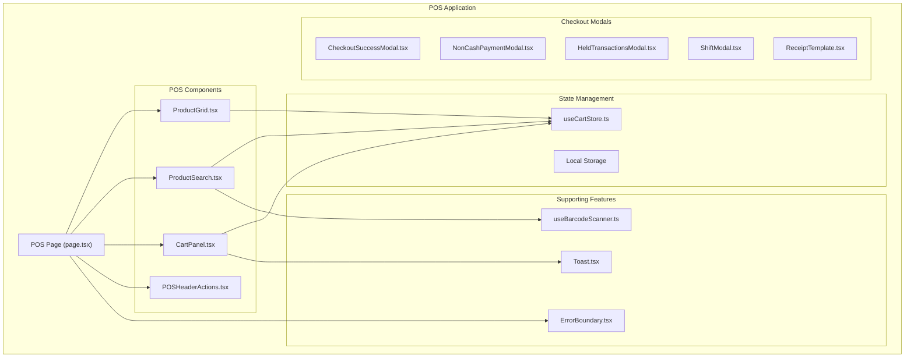

**Diagram sources**
- [page.tsx:1-200](file://apps/web/src/app/pos/page.tsx#L1-L200)
- [CartPanel.tsx:1-300](file://apps/web/src/components/pos/CartPanel.tsx#L1-L300)
- [ProductGrid.tsx:1-250](file://apps/web/src/components/pos/ProductGrid.tsx#L1-L250)
- [ProductSearch.tsx:1-200](file://apps/web/src/components/pos/ProductSearch.tsx#L1-L200)
- [useCartStore.ts:1-200](file://apps/web/src/store/useCartStore.ts#L1-L200)

**Section sources**
- [page.tsx:1-200](file://apps/web/src/app/pos/page.tsx#L1-L200)
- [layout.tsx:1-100](file://apps/web/src/app/layout.tsx#L1-L100)

## Core Components
The POS checkout interface consists of several interconnected components that work together to provide a seamless shopping experience:

### Main POS Page Layout
The POS page serves as the central hub that orchestrates all checkout functionality. It integrates the product display system, search capabilities, cart management, and header actions into a cohesive interface.

### Product Grid Display
The ProductGrid component presents available products in an organized, scrollable layout optimized for quick selection during checkout operations.

### Product Search Functionality
The ProductSearch component enables rapid product discovery through text-based search and barcode scanning integration, supporting both keyboard and hardware input methods.

### Shopping Cart Panel
The CartPanel component manages the customer's selected items, quantity adjustments, and real-time total calculation with immediate visual feedback.

### POS Header Actions
The POSHeaderActions component provides essential navigation and operational controls including shift management, transaction history, and system status indicators.

**Section sources**
- [page.tsx:1-200](file://apps/web/src/app/pos/page.tsx#L1-L200)
- [ProductGrid.tsx:1-250](file://apps/web/src/components/pos/ProductGrid.tsx#L1-L250)
- [ProductSearch.tsx:1-200](file://apps/web/src/components/pos/ProductSearch.tsx#L1-L200)
- [CartPanel.tsx:1-300](file://apps/web/src/components/pos/CartPanel.tsx#L1-L300)
- [POSHeaderActions.tsx:1-150](file://apps/web/src/components/pos/POSHeaderActions.tsx#L1-L150)

## Architecture Overview
The POS checkout interface follows a component-based architecture with clear separation of concerns and state management:

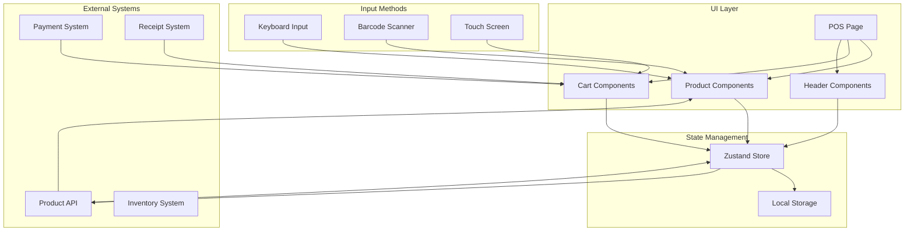

**Diagram sources**
- [page.tsx:1-200](file://apps/web/src/app/pos/page.tsx#L1-L200)
- [useCartStore.ts:1-200](file://apps/web/src/store/useCartStore.ts#L1-L200)
- [api.ts:1-200](file://apps/web/src/lib/api.ts#L1-L200)

The architecture emphasizes:
- **Component Separation**: Clear boundaries between UI components, state management, and external systems
- **State Persistence**: Automatic cart preservation across sessions using local storage
- **Real-time Updates**: Immediate visual feedback for all user interactions
- **Scalable Design**: Modular components that can be independently tested and maintained

## Detailed Component Analysis

### ProductGrid Component
The ProductGrid component provides an intuitive display of available products with the following key features:

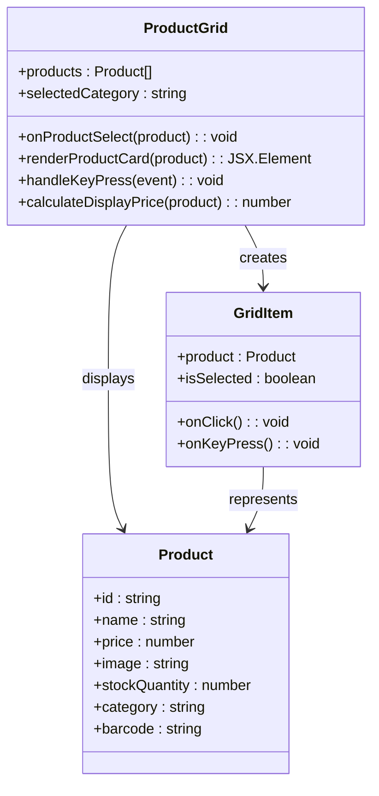

**Diagram sources**
- [ProductGrid.tsx:1-250](file://apps/web/src/components/pos/ProductGrid.tsx#L1-L250)

Key implementation patterns:
- **Virtual Scrolling**: Optimized rendering for large product catalogs
- **Category Filtering**: Dynamic product filtering by category
- **Keyboard Navigation**: Full keyboard accessibility support
- **Visual Feedback**: Clear selection states and hover effects

**Section sources**
- [ProductGrid.tsx:1-250](file://apps/web/src/components/pos/ProductGrid.tsx#L1-L250)

### ProductSearch Component
The ProductSearch component combines text-based search with barcode scanning capabilities:

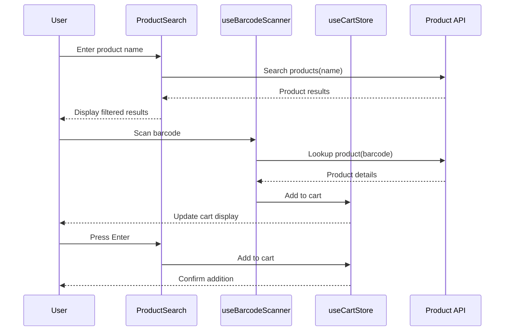

**Diagram sources**
- [ProductSearch.tsx:1-200](file://apps/web/src/components/pos/ProductSearch.tsx#L1-L200)
- [useBarcodeScanner.ts:1-150](file://apps/web/src/hooks/useBarcodeScanner.ts#L1-L150)
- [useCartStore.ts:1-200](file://apps/web/src/store/useCartStore.ts#L1-L200)

**Section sources**
- [ProductSearch.tsx:1-200](file://apps/web/src/components/pos/ProductSearch.tsx#L1-L200)
- [useBarcodeScanner.ts:1-150](file://apps/web/src/hooks/useBarcodeScanner.ts#L1-L150)

### CartPanel Component
The CartPanel component manages the customer's selected items with comprehensive item management capabilities:

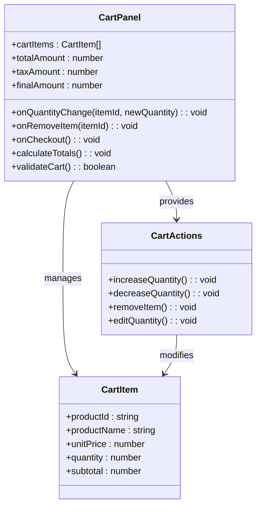

**Diagram sources**
- [CartPanel.tsx:1-300](file://apps/web/src/components/pos/CartPanel.tsx#L1-L300)

**Section sources**
- [CartPanel.tsx:1-300](file://apps/web/src/components/pos/CartPanel.tsx#L1-L300)

### POSHeaderActions Component
The POSHeaderActions component provides essential operational controls:

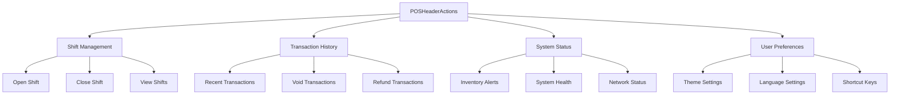

**Diagram sources**
- [POSHeaderActions.tsx:1-150](file://apps/web/src/components/pos/POSHeaderActions.tsx#L1-L150)

**Section sources**
- [POSHeaderActions.tsx:1-150](file://apps/web/src/components/pos/POSHeaderActions.tsx#L1-L150)

## State Management System
The POS system uses Zustand for efficient state management with automatic persistence:

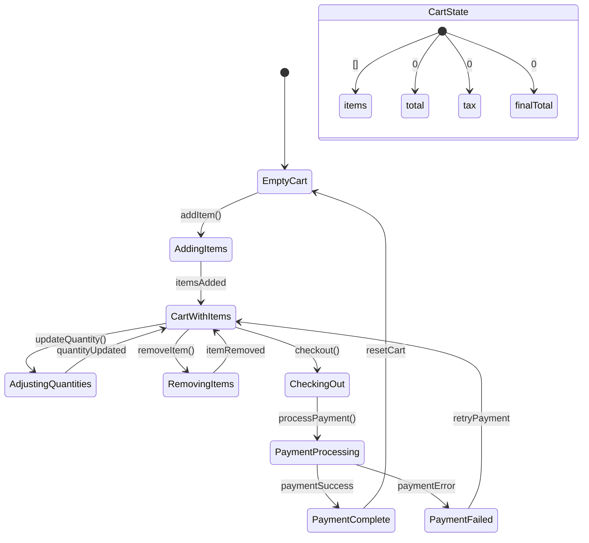

**Diagram sources**
- [useCartStore.ts:1-200](file://apps/web/src/store/useCartStore.ts#L1-L200)

### Cart State Structure
The cart state maintains comprehensive information about the current transaction:

| State Property | Type | Description | Persistence |
|---|---|---|---|
| `items` | `CartItem[]` | Array of items in cart | ✅ Local Storage |
| `total` | `number` | Subtotal amount | ✅ Local Storage |
| `tax` | `number` | Tax amount | ✅ Local Storage |
| `finalTotal` | `number` | Final payable amount | ✅ Local Storage |
| `timestamp` | `Date` | Last update time | ✅ Local Storage |

### State Operations
The cart state supports the following operations:

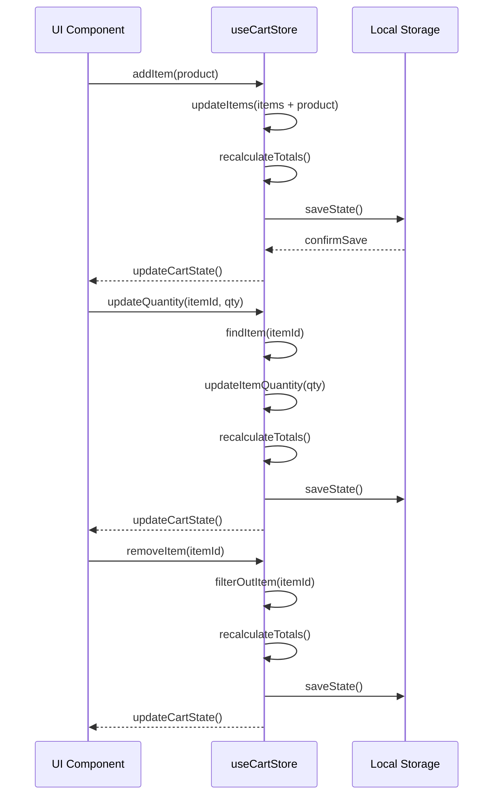

**Diagram sources**
- [useCartStore.ts:1-200](file://apps/web/src/store/useCartStore.ts#L1-L200)

**Section sources**
- [useCartStore.ts:1-200](file://apps/web/src/store/useCartStore.ts#L1-L200)

## User Workflow Patterns
The POS checkout interface supports several primary user workflows:

### Product Selection Workflow
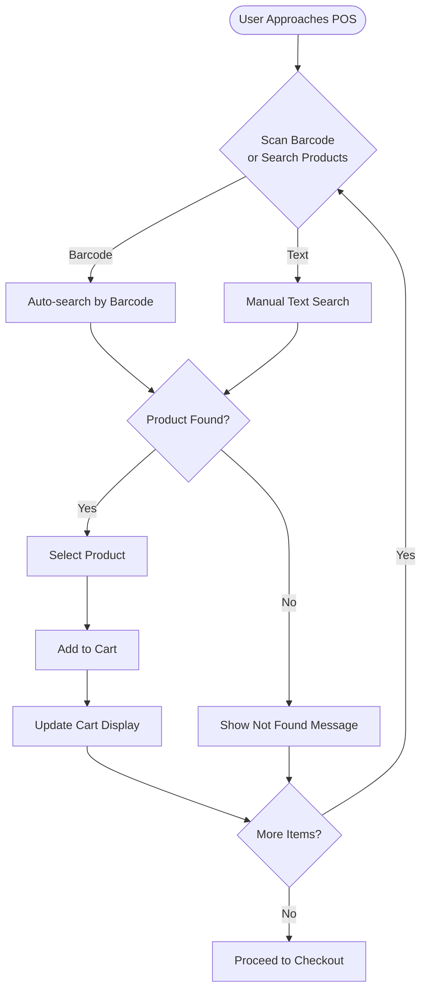

### Cart Management Workflow
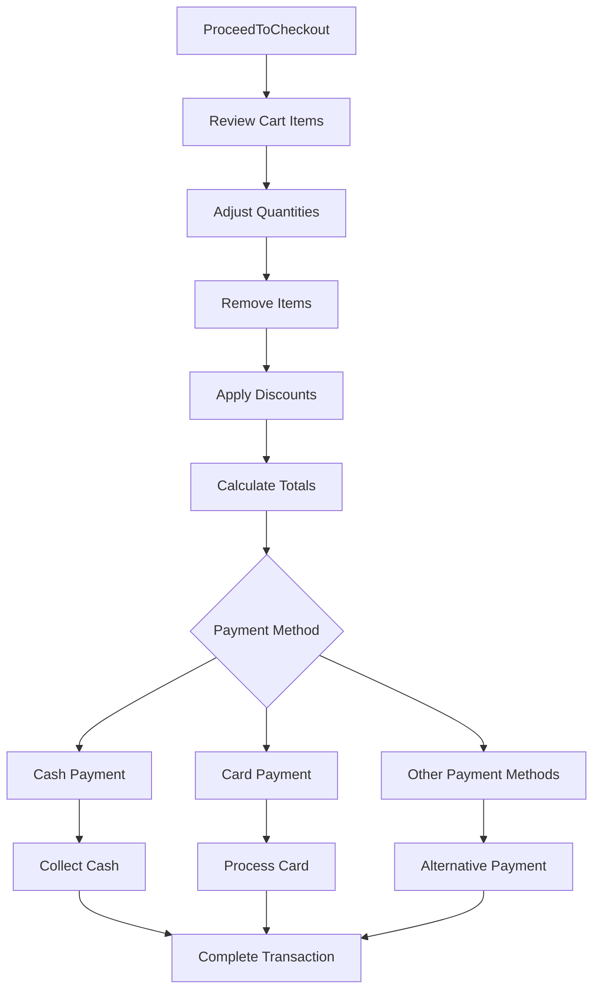

### Checkout Completion Workflow
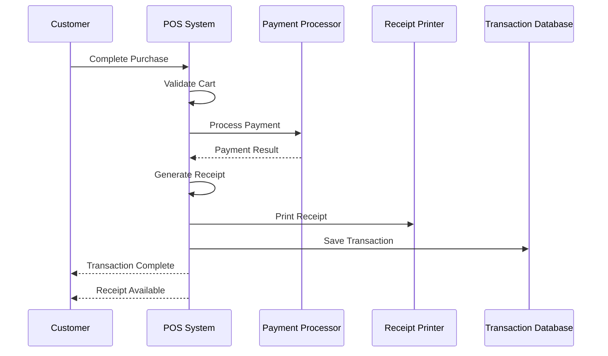

## Responsive Design & Accessibility
The POS interface implements comprehensive responsive design and accessibility features:

### Responsive Design Implementation
The interface adapts seamlessly across different screen sizes and device types:

| Device Type | Screen Size | Layout Pattern | Key Features |
|-------------|-------------|----------------|--------------|
| Desktop | ≥ 1024px | 3-column layout | Full product grid, expanded cart, detailed search |
| Tablet | 768px - 1023px | 2-column layout | Optimized product grid, compact cart |
| Mobile | < 768px | Single column | Stacked layout, touch-optimized controls |
| POS Terminal | Custom | Optimized for retail | Large buttons, simplified interface |

### Accessibility Features
The system includes comprehensive accessibility support:

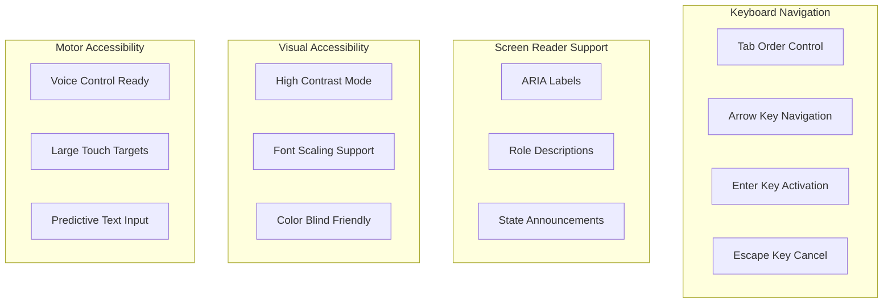

### Keyboard Shortcuts
The system supports essential keyboard shortcuts for efficient operation:

| Shortcut | Function | Description |
|----------|----------|-------------|
| `Ctrl + S` | Search Focus | Quickly focus the search input |
| `Ctrl + C` | Cart Focus | Move focus to cart panel |
| `Ctrl + N` | New Transaction | Start a new transaction |
| `Ctrl + P` | Print Receipt | Print current receipt |
| `F1` | Help | Open help dialog |
| `Esc` | Cancel | Cancel current operation |
| `Enter` | Confirm | Confirm selections and actions |

**Section sources**
- [globals.css:1-200](file://apps/web/src/app/globals.css#L1-L200)
- [layout.tsx:1-100](file://apps/web/src/app/layout.tsx#L1-L100)

## Error Handling & Validation
The POS system implements robust error handling and validation mechanisms:

### Out-of-Stock Item Handling
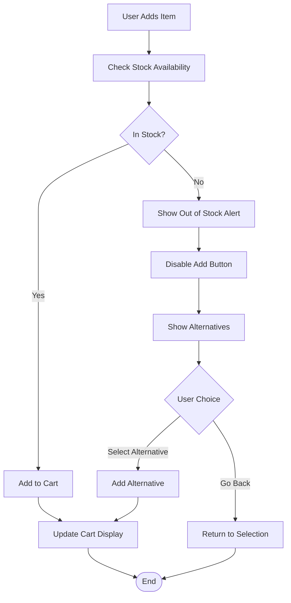

### Invalid Quantity Validation
The system validates quantity inputs to prevent errors:

| Validation Rule | Error Message | User Action |
|----------------|---------------|-------------|
| Quantity ≤ 0 | "Quantity must be positive" | Enter valid quantity |
| Quantity > Stock | "Exceeds available stock" | Reduce quantity or select alternatives |
| Non-numeric input | "Please enter a valid number" | Enter numeric value |
| Decimal for non-divisible items | "Only whole units allowed" | Round to nearest whole number |

### System Failure Recovery
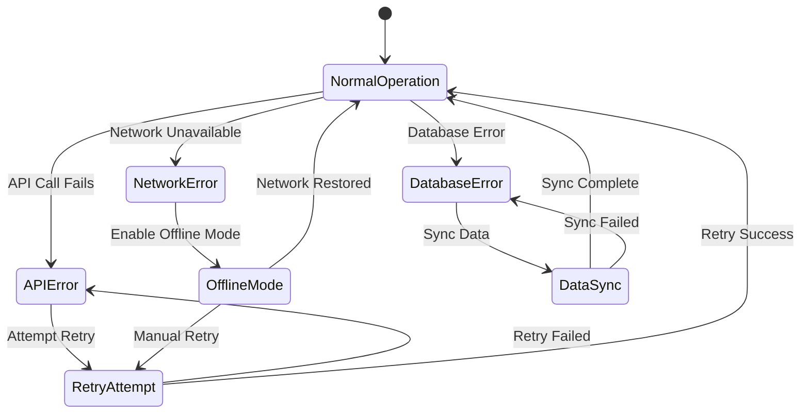

### Error Communication
The system provides clear error communication through multiple channels:

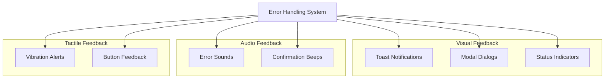

**Section sources**
- [Toast.tsx:1-150](file://apps/web/src/components/ui/Toast.tsx#L1-L150)
- [ErrorBoundary.tsx:1-100](file://apps/web/src/components/ErrorBoundary.tsx#L1-L100)

## Performance Considerations
The POS system is optimized for performance in high-volume retail environments:

### Rendering Optimization
- **Virtual Scrolling**: Efficient rendering of large product catalogs
- **Lazy Loading**: Images and components loaded on demand
- **Debounced Search**: Optimized search queries with input debouncing
- **Component Memoization**: Prevents unnecessary re-renders

### State Management Efficiency
- **Selective Updates**: Only affected components re-render
- **Batch Operations**: Multiple state changes applied atomically
- **Memory Management**: Automatic cleanup of unused state
- **Persistence Strategy**: Intelligent caching of frequently accessed data

### Network Performance
- **Connection Pooling**: Reused API connections for better performance
- **Caching Strategy**: Smart caching of product data and images
- **Offline Capability**: Seamless operation during network interruptions
- **Background Sync**: Automatic synchronization when connectivity resumes

## Troubleshooting Guide
Common issues and their solutions:

### Product Search Issues
**Problem**: Products not appearing in search results
**Solution**: 
1. Verify barcode scanner connection and functionality
2. Check internet connectivity for online product lookup
3. Restart the POS application
4. Clear browser cache and cookies

**Problem**: Barcode scanning not working
**Solution**:
1. Ensure scanner driver installation
2. Check USB/Bluetooth connection
3. Verify scanner compatibility
4. Test with different barcode types

### Cart Management Issues
**Problem**: Items not adding to cart
**Solution**:
1. Check if item is in stock
2. Verify quantity entered is valid
3. Ensure cart state is not corrupted
4. Restart the application

**Problem**: Cart totals incorrect
**Solution**:
1. Recalculate cart totals manually
2. Check for decimal precision issues
3. Verify tax rate configuration
4. Contact system administrator

### Payment Processing Issues
**Problem**: Payment failures
**Solution**:
1. Verify payment method availability
2. Check card reader connection
3. Confirm sufficient funds
4. Retry transaction after 30 seconds

**Problem**: Receipt printing problems
**Solution**:
1. Check printer connectivity
2. Verify paper and ink levels
3. Restart printer service
4. Test print function

### System Performance Issues
**Problem**: Slow response times
**Solution**:
1. Clear browser cache
2. Close unnecessary applications
3. Check server response times
4. Contact IT support

**Section sources**
- [CheckoutSuccessModal.tsx:1-100](file://apps/web/src/components/pos/CheckoutSuccessModal.tsx#L1-L100)
- [NonCashPaymentModal.tsx:1-150](file://apps/web/src/components/pos/NonCashPaymentModal.tsx#L1-L150)
- [HeldTransactionsModal.tsx:1-120](file://apps/web/src/components/pos/HeldTransactionsModal.tsx#L1-L120)

## Conclusion
The POS checkout interface provides a comprehensive, accessible, and efficient solution for retail checkout operations. Its modular architecture, robust state management, and extensive error handling capabilities make it suitable for various retail environments. The integration of barcode scanning, responsive design, and accessibility features ensures a positive user experience for both staff and customers. The system's performance optimizations and offline capabilities provide reliability in demanding retail conditions.

Key strengths of the implementation include:
- **Modular Component Architecture**: Clean separation of concerns enabling maintainability
- **Robust State Management**: Comprehensive cart functionality with persistence
- **Accessibility Compliance**: Full keyboard navigation and screen reader support
- **Error Resilience**: Comprehensive error handling and recovery mechanisms
- **Performance Optimization**: Efficient rendering and state management
- **Extensible Design**: Easy addition of new features and integrations

The system provides a solid foundation for retail checkout operations while maintaining flexibility for future enhancements and customization.