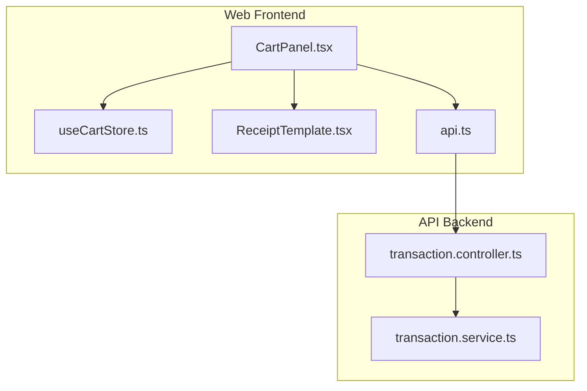
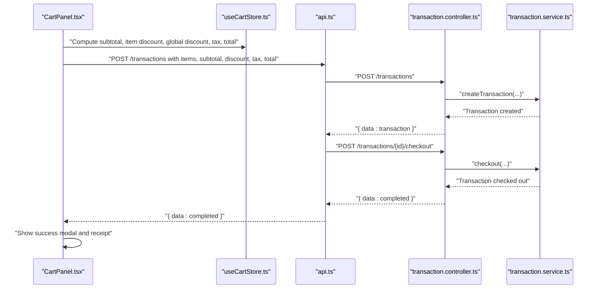
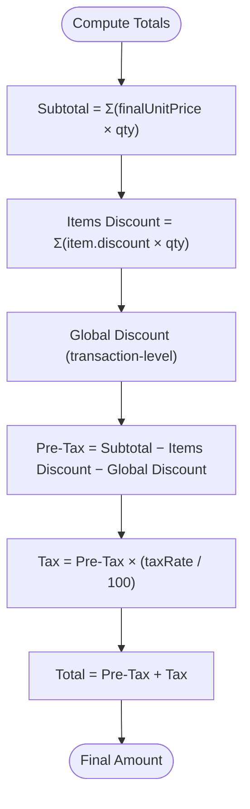
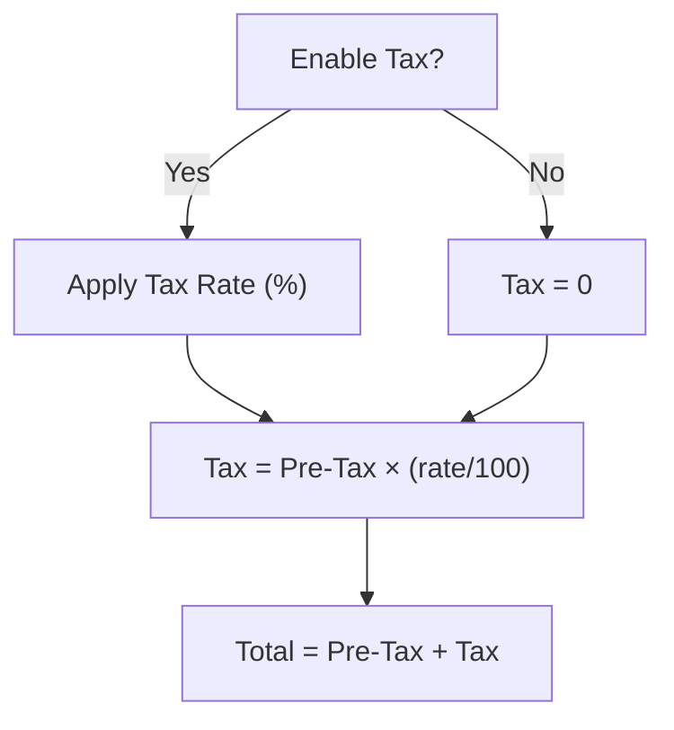
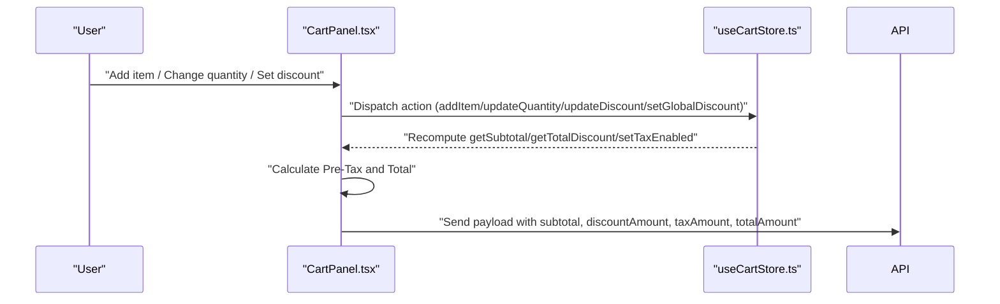
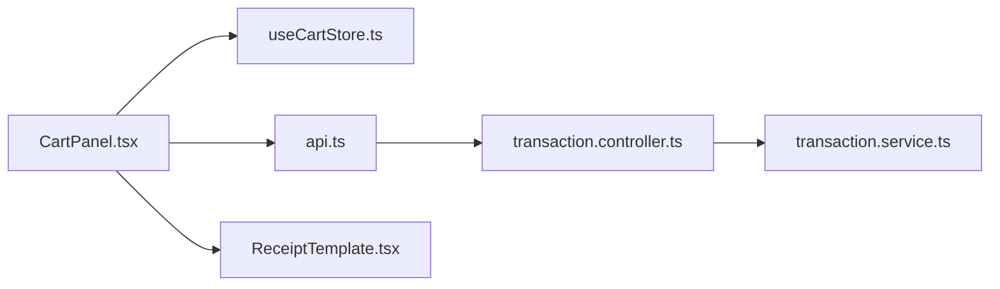

# Discounts, Taxes & Calculations

<cite>
**Referenced Files in This Document**
- [CartPanel.tsx](file://apps/web/src/components/pos/CartPanel.tsx)
- [useCartStore.ts](file://apps/web/src/store/useCartStore.ts)
- [ReceiptTemplate.tsx](file://apps/web/src/components/pos/ReceiptTemplate.tsx)
- [api.ts](file://apps/web/src/lib/api.ts)
- [transaction.controller.ts](file://apps/api/src/controllers/transaction.controller.ts)
- [transaction.service.ts](file://apps/api/src/services/transaction.service.ts)
- [test_checkout.ts](file://apps/api/test_checkout.ts)
- [test_fetch.js](file://apps/api/test_fetch.js)
- [PRD.md](file://PRD/PRD.md)
- [page.tsx](file://apps/web/src/app/settings/page.tsx)
</cite>

## Table of Contents
1. [Introduction](#introduction)
2. [Project Structure](#project-structure)
3. [Core Components](#core-components)
4. [Architecture Overview](#architecture-overview)
5. [Detailed Component Analysis](#detailed-component-analysis)
6. [Dependency Analysis](#dependency-analysis)
7. [Performance Considerations](#performance-considerations)
8. [Troubleshooting Guide](#troubleshooting-guide)
9. [Conclusion](#conclusion)

## Introduction
This document explains how discounts, taxes, and financial computations are implemented in the ARHAT POS system. It covers:
- Discount mechanisms: per-item fixed and percentage, transaction-level global discount, and points-based discount
- Tax calculation: automatic PPN (11%), tax toggle, and receipt display
- Real-time calculation engine: subtotal, item discount, global discount, tax, and final total
- Special pricing: member/customer-specific adjustments and promotional scenarios
- Rounding and currency handling, plus internationalization considerations
- Validation rules for discount codes, tax exemptions, and calculation accuracy

## Project Structure
The POS checkout pipeline spans the web frontend and the API backend:
- Frontend stores and computes totals in a local Zustand store and renders a cart panel with discount and tax controls
- The frontend sends transaction payloads to the API for creation and immediate checkout
- The backend services persist and finalize transactions

**Diagram sources**
- [CartPanel.tsx:1-496](file://apps/web/src/components/pos/CartPanel.tsx#L1-L496)
- [useCartStore.ts:1-183](file://apps/web/src/store/useCartStore.ts#L1-L183)
- [ReceiptTemplate.tsx:93-120](file://apps/web/src/components/pos/ReceiptTemplate.tsx#L93-L120)
- [api.ts:75-119](file://apps/web/src/lib/api.ts#L75-L119)
- [transaction.controller.ts:39-86](file://apps/api/src/controllers/transaction.controller.ts#L39-L86)
- [transaction.service.ts](file://apps/api/src/services/transaction.service.ts)

**Section sources**
- [CartPanel.tsx:1-496](file://apps/web/src/components/pos/CartPanel.tsx#L1-L496)
- [useCartStore.ts:1-183](file://apps/web/src/store/useCartStore.ts#L1-L183)
- [ReceiptTemplate.tsx:93-120](file://apps/web/src/components/pos/ReceiptTemplate.tsx#L93-L120)
- [api.ts:75-119](file://apps/web/src/lib/api.ts#L75-L119)
- [transaction.controller.ts:39-86](file://apps/api/src/controllers/transaction.controller.ts#L39-L86)

## Core Components
- Cart store: maintains items, per-item discount, global discount, tax toggle, and computes subtotal, item discount total, and final total
- Cart panel: UI for adding items, adjusting quantities, applying per-item and global discounts, toggling tax, and initiating checkout
- Receipt template: displays subtotal, discount, tax, and total on receipts
- API integration: creates transactions and immediately checks out payments
- Settings: exposes tax rate configuration

Key calculation selectors and actions:
- Subtotal: sum of (finalUnitPrice × quantity) for all items
- Item discount total: sum of (discount × quantity) per item
- Global discount: transaction-level fixed discount
- Tax: computed as subtotal minus item discounts minus global discount, then multiplied by configured tax rate
- Total: subtotal minus all discounts plus tax

**Section sources**
- [useCartStore.ts:170-183](file://apps/web/src/store/useCartStore.ts#L170-L183)
- [CartPanel.tsx:54-86](file://apps/web/src/components/pos/CartPanel.tsx#L54-L86)
- [ReceiptTemplate.tsx:93-120](file://apps/web/src/components/pos/ReceiptTemplate.tsx#L93-L120)
- [page.tsx:294-310](file://apps/web/src/app/settings/page.tsx#L294-L310)

## Architecture Overview
End-to-end checkout flow from UI to backend and back to UI:

**Diagram sources**
- [CartPanel.tsx:54-86](file://apps/web/src/components/pos/CartPanel.tsx#L54-L86)
- [api.ts:75-119](file://apps/web/src/lib/api.ts#L75-L119)
- [transaction.controller.ts:39-86](file://apps/api/src/controllers/transaction.controller.ts#L39-L86)
- [transaction.service.ts](file://apps/api/src/services/transaction.service.ts)

**Section sources**
- [CartPanel.tsx:54-86](file://apps/web/src/components/pos/CartPanel.tsx#L54-L86)
- [api.ts:75-119](file://apps/web/src/lib/api.ts#L75-L119)
- [transaction.controller.ts:39-86](file://apps/api/src/controllers/transaction.controller.ts#L39-L86)

## Detailed Component Analysis

### Discount Mechanisms
- Per-item discount: stored per cart item and summed across quantities
- Transaction-level global discount: a fixed amount subtracted from the pre-tax subtotal
- Points discount: shown separately on the receipt and cart summary; subtracted from total

**Diagram sources**
- [useCartStore.ts:170-183](file://apps/web/src/store/useCartStore.ts#L170-L183)
- [CartPanel.tsx:54-86](file://apps/web/src/components/pos/CartPanel.tsx#L54-L86)
- [ReceiptTemplate.tsx:93-120](file://apps/web/src/components/pos/ReceiptTemplate.tsx#L93-L120)

Validation rules:
- Per-item discount cannot exceed the item’s final unit price
- Global discount cannot exceed the pre-discount subtotal
- Points discount is validated against available points and applied as a fixed amount

**Section sources**
- [useCartStore.ts:170-183](file://apps/web/src/store/useCartStore.ts#L170-L183)
- [CartPanel.tsx:367-382](file://apps/web/src/components/pos/CartPanel.tsx#L367-L382)
- [ReceiptTemplate.tsx:93-120](file://apps/web/src/components/pos/ReceiptTemplate.tsx#L93-L120)

### Tax Calculation
- Tax toggle: enable/disable tax application
- Tax rate: configurable percentage (default 11% in UI)
- Tax amount: computed on pre-tax amount after all discounts
- Receipt display: shows tax line item

**Diagram sources**
- [CartPanel.tsx:347-365](file://apps/web/src/components/pos/CartPanel.tsx#L347-L365)
- [page.tsx:294-310](file://apps/web/src/app/settings/page.tsx#L294-L310)
- [ReceiptTemplate.tsx:107-112](file://apps/web/src/components/pos/ReceiptTemplate.tsx#L107-L112)

Validation rules:
- Tax rate must be a non-negative number
- Tax exemption: when disabled, tax is zero; when enabled, tax applies to pre-tax amount
- Multi-jurisdiction: configure rate per tenant via settings

**Section sources**
- [CartPanel.tsx:347-365](file://apps/web/src/components/pos/CartPanel.tsx#L347-L365)
- [page.tsx:294-310](file://apps/web/src/app/settings/page.tsx#L294-L310)
- [ReceiptTemplate.tsx:107-112](file://apps/web/src/components/pos/ReceiptTemplate.tsx#L107-L112)

### Real-Time Price Updates and Final Amount Computation
- Real-time updates: subtotal, item discount total, global discount, tax, and total are recomputed whenever items, quantities, or discounts change
- Final amount: total amount sent to the API reflects the final computed total

**Diagram sources**
- [CartPanel.tsx:54-86](file://apps/web/src/components/pos/CartPanel.tsx#L54-L86)
- [useCartStore.ts:72-183](file://apps/web/src/store/useCartStore.ts#L72-L183)

**Section sources**
- [CartPanel.tsx:54-86](file://apps/web/src/components/pos/CartPanel.tsx#L54-L86)
- [useCartStore.ts:72-183](file://apps/web/src/store/useCartStore.ts#L72-L183)

### Special Pricing Scenarios
- Member/customer discounts: supported conceptually; implement by setting per-item or global discount in the cart store
- Promotional pricing: apply fixed or percentage discounts per item or globally
- Dynamic pricing adjustments: adjust final unit price and recompute totals

Note: The current codebase demonstrates discount application and receipt display; specific promotional logic would be integrated into the cart store and checkout payload.

**Section sources**
- [PRD.md:372-384](file://PRD/PRD.md#L372-L384)
- [CartPanel.tsx:334-394](file://apps/web/src/components/pos/CartPanel.tsx#L334-L394)
- [useCartStore.ts:170-183](file://apps/web/src/store/useCartStore.ts#L170-L183)

### Rounding Policies, Currency Handling, and Internationalization
- Currency display: Indonesian Rupiah formatting is used consistently across the UI
- Rounding: totals are formatted for display; precise internal arithmetic is handled by the store and UI
- Internationalization: locale formatting is set to Indonesian locale for currency presentation

Recommendations:
- Round to the nearest rupiah cent for display
- For financial precision, consider storing amounts as integers in smallest currency units internally
- Keep locale formatting consistent across all currency displays

**Section sources**
- [CartPanel.tsx:362-386](file://apps/web/src/components/pos/CartPanel.tsx#L362-L386)
- [ReceiptTemplate.tsx:99-117](file://apps/web/src/components/pos/ReceiptTemplate.tsx#L99-L117)

## Dependency Analysis
- CartPanel depends on useCartStore for state and calculations
- CartPanel invokes api.ts to submit transactions and trigger checkout
- api.ts delegates to transaction controller and service
- transaction.controller.ts orchestrates service calls
- ReceiptTemplate consumes transaction data for display

**Diagram sources**
- [CartPanel.tsx:1-496](file://apps/web/src/components/pos/CartPanel.tsx#L1-L496)
- [useCartStore.ts:1-183](file://apps/web/src/store/useCartStore.ts#L1-L183)
- [api.ts:75-119](file://apps/web/src/lib/api.ts#L75-L119)
- [transaction.controller.ts:39-86](file://apps/api/src/controllers/transaction.controller.ts#L39-L86)
- [transaction.service.ts](file://apps/api/src/services/transaction.service.ts)
- [ReceiptTemplate.tsx:93-120](file://apps/web/src/components/pos/ReceiptTemplate.tsx#L93-L120)

**Section sources**
- [CartPanel.tsx:1-496](file://apps/web/src/components/pos/CartPanel.tsx#L1-L496)
- [useCartStore.ts:1-183](file://apps/web/src/store/useCartStore.ts#L1-L183)
- [api.ts:75-119](file://apps/web/src/lib/api.ts#L75-L119)
- [transaction.controller.ts:39-86](file://apps/api/src/controllers/transaction.controller.ts#L39-L86)

## Performance Considerations
- Minimize re-computations: compute totals once per state change and memoize where appropriate
- Batch UI updates: avoid frequent DOM updates by debouncing rapid changes
- Network efficiency: combine transaction creation and checkout into a single flow to reduce round-trips
- Large carts: consider virtualized lists and lazy evaluation for item rendering

## Troubleshooting Guide
Common issues and resolutions:
- Checkout fails due to network errors: the frontend queues offline sync and returns a simulated success response; verify offline queue and retry later
- Incorrect tax amount: confirm tax rate setting and that tax toggle is enabled
- Discount exceeds limits: ensure per-item discount does not exceed unit price and global discount does not exceed pre-discount subtotal
- Receipt mismatch: verify subtotal, discount, and tax fields match the transaction payload

Validation references:
- Discount validation: per-item discount ≤ unit price; global discount ≤ pre-discount subtotal
- Tax validation: tax rate ≥ 0; tax = 0 when tax disabled
- Calculation accuracy: subtotal − item discounts − global discount + tax = total

**Section sources**
- [api.ts:99-118](file://apps/web/src/lib/api.ts#L99-L118)
- [CartPanel.tsx:334-394](file://apps/web/src/components/pos/CartPanel.tsx#L334-L394)
- [ReceiptTemplate.tsx:93-120](file://apps/web/src/components/pos/ReceiptTemplate.tsx#L93-L120)

## Conclusion
ARHAT POS implements a straightforward yet robust checkout calculation pipeline:
- Discounts are applied per item and globally, with clear visibility on receipts
- Tax is configurable and automatically computed on the pre-discount subtotal
- Real-time updates keep the UI synchronized with accurate totals
- The API backend finalizes transactions and supports offline fallbacks
Extending the system to support advanced discount codes, multi-jurisdiction tax rates, and promotional logic requires integrating additional validation and service logic while preserving the current calculation flow.