# POS Transaction Processing

<cite>
**Referenced Files in This Document**
- [transaction.controller.ts](file://apps/api/src/controllers/transaction.controller.ts)
- [transaction.routes.ts](file://apps/api/src/routes/transaction.routes.ts)
- [transaction.service.ts](file://apps/api/src/services/transaction.service.ts)
- [transaction.model.ts](file://apps/api/src/models/index.ts)
- [email.service.ts](file://apps/api/src/services/email.service.ts)
- [whatsapp.service.ts](file://apps/api/src/services/whatsapp.service.ts)
- [inventory.service.ts](file://apps/api/src/services/inventory.service.ts)
- [product.service.ts](file://apps/api/src/services/product.service.ts)
- [useCartStore.ts](file://apps/web/src/store/useCartStore.ts)
- [ProductSearch.tsx](file://apps/web/src/components/pos/ProductSearch.tsx)
- [CartPanel.tsx](file://apps/web/src/components/pos/CartPanel.tsx)
- [CheckoutSuccessModal.tsx](file://apps/web/src/components/pos/CheckoutSuccessModal.tsx)
- [HeldTransactionsModal.tsx](file://apps/web/src/components/pos/HeldTransactionsModal.tsx)
- [NonCashPaymentModal.tsx](file://apps/web/src/components/pos/NonCashPaymentModal.tsx)
- [ReceiptTemplate.tsx](file://apps/web/src/components/pos/ReceiptTemplate.tsx)
- [useBarcodeScanner.ts](file://apps/web/src/hooks/useBarcodeScanner.ts)
- [transaction.routes.ts](file://apps/api/src/routes/transaction.routes.ts)
- [transaction.controller.ts](file://apps/api/src/controllers/transaction.controller.ts)
- [transaction.service.ts](file://apps/api/src/services/transaction.service.ts)
- [transaction.model.ts](file://apps/api/src/models/index.ts)
- [email.service.ts](file://apps/api/src/services/email.service.ts)
- [whatsapp.service.ts](file://apps/api/src/services/whatsapp.service.ts)
- [inventory.service.ts](file://apps/api/src/services/inventory.service.ts)
- [product.service.ts](file://apps/api/src/services/product.service.ts)
- [useCartStore.ts](file://apps/web/src/store/useCartStore.ts)
- [ProductSearch.tsx](file://apps/web/src/components/pos/ProductSearch.tsx)
- [CartPanel.tsx](file://apps/web/src/components/pos/CartPanel.tsx)
- [CheckoutSuccessModal.tsx](file://apps/web/src/components/pos/CheckoutSuccessModal.tsx)
- [HeldTransactionsModal.tsx](file://apps/web/src/components/pos/HeldTransactionsModal.tsx)
- [NonCashPaymentModal.tsx](file://apps/web/src/components/pos/NonCashPaymentModal.tsx)
- [ReceiptTemplate.tsx](file://apps/web/src/components/pos/ReceiptTemplate.tsx)
- [useBarcodeScanner.ts](file://apps/web/src/hooks/useBarcodeScanner.ts)
</cite>

## Table of Contents
1. [Introduction](#introduction)
2. [Project Structure](#project-structure)
3. [Core Components](#core-components)
4. [Architecture Overview](#architecture-overview)
5. [Detailed Component Analysis](#detailed-component-analysis)
6. [Dependency Analysis](#dependency-analysis)
7. [Performance Considerations](#performance-considerations)
8. [Troubleshooting Guide](#troubleshooting-guide)
9. [Conclusion](#conclusion)
10. [Appendices](#appendices)

## Introduction
This document describes the POS Transaction Processing system with emphasis on the checkout interface, product search, shopping cart, transaction management, payment processing integrations, receipt generation, transaction states, discounts, taxes, barcode scanning, inventory deduction, transaction history/reporting/reconciliation, and security/error handling. It synthesizes frontend components and backend services/controllers/routes to present a cohesive view of how transactions are created, processed, and finalized.

## Project Structure
The POS system comprises:
- Frontend (Next.js): checkout UI, cart store, product search, receipt templates, and barcode scanner hook.
- Backend (Cloudflare Workers + Drizzle ORM): transaction controller, service, routes, and models; inventory and product services; email and WhatsApp receipt delivery.

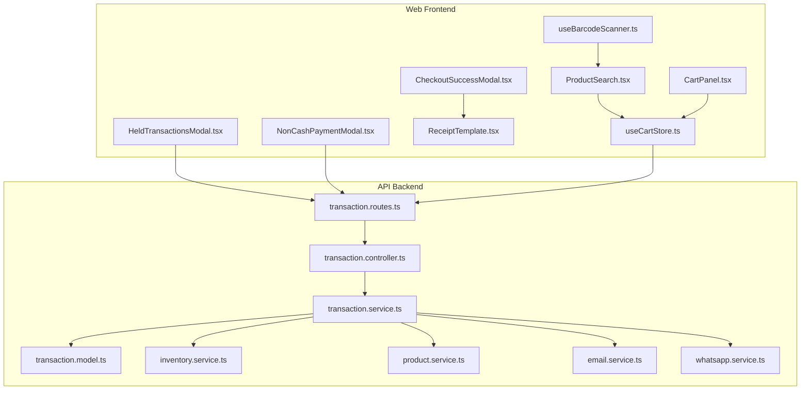

**Diagram sources**
- [transaction.routes.ts](file://apps/api/src/routes/transaction.routes.ts)
- [transaction.controller.ts](file://apps/api/src/controllers/transaction.controller.ts)
- [transaction.service.ts](file://apps/api/src/services/transaction.service.ts)
- [transaction.model.ts](file://apps/api/src/models/index.ts)
- [email.service.ts](file://apps/api/src/services/email.service.ts)
- [whatsapp.service.ts](file://apps/api/src/services/whatsapp.service.ts)
- [inventory.service.ts](file://apps/api/src/services/inventory.service.ts)
- [product.service.ts](file://apps/api/src/services/product.service.ts)
- [useCartStore.ts](file://apps/web/src/store/useCartStore.ts)
- [ProductSearch.tsx](file://apps/web/src/components/pos/ProductSearch.tsx)
- [CartPanel.tsx](file://apps/web/src/components/pos/CartPanel.tsx)
- [CheckoutSuccessModal.tsx](file://apps/web/src/components/pos/CheckoutSuccessModal.tsx)
- [HeldTransactionsModal.tsx](file://apps/web/src/components/pos/HeldTransactionsModal.tsx)
- [NonCashPaymentModal.tsx](file://apps/web/src/components/pos/NonCashPaymentModal.tsx)
- [ReceiptTemplate.tsx](file://apps/web/src/components/pos/ReceiptTemplate.tsx)
- [useBarcodeScanner.ts](file://apps/web/src/hooks/useBarcodeScanner.ts)

**Section sources**
- [transaction.routes.ts](file://apps/api/src/routes/transaction.routes.ts)
- [transaction.controller.ts](file://apps/api/src/controllers/transaction.controller.ts)
- [transaction.service.ts](file://apps/api/src/services/transaction.service.ts)
- [transaction.model.ts](file://apps/api/src/models/index.ts)
- [email.service.ts](file://apps/api/src/services/email.service.ts)
- [whatsapp.service.ts](file://apps/api/src/services/whatsapp.service.ts)
- [inventory.service.ts](file://apps/api/src/services/inventory.service.ts)
- [product.service.ts](file://apps/api/src/services/product.service.ts)
- [useCartStore.ts](file://apps/web/src/store/useCartStore.ts)
- [ProductSearch.tsx](file://apps/web/src/components/pos/ProductSearch.tsx)
- [CartPanel.tsx](file://apps/web/src/components/pos/CartPanel.tsx)
- [CheckoutSuccessModal.tsx](file://apps/web/src/components/pos/CheckoutSuccessModal.tsx)
- [HeldTransactionsModal.tsx](file://apps/web/src/components/pos/HeldTransactionsModal.tsx)
- [NonCashPaymentModal.tsx](file://apps/web/src/components/pos/NonCashPaymentModal.tsx)
- [ReceiptTemplate.tsx](file://apps/web/src/components/pos/ReceiptTemplate.tsx)
- [useBarcodeScanner.ts](file://apps/web/src/hooks/useBarcodeScanner.ts)

## Core Components
- Frontend Store and UI
  - Cart store manages items, quantities, totals, and selected payment method.
  - Product search enables barcode scanning and manual entry.
  - Cart panel displays line items, discounts, taxes, and totals.
  - Modals handle success confirmation, held transactions, and non-cash payment steps.
  - Receipt template renders printable receipts.
- Backend Services
  - Transaction controller exposes endpoints for creating, resuming, voiding, and refunding transactions.
  - Transaction service orchestrates payment processing, inventory deduction, and receipt generation.
  - Inventory and product services manage stock updates and product lookups.
  - Email and WhatsApp services deliver receipts via supported channels.

**Section sources**
- [useCartStore.ts](file://apps/web/src/store/useCartStore.ts)
- [ProductSearch.tsx](file://apps/web/src/components/pos/ProductSearch.tsx)
- [CartPanel.tsx](file://apps/web/src/components/pos/CartPanel.tsx)
- [CheckoutSuccessModal.tsx](file://apps/web/src/components/pos/CheckoutSuccessModal.tsx)
- [HeldTransactionsModal.tsx](file://apps/web/src/components/pos/HeldTransactionsModal.tsx)
- [NonCashPaymentModal.tsx](file://apps/web/src/components/pos/NonCashPaymentModal.tsx)
- [ReceiptTemplate.tsx](file://apps/web/src/components/pos/ReceiptTemplate.tsx)
- [transaction.controller.ts](file://apps/api/src/controllers/transaction.controller.ts)
- [transaction.service.ts](file://apps/api/src/services/transaction.service.ts)
- [inventory.service.ts](file://apps/api/src/services/inventory.service.ts)
- [product.service.ts](file://apps/api/src/services/product.service.ts)
- [email.service.ts](file://apps/api/src/services/email.service.ts)
- [whatsapp.service.ts](file://apps/api/src/services/whatsapp.service.ts)

## Architecture Overview
The checkout flow integrates frontend UI with backend APIs. The frontend collects items and payment preferences, submits a transaction creation request, and receives a response indicating success or pending status. The backend validates inventory, applies discounts and taxes, processes payments, and emits receipts via email or WhatsApp.

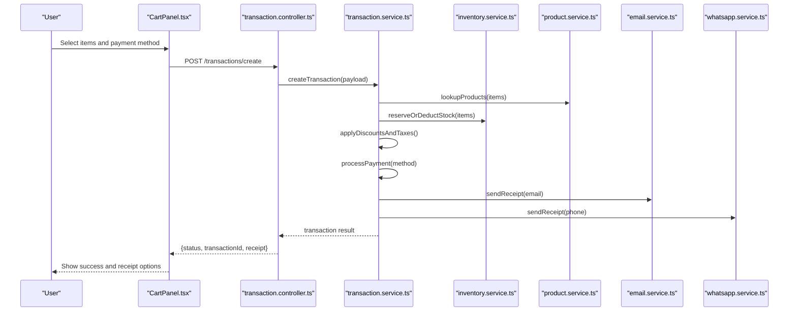

**Diagram sources**
- [transaction.controller.ts](file://apps/api/src/controllers/transaction.controller.ts)
- [transaction.service.ts](file://apps/api/src/services/transaction.service.ts)
- [inventory.service.ts](file://apps/api/src/services/inventory.service.ts)
- [product.service.ts](file://apps/api/src/services/product.service.ts)
- [email.service.ts](file://apps/api/src/services/email.service.ts)
- [whatsapp.service.ts](file://apps/api/src/services/whatsapp.service.ts)

## Detailed Component Analysis

### Checkout Interface Design
- Product Search
  - Scans barcodes via device input and resolves product details.
  - Supports manual search and selection.
- Shopping Cart
  - Maintains item list, quantities, unit prices, totals, and applied discounts.
  - Allows editing quantities and removing items.
- Payment Selection
  - Enables choosing among cash, QRIS, bank transfer, debit card, credit card, and e-wallet.
  - Non-cash flows trigger additional modal steps for provider-specific actions.
- Transaction Submission
  - Validates cart, computes totals and taxes, and posts to backend.

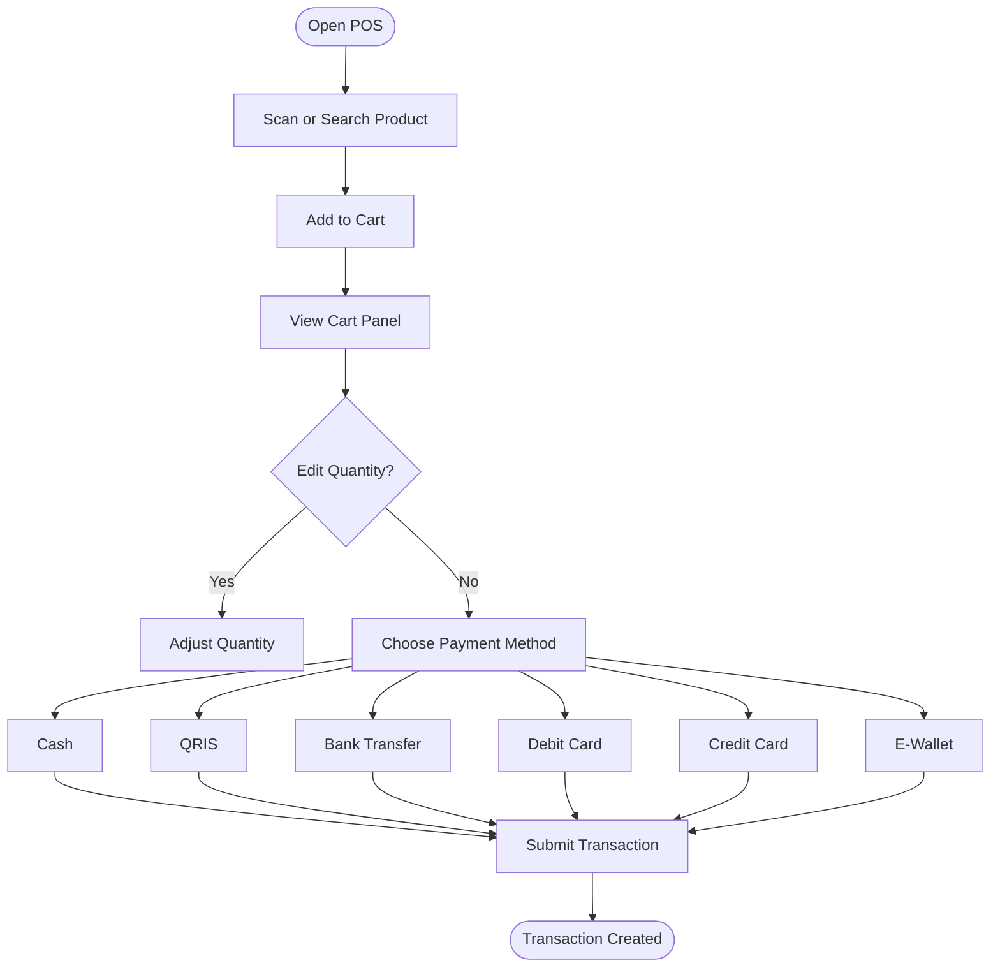

**Diagram sources**
- [ProductSearch.tsx](file://apps/web/src/components/pos/ProductSearch.tsx)
- [CartPanel.tsx](file://apps/web/src/components/pos/CartPanel.tsx)
- [NonCashPaymentModal.tsx](file://apps/web/src/components/pos/NonCashPaymentModal.tsx)
- [useCartStore.ts](file://apps/web/src/store/useCartStore.ts)

**Section sources**
- [ProductSearch.tsx](file://apps/web/src/components/pos/ProductSearch.tsx)
- [CartPanel.tsx](file://apps/web/src/components/pos/CartPanel.tsx)
- [NonCashPaymentModal.tsx](file://apps/web/src/components/pos/NonCashPaymentModal.tsx)
- [useCartStore.ts](file://apps/web/src/store/useCartStore.ts)

### Transaction Management
- Endpoints
  - Create transaction: validates cart, reserves inventory, computes totals/taxes, and initiates payment.
  - Resume transaction: allows continuing a previously started but incomplete transaction.
  - Void transaction: cancels a paid transaction and restores inventory.
  - Refund transaction: processes refunds per payment method and updates inventory accordingly.
- State Model
  - New, Reserved (inventory held), Paid, Voided, Refunded.
  - Held transactions are persisted and retrievable for later completion.

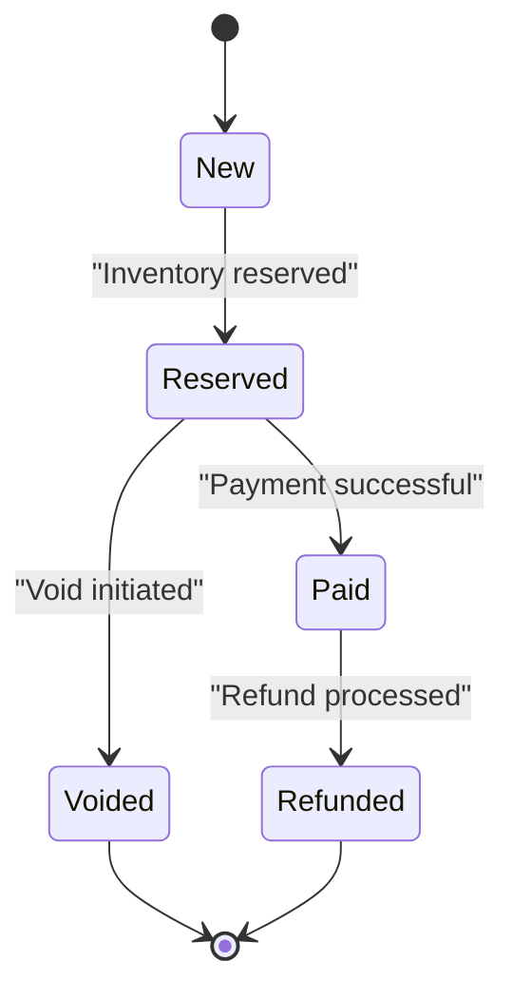

**Diagram sources**
- [transaction.routes.ts](file://apps/api/src/routes/transaction.routes.ts)
- [transaction.controller.ts](file://apps/api/src/controllers/transaction.controller.ts)
- [transaction.service.ts](file://apps/api/src/services/transaction.service.ts)

**Section sources**
- [transaction.routes.ts](file://apps/api/src/routes/transaction.routes.ts)
- [transaction.controller.ts](file://apps/api/src/controllers/transaction.controller.ts)
- [transaction.service.ts](file://apps/api/src/services/transaction.service.ts)

### Payment Processing Integration
- Supported Methods
  - Cash, QRIS, Bank Transfer, Debit Card, Credit Card, E-Wallet.
- Non-Cash Workflows
  - Opens dedicated modal to guide user through provider steps (e.g., scan QRIS, enter card details).
  - On completion, the backend finalizes payment and marks transaction as Paid.
- Cash Handling
  - Collects amount tendered, computes change, and finalizes transaction.

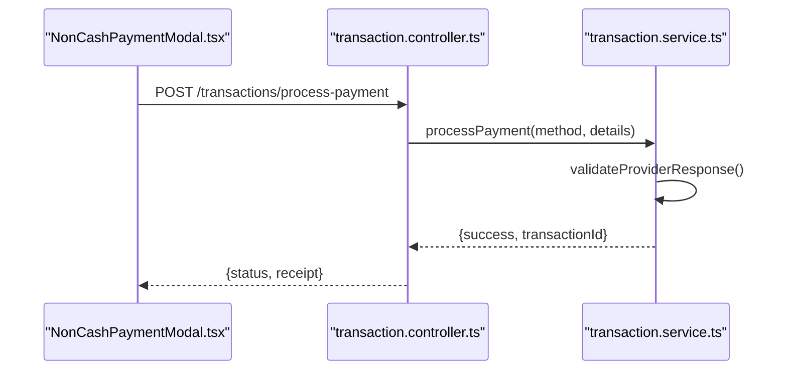

**Diagram sources**
- [NonCashPaymentModal.tsx](file://apps/web/src/components/pos/NonCashPaymentModal.tsx)
- [transaction.controller.ts](file://apps/api/src/controllers/transaction.controller.ts)
- [transaction.service.ts](file://apps/api/src/services/transaction.service.ts)

**Section sources**
- [NonCashPaymentModal.tsx](file://apps/web/src/components/pos/NonCashPaymentModal.tsx)
- [transaction.controller.ts](file://apps/api/src/controllers/transaction.controller.ts)
- [transaction.service.ts](file://apps/api/src/services/transaction.service.ts)

### Receipt Generation and Delivery
- Receipt Template
  - Renders transaction details, items, discounts, taxes, totals, and timestamps.
- Delivery Channels
  - Email: sends receipt to customer email address.
  - WhatsApp: sends receipt to customer phone number.
- Print Option
  - Uses receipt template to generate printable output.

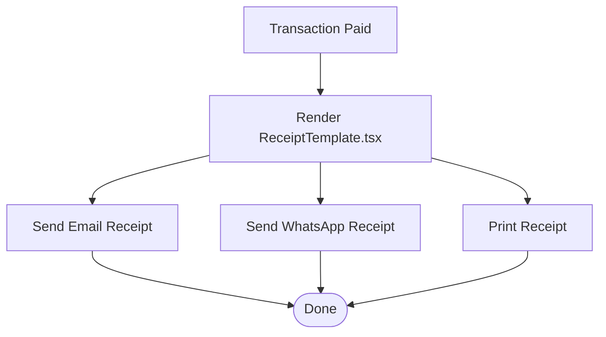

**Diagram sources**
- [ReceiptTemplate.tsx](file://apps/web/src/components/pos/ReceiptTemplate.tsx)
- [email.service.ts](file://apps/api/src/services/email.service.ts)
- [whatsapp.service.ts](file://apps/api/src/services/whatsapp.service.ts)

**Section sources**
- [ReceiptTemplate.tsx](file://apps/web/src/components/pos/ReceiptTemplate.tsx)
- [email.service.ts](file://apps/api/src/services/email.service.ts)
- [whatsapp.service.ts](file://apps/api/src/services/whatsapp.service.ts)

### Discounts and Taxes
- Item-Level Discounts
  - Per-item discount adjustments applied before tax calculation.
- Transaction-Level Discounts
  - Whole-cart percentage or fixed amount discounts applied after item discounts.
- Tax Automation
  - Applies applicable tax rates to taxable items and totals.
- Totals Recalculation
  - Recomputes subtotal, discount total, tax total, and final total.

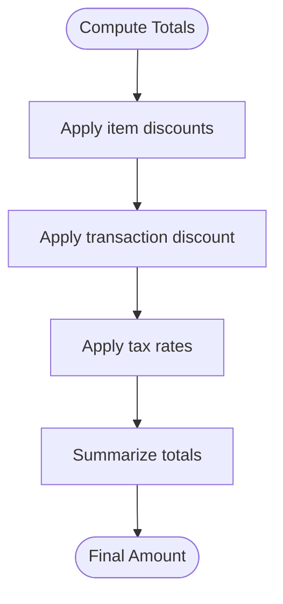

**Diagram sources**
- [useCartStore.ts](file://apps/web/src/store/useCartStore.ts)
- [transaction.service.ts](file://apps/api/src/services/transaction.service.ts)

**Section sources**
- [useCartStore.ts](file://apps/web/src/store/useCartStore.ts)
- [transaction.service.ts](file://apps/api/src/services/transaction.service.ts)

### Barcode Scanner Integration and Product Lookup
- Scanner Hook
  - Listens to device input events and triggers product search.
- Product Lookup
  - Resolves product by barcode or manual search, loads pricing and inventory info.
- Auto-Fill Cart
  - Adds matched product to cart with default quantity or scanned quantity.

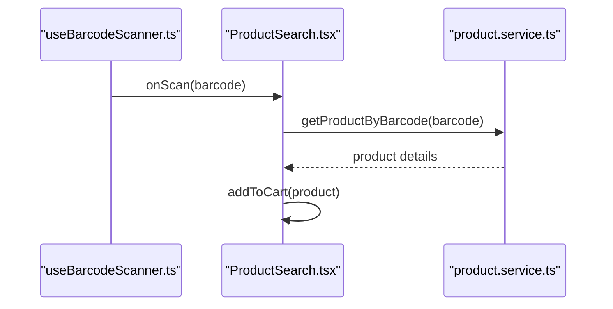

**Diagram sources**
- [useBarcodeScanner.ts](file://apps/web/src/hooks/useBarcodeScanner.ts)
- [ProductSearch.tsx](file://apps/web/src/components/pos/ProductSearch.tsx)
- [product.service.ts](file://apps/api/src/services/product.service.ts)

**Section sources**
- [useBarcodeScanner.ts](file://apps/web/src/hooks/useBarcodeScanner.ts)
- [ProductSearch.tsx](file://apps/web/src/components/pos/ProductSearch.tsx)
- [product.service.ts](file://apps/api/src/services/product.service.ts)

### Inventory Deduction During Transactions
- Reservation vs. Immediate Deduction
  - For cash: immediate stock deduction.
  - For non-cash: reserve inventory until payment confirmed; release on void/refund.
- Validation
  - Ensures sufficient stock exists before reservation/deduction.
- Rollback
  - On failure or void/refund, inventory is restored.

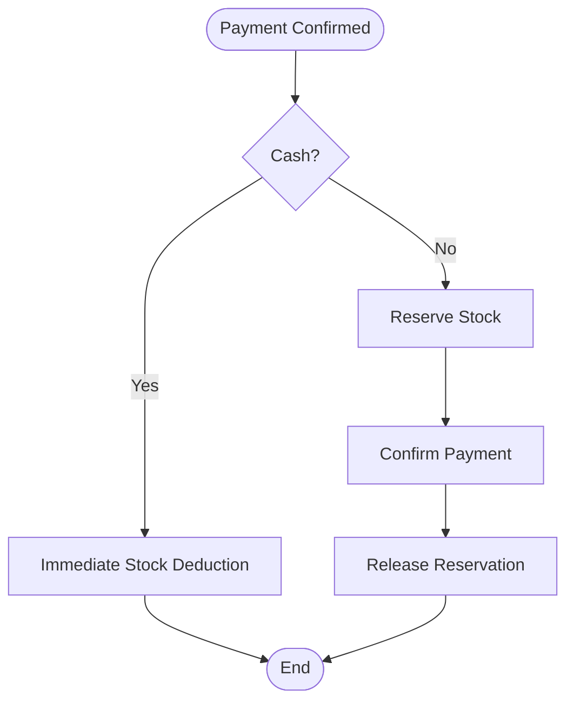

**Diagram sources**
- [transaction.service.ts](file://apps/api/src/services/transaction.service.ts)
- [inventory.service.ts](file://apps/api/src/services/inventory.service.ts)

**Section sources**
- [transaction.service.ts](file://apps/api/src/services/transaction.service.ts)
- [inventory.service.ts](file://apps/api/src/services/inventory.service.ts)

### Transaction History, Reporting, and Reconciliation
- Transaction History
  - Backend maintains transaction records with state, items, totals, payment method, timestamps, and audit trail.
- Reporting
  - Analytics endpoints support daily sales, product performance, and revenue summaries.
- Reconciliation
  - Daily reconciliation compares cash drawer counts with recorded transactions and outstanding holds.

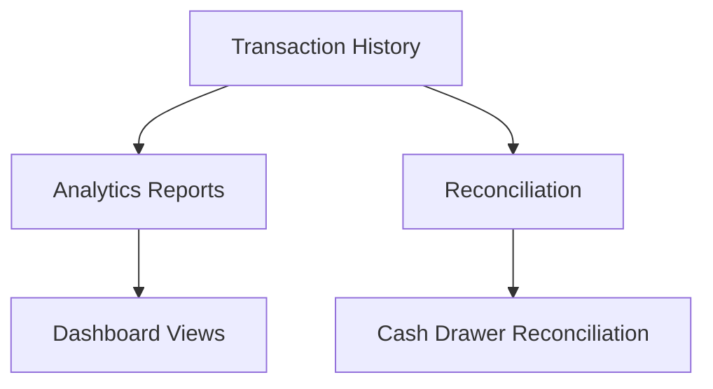

**Diagram sources**
- [transaction.controller.ts](file://apps/api/src/controllers/transaction.controller.ts)
- [transaction.service.ts](file://apps/api/src/services/transaction.service.ts)
- [transaction.routes.ts](file://apps/api/src/routes/transaction.routes.ts)

**Section sources**
- [transaction.controller.ts](file://apps/api/src/controllers/transaction.controller.ts)
- [transaction.service.ts](file://apps/api/src/services/transaction.service.ts)
- [transaction.routes.ts](file://apps/api/src/routes/transaction.routes.ts)

### Security, Audit Trails, and Error Handling
- Authentication and Authorization
  - Routes protected by middleware ensuring authenticated sessions.
- Audit Trail
  - Logs all transaction lifecycle events (created, reserved, paid, voided, refunded).
- Error Handling
  - Centralized error handler returns structured error responses.
  - Payment failures return actionable messages; partial failures attempt rollback.

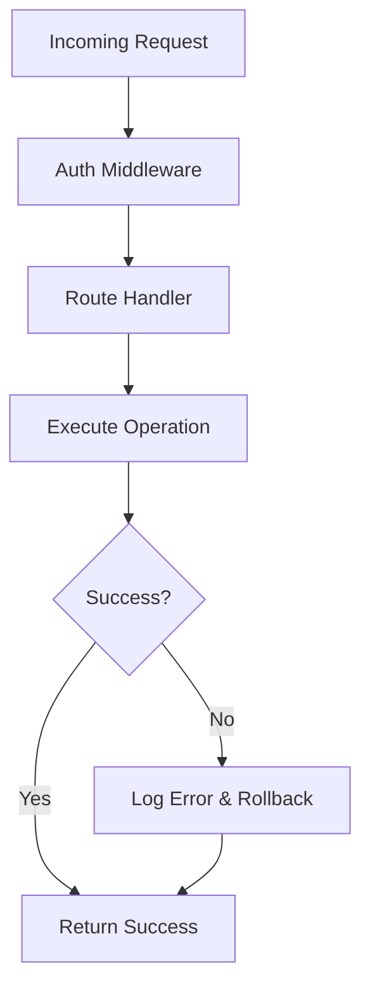

**Diagram sources**
- [transaction.routes.ts](file://apps/api/src/routes/transaction.routes.ts)
- [transaction.controller.ts](file://apps/api/src/controllers/transaction.controller.ts)
- [transaction.service.ts](file://apps/api/src/services/transaction.service.ts)

**Section sources**
- [transaction.routes.ts](file://apps/api/src/routes/transaction.routes.ts)
- [transaction.controller.ts](file://apps/api/src/controllers/transaction.controller.ts)
- [transaction.service.ts](file://apps/api/src/services/transaction.service.ts)

## Dependency Analysis
- Frontend depends on:
  - Cart store for state management.
  - Product search and barcode scanner for item resolution.
  - Modals for payment and success confirmation.
  - Receipt template for rendering.
- Backend depends on:
  - Transaction controller for route exposure.
  - Transaction service for orchestration.
  - Inventory and product services for stock and product data.
  - Email and WhatsApp services for receipt delivery.
  - Models for database schema and relations.

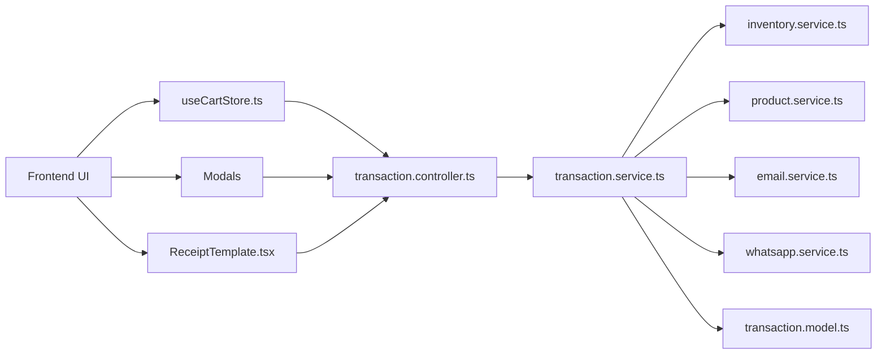

**Diagram sources**
- [useCartStore.ts](file://apps/web/src/store/useCartStore.ts)
- [transaction.controller.ts](file://apps/api/src/controllers/transaction.controller.ts)
- [transaction.service.ts](file://apps/api/src/services/transaction.service.ts)
- [inventory.service.ts](file://apps/api/src/services/inventory.service.ts)
- [product.service.ts](file://apps/api/src/services/product.service.ts)
- [email.service.ts](file://apps/api/src/services/email.service.ts)
- [whatsapp.service.ts](file://apps/api/src/services/whatsapp.service.ts)
- [transaction.model.ts](file://apps/api/src/models/index.ts)
- [ReceiptTemplate.tsx](file://apps/web/src/components/pos/ReceiptTemplate.tsx)

**Section sources**
- [useCartStore.ts](file://apps/web/src/store/useCartStore.ts)
- [transaction.controller.ts](file://apps/api/src/controllers/transaction.controller.ts)
- [transaction.service.ts](file://apps/api/src/services/transaction.service.ts)
- [inventory.service.ts](file://apps/api/src/services/inventory.service.ts)
- [product.service.ts](file://apps/api/src/services/product.service.ts)
- [email.service.ts](file://apps/api/src/services/email.service.ts)
- [whatsapp.service.ts](file://apps/api/src/services/whatsapp.service.ts)
- [transaction.model.ts](file://apps/api/src/models/index.ts)
- [ReceiptTemplate.tsx](file://apps/web/src/components/pos/ReceiptTemplate.tsx)

## Performance Considerations
- Minimize network requests by batching product lookups and reducing modal transitions.
- Cache frequently accessed product data in the cart store to reduce repeated backend calls.
- Use optimistic UI updates for item additions while deferring server-side validation to improve responsiveness.
- Optimize barcode scanning debounce to avoid duplicate scans and excessive lookups.

## Troubleshooting Guide
- Payment Failures
  - Verify payment method configuration and provider connectivity.
  - Check transaction state; if stuck in Reserved, reconcile inventory and retry.
- Inventory Discrepancies
  - Compare reserved vs. deducted stock; ensure rollback occurs on void/refund.
- Receipt Delivery Issues
  - Confirm email/WhatsApp credentials and templates; retry delivery if blocked.
- Barcode Scanning Problems
  - Ensure scanner hook is active and product exists in the catalog.

**Section sources**
- [transaction.service.ts](file://apps/api/src/services/transaction.service.ts)
- [email.service.ts](file://apps/api/src/services/email.service.ts)
- [whatsapp.service.ts](file://apps/api/src/services/whatsapp.service.ts)
- [useBarcodeScanner.ts](file://apps/web/src/hooks/useBarcodeScanner.ts)

## Conclusion
The POS Transaction Processing system integrates a responsive checkout UI with robust backend services to support diverse payment methods, automated discounts and taxes, inventory management, and multi-channel receipt delivery. Its modular design facilitates maintainability, scalability, and secure transaction lifecycle management.

## Appendices
- API Endpoints
  - POST /transactions/create: Create new transaction.
  - POST /transactions/resume/{id}: Resume held transaction.
  - POST /transactions/void/{id}: Void paid transaction.
  - POST /transactions/refund/{id}: Initiate refund.
  - POST /transactions/process-payment: Finalize non-cash payment.
- Data Model Notes
  - Transaction entity includes items, totals, taxes, discounts, payment method, state, timestamps, and audit fields.
- UI Components
  - ProductSearch, CartPanel, NonCashPaymentModal, CheckoutSuccessModal, HeldTransactionsModal, ReceiptTemplate.