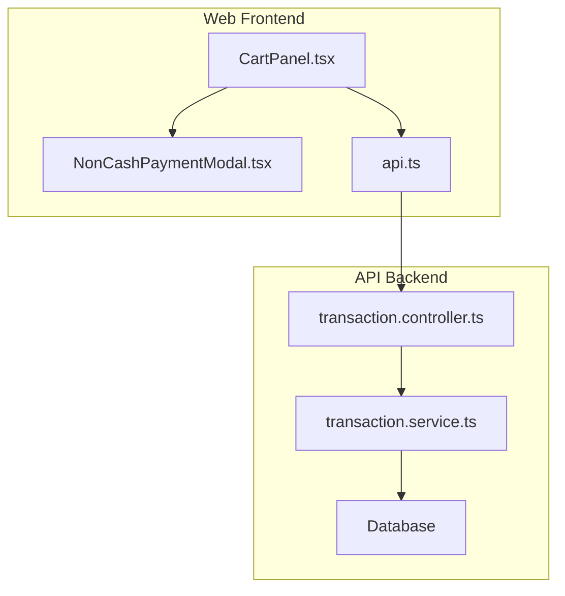
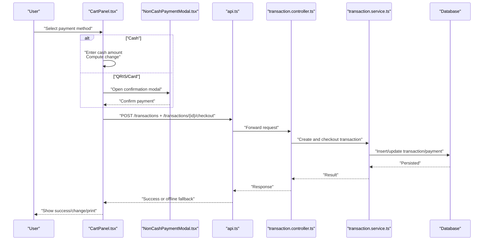
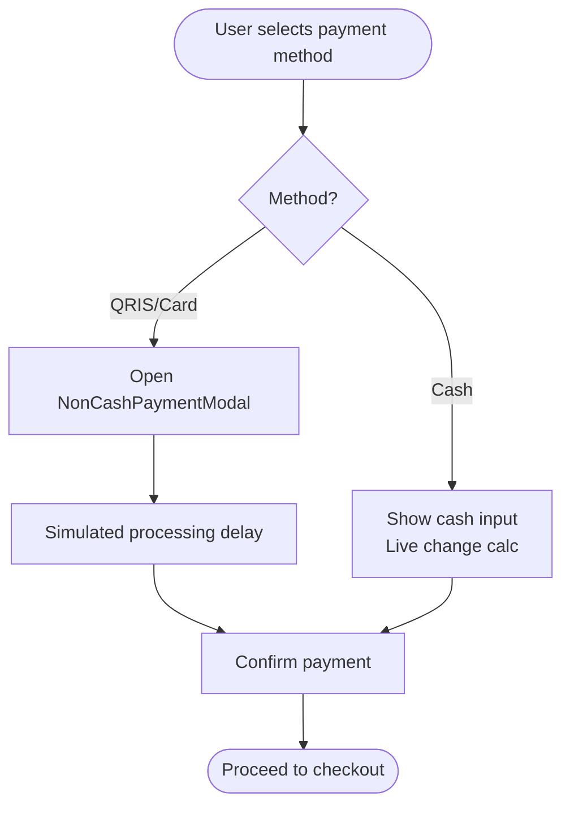
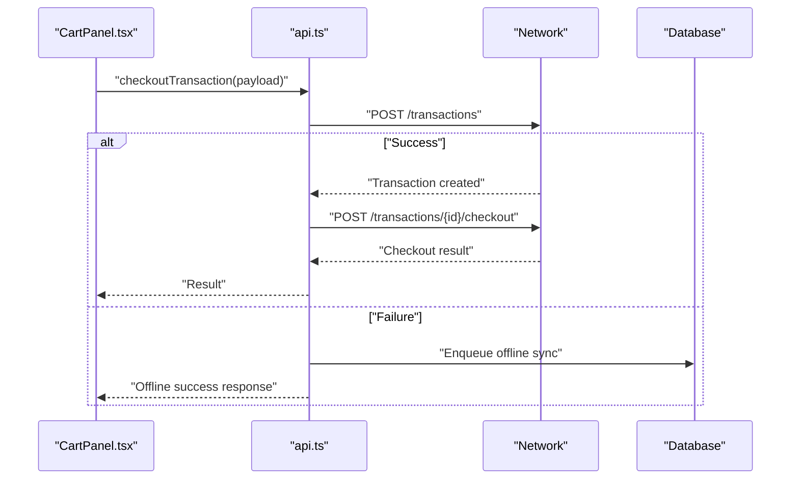
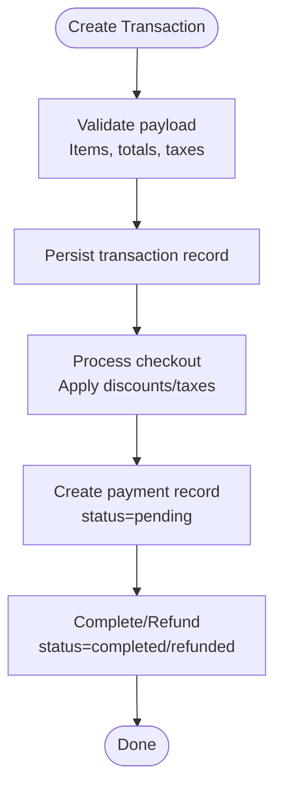
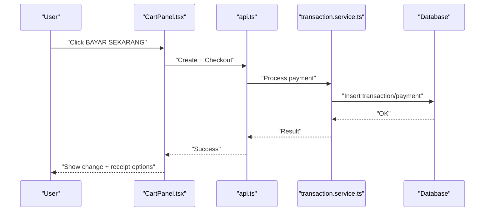
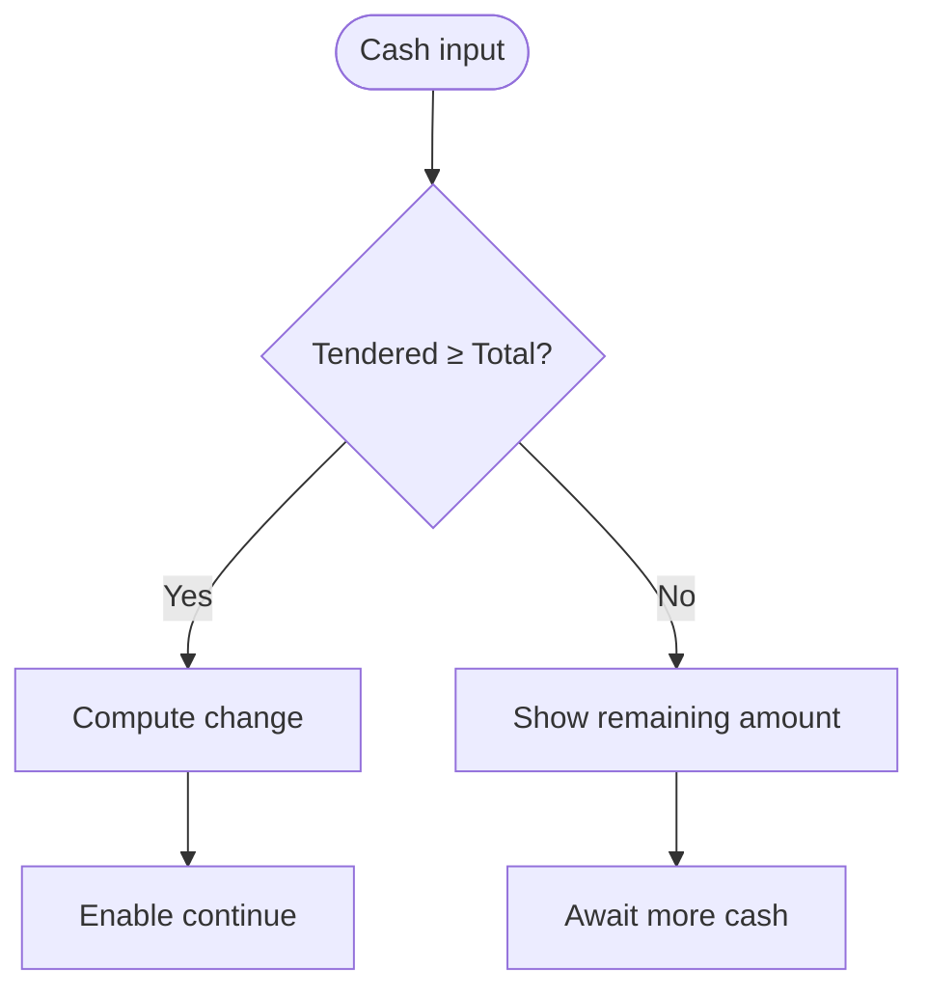
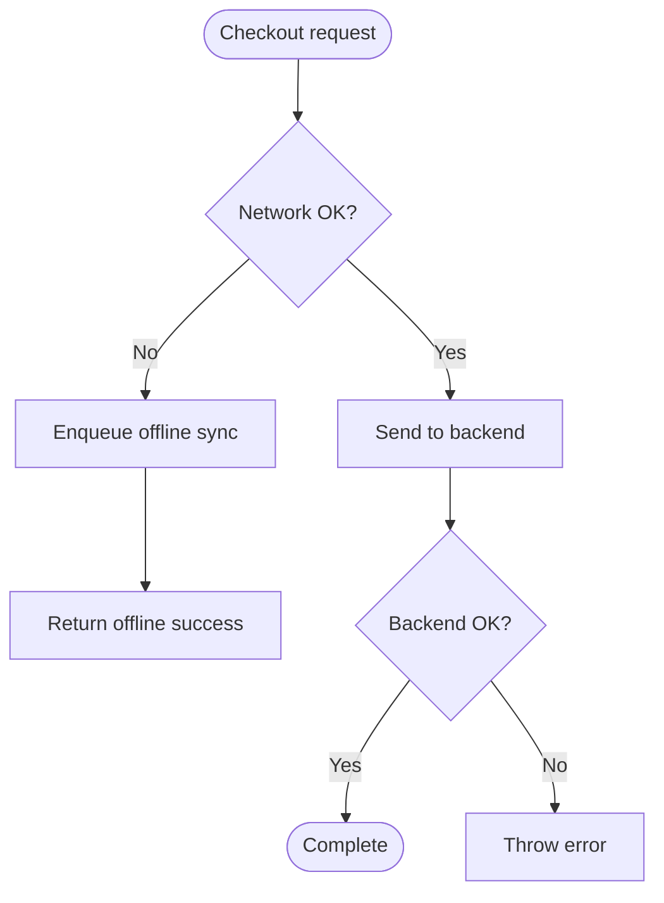
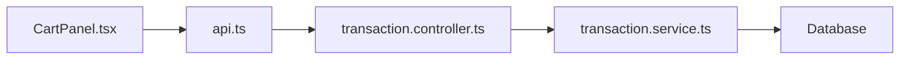

# Payment Processing & Methods

<cite>
**Referenced Files in This Document**
- [CartPanel.tsx](file://apps/web/src/components/pos/CartPanel.tsx)
- [NonCashPaymentModal.tsx](file://apps/web/src/components/pos/NonCashPaymentModal.tsx)
- [api.ts](file://apps/web/src/lib/api.ts)
- [transaction.controller.ts](file://apps/api/src/controllers/transaction.controller.ts)
- [transaction.service.ts](file://apps/api/src/services/transaction.service.ts)
- [test_checkout.ts](file://apps/api/test_checkout.ts)
- [PRD.md](file://PRD/PRD.md)
</cite>

## Table of Contents
1. [Introduction](#introduction)
2. [Project Structure](#project-structure)
3. [Core Components](#core-components)
4. [Architecture Overview](#architecture-overview)
5. [Detailed Component Analysis](#detailed-component-analysis)
6. [Dependency Analysis](#dependency-analysis)
7. [Performance Considerations](#performance-considerations)
8. [Security & Compliance](#security--compliance)
9. [Troubleshooting Guide](#troubleshooting-guide)
10. [Conclusion](#conclusion)

## Introduction
This document explains the payment processing and methods in the POS system. It covers supported payment methods, the payment modal implementation for non-cash transactions, the transaction service layer, the end-to-end payment workflow, partial payments and change calculation, failure handling, security and PCI considerations, and integration patterns with external payment processors and asynchronous confirmation via webhooks.

## Project Structure
The payment flow spans the frontend POS UI and the backend API:
- Frontend: POS cart panel and payment modals orchestrate user interactions and initiate checkout.
- Backend: Transaction controller and service manage payment validation, amount processing, and persistence.

**Diagram sources**
- [CartPanel.tsx:54-457](file://apps/web/src/components/pos/CartPanel.tsx#L54-L457)
- [NonCashPaymentModal.tsx:1-86](file://apps/web/src/components/pos/NonCashPaymentModal.tsx#L1-L86)
- [api.ts:75-159](file://apps/web/src/lib/api.ts#L75-L159)
- [transaction.controller.ts](file://apps/api/src/controllers/transaction.controller.ts)
- [transaction.service.ts](file://apps/api/src/services/transaction.service.ts)

**Section sources**
- [CartPanel.tsx:54-457](file://apps/web/src/components/pos/CartPanel.tsx#L54-L457)
- [NonCashPaymentModal.tsx:1-86](file://apps/web/src/components/pos/NonCashPaymentModal.tsx#L1-L86)
- [api.ts:75-159](file://apps/web/src/lib/api.ts#L75-L159)

## Core Components
- Payment Method Selection: Cash, QRIS, and Card are supported in the POS UI.
- Non-Cash Payment Modal: Guides QRIS and Card payment confirmation with a short processing simulation.
- Cash Input and Change Calculation: Numeric cash input with quick denomination buttons and real-time change computation.
- Checkout Orchestration: Frontend composes transaction payload and invokes backend checkout endpoint.
- Transaction Service Layer: Creates transactions, validates amounts, applies discounts/tax, and persists payment records.
- Offline Fallback: Network failures enqueue transactions for later synchronization.

**Section sources**
- [CartPanel.tsx:396-496](file://apps/web/src/components/pos/CartPanel.tsx#L396-L496)
- [NonCashPaymentModal.tsx:1-86](file://apps/web/src/components/pos/NonCashPaymentModal.tsx#L1-L86)
- [api.ts:75-159](file://apps/web/src/lib/api.ts#L75-L159)
- [PRD.md:400-456](file://PRD/PRD.md#L400-L456)

## Architecture Overview
The payment workflow integrates frontend UI with backend services and database. The frontend collects payment inputs, constructs a payload, and posts to the backend. The backend validates and processes the payment, updates transaction and payment records, and returns a result. Offline scenarios are handled gracefully with queued synchronization.

**Diagram sources**
- [CartPanel.tsx:54-457](file://apps/web/src/components/pos/CartPanel.tsx#L54-L457)
- [NonCashPaymentModal.tsx:1-86](file://apps/web/src/components/pos/NonCashPaymentModal.tsx#L1-L86)
- [api.ts:75-159](file://apps/web/src/lib/api.ts#L75-L159)
- [transaction.controller.ts](file://apps/api/src/controllers/transaction.controller.ts)
- [transaction.service.ts](file://apps/api/src/services/transaction.service.ts)

## Detailed Component Analysis

### Payment Method Selection and UI
- Supported methods: Cash, QRIS, Card.
- Cash mode enables numeric input with quick denomination buttons and live change display.
- QRIS/Card modes show a confirmation dialog with instructions and a simulated processing step.

**Diagram sources**
- [CartPanel.tsx:396-496](file://apps/web/src/components/pos/CartPanel.tsx#L396-L496)
- [NonCashPaymentModal.tsx:1-86](file://apps/web/src/components/pos/NonCashPaymentModal.tsx#L1-L86)

**Section sources**
- [CartPanel.tsx:396-496](file://apps/web/src/components/pos/CartPanel.tsx#L396-L496)
- [NonCashPaymentModal.tsx:1-86](file://apps/web/src/components/pos/NonCashPaymentModal.tsx#L1-L86)

### Checkout Payload Construction and API Calls
- The frontend composes a transaction payload including items, totals, and payment method.
- It performs two steps: create transaction and checkout.
- On network errors, the payload is enqueued for offline synchronization with a simulated success response.

**Diagram sources**
- [api.ts:75-159](file://apps/web/src/lib/api.ts#L75-L159)

**Section sources**
- [api.ts:75-159](file://apps/web/src/lib/api.ts#L75-L159)

### Transaction Service Layer
- Creates a transaction with items, totals, and metadata.
- Processes checkout by validating payment method and amount, applying discounts/tax, and persisting payment records.
- Supports hold/resume/refund operations for lifecycle management.

**Diagram sources**
- [transaction.service.ts](file://apps/api/src/services/transaction.service.ts)
- [test_checkout.ts:1-43](file://apps/api/test_checkout.ts#L1-L43)

**Section sources**
- [transaction.service.ts](file://apps/api/src/services/transaction.service.ts)
- [test_checkout.ts:1-43](file://apps/api/test_checkout.ts#L1-L43)

### Payment Workflow: From Initiation to Completion
- Initiation: User selects method, enters cash or confirms QRIS/Card.
- Validation: Amounts validated against totals; discounts and tax applied.
- Processing: Payment method-specific logic executed (cash change, QRIS/Card confirmation).
- Persistence: Transaction and payment records updated; receipts generated.
- Completion: Success modal shown with change (if cash) and optional print action.

**Diagram sources**
- [CartPanel.tsx:54-457](file://apps/web/src/components/pos/CartPanel.tsx#L54-L457)
- [api.ts:75-159](file://apps/web/src/lib/api.ts#L75-L159)
- [transaction.service.ts](file://apps/api/src/services/transaction.service.ts)

**Section sources**
- [CartPanel.tsx:54-457](file://apps/web/src/components/pos/CartPanel.tsx#L54-L457)
- [api.ts:75-159](file://apps/web/src/lib/api.ts#L75-L159)

### Partial Payments and Change Calculation
- Cash method supports partial payments; the UI disables the pay button until sufficient amount is entered.
- Change is computed as cash tendered minus total; negative values indicate remaining balance.
- Quick denomination buttons accelerate cash entry.

**Diagram sources**
- [CartPanel.tsx:418-448](file://apps/web/src/components/pos/CartPanel.tsx#L418-L448)

**Section sources**
- [CartPanel.tsx:418-448](file://apps/web/src/components/pos/CartPanel.tsx#L418-L448)

### Payment Failure Handling
- Network failures trigger offline queueing; a synthetic success response is returned to the UI.
- Offline transactions are persisted locally and retried later.

**Diagram sources**
- [api.ts:75-159](file://apps/web/src/lib/api.ts#L75-L159)

**Section sources**
- [api.ts:75-159](file://apps/web/src/lib/api.ts#L75-L159)

### Supported Payment Methods
- Cash: Numeric input with quick denominations and change calculation.
- QRIS: Mobile payment via QR code scanning; cashier confirms after funds are received.
- Card: Insert/swipe card at EDC terminal; cashier confirms after transaction completion.
- Additional methods (Bank Transfer, Debit, Credit, E-Wallet) are documented as acceptance criteria and can be integrated by extending the UI and backend handlers.

**Section sources**
- [CartPanel.tsx:396-496](file://apps/web/src/components/pos/CartPanel.tsx#L396-L496)
- [NonCashPaymentModal.tsx:1-86](file://apps/web/src/components/pos/NonCashPaymentModal.tsx#L1-L86)
- [PRD.md:400-456](file://PRD/PRD.md#L400-L456)

## Dependency Analysis
- Frontend depends on the API client for transaction creation and checkout.
- The API controller delegates to the transaction service for business logic.
- The transaction service interacts with the database to persist and update records.

**Diagram sources**
- [CartPanel.tsx:54-457](file://apps/web/src/components/pos/CartPanel.tsx#L54-L457)
- [api.ts:75-159](file://apps/web/src/lib/api.ts#L75-L159)
- [transaction.controller.ts](file://apps/api/src/controllers/transaction.controller.ts)
- [transaction.service.ts](file://apps/api/src/services/transaction.service.ts)

**Section sources**
- [CartPanel.tsx:54-457](file://apps/web/src/components/pos/CartPanel.tsx#L54-L457)
- [api.ts:75-159](file://apps/web/src/lib/api.ts#L75-L159)
- [transaction.controller.ts](file://apps/api/src/controllers/transaction.controller.ts)
- [transaction.service.ts](file://apps/api/src/services/transaction.service.ts)

## Performance Considerations
- Minimize UI blocking: The NonCashPaymentModal simulates processing to avoid premature user actions while maintaining responsiveness.
- Offline-first design: Enqueue failed requests to reduce retries and improve reliability under intermittent connectivity.
- Efficient calculations: Cash change computation occurs on the fly to provide immediate feedback.

[No sources needed since this section provides general guidance]

## Security & Compliance
- PCI compliance: Do not store sensitive cardholder data. Use external payment processors for card transactions and tokenize sensitive fields.
- Data validation: Validate amounts, taxes, and discounts server-side to prevent manipulation.
- Authentication and authorization: Ensure all payment endpoints require authenticated sessions and appropriate permissions.
- Secure transport: Use HTTPS for all payment-related endpoints.
- Webhook security: Verify webhook signatures and reject unsigned or tampered events. Deduplicate events using unique IDs.

[No sources needed since this section provides general guidance]

## Troubleshooting Guide
- Cash amount insufficient: The UI prevents checkout until the entered amount meets or exceeds the total.
- Non-Cash confirmation: If the modal is closed or canceled, the flow resets; re-open the modal to confirm.
- Offline fallback: When offline, the system returns a synthetic success and queues the transaction; verify the offline queue and retry later.
- Refunds and voids: Use backend endpoints to refund completed transactions or void pending ones; ensure proper approvals per policy.

**Section sources**
- [CartPanel.tsx:450-457](file://apps/web/src/components/pos/CartPanel.tsx#L450-L457)
- [NonCashPaymentModal.tsx:1-86](file://apps/web/src/components/pos/NonCashPaymentModal.tsx#L1-L86)
- [api.ts:75-159](file://apps/web/src/lib/api.ts#L75-L159)
- [PRD.md:415-442](file://PRD/PRD.md#L415-L442)

## Conclusion
The POS payment system provides a robust, user-friendly interface for multiple payment methods with strong offline resilience. The frontend handles intuitive payment entry and confirmation, while the backend enforces validation and maintains accurate transaction and payment records. Extending support to additional methods and integrating external processors follows established patterns in the codebase.