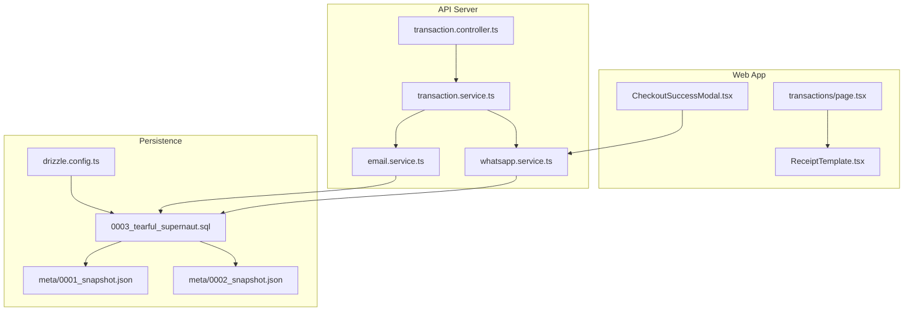
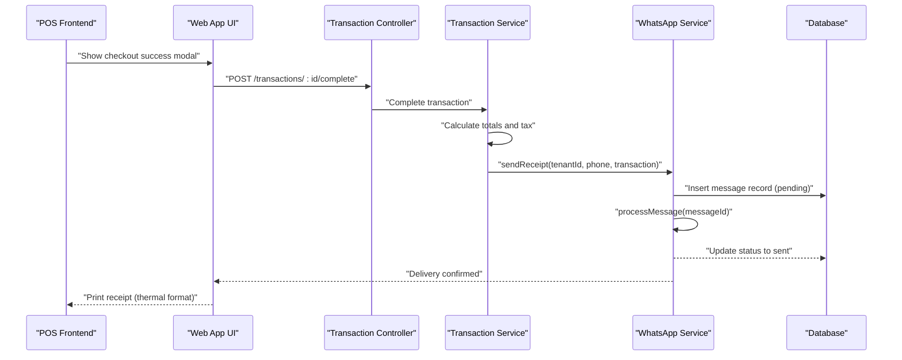
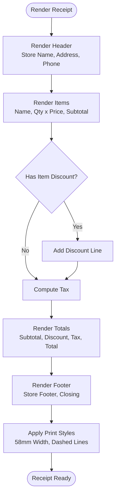
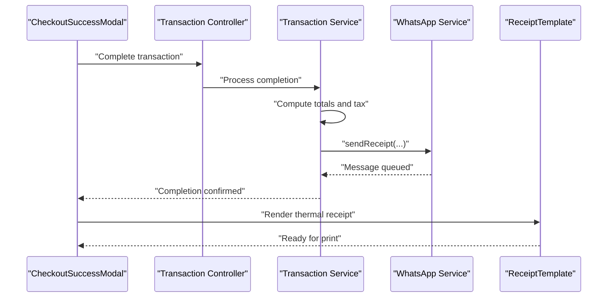
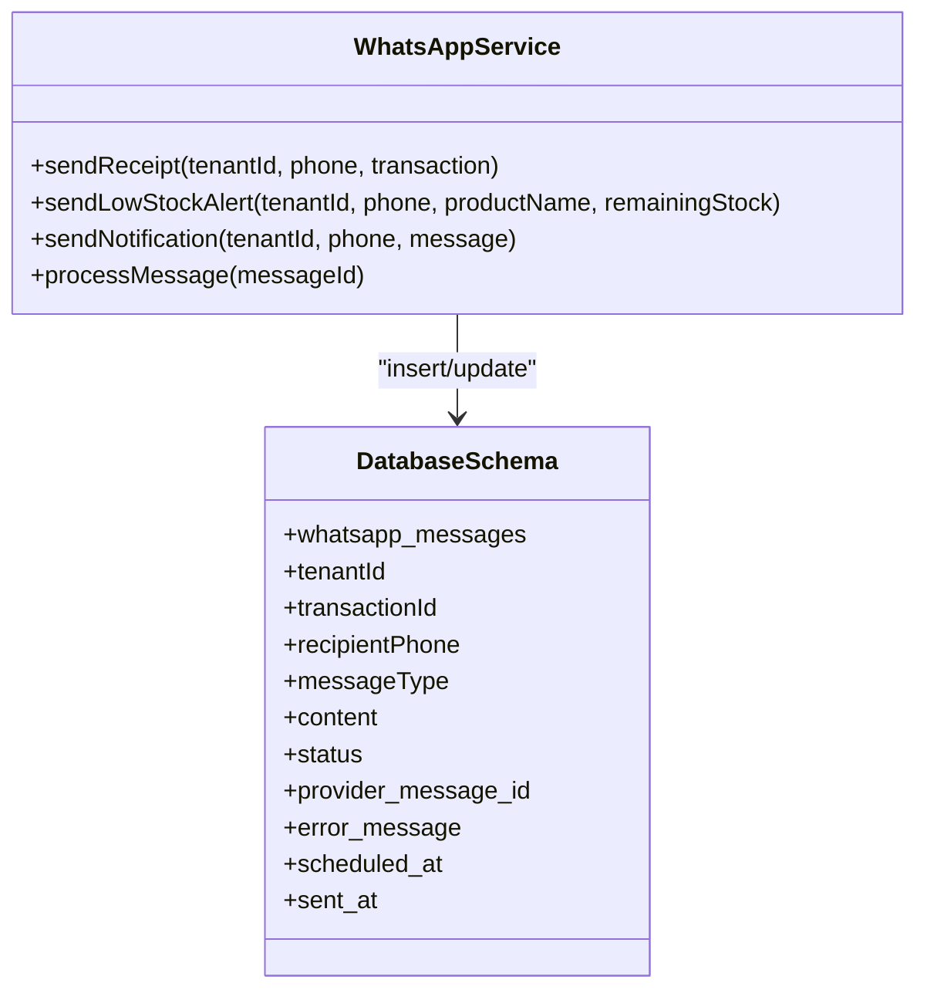
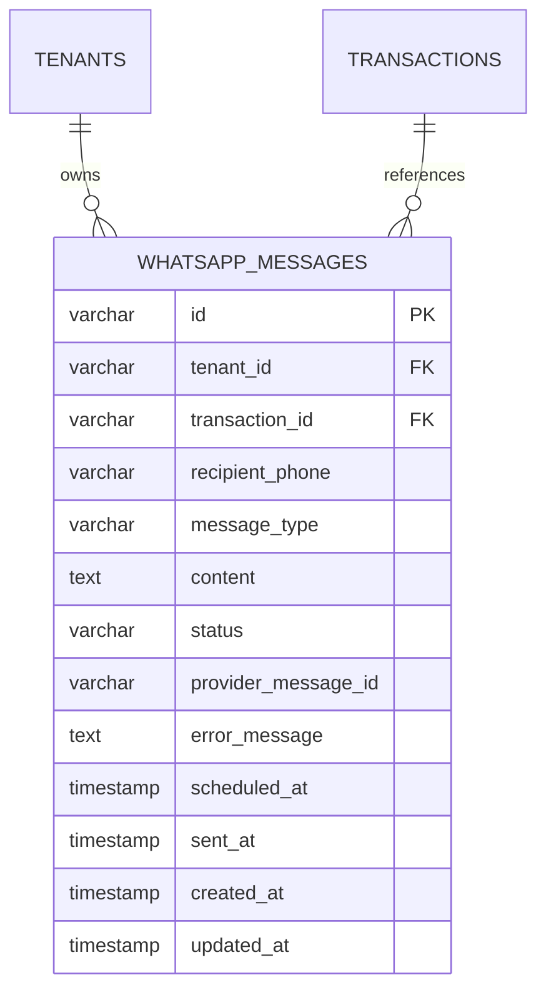
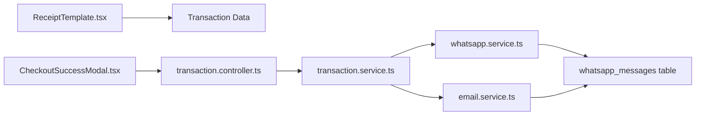

# Receipt Generation & Delivery

<cite>
**Referenced Files in This Document**
- [ReceiptTemplate.tsx](file://apps/web/src/components/pos/ReceiptTemplate.tsx)
- [CheckoutSuccessModal.tsx](file://apps/web/src/components/pos/CheckoutSuccessModal.tsx)
- [transaction.controller.ts](file://apps/api/src/controllers/transaction.controller.ts)
- [transaction.service.ts](file://apps/api/src/services/transaction.service.ts)
- [whatsapp.service.ts](file://apps/api/src/services/whatsapp.service.ts)
- [email.service.ts](file://apps/api/src/services/email.service.ts)
- [0003_tearful_supernaut.sql](file://apps/api/migrations/0003_tearful_supernaut.sql)
- [0002_snapshot.json](file://apps/api/migrations/meta/0002_snapshot.json)
- [0001_snapshot.json](file://apps/api/migrations/meta/0001_snapshot.json)
- [drizzle.config.ts](file://apps/api/drizzle.config.ts)
- [page.tsx](file://apps/web/src/app/transactions/page.tsx)
</cite>

## Table of Contents
1. [Introduction](#introduction)
2. [Project Structure](#project-structure)
3. [Core Components](#core-components)
4. [Architecture Overview](#architecture-overview)
5. [Detailed Component Analysis](#detailed-component-analysis)
6. [Dependency Analysis](#dependency-analysis)
7. [Performance Considerations](#performance-considerations)
8. [Troubleshooting Guide](#troubleshooting-guide)
9. [Conclusion](#conclusion)
10. [Appendices](#appendices)

## Introduction
This document explains the receipt generation and delivery system in the ARHAT POS platform. It covers the receipt template system (header, itemized listings, totals calculation, tax breakdown, and footer), workflows triggered by successful transactions, print job creation, PDF export capability, and multi-channel delivery via email, WhatsApp, and physical print outputs. It also documents WhatsApp receipt integration, formatting options, localization support, custom branding, and receipt storage/retrieval for customer service scenarios.

## Project Structure
The receipt system spans the frontend (web app) and backend (API server):
- Frontend rendering: A thermal-style receipt template renders transaction data for printing.
- Backend services: Transaction controller/service orchestrates successful transaction events and triggers delivery channels.
- Messaging: WhatsApp service sends receipts as messages; email service provides a placeholder for email delivery.
- Persistence: Drizzle ORM manages schema for storing messages and related metadata.

**Diagram sources**
- [ReceiptTemplate.tsx:1-120](file://apps/web/src/components/pos/ReceiptTemplate.tsx#L1-L120)
- [CheckoutSuccessModal.tsx:35-66](file://apps/web/src/components/pos/CheckoutSuccessModal.tsx#L35-L66)
- [transaction.controller.ts](file://apps/api/src/controllers/transaction.controller.ts)
- [transaction.service.ts](file://apps/api/src/services/transaction.service.ts)
- [whatsapp.service.ts:1-36](file://apps/api/src/services/whatsapp.service.ts#L1-L36)
- [email.service.ts:1-8](file://apps/api/src/services/email.service.ts#L1-L8)
- [0003_tearful_supernaut.sql](file://apps/api/migrations/0003_tearful_supernaut.sql)
- [0002_snapshot.json:2187-2239](file://apps/api/migrations/meta/0002_snapshot.json#L2187-L2239)
- [0001_snapshot.json:2134-2186](file://apps/api/migrations/meta/0001_snapshot.json#L2134-L2186)
- [drizzle.config.ts](file://apps/api/drizzle.config.ts)

**Section sources**
- [ReceiptTemplate.tsx:1-120](file://apps/web/src/components/pos/ReceiptTemplate.tsx#L1-L120)
- [CheckoutSuccessModal.tsx:35-66](file://apps/web/src/components/pos/CheckoutSuccessModal.tsx#L35-L66)
- [transaction.controller.ts](file://apps/api/src/controllers/transaction.controller.ts)
- [transaction.service.ts](file://apps/api/src/services/transaction.service.ts)
- [whatsapp.service.ts:1-36](file://apps/api/src/services/whatsapp.service.ts#L1-L36)
- [email.service.ts:1-8](file://apps/api/src/services/email.service.ts#L1-L8)
- [0003_tearful_supernaut.sql](file://apps/api/migrations/0003_tearful_supernaut.sql)
- [0002_snapshot.json:2187-2239](file://apps/api/migrations/meta/0002_snapshot.json#L2187-L2239)
- [0001_snapshot.json:2134-2186](file://apps/api/migrations/meta/0001_snapshot.json#L2134-L2186)
- [drizzle.config.ts](file://apps/api/drizzle.config.ts)

## Core Components
- Receipt Template Renderer: Renders a thermal-style receipt with header, items, totals, tax, and footer. Supports localization formatting and print-only styles.
- Transaction Controller/Service: Coordinates successful transaction completion and triggers delivery actions.
- WhatsApp Service: Sends receipt messages to customers and tracks message lifecycle.
- Email Service: Provides a placeholder for email delivery functionality.
- Persistence Layer: Stores message records with status, timestamps, and provider identifiers.

Key responsibilities:
- Receipt rendering and formatting
- Totals calculation and tax breakdown
- Multi-channel delivery orchestration
- Message persistence and status tracking
- Localization and currency formatting

**Section sources**
- [ReceiptTemplate.tsx:1-120](file://apps/web/src/components/pos/ReceiptTemplate.tsx#L1-L120)
- [transaction.controller.ts](file://apps/api/src/controllers/transaction.controller.ts)
- [transaction.service.ts](file://apps/api/src/services/transaction.service.ts)
- [whatsapp.service.ts:1-36](file://apps/api/src/services/whatsapp.service.ts#L1-L36)
- [email.service.ts:1-8](file://apps/api/src/services/email.service.ts#L1-L8)

## Architecture Overview
The receipt generation and delivery pipeline integrates frontend rendering with backend services and persistence.

**Diagram sources**
- [CheckoutSuccessModal.tsx:35-66](file://apps/web/src/components/pos/CheckoutSuccessModal.tsx#L35-L66)
- [transaction.controller.ts](file://apps/api/src/controllers/transaction.controller.ts)
- [transaction.service.ts](file://apps/api/src/services/transaction.service.ts)
- [whatsapp.service.ts:1-36](file://apps/api/src/services/whatsapp.service.ts#L1-L36)

## Detailed Component Analysis

### Receipt Template System
The receipt template renders a compact thermal-style receipt with:
- Header: Store branding and contact info
- Itemized listings: Product name, quantity, unit price, subtotal, and discount per item
- Totals summary: Subtotal, discount amount, tax amount, and total
- Footer: Optional store footer text and closing message

Formatting and localization:
- Uses locale-aware number formatting for currency and thousands separators
- Print-only styles ensure proper thermal printer output
- Fixed width and font sizing optimized for 58mm thermal paper

**Diagram sources**
- [ReceiptTemplate.tsx:1-120](file://apps/web/src/components/pos/ReceiptTemplate.tsx#L1-L120)

**Section sources**
- [ReceiptTemplate.tsx:1-120](file://apps/web/src/components/pos/ReceiptTemplate.tsx#L1-L120)

### Transaction Completion and Delivery Orchestration
On successful transaction completion:
- The UI triggers a completion endpoint
- The backend service calculates totals and tax
- The system prepares delivery via WhatsApp and optionally email
- The receipt is rendered for immediate printing

**Diagram sources**
- [CheckoutSuccessModal.tsx:35-66](file://apps/web/src/components/pos/CheckoutSuccessModal.tsx#L35-L66)
- [transaction.controller.ts](file://apps/api/src/controllers/transaction.controller.ts)
- [transaction.service.ts](file://apps/api/src/services/transaction.service.ts)
- [whatsapp.service.ts:1-36](file://apps/api/src/services/whatsapp.service.ts#L1-L36)
- [ReceiptTemplate.tsx:1-120](file://apps/web/src/components/pos/ReceiptTemplate.tsx#L1-L120)

**Section sources**
- [CheckoutSuccessModal.tsx:35-66](file://apps/web/src/components/pos/CheckoutSuccessModal.tsx#L35-L66)
- [transaction.controller.ts](file://apps/api/src/controllers/transaction.controller.ts)
- [transaction.service.ts](file://apps/api/src/services/transaction.service.ts)
- [whatsapp.service.ts:1-36](file://apps/api/src/services/whatsapp.service.ts#L1-L36)
- [ReceiptTemplate.tsx:1-120](file://apps/web/src/components/pos/ReceiptTemplate.tsx#L1-L120)

### WhatsApp Receipt Integration
The WhatsApp service:
- Constructs a localized receipt message from transaction data
- Inserts a pending message record into the database
- Attempts immediate processing and updates status upon success
- Tracks provider message ID, error messages, scheduling, and sent timestamps

**Diagram sources**
- [whatsapp.service.ts:1-36](file://apps/api/src/services/whatsapp.service.ts#L1-L36)
- [0001_snapshot.json:2134-2186](file://apps/api/migrations/meta/0001_snapshot.json#L2134-L2186)
- [0002_snapshot.json:2187-2239](file://apps/api/migrations/meta/0002_snapshot.json#L2187-L2239)

**Section sources**
- [whatsapp.service.ts:1-36](file://apps/api/src/services/whatsapp.service.ts#L1-L36)
- [0001_snapshot.json:2134-2186](file://apps/api/migrations/meta/0001_snapshot.json#L2134-L2186)
- [0002_snapshot.json:2187-2239](file://apps/api/migrations/meta/0002_snapshot.json#L2187-L2239)

### Email Delivery Placeholder
The email service currently provides mock functions for verification and password reset emails. Email receipt delivery can be integrated by extending this service to:
- Accept transaction data and render a PDF receipt
- Queue or send the email with the receipt attached
- Track delivery status similarly to WhatsApp messages

**Section sources**
- [email.service.ts:1-8](file://apps/api/src/services/email.service.ts#L1-L8)

### Receipt Storage, Retrieval, and Reprint
The database schema supports storing message records with:
- Tenant and transaction linkage
- Recipient phone and message type
- Content, status, and timestamps
- Provider message ID and error tracking

**Diagram sources**
- [0003_tearful_supernaut.sql](file://apps/api/migrations/0003_tearful_supernaut.sql)
- [0002_snapshot.json:2187-2239](file://apps/api/migrations/meta/0002_snapshot.json#L2187-L2239)
- [0001_snapshot.json:2134-2186](file://apps/api/migrations/meta/0001_snapshot.json#L2134-L2186)

**Section sources**
- [0003_tearful_supernaut.sql](file://apps/api/migrations/0003_tearful_supernaut.sql)
- [0002_snapshot.json:2187-2239](file://apps/api/migrations/meta/0002_snapshot.json#L2187-L2239)
- [0001_snapshot.json:2134-2186](file://apps/api/migrations/meta/0001_snapshot.json#L2134-L2186)

## Dependency Analysis
- Frontend depends on transaction data to render receipts and trigger print actions.
- Backend services depend on Drizzle ORM for persistence and on external providers for messaging.
- The WhatsApp service encapsulates message lifecycle and status transitions.
- The email service is decoupled and ready for extension.

**Diagram sources**
- [ReceiptTemplate.tsx:1-120](file://apps/web/src/components/pos/ReceiptTemplate.tsx#L1-L120)
- [CheckoutSuccessModal.tsx:35-66](file://apps/web/src/components/pos/CheckoutSuccessModal.tsx#L35-L66)
- [transaction.controller.ts](file://apps/api/src/controllers/transaction.controller.ts)
- [transaction.service.ts](file://apps/api/src/services/transaction.service.ts)
- [whatsapp.service.ts:1-36](file://apps/api/src/services/whatsapp.service.ts#L1-L36)
- [email.service.ts:1-8](file://apps/api/src/services/email.service.ts#L1-L8)

**Section sources**
- [ReceiptTemplate.tsx:1-120](file://apps/web/src/components/pos/ReceiptTemplate.tsx#L1-L120)
- [CheckoutSuccessModal.tsx:35-66](file://apps/web/src/components/pos/CheckoutSuccessModal.tsx#L35-L66)
- [transaction.controller.ts](file://apps/api/src/controllers/transaction.controller.ts)
- [transaction.service.ts](file://apps/api/src/services/transaction.service.ts)
- [whatsapp.service.ts:1-36](file://apps/api/src/services/whatsapp.service.ts#L1-L36)
- [email.service.ts:1-8](file://apps/api/src/services/email.service.ts#L1-L8)

## Performance Considerations
- Rendering: The receipt template uses lightweight inline styles and fixed dimensions to minimize layout thrashing during print.
- Messaging: Immediate processing is simulated; production deployments should enqueue messages for asynchronous processing to avoid blocking transaction completion.
- Formatting: Currency and number formatting rely on locale-aware APIs; ensure consistent locale configuration across environments.
- Persistence: Batch inserts and updates for message records improve throughput; consider indexing frequently queried fields (e.g., tenantId, status).

## Troubleshooting Guide
Common issues and resolutions:
- Missing phone number for WhatsApp delivery: The service checks for a valid phone number and skips sending if absent.
- Message status stuck as pending: Verify message processing logic and provider response handling; inspect error_message and provider_message_id fields.
- Receipt not printing: Confirm print styles are applied and the receipt container is visible in print mode.
- Localization inconsistencies: Ensure locale settings align with the intended currency and number formatting.

**Section sources**
- [whatsapp.service.ts:1-36](file://apps/api/src/services/whatsapp.service.ts#L1-L36)
- [ReceiptTemplate.tsx:1-120](file://apps/web/src/components/pos/ReceiptTemplate.tsx#L1-L120)

## Conclusion
The receipt system combines a flexible thermal-style template with robust delivery channels. The current implementation focuses on WhatsApp delivery and print-ready rendering, with email delivery ready for extension. The schema supports message lifecycle tracking, enabling auditability and status monitoring. Future enhancements can include PDF export, advanced localization, and branded templates.

## Appendices
- Print Job Creation: The receipt template applies print-specific styles and dimensions suitable for thermal printers.
- PDF Export: Can be implemented by rendering the receipt in a hidden DOM element and invoking browser print-to-PDF APIs or third-party libraries.
- Custom Branding: Extend the template to include dynamic store branding and localized footer content stored per tenant.
- Reprint Functionality: Use stored transaction and message records to regenerate receipts and resend messages as needed.