# Transaction Workflows & States

<cite>
**Referenced Files in This Document**
- [transaction.controller.ts](file://apps/api/src/controllers/transaction.controller.ts)
- [transaction.routes.ts](file://apps/api/src/routes/transaction.routes.ts)
- [transaction.service.ts](file://apps/api/src/services/transaction.service.ts)
- [shift.service.ts](file://apps/api/src/services/shift.service.ts)
- [shift.routes.ts](file://apps/api/src/routes/shift.routes.ts)
- [transaction.controller.js](file://apps/api/src/controllers/transaction.controller.js)
- [transaction.routes.js](file://apps/api/src/routes/transaction.routes.js)
- [transaction.service.js](file://apps/api/src/services/transaction.service.js)
- [shift.service.js](file://apps/api/src/services/shift.service.js)
- [shift.routes.js](file://apps/api/src/routes/shift.routes.js)
- [db.ts](file://apps/api/src/lib/db.ts)
- [errors.ts](file://apps/api/src/lib/errors.ts)
- [errorHandler.ts](file://apps/api/src/middleware/errorHandler.ts)
- [errorHandler.js](file://apps/api/src/middleware/errorHandler.js)
- [CartPanel.tsx](file://apps/web/src/components/pos/CartPanel.tsx)
- [HeldTransactionsModal.tsx](file://apps/web/src/components/pos/HeldTransactionsModal.tsx)
- [NonCashPaymentModal.tsx](file://apps/web/src/components/pos/NonCashPaymentModal.tsx)
- [POSHeaderActions.tsx](file://apps/web/src/components/pos/POSHeaderActions.tsx)
- [ShiftModal.tsx](file://apps/web/src/components/pos/ShiftModal.tsx)
- [ReceiptTemplate.tsx](file://apps/web/src/components/pos/ReceiptTemplate.tsx)
- [useCartStore.ts](file://apps/web/src/store/useCartStore.ts)
- [analytics.controller.ts](file://apps/api/src/controllers/analytics.controller.ts)
- [analytics.service.ts](file://apps/api/src/services/analytics.service.ts)
- [0000_wide_runaways.sql](file://apps/api/migrations/0000_wide_runaways.sql)
- [0001_damp_sunfire.sql](file://apps/api/migrations/0001_damp_sunfire.sql)
- [0002_light_katie_power.sql](file://apps/api/migrations/0002_light_katie_power.sql)
- [0003_tearful_supernaut.sql](file://apps/api/migrations/0003_tearful_supernaut.sql)
- [001_initial_setup.sql](file://apps/api/migrations/0001_initial_setup.sql)
</cite>

## Table of Contents
1. [Introduction](#introduction)
2. [Project Structure](#project-structure)
3. [Core Components](#core-components)
4. [Architecture Overview](#architecture-overview)
5. [Detailed Component Analysis](#detailed-component-analysis)
6. [Dependency Analysis](#dependency-analysis)
7. [Performance Considerations](#performance-considerations)
8. [Troubleshooting Guide](#troubleshooting-guide)
9. [Conclusion](#conclusion)
10. [Appendices](#appendices)

## Introduction
This document provides comprehensive documentation for transaction workflows and state management in the ARHAT POS system. It covers the transaction lifecycle (creation, modification, completion, void, and refund), held transactions for paused workflows, reservation systems, shift-based transaction management, auditing, validation rules, error handling, and reporting capabilities. The goal is to make the transaction system understandable for both technical and non-technical stakeholders.

## Project Structure
The transaction system spans both the backend API and the frontend web application:
- Backend API: Controllers, routes, services, database utilities, and middleware handle transaction operations, validation, and error handling.
- Frontend Web App: POS components manage cart state, payment flows, held transactions, shift operations, and receipt generation.

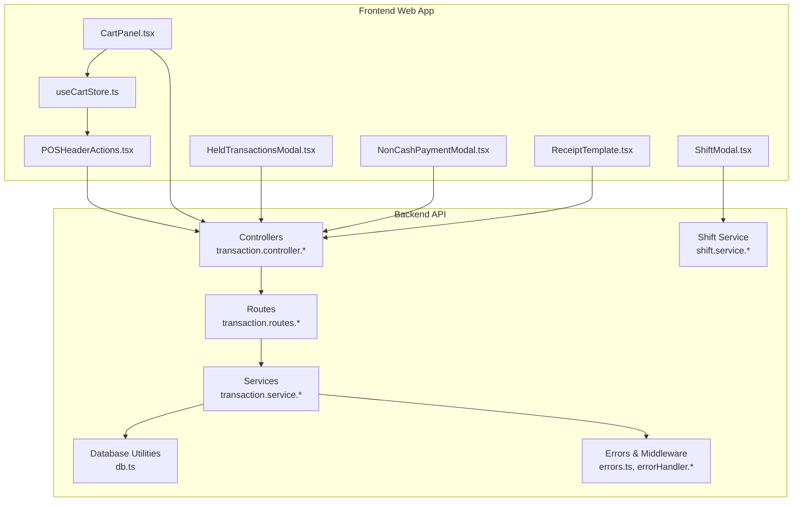

**Diagram sources**
- [transaction.controller.ts](file://apps/api/src/controllers/transaction.controller.ts)
- [transaction.routes.ts](file://apps/api/src/routes/transaction.routes.ts)
- [transaction.service.ts](file://apps/api/src/services/transaction.service.ts)
- [shift.service.ts](file://apps/api/src/services/shift.service.ts)
- [db.ts](file://apps/api/src/lib/db.ts)
- [errorHandler.ts](file://apps/api/src/middleware/errorHandler.ts)
- [CartPanel.tsx](file://apps/web/src/components/pos/CartPanel.tsx)
- [HeldTransactionsModal.tsx](file://apps/web/src/components/pos/HeldTransactionsModal.tsx)
- [NonCashPaymentModal.tsx](file://apps/web/src/components/pos/NonCashPaymentModal.tsx)
- [POSHeaderActions.tsx](file://apps/web/src/components/pos/POSHeaderActions.tsx)
- [ShiftModal.tsx](file://apps/web/src/components/pos/ShiftModal.tsx)
- [ReceiptTemplate.tsx](file://apps/web/src/components/pos/ReceiptTemplate.tsx)
- [useCartStore.ts](file://apps/web/src/store/useCartStore.ts)

**Section sources**
- [transaction.controller.ts](file://apps/api/src/controllers/transaction.controller.ts)
- [transaction.routes.ts](file://apps/api/src/routes/transaction.routes.ts)
- [transaction.service.ts](file://apps/api/src/services/transaction.service.ts)
- [shift.service.ts](file://apps/api/src/services/shift.service.ts)
- [db.ts](file://apps/api/src/lib/db.ts)
- [errorHandler.ts](file://apps/api/src/middleware/errorHandler.ts)
- [CartPanel.tsx](file://apps/web/src/components/pos/CartPanel.tsx)
- [HeldTransactionsModal.tsx](file://apps/web/src/components/pos/HeldTransactionsModal.tsx)
- [NonCashPaymentModal.tsx](file://apps/web/src/components/pos/NonCashPaymentModal.tsx)
- [POSHeaderActions.tsx](file://apps/web/src/components/pos/POSHeaderActions.tsx)
- [ShiftModal.tsx](file://apps/web/src/components/pos/ShiftModal.tsx)
- [ReceiptTemplate.tsx](file://apps/web/src/components/pos/ReceiptTemplate.tsx)
- [useCartStore.ts](file://apps/web/src/store/useCartStore.ts)

## Core Components
- Transaction Controller: Exposes endpoints for transaction operations and delegates to the service layer.
- Transaction Service: Implements business logic for transaction states, validations, and persistence.
- Shift Service: Manages shift lifecycle (open/close), cash handling, and end-of-day reconciliation.
- Routes: Define API endpoints for transactions and shifts.
- Database Utilities: Provide connection and transaction primitives.
- Error Handling: Centralized error handling and custom error types.
- Frontend POS Components: Manage cart state, payment flows, held transactions, and receipts.

Key responsibilities:
- Enforce state transitions and constraints.
- Maintain audit trails and user attribution.
- Support held transactions and recovery mechanisms.
- Integrate with shift-based cash handling.
- Provide reporting and analytics via analytics service.

**Section sources**
- [transaction.controller.ts](file://apps/api/src/controllers/transaction.controller.ts)
- [transaction.service.ts](file://apps/api/src/services/transaction.service.ts)
- [shift.service.ts](file://apps/api/src/services/shift.service.ts)
- [transaction.routes.ts](file://apps/api/src/routes/transaction.routes.ts)
- [shift.routes.ts](file://apps/api/src/routes/shift.routes.ts)
- [db.ts](file://apps/api/src/lib/db.ts)
- [errors.ts](file://apps/api/src/lib/errors.ts)
- [errorHandler.ts](file://apps/api/src/middleware/errorHandler.ts)

## Architecture Overview
The transaction system follows a layered architecture:
- Presentation Layer: Frontend POS components and actions.
- Application Layer: Controllers and Services.
- Domain Layer: Business logic for state transitions, validations, and constraints.
- Persistence Layer: Database utilities and migrations.

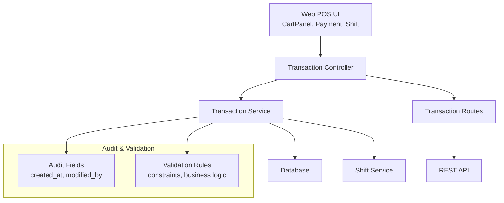

**Diagram sources**
- [transaction.controller.ts](file://apps/api/src/controllers/transaction.controller.ts)
- [transaction.service.ts](file://apps/api/src/services/transaction.service.ts)
- [shift.service.ts](file://apps/api/src/services/shift.service.ts)
- [transaction.routes.ts](file://apps/api/src/routes/transaction.routes.ts)
- [db.ts](file://apps/api/src/lib/db.ts)

## Detailed Component Analysis

### Transaction Lifecycle and State Management
The transaction lifecycle encompasses creation, modification, completion, void, and refund states. The service enforces state transitions and constraints.

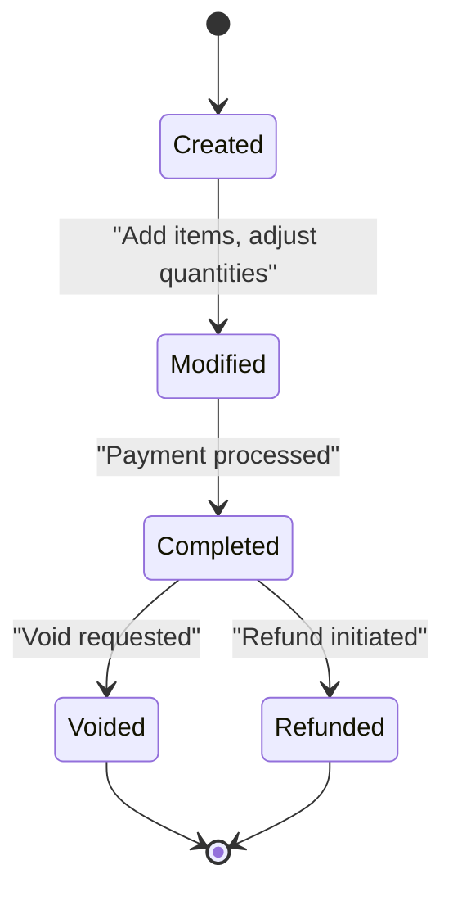

- Creation: Initializes transaction with cart items and pending state.
- Modification: Allows item adjustments while in Created/Modified states.
- Completion: Finalizes payment and moves to Completed.
- Void: Cancels a completed transaction (reverses effects).
- Refund: Issues refunds for completed transactions.

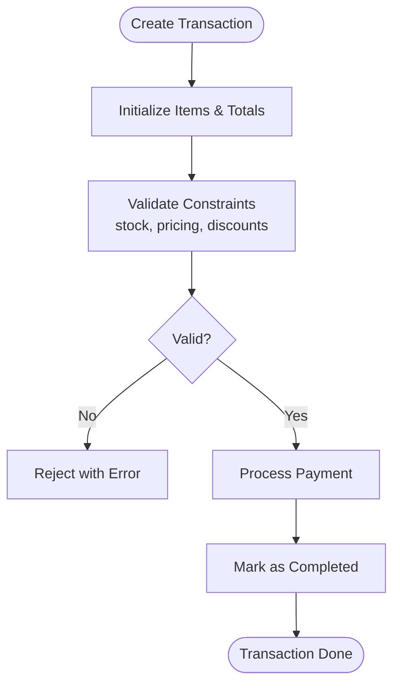

**Diagram sources**
- [transaction.service.ts](file://apps/api/src/services/transaction.service.ts)

**Section sources**
- [transaction.service.ts](file://apps/api/src/services/transaction.service.ts)
- [transaction.controller.ts](file://apps/api/src/controllers/transaction.controller.ts)

### Held Transactions and Reservation Systems
Held transactions pause workflows for later completion. The UI provides a modal to manage held transactions, and the backend supports retrieval and continuation.

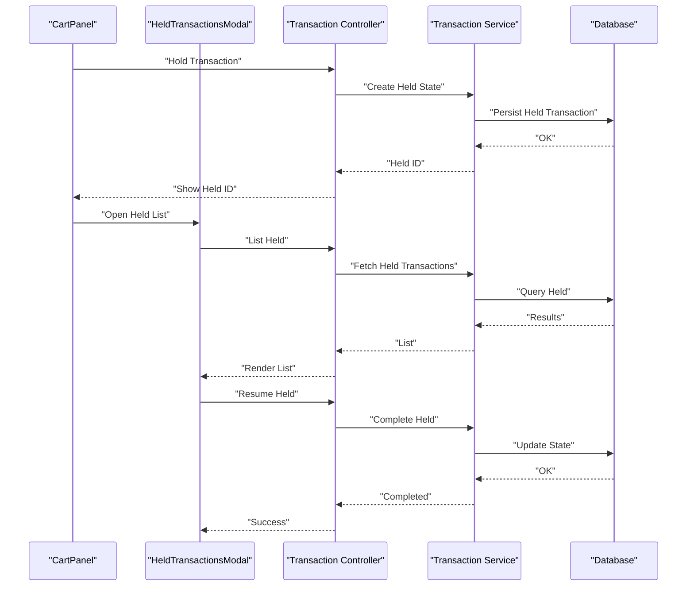

**Diagram sources**
- [HeldTransactionsModal.tsx](file://apps/web/src/components/pos/HeldTransactionsModal.tsx)
- [CartPanel.tsx](file://apps/web/src/components/pos/CartPanel.tsx)
- [transaction.controller.ts](file://apps/api/src/controllers/transaction.controller.ts)
- [transaction.service.ts](file://apps/api/src/services/transaction.service.ts)

**Section sources**
- [HeldTransactionsModal.tsx](file://apps/web/src/components/pos/HeldTransactionsModal.tsx)
- [CartPanel.tsx](file://apps/web/src/components/pos/CartPanel.tsx)
- [transaction.controller.ts](file://apps/api/src/controllers/transaction.controller.ts)
- [transaction.service.ts](file://apps/api/src/services/transaction.service.ts)

### Shift-Based Transaction Management
Shifts encapsulate cash handling and end-of-day reconciliation. The shift service manages opening, closing, and cash counts.

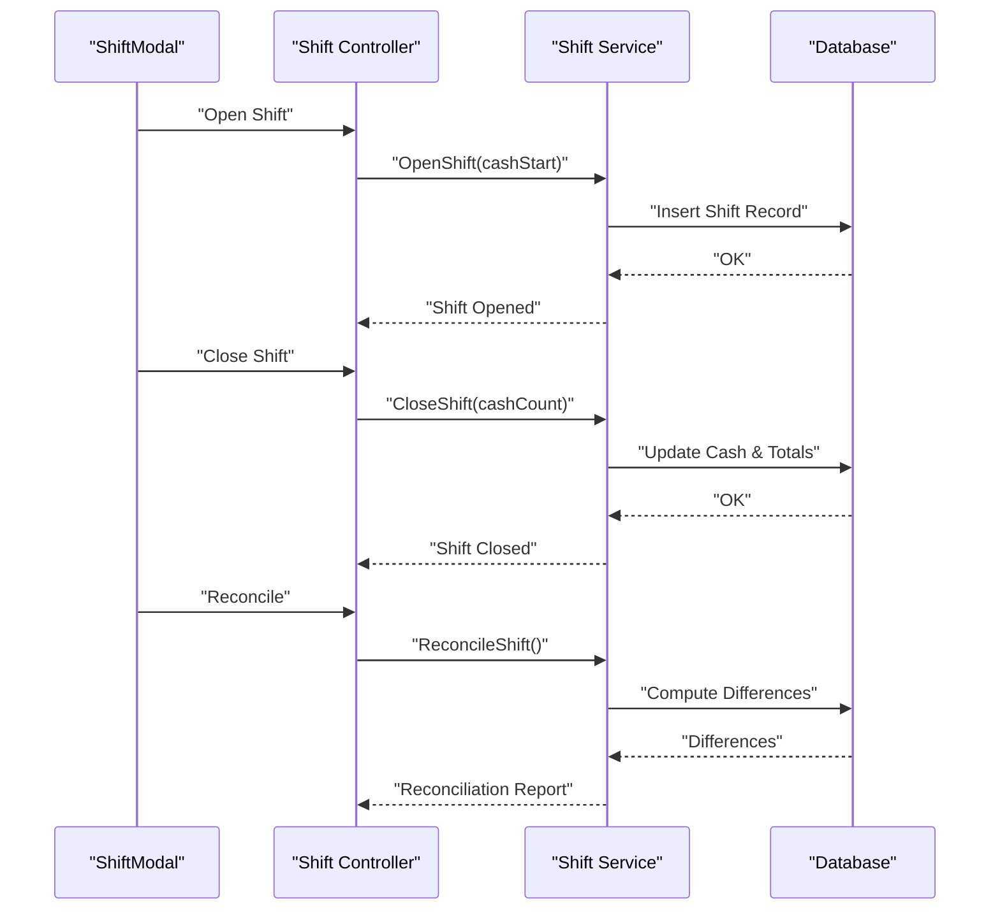

**Diagram sources**
- [ShiftModal.tsx](file://apps/web/src/components/pos/ShiftModal.tsx)
- [shift.service.ts](file://apps/api/src/services/shift.service.ts)
- [shift.routes.ts](file://apps/api/src/routes/shift.routes.ts)

**Section sources**
- [ShiftModal.tsx](file://apps/web/src/components/pos/ShiftModal.tsx)
- [shift.service.ts](file://apps/api/src/services/shift.service.ts)
- [shift.routes.ts](file://apps/api/src/routes/shift.routes.ts)

### Transaction Auditing and User Attribution
Auditing captures creation timestamps, modifications, and user attribution. The service writes audit metadata during operations.

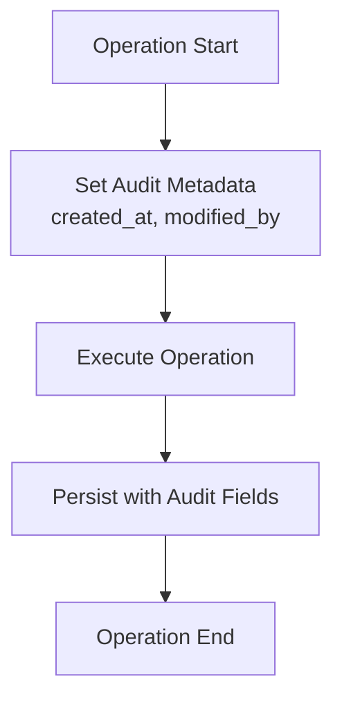

**Diagram sources**
- [transaction.service.ts](file://apps/api/src/services/transaction.service.ts)

**Section sources**
- [transaction.service.ts](file://apps/api/src/services/transaction.service.ts)

### Transaction Validation Rules and Constraint Checking
Validation ensures data integrity and business rule compliance. Typical checks include stock availability, price accuracy, discount limits, and payment completeness.

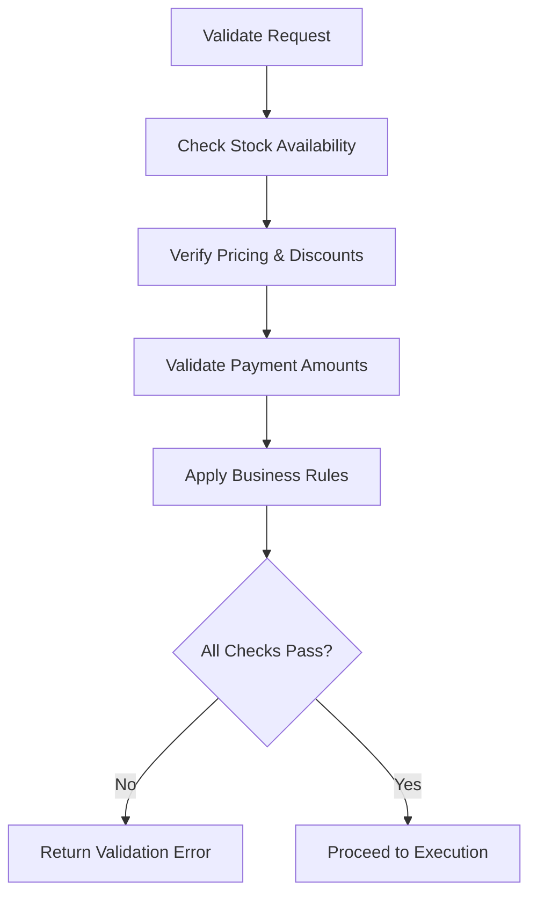

**Diagram sources**
- [transaction.service.ts](file://apps/api/src/services/transaction.service.ts)

**Section sources**
- [transaction.service.ts](file://apps/api/src/services/transaction.service.ts)

### Error Handling for Concurrent Transactions, Failures, and Consistency
Centralized error handling and custom error types ensure consistent failure responses. The middleware intercepts errors and returns standardized messages. Concurrency is mitigated through database-level constraints and optimistic locking.

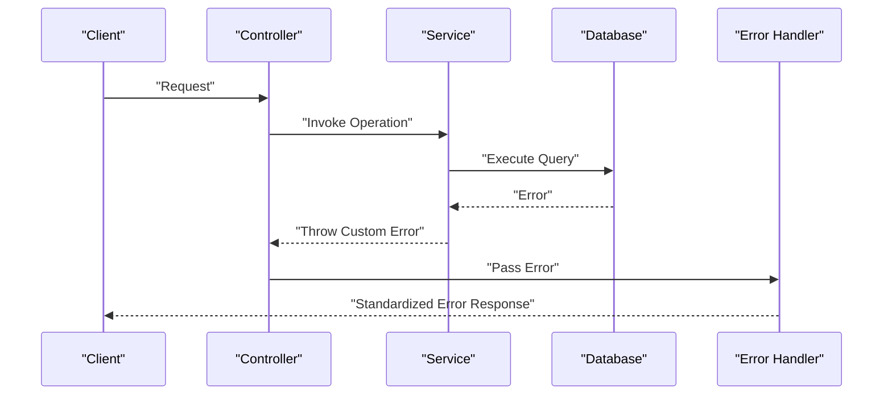

**Diagram sources**
- [errorHandler.ts](file://apps/api/src/middleware/errorHandler.ts)
- [errors.ts](file://apps/api/src/lib/errors.ts)
- [transaction.controller.ts](file://apps/api/src/controllers/transaction.controller.ts)
- [transaction.service.ts](file://apps/api/src/services/transaction.service.ts)

**Section sources**
- [errorHandler.ts](file://apps/api/src/middleware/errorHandler.ts)
- [errors.ts](file://apps/api/src/lib/errors.ts)
- [transaction.controller.ts](file://apps/api/src/controllers/transaction.controller.ts)
- [transaction.service.ts](file://apps/api/src/services/transaction.service.ts)

### Transaction Reporting and Historical Data Management
Analytics and reporting leverage the analytics service to produce historical summaries and trends. Historical data is stored in the database and exposed via analytics endpoints.

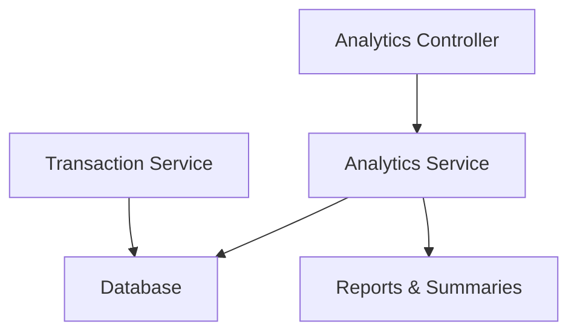

**Diagram sources**
- [analytics.controller.ts](file://apps/api/src/controllers/analytics.controller.ts)
- [analytics.service.ts](file://apps/api/src/services/analytics.service.ts)
- [transaction.service.ts](file://apps/api/src/services/transaction.service.ts)

**Section sources**
- [analytics.controller.ts](file://apps/api/src/controllers/analytics.controller.ts)
- [analytics.service.ts](file://apps/api/src/services/analytics.service.ts)
- [transaction.service.ts](file://apps/api/src/services/transaction.service.ts)

## Dependency Analysis
The transaction system exhibits clear separation of concerns with low coupling and high cohesion.

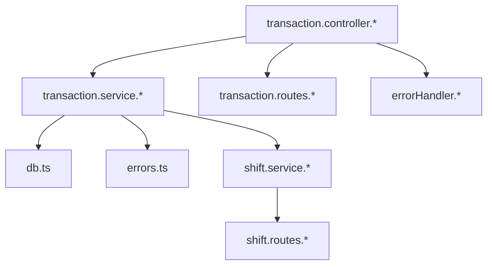

**Diagram sources**
- [transaction.controller.ts](file://apps/api/src/controllers/transaction.controller.ts)
- [transaction.service.ts](file://apps/api/src/services/transaction.service.ts)
- [transaction.routes.ts](file://apps/api/src/routes/transaction.routes.ts)
- [shift.service.ts](file://apps/api/src/services/shift.service.ts)
- [shift.routes.ts](file://apps/api/src/routes/shift.routes.ts)
- [db.ts](file://apps/api/src/lib/db.ts)
- [errors.ts](file://apps/api/src/lib/errors.ts)
- [errorHandler.ts](file://apps/api/src/middleware/errorHandler.ts)

**Section sources**
- [transaction.controller.ts](file://apps/api/src/controllers/transaction.controller.ts)
- [transaction.service.ts](file://apps/api/src/services/transaction.service.ts)
- [transaction.routes.ts](file://apps/api/src/routes/transaction.routes.ts)
- [shift.service.ts](file://apps/api/src/services/shift.service.ts)
- [shift.routes.ts](file://apps/api/src/routes/shift.routes.ts)
- [db.ts](file://apps/api/src/lib/db.ts)
- [errors.ts](file://apps/api/src/lib/errors.ts)
- [errorHandler.ts](file://apps/api/src/middleware/errorHandler.ts)

## Performance Considerations
- Minimize round trips by batching operations where possible.
- Use database transactions to maintain consistency for multi-step operations.
- Index frequently queried fields (e.g., transaction_id, user_id, timestamps).
- Implement caching for static data (products, categories) to reduce load.
- Monitor slow queries and optimize hotspots in analytics and reporting.

## Troubleshooting Guide
Common issues and resolutions:
- Validation Failures: Review constraint violations and adjust inputs accordingly.
- Concurrency Conflicts: Retry operations with exponential backoff; ensure proper locking.
- Database Errors: Check connection health and migration status.
- Audit Gaps: Verify audit metadata population in service operations.
- Reporting Delays: Confirm analytics jobs and indexing are up-to-date.

**Section sources**
- [errorHandler.ts](file://apps/api/src/middleware/errorHandler.ts)
- [errors.ts](file://apps/api/src/lib/errors.ts)
- [transaction.service.ts](file://apps/api/src/services/transaction.service.ts)

## Conclusion
The ARHAT POS transaction system provides a robust foundation for managing sales workflows, held transactions, shift operations, auditing, validation, and reporting. By adhering to the documented state transitions, validation rules, and error handling patterns, teams can maintain data consistency and deliver reliable POS experiences.

## Appendices

### Database Schema References
- Initial setup and migrations define core tables and relationships for transactions, shifts, and related entities.

**Section sources**
- [0000_wide_runaways.sql](file://apps/api/migrations/0000_wide_runaways.sql)
- [0001_damp_sunfire.sql](file://apps/api/migrations/0001_damp_sunfire.sql)
- [0002_light_katie_power.sql](file://apps/api/migrations/0002_light_katie_power.sql)
- [0003_tearful_supernaut.sql](file://apps/api/migrations/0003_tearful_supernaut.sql)
- [001_initial_setup.sql](file://apps/api/migrations/0001_initial_setup.sql)

### Frontend POS Integration Notes
- Cart state is managed in the store and synchronized with UI components.
- Payment modals handle cash/non-cash flows and integrate with transaction endpoints.
- Receipt templates render transaction details after completion.

**Section sources**
- [useCartStore.ts](file://apps/web/src/store/useCartStore.ts)
- [CartPanel.tsx](file://apps/web/src/components/pos/CartPanel.tsx)
- [NonCashPaymentModal.tsx](file://apps/web/src/components/pos/NonCashPaymentModal.tsx)
- [ReceiptTemplate.tsx](file://apps/web/src/components/pos/ReceiptTemplate.tsx)