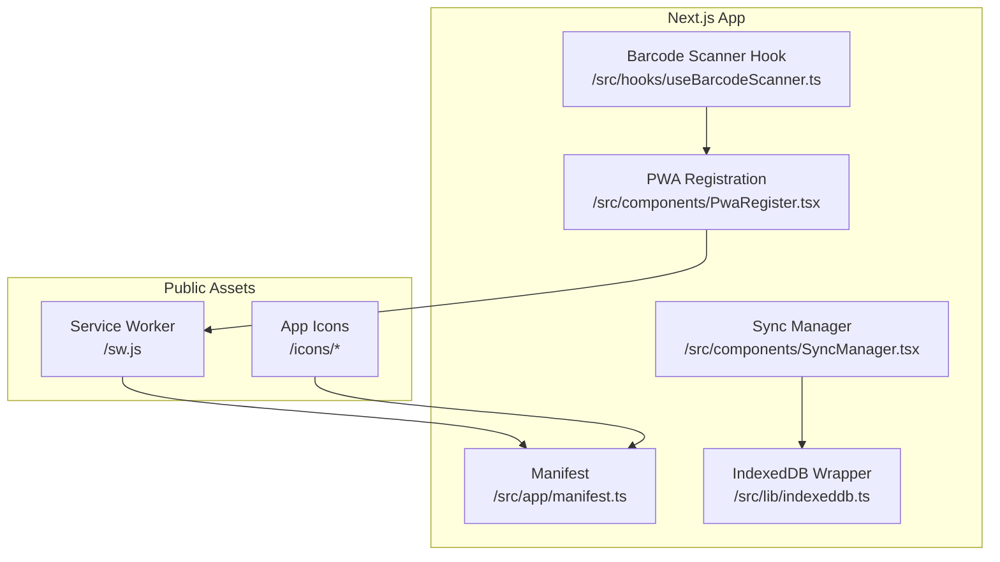
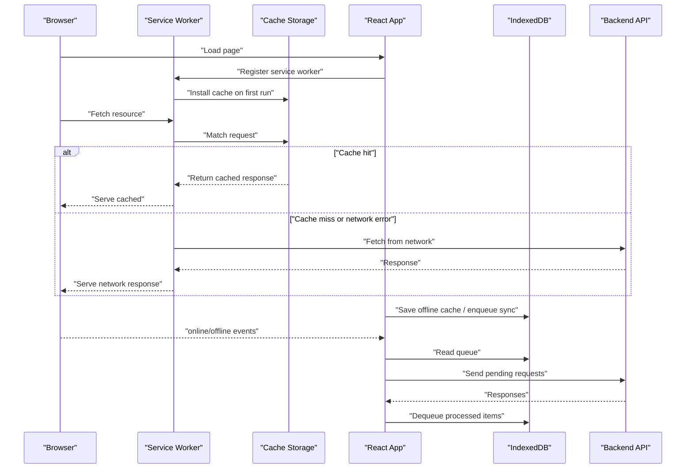
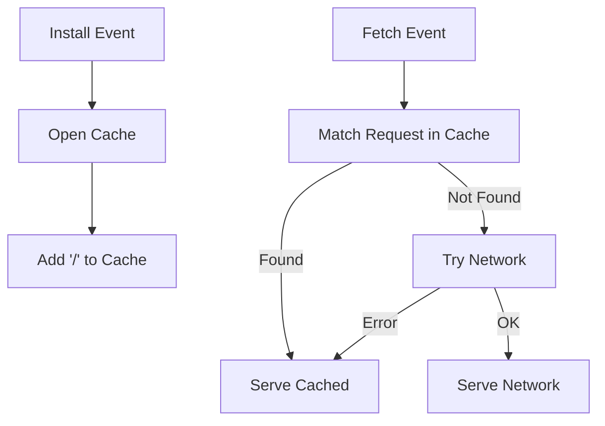
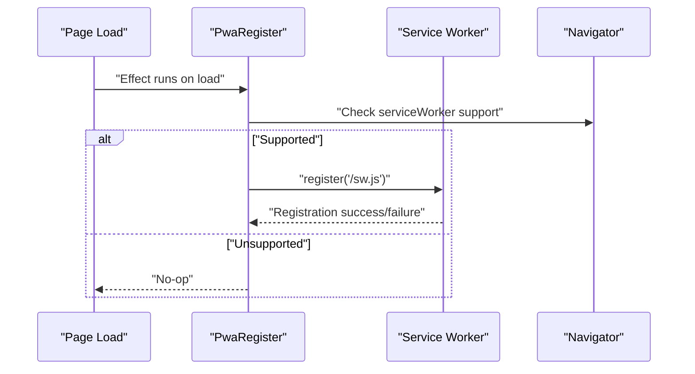
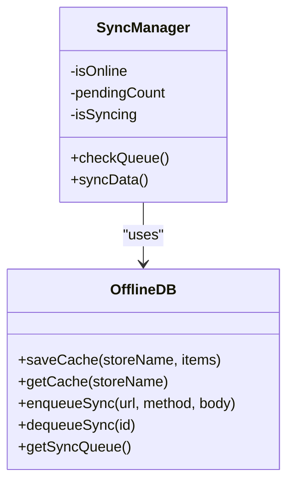
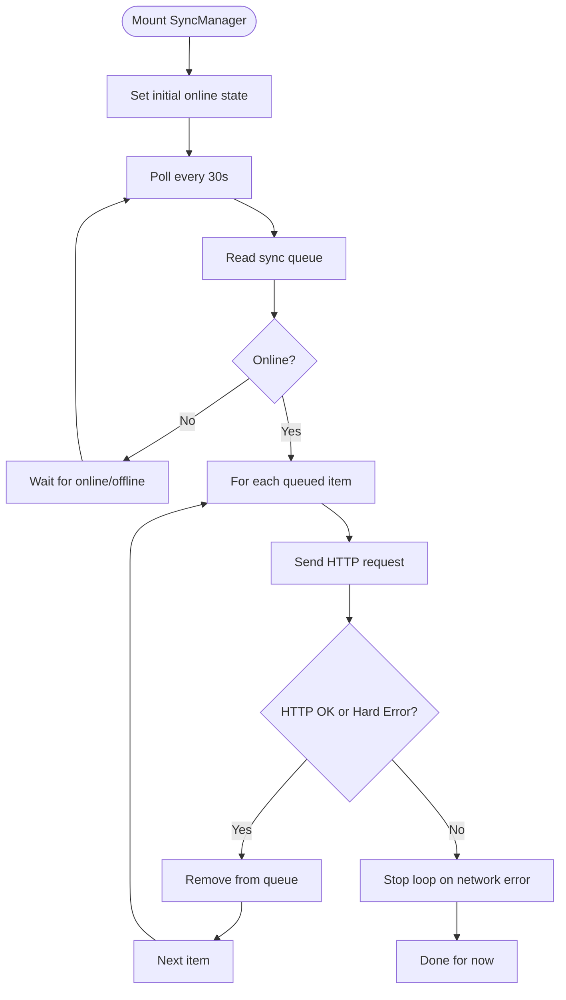
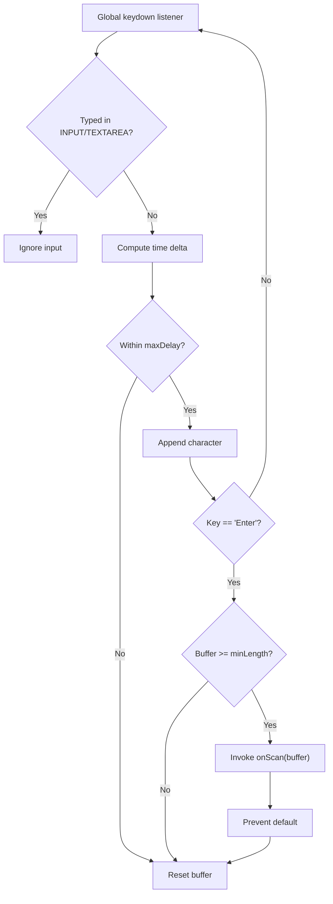
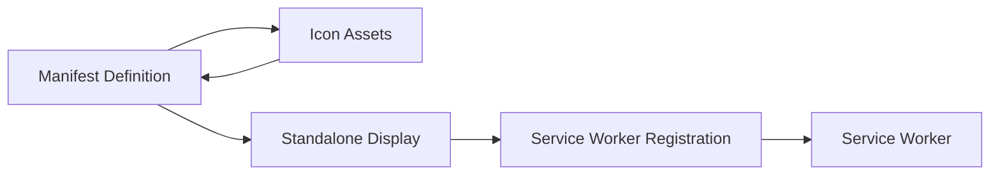
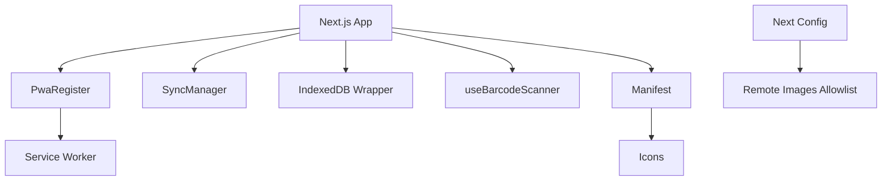

# PWA & Mobile Features

<cite>
**Referenced Files in This Document**
- [sw.js](file://apps/web/public/sw.js)
- [manifest.ts](file://apps/web/src/app/manifest.ts)
- [PwaRegister.tsx](file://apps/web/src/components/PwaRegister.tsx)
- [SyncManager.tsx](file://apps/web/src/components/SyncManager.tsx)
- [indexeddb.ts](file://apps/web/src/lib/indexeddb.ts)
- [useBarcodeScanner.ts](file://apps/web/src/hooks/useBarcodeScanner.ts)
- [next.config.ts](file://apps/web/next.config.ts)
- [package.json](file://apps/web/package.json)
</cite>

## Table of Contents
1. [Introduction](#introduction)
2. [Project Structure](#project-structure)
3. [Core Components](#core-components)
4. [Architecture Overview](#architecture-overview)
5. [Detailed Component Analysis](#detailed-component-analysis)
6. [Dependency Analysis](#dependency-analysis)
7. [Performance Considerations](#performance-considerations)
8. [Troubleshooting Guide](#troubleshooting-guide)
9. [Conclusion](#conclusion)

## Introduction
This document explains the Progressive Web App (PWA) and mobile features implemented in ARHAT POS. It covers the service worker lifecycle, offline-first caching strategy, IndexedDB-backed offline data persistence, synchronization manager, and mobile-specific enhancements such as barcode scanning integration. It also outlines the PWA manifest configuration, installation flows for iOS Safari and Android Chrome, and practical guidance for maintaining reliability and performance on mobile devices.

## Project Structure
The PWA-related assets and logic are primarily located under the Next.js web application:
- Service worker script and icons are served statically from the public directory.
- PWA metadata and runtime registration are implemented in the frontend application.
- Offline data persistence and synchronization logic are encapsulated in a dedicated library module.
- A UI component surfaces connectivity and sync status to users.

**Diagram sources**
- [sw.js:1-19](file://apps/web/public/sw.js#L1-L19)
- [manifest.ts:1-26](file://apps/web/src/app/manifest.ts#L1-L26)
- [PwaRegister.tsx:1-23](file://apps/web/src/components/PwaRegister.tsx#L1-L23)
- [SyncManager.tsx:1-123](file://apps/web/src/components/SyncManager.tsx#L1-L123)
- [indexeddb.ts:1-147](file://apps/web/src/lib/indexeddb.ts#L1-L147)
- [useBarcodeScanner.ts:1-53](file://apps/web/src/hooks/useBarcodeScanner.ts#L1-L53)

**Section sources**
- [sw.js:1-19](file://apps/web/public/sw.js#L1-L19)
- [manifest.ts:1-26](file://apps/web/src/app/manifest.ts#L1-L26)
- [PwaRegister.tsx:1-23](file://apps/web/src/components/PwaRegister.tsx#L1-L23)
- [SyncManager.tsx:1-123](file://apps/web/src/components/SyncManager.tsx#L1-L123)
- [indexeddb.ts:1-147](file://apps/web/src/lib/indexeddb.ts#L1-L147)
- [useBarcodeScanner.ts:1-53](file://apps/web/src/hooks/useBarcodeScanner.ts#L1-L53)
- [next.config.ts:1-17](file://apps/web/next.config.ts#L1-L17)
- [package.json:1-40](file://apps/web/package.json#L1-L40)

## Core Components
- Service Worker: Registers the worker, installs a basic cache, and serves cached content with a network-first strategy.
- PWA Registration: Registers the service worker after page load.
- Manifest: Defines app metadata, display mode, theme colors, and icon assets for installability.
- IndexedDB Wrapper: Provides offline storage for cached resources and a queue for pending sync operations.
- Sync Manager: Monitors connectivity, surfaces offline state, and attempts to flush queued requests when online.
- Barcode Scanner Hook: Detects barcode scanner input events and triggers callbacks for POS scanning workflows.

**Section sources**
- [sw.js:1-19](file://apps/web/public/sw.js#L1-L19)
- [PwaRegister.tsx:1-23](file://apps/web/src/components/PwaRegister.tsx#L1-L23)
- [manifest.ts:1-26](file://apps/web/src/app/manifest.ts#L1-L26)
- [indexeddb.ts:1-147](file://apps/web/src/lib/indexeddb.ts#L1-L147)
- [SyncManager.tsx:1-123](file://apps/web/src/components/SyncManager.tsx#L1-L123)
- [useBarcodeScanner.ts:1-53](file://apps/web/src/hooks/useBarcodeScanner.ts#L1-L53)

## Architecture Overview
The PWA stack integrates static asset caching, runtime registration, and offline-first data handling. The service worker intercepts network requests and falls back to cache when offline. The app persists POS data and pending transactions in IndexedDB and retries synchronization when connectivity is restored.

**Diagram sources**
- [sw.js:1-19](file://apps/web/public/sw.js#L1-L19)
- [PwaRegister.tsx:1-23](file://apps/web/src/components/PwaRegister.tsx#L1-L23)
- [SyncManager.tsx:1-123](file://apps/web/src/components/SyncManager.tsx#L1-L123)
- [indexeddb.ts:1-147](file://apps/web/src/lib/indexeddb.ts#L1-L147)

## Detailed Component Analysis

### Service Worker Lifecycle and Caching Strategy
- Installation: The service worker opens a named cache and pre-caches the root route.
- Fetch: On each request, the worker attempts to fetch from the network. On failure, it falls back to the cache.
- Network-first rationale: Ensures fresh content when online while preserving usability offline.

**Diagram sources**
- [sw.js:1-19](file://apps/web/public/sw.js#L1-L19)

**Section sources**
- [sw.js:1-19](file://apps/web/public/sw.js#L1-L19)

### PWA Registration and Manifest Configuration
- Registration: The app registers the service worker after the window loads, ensuring compatibility checks are performed.
- Manifest: Defines app identity, standalone display mode, theme and background colors, and icon assets for install prompts.

**Diagram sources**
- [PwaRegister.tsx:1-23](file://apps/web/src/components/PwaRegister.tsx#L1-L23)
- [sw.js:1-19](file://apps/web/public/sw.js#L1-L19)

**Section sources**
- [PwaRegister.tsx:1-23](file://apps/web/src/components/PwaRegister.tsx#L1-L23)
- [manifest.ts:1-26](file://apps/web/src/app/manifest.ts#L1-L26)

### Offline Data Persistence and Synchronization
- IndexedDB stores:
  - Products cache
  - Customers cache
  - Sync queue for pending transactions
- Operations:
  - Save cache: Clears and replaces entries for a given store.
  - Get cache: Retrieves all cached items.
  - Enqueue sync: Adds a transaction with URL, method, body, and timestamp.
  - Dequeue sync: Removes a successfully processed item.
  - Get sync queue: Lists pending items for retry.

**Diagram sources**
- [indexeddb.ts:1-147](file://apps/web/src/lib/indexeddb.ts#L1-L147)
- [SyncManager.tsx:1-123](file://apps/web/src/components/SyncManager.tsx#L1-L123)

**Section sources**
- [indexeddb.ts:1-147](file://apps/web/src/lib/indexeddb.ts#L1-L147)
- [SyncManager.tsx:1-123](file://apps/web/src/components/SyncManager.tsx#L1-L123)

### Connectivity Monitoring and Retry Logic
- The Sync Manager tracks online/offline state and periodically polls for pending items.
- When online, it iterates through the sync queue, sending requests with optional bearer token.
- Items are dequeued upon success or hard HTTP errors to prevent infinite retries.
- UI indicators reflect connectivity and pending counts, with manual sync trigger.

**Diagram sources**
- [SyncManager.tsx:1-123](file://apps/web/src/components/SyncManager.tsx#L1-L123)
- [indexeddb.ts:1-147](file://apps/web/src/lib/indexeddb.ts#L1-L147)

**Section sources**
- [SyncManager.tsx:1-123](file://apps/web/src/components/SyncManager.tsx#L1-L123)
- [indexeddb.ts:1-147](file://apps/web/src/lib/indexeddb.ts#L1-L147)

### Mobile Optimization and Touch UX
- Responsive design: Tailwind-based styling ensures adaptability across screen sizes.
- Touch-friendly controls: Buttons and panels sized for finger interaction.
- Device-specific input: Barcode scanner hook detects rapid keyboard-like input and triggers POS scanning workflows.

**Diagram sources**
- [useBarcodeScanner.ts:1-53](file://apps/web/src/hooks/useBarcodeScanner.ts#L1-L53)

**Section sources**
- [useBarcodeScanner.ts:1-53](file://apps/web/src/hooks/useBarcodeScanner.ts#L1-L53)
- [package.json:1-40](file://apps/web/package.json#L1-L40)

### PWA Installation and Manifest Details
- Manifest defines app name, short name, description, start URL, standalone display mode, theme/background colors, and icon assets.
- Icons are served from the public icons directory and referenced via the manifest.
- Registration occurs after page load, guarded by service worker support checks.

**Diagram sources**
- [manifest.ts:1-26](file://apps/web/src/app/manifest.ts#L1-L26)
- [PwaRegister.tsx:1-23](file://apps/web/src/components/PwaRegister.tsx#L1-L23)
- [sw.js:1-19](file://apps/web/public/sw.js#L1-L19)

**Section sources**
- [manifest.ts:1-26](file://apps/web/src/app/manifest.ts#L1-L26)
- [PwaRegister.tsx:1-23](file://apps/web/src/components/PwaRegister.tsx#L1-L23)

## Dependency Analysis
- Runtime dependencies include React, Next.js, Tailwind, and UI libraries that support responsive layouts and mobile-first design.
- Static assets (icons) are referenced by the manifest and served from the public directory.
- The service worker relies on browser APIs for caching and registration.

**Diagram sources**
- [package.json:1-40](file://apps/web/package.json#L1-L40)
- [PwaRegister.tsx:1-23](file://apps/web/src/components/PwaRegister.tsx#L1-L23)
- [SyncManager.tsx:1-123](file://apps/web/src/components/SyncManager.tsx#L1-L123)
- [indexeddb.ts:1-147](file://apps/web/src/lib/indexeddb.ts#L1-L147)
- [useBarcodeScanner.ts:1-53](file://apps/web/src/hooks/useBarcodeScanner.ts#L1-L53)
- [manifest.ts:1-26](file://apps/web/src/app/manifest.ts#L1-L26)
- [next.config.ts:1-17](file://apps/web/next.config.ts#L1-L17)

**Section sources**
- [package.json:1-40](file://apps/web/package.json#L1-L40)
- [next.config.ts:1-17](file://apps/web/next.config.ts#L1-L17)

## Performance Considerations
- Prefer network-first caching to minimize stale content while enabling offline resilience.
- Batch and debounce user actions (e.g., scanning) to reduce redundant operations.
- Limit IndexedDB writes to essential datasets and use targeted stores to improve lookup performance.
- Use polling intervals judiciously; adjust the 30-second cadence based on usage patterns and battery life.
- Optimize image loading and lazy-load non-critical assets to reduce bandwidth consumption on mobile networks.

## Troubleshooting Guide
- Service Worker not registering:
  - Verify the registration effect runs after load and that the browser supports service workers.
  - Confirm the service worker file path matches the registration URL.
- Offline caching not working:
  - Ensure the install event completes and the cache contains the intended URLs.
  - Check that fetch interception logic returns cached content on network failure.
- Sync queue not flushing:
  - Confirm connectivity events are received and the queue is polled regularly.
  - Validate that successful or hard HTTP errors remove items from the queue.
- Barcode scanner not detected:
  - Ensure the hook is attached globally and not suppressed inside input fields.
  - Adjust timing thresholds to accommodate different scanner speeds.

**Section sources**
- [PwaRegister.tsx:1-23](file://apps/web/src/components/PwaRegister.tsx#L1-L23)
- [sw.js:1-19](file://apps/web/public/sw.js#L1-L19)
- [SyncManager.tsx:1-123](file://apps/web/src/components/SyncManager.tsx#L1-L123)
- [indexeddb.ts:1-147](file://apps/web/src/lib/indexeddb.ts#L1-L147)
- [useBarcodeScanner.ts:1-53](file://apps/web/src/hooks/useBarcodeScanner.ts#L1-L53)

## Conclusion
ARHAT POS implements a pragmatic PWA with a minimal service worker, a robust offline-first IndexedDB layer, and a user-visible synchronization manager. Together with a concise manifest and a global barcode scanner hook, these features deliver reliable operation in constrained network environments and enhance the mobile POS experience. Future enhancements could include background sync, push notifications, and more granular cache strategies tailored to POS data lifecycles.