# Inventory Control System

<cite>
**Referenced Files in This Document**
- [PRD.md](file://PRD/PRD.md)
- [index.ts](file://apps/api/src/models/index.ts)
- [inventory.service.ts](file://apps/api/src/services/inventory.service.ts)
- [inventory.service.js](file://apps/api/src/services/inventory.service.js)
- [transaction.service.js](file://apps/api/src/services/transaction.service.js)
- [analytics.service.ts](file://apps/api/src/services/analytics.service.ts)
- [analytics.service.js](file://apps/api/src/services/analytics.service.js)
- [inventory.routes.ts](file://apps/api/src/routes/inventory.routes.ts)
- [inventory.routes.js](file://apps/api/src/routes/inventory.routes.js)
- [page.tsx](file://apps/web/src/app/inventory/page.tsx)
- [page.tsx](file://apps/web/src/app/(admin)/inventory/raw-materials/page.tsx)
- [0000_snapshot.json](file://apps/api/migrations/meta/0000_snapshot.json)
- [0001_snapshot.json](file://apps/api/migrations/meta/0001_snapshot.json)
- [0002_snapshot.json](file://apps/api/migrations/meta/0002_snapshot.json)
- [0003_snapshot.json](file://apps/api/migrations/meta/0003_snapshot.json)
</cite>

## Table of Contents
1. [Introduction](#introduction)
2. [Project Structure](#project-structure)
3. [Core Components](#core-components)
4. [Architecture Overview](#architecture-overview)
5. [Detailed Component Analysis](#detailed-component-analysis)
6. [Dependency Analysis](#dependency-analysis)
7. [Performance Considerations](#performance-considerations)
8. [Troubleshooting Guide](#troubleshooting-guide)
9. [Conclusion](#conclusion)
10. [Appendices](#appendices)

## Introduction
This document describes the Inventory Control System implemented in the ARHAT POS codebase. It covers stock tracking mechanisms (stock in, stock out, stock adjustments, and inter-location transfers), inventory valuation and COGS tracking, low stock alerts and reorder management, physical inventory counting (stock opname), batch and expiry tracking, inventory movement auditing, and reporting capabilities. Practical workflows and examples are included to guide implementation and troubleshooting.

## Project Structure
The inventory system spans backend services and frontend UI:
- Backend API (TypeScript/JavaScript): routes, services, models, and migrations define inventory operations, stock movements, and analytics.
- Frontend (Next.js): inventory dashboard and raw materials pages present low stock alerts, opname sessions, and adjustment lists.

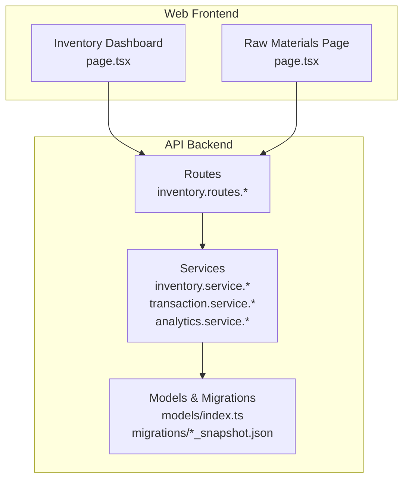

**Diagram sources**
- [page.tsx](file://apps/web/src/app/inventory/page.tsx)
- [page.tsx](file://apps/web/src/app/(admin)/inventory/raw-materials/page.tsx)
- [inventory.routes.ts](file://apps/api/src/routes/inventory.routes.ts)
- [inventory.routes.js](file://apps/api/src/routes/inventory.routes.js)
- [inventory.service.ts](file://apps/api/src/services/inventory.service.ts)
- [inventory.service.js](file://apps/api/src/services/inventory.service.js)
- [transaction.service.js](file://apps/api/src/services/transaction.service.js)
- [analytics.service.ts](file://apps/api/src/services/analytics.service.ts)
- [index.ts](file://apps/api/src/models/index.ts)
- [0000_snapshot.json](file://apps/api/migrations/meta/0000_snapshot.json)

**Section sources**
- [page.tsx](file://apps/web/src/app/inventory/page.tsx)
- [page.tsx](file://apps/web/src/app/(admin)/inventory/raw-materials/page.tsx)
- [inventory.routes.ts](file://apps/api/src/routes/inventory.routes.ts)
- [inventory.routes.js](file://apps/api/src/routes/inventory.routes.js)
- [inventory.service.ts](file://apps/api/src/services/inventory.service.ts)
- [inventory.service.js](file://apps/api/src/services/inventory.service.js)
- [transaction.service.js](file://apps/api/src/services/transaction.service.js)
- [analytics.service.ts](file://apps/api/src/services/analytics.service.ts)
- [index.ts](file://apps/api/src/models/index.ts)
- [0000_snapshot.json](file://apps/api/migrations/meta/0000_snapshot.json)

## Core Components
- Stock Movements: central log of all inventory changes with movement types (in, out, adjustment, transfer_in, transfer_out), quantities, references, reasons, and timestamps.
- Stock Adjustments: formal process to correct discrepancies with approvals and audit trails.
- Stock Transfers: inter-outlet movement with creation, validation, and receiving steps.
- Analytics and COGS: revenue and cost of goods sold aggregation from transaction items.
- Low Stock Alerts: dashboard notifications and configurable minimum thresholds.
- Physical Inventory (Opname): scheduled counting sessions with variance calculation and automatic adjustments.

**Section sources**
- [index.ts](file://apps/api/src/models/index.ts)
- [inventory.service.ts](file://apps/api/src/services/inventory.service.ts)
- [inventory.service.js](file://apps/api/src/services/inventory.service.js)
- [analytics.service.ts](file://apps/api/src/services/analytics.service.ts)
- [analytics.service.js](file://apps/api/src/services/analytics.service.js)
- [page.tsx](file://apps/web/src/app/inventory/page.tsx)

## Architecture Overview
The system follows a layered architecture:
- UI layer (Next.js) renders inventory dashboards and raw materials views.
- API routes accept requests and delegate to services.
- Services encapsulate business logic for stock operations, approvals, and analytics.
- Models and migrations define the persistent schema for inventory entities.

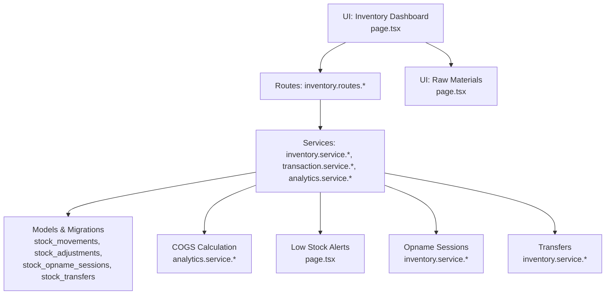

**Diagram sources**
- [page.tsx](file://apps/web/src/app/inventory/page.tsx)
- [page.tsx](file://apps/web/src/app/(admin)/inventory/raw-materials/page.tsx)
- [inventory.routes.ts](file://apps/api/src/routes/inventory.routes.ts)
- [inventory.routes.js](file://apps/api/src/routes/inventory.routes.js)
- [inventory.service.ts](file://apps/api/src/services/inventory.service.ts)
- [inventory.service.js](file://apps/api/src/services/inventory.service.js)
- [transaction.service.js](file://apps/api/src/services/transaction.service.js)
- [analytics.service.ts](file://apps/api/src/services/analytics.service.ts)
- [index.ts](file://apps/api/src/models/index.ts)

## Detailed Component Analysis

### Stock Movements and Audit Trail
Stock movements capture every change with:
- movementType: in, out, adjustment, transfer_in, transfer_out
- referenceType/referenceId: links to transactions, transfers, or manual entries
- reason: textual justification
- recordedBy: who performed the action
- createdAt: timestamp

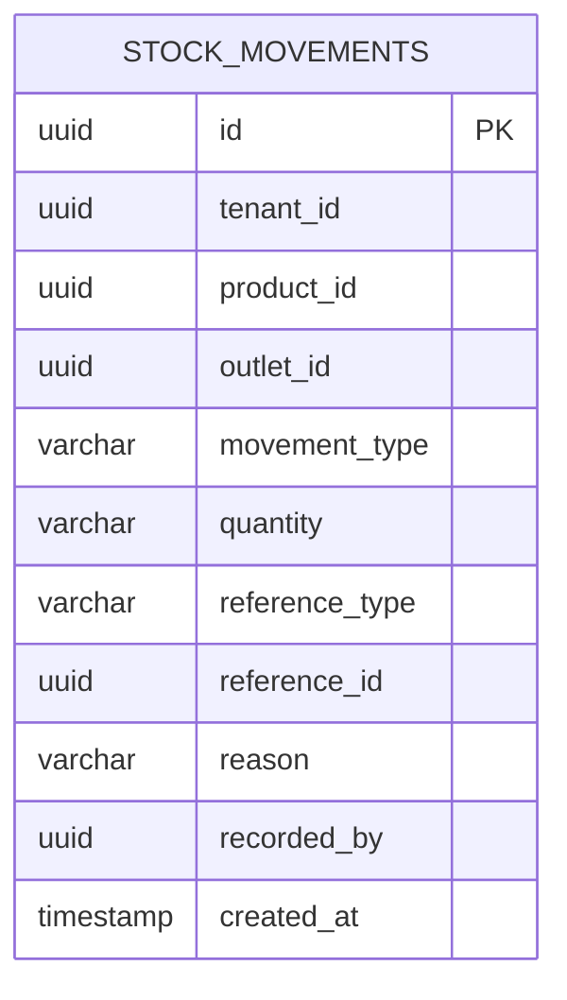

**Diagram sources**
- [index.ts](file://apps/api/src/models/index.ts)
- [0000_snapshot.json](file://apps/api/migrations/meta/0000_snapshot.json)
- [0001_snapshot.json](file://apps/api/migrations/meta/0001_snapshot.json)
- [0002_snapshot.json](file://apps/api/migrations/meta/0002_snapshot.json)
- [0003_snapshot.json](file://apps/api/migrations/meta/0003_snapshot.json)

**Section sources**
- [index.ts](file://apps/api/src/models/index.ts)
- [0000_snapshot.json](file://apps/api/migrations/meta/0000_snapshot.json)
- [0001_snapshot.json](file://apps/api/migrations/meta/0001_snapshot.json)
- [0002_snapshot.json](file://apps/api/migrations/meta/0002_snapshot.json)
- [0003_snapshot.json](file://apps/api/migrations/meta/0003_snapshot.json)

### Stock In (Receiving Goods)
- Create stock-in records linked to purchase orders or supplier references.
- Update product stock quantities per outlet.
- Generate movement logs with movementType=in and reference metadata.

Implementation highlights:
- Stock-in creates movement records and updates productStocks for the outlet.
- Batch and expiry fields are supported in the schema for future use.

**Section sources**
- [PRD.md](file://PRD/PRD.md)
- [index.ts](file://apps/api/src/models/index.ts)

### Stock Out (Sales/Usage)
- Automatic reduction during transaction completion.
- Raw material consumption via Bill of Materials (BOM) for finished products.
- Movement logs with movementType=out.

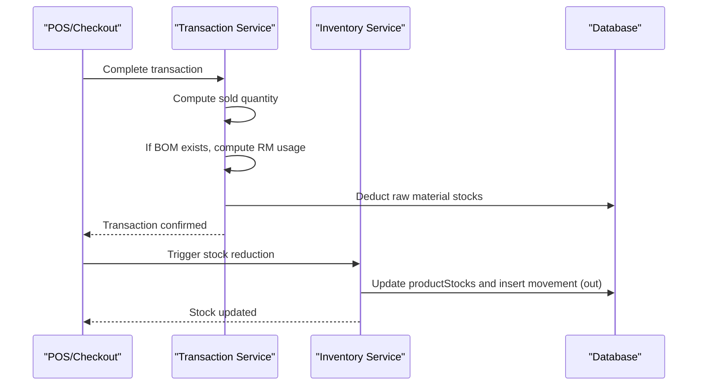

**Diagram sources**
- [transaction.service.js](file://apps/api/src/services/transaction.service.js)
- [inventory.service.js](file://apps/api/src/services/inventory.service.js)
- [index.ts](file://apps/api/src/models/index.ts)

**Section sources**
- [transaction.service.js](file://apps/api/src/services/transaction.service.js)
- [PRD.md](file://PRD/PRD.md)
- [index.ts](file://apps/api/src/models/index.ts)

### Stock Adjustments (Corrections)
- Create adjustment requests with items, current/adjusted stock, variance, and reason.
- Approve adjustments to apply variances to productStocks and record movementType=adjustment.
- Legacy total stock updates are also applied for backward compatibility.

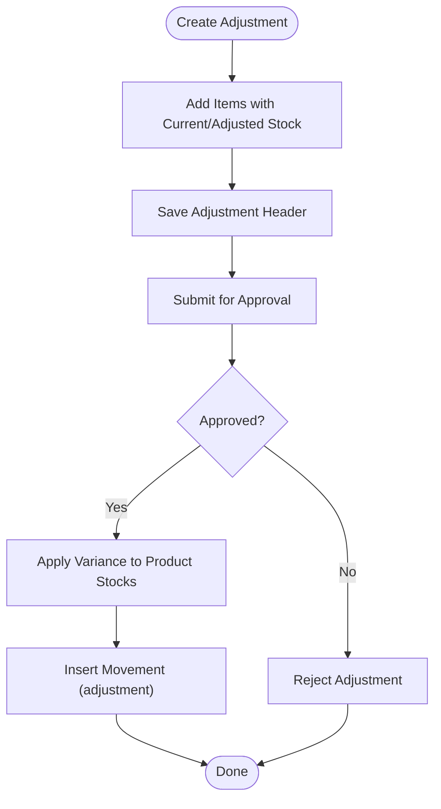

**Diagram sources**
- [inventory.service.js](file://apps/api/src/services/inventory.service.js)
- [index.ts](file://apps/api/src/models/index.ts)

**Section sources**
- [inventory.service.js](file://apps/api/src/services/inventory.service.js)
- [inventory.service.ts](file://apps/api/src/services/inventory.service.ts)
- [PRD.md](file://PRD/PRD.md)
- [index.ts](file://apps/api/src/models/index.ts)

### Inter-Location Transfers
- Create transfer with source/destination outlets and items.
- Validate sufficient stock in source outlet.
- On receive, add quantities to destination outlet and log movementType=transfer_in.

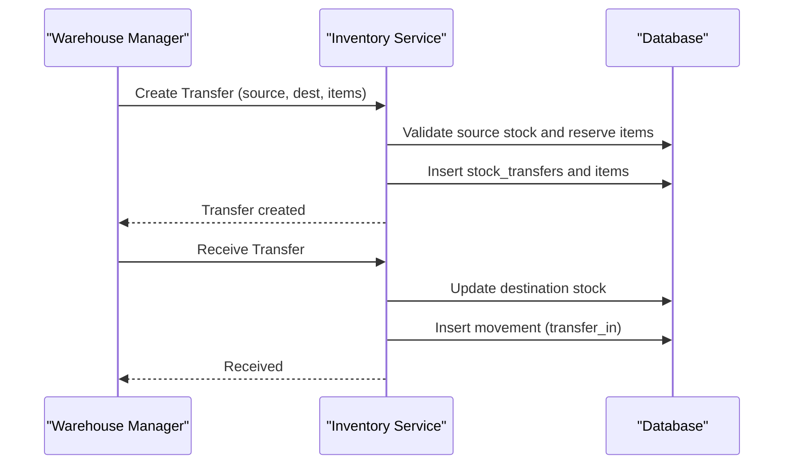

**Diagram sources**
- [inventory.service.js](file://apps/api/src/services/inventory.service.js)
- [inventory.service.ts](file://apps/api/src/services/inventory.service.ts)
- [index.ts](file://apps/api/src/models/index.ts)

**Section sources**
- [inventory.service.js](file://apps/api/src/services/inventory.service.js)
- [inventory.service.ts](file://apps/api/src/services/inventory.service.ts)
- [index.ts](file://apps/api/src/models/index.ts)

### Low Stock Alerts and Reorder Management
- Minimum stock levels per product trigger alerts when current stock falls at or below the threshold.
- Dashboard displays low stock badges and counts.
- Reorder suggestions can be derived from historical sales and lead times (conceptual extension).

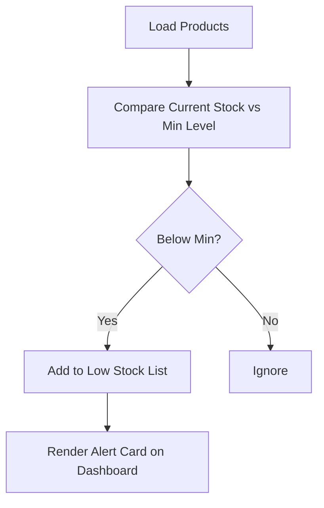

**Diagram sources**
- [page.tsx](file://apps/web/src/app/inventory/page.tsx)

**Section sources**
- [page.tsx](file://apps/web/src/app/inventory/page.tsx)
- [PRD.md](file://PRD/PRD.md)

### Physical Inventory Counting (Opname) and Reconciliation
- Start a stock opname session per outlet.
- Capture actual counts per product; system computes variance.
- Automatically apply adjustments to align system stock with physical counts.
- Generate variance reports and lock the session upon completion.

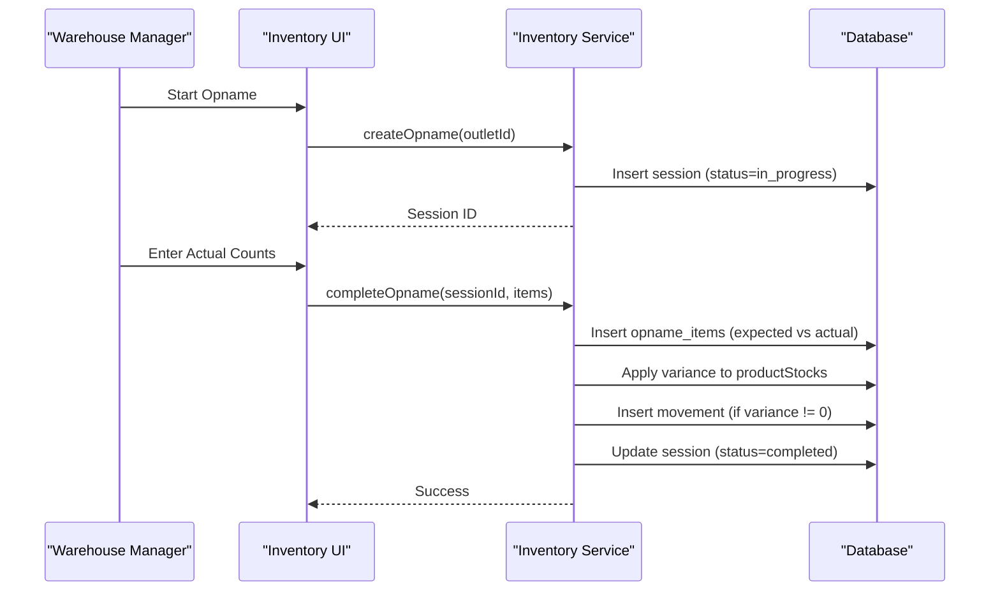

**Diagram sources**
- [inventory.service.js](file://apps/api/src/services/inventory.service.js)
- [page.tsx](file://apps/web/src/app/inventory/page.tsx)
- [index.ts](file://apps/api/src/models/index.ts)

**Section sources**
- [inventory.service.js](file://apps/api/src/services/inventory.service.js)
- [page.tsx](file://apps/web/src/app/inventory/page.tsx)
- [PRD.md](file://PRD/PRD.md)
- [index.ts](file://apps/api/src/models/index.ts)

### Batch Tracking, Expiry Dates, and Costing Methods
- Schema supports batch_number and expiry_date fields on stock movements for traceability.
- FIFO/LIFO costing are not explicitly implemented in the current codebase; FIFO is commonly used for perishables and expiry tracking.

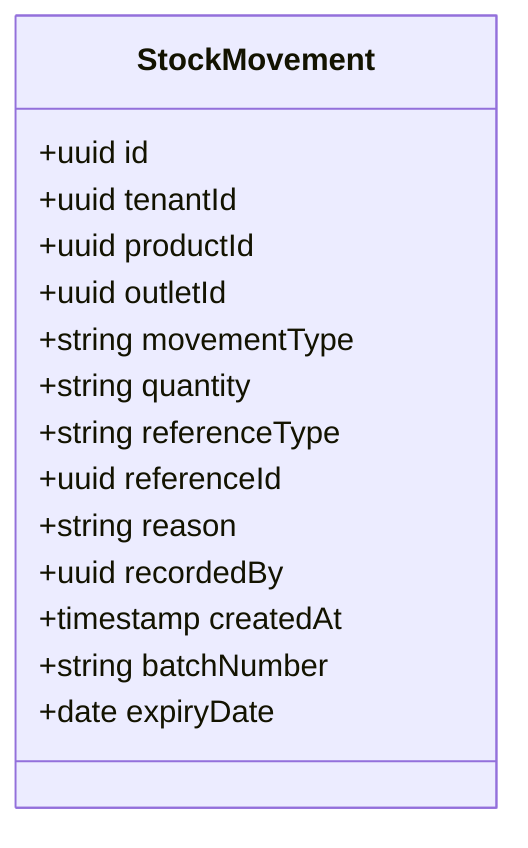

**Diagram sources**
- [index.ts](file://apps/api/src/models/index.ts)
- [PRD.md](file://PRD/PRD.md)

**Section sources**
- [index.ts](file://apps/api/src/models/index.ts)
- [PRD.md](file://PRD/PRD.md)

### Inventory Valuation and COGS Tracking
- COGS is computed by aggregating transaction items and multiplying quantity by purchase price.
- Profit and loss analytics group revenue and COGS by date windows.

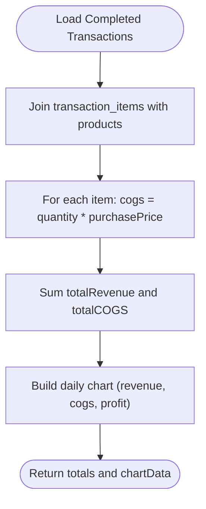

**Diagram sources**
- [analytics.service.ts](file://apps/api/src/services/analytics.service.ts)
- [analytics.service.js](file://apps/api/src/services/analytics.service.js)

**Section sources**
- [analytics.service.ts](file://apps/api/src/services/analytics.service.ts)
- [analytics.service.js](file://apps/api/src/services/analytics.service.js)

### Reporting Capabilities
- Top-performing products by quantity and revenue.
- Slow-moving product identification.
- Profit and loss over time with revenue, COGS, and margin.

**Section sources**
- [analytics.service.ts](file://apps/api/src/services/analytics.service.ts)
- [analytics.service.js](file://apps/api/src/services/analytics.service.js)

## Dependency Analysis
- Routes depend on services for inventory operations.
- Services depend on models and migrations for persistence.
- UI depends on routes for inventory actions and data.

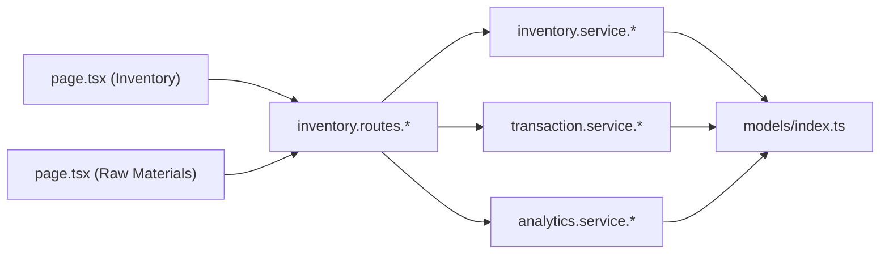

**Diagram sources**
- [inventory.routes.ts](file://apps/api/src/routes/inventory.routes.ts)
- [inventory.routes.js](file://apps/api/src/routes/inventory.routes.js)
- [inventory.service.ts](file://apps/api/src/services/inventory.service.ts)
- [inventory.service.js](file://apps/api/src/services/inventory.service.js)
- [transaction.service.js](file://apps/api/src/services/transaction.service.js)
- [analytics.service.ts](file://apps/api/src/services/analytics.service.ts)
- [index.ts](file://apps/api/src/models/index.ts)
- [page.tsx](file://apps/web/src/app/inventory/page.tsx)
- [page.tsx](file://apps/web/src/app/(admin)/inventory/raw-materials/page.tsx)

**Section sources**
- [inventory.routes.ts](file://apps/api/src/routes/inventory.routes.ts)
- [inventory.routes.js](file://apps/api/src/routes/inventory.routes.js)
- [inventory.service.ts](file://apps/api/src/services/inventory.service.ts)
- [inventory.service.js](file://apps/api/src/services/inventory.service.js)
- [transaction.service.js](file://apps/api/src/services/transaction.service.js)
- [analytics.service.ts](file://apps/api/src/services/analytics.service.ts)
- [index.ts](file://apps/api/src/models/index.ts)
- [page.tsx](file://apps/web/src/app/inventory/page.tsx)
- [page.tsx](file://apps/web/src/app/(admin)/inventory/raw-materials/page.tsx)

## Performance Considerations
- Use batch operations for bulk stock adjustments and opname sessions to minimize round trips.
- Index movementType, referenceType/referenceId, and outletId for efficient queries.
- Limit analytics windows (e.g., last 30 days) to reduce computation overhead.
- Cache frequently accessed product and outlet stock summaries.

## Troubleshooting Guide
- Insufficient stock during transfer: ensure source outlet has adequate stock before initiating transfer.
- Adjustment not applying: verify adjustment status is approved and variance is calculated correctly.
- Opname variance not reflected: confirm opname session is completed and items recorded.
- COGS mismatch: validate purchase prices and transaction item quantities; ensure only completed transactions are considered.

**Section sources**
- [inventory.service.js](file://apps/api/src/services/inventory.service.js)
- [inventory.service.ts](file://apps/api/src/services/inventory.service.ts)
- [transaction.service.js](file://apps/api/src/services/transaction.service.js)
- [analytics.service.ts](file://apps/api/src/services/analytics.service.ts)

## Conclusion
The Inventory Control System provides robust mechanisms for tracking stock in, out, adjustments, and inter-location transfers, with integrated audit trails and analytics. Low stock alerts and opname workflows support accuracy and compliance. While batch and expiry fields are schema-enabled, FIFO/LIFO costing is not yet implemented. Extending the system to include automated reorder triggers and explicit FIFO/LIFO costing would further strengthen inventory management capabilities.

## Appendices

### Practical Examples

- Stock Adjustment Procedure
  - Create adjustment with items and reasons.
  - Submit for approval; on approval, variances are applied and movements logged.

- Inventory Transfer Workflow
  - Create transfer from source outlet to destination outlet.
  - Receive transfer at destination; verify stock increases and movement records.

- Automated Reorder Triggers
  - Configure minimum stock levels per product.
  - Use analytics to identify slow-moving items and forecast demand for reorder suggestions.

- Inventory Accuracy Measures and Variance Analysis
  - Conduct regular opname sessions and reconcile variances.
  - Investigate shrinkage by reviewing movement logs and identifying discrepancies.

**Section sources**
- [PRD.md](file://PRD/PRD.md)
- [page.tsx](file://apps/web/src/app/inventory/page.tsx)
- [inventory.service.js](file://apps/api/src/services/inventory.service.js)
- [analytics.service.ts](file://apps/api/src/services/analytics.service.ts)