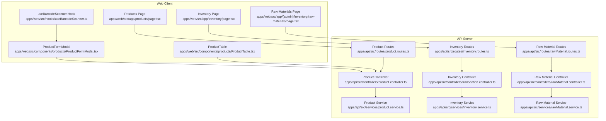
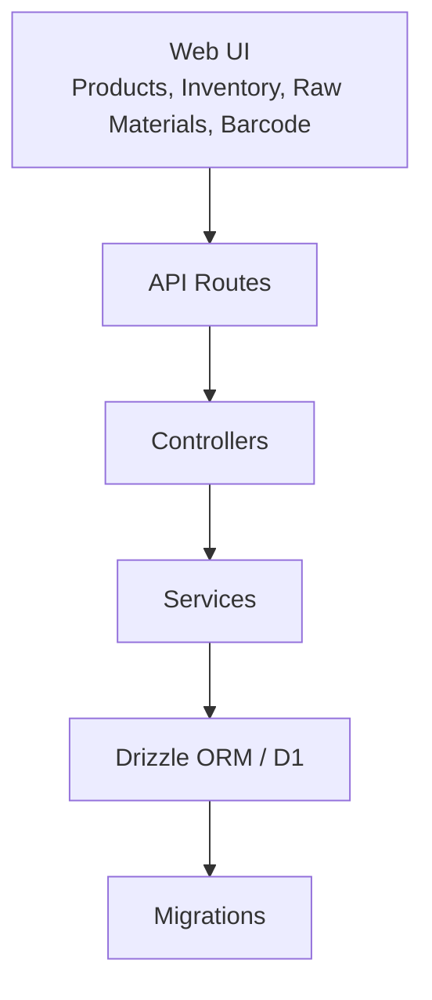
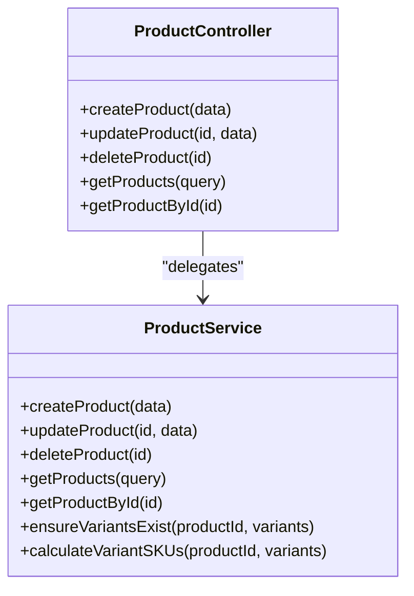
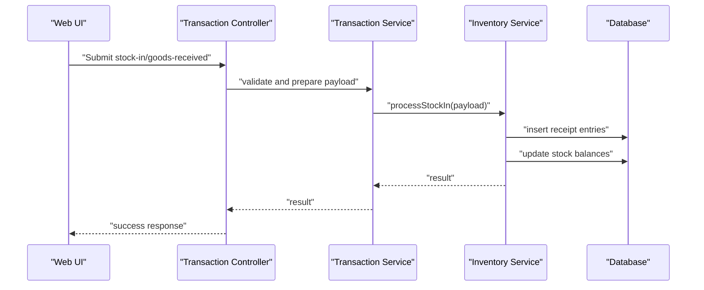
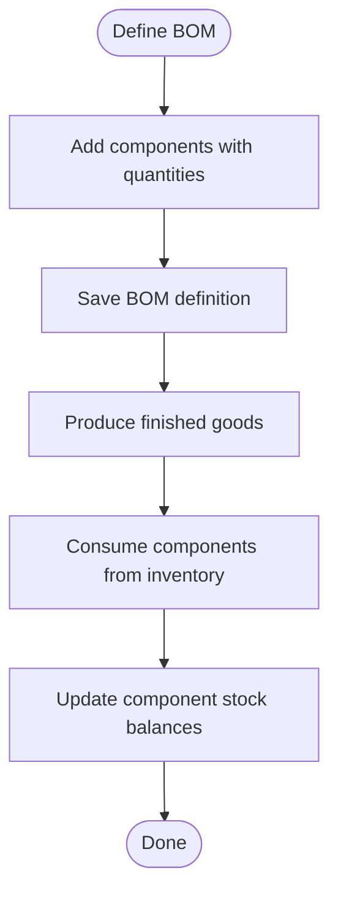
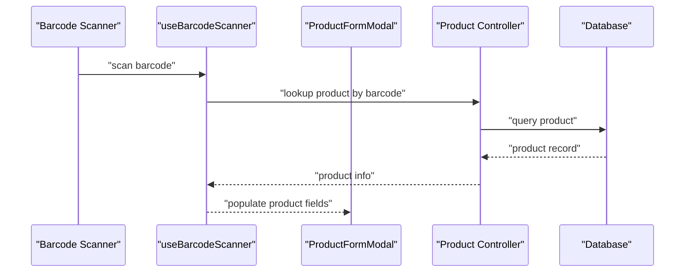
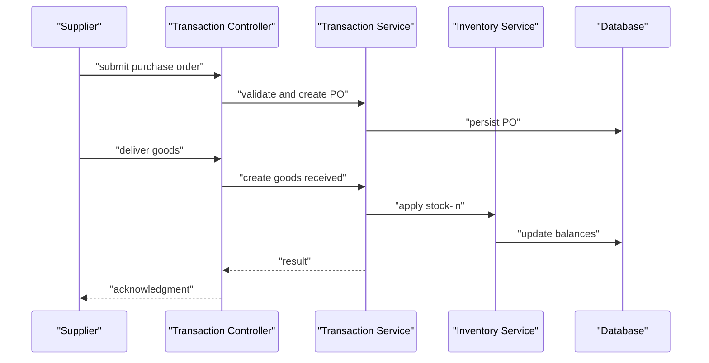
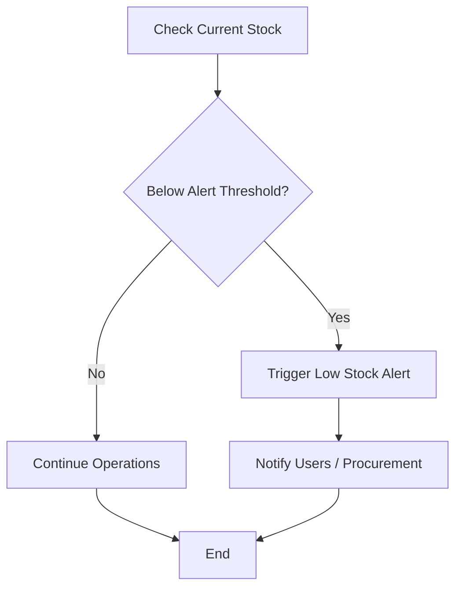
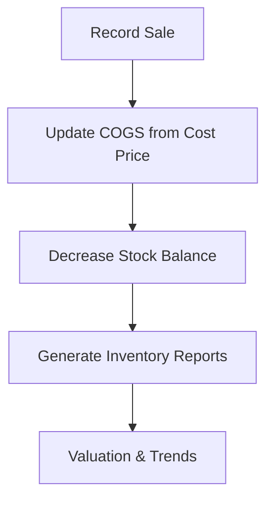
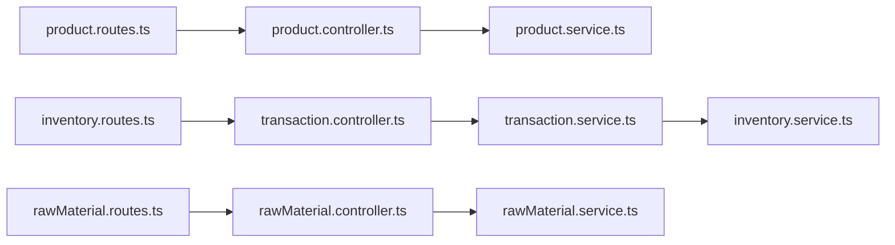

# Product & Inventory Management

<cite>
**Referenced Files in This Document**
- [product.controller.ts](file://apps/api/src/controllers/product.controller.ts)
- [product.service.ts](file://apps/api/src/services/product.service.ts)
- [rawMaterial.controller.ts](file://apps/api/src/controllers/rawMaterial.controller.ts)
- [rawMaterial.controller.js](file://apps/api/src/controllers/rawMaterial.controller.js)
- [rawMaterial.service.ts](file://apps/api/src/services/rawMaterial.service.ts)
- [inventory.service.ts](file://apps/api/src/services/inventory.service.ts)
- [inventory.routes.ts](file://apps/api/src/routes/inventory.routes.ts)
- [product.routes.ts](file://apps/api/src/routes/product.routes.ts)
- [rawMaterial.routes.ts](file://apps/api/src/routes/rawMaterial.routes.ts)
- [transaction.controller.ts](file://apps/api/src/controllers/transaction.controller.ts)
- [transaction.service.ts](file://apps/api/src/services/transaction.service.ts)
- [transaction.routes.ts](file://apps/api/src/routes/transaction.routes.ts)
- [useBarcodeScanner.ts](file://apps/web/src/hooks/useBarcodeScanner.ts)
- [ProductFormModal.tsx](file://apps/web/src/components/products/ProductFormModal.tsx)
- [ProductTable.tsx](file://apps/web/src/components/products/ProductTable.tsx)
- [page.tsx](file://apps/web/src/app/(admin)/inventory/raw-materials/page.tsx)
- [page.tsx](file://apps/web/src/app/inventory/page.tsx)
- [page.tsx](file://apps/web/src/app/products/page.tsx)
- [migrate_variants.ts](file://apps/api/migrate_variants.ts)
- [0003_tearful_supernaut.sql](file://apps/api/migrations/0003_tearful_supernaut.sql)
- [0002_light_katie_power.sql](file://apps/api/migrations/0002_light_katie_power.sql)
- [0001_damp_sunfire.sql](file://apps/api/migrations/0001_damp_sunfire.sql)
- [0000_wide_runaways.sql](file://apps/api/migrations/0000_wide_runaways.sql)
- [001_initial_setup.sql](file://apps/api/migrations/001_initial_setup.sql)
- [PRD.md](file://PRD/PRD.md)
- [IMPLEMENTATION_CHECKLIST.md](file://PRD/IMPLEMENTATION_CHECKLIST.md)
</cite>

## Table of Contents
1. [Introduction](#introduction)
2. [Project Structure](#project-structure)
3. [Core Components](#core-components)
4. [Architecture Overview](#architecture-overview)
5. [Detailed Component Analysis](#detailed-component-analysis)
6. [Dependency Analysis](#dependency-analysis)
7. [Performance Considerations](#performance-considerations)
8. [Troubleshooting Guide](#troubleshooting-guide)
9. [Conclusion](#conclusion)
10. [Appendices](#appendices)

## Introduction
This document describes the Product & Inventory Management system implemented in the ARHAT POS codebase. It covers product catalog management (creation, updates, deletion, categorization), product variants, pricing strategies, and barcode integration. It also documents the inventory control system (stock in, stock out, adjustments, transfers, physical counts), raw materials management for products with multiple components, stock monitoring and alerts, supplier/purchase order integration, and goods receiving processes. Finally, it explains inventory valuation, cost of goods sold calculations, and inventory reporting.

## Project Structure
The system is split into two primary applications:
- API server (TypeScript): Controllers, Services, Routes, Migrations, and database schema definitions.
- Web client (Next.js): UI components for product management, inventory operations, raw materials, and barcode scanning integration.

Key areas:
- Product management: controllers, services, and routes under apps/api/src/controllers, apps/api/src/services, apps/api/src/routes.
- Inventory management: services and routes under apps/api/src/services and apps/api/src/routes.
- Raw materials: controllers, services, and routes under apps/api/src/controllers, apps/api/src/services, apps/api/src/routes.
- Web UI: pages and components under apps/web/src/app and apps/web/src/components.

**Diagram sources**
- [product.routes.ts](file://apps/api/src/routes/product.routes.ts)
- [inventory.routes.ts](file://apps/api/src/routes/inventory.routes.ts)
- [rawMaterial.routes.ts](file://apps/api/src/routes/rawMaterial.routes.ts)
- [product.controller.ts](file://apps/api/src/controllers/product.controller.ts)
- [transaction.controller.ts](file://apps/api/src/controllers/transaction.controller.ts)
- [rawMaterial.controller.ts](file://apps/api/src/controllers/rawMaterial.controller.ts)
- [product.service.ts](file://apps/api/src/services/product.service.ts)
- [inventory.service.ts](file://apps/api/src/services/inventory.service.ts)
- [rawMaterial.service.ts](file://apps/api/src/services/rawMaterial.service.ts)
- [useBarcodeScanner.ts](file://apps/web/src/hooks/useBarcodeScanner.ts)
- [ProductFormModal.tsx](file://apps/web/src/components/products/ProductFormModal.tsx)
- [ProductTable.tsx](file://apps/web/src/components/products/ProductTable.tsx)
- [page.tsx](file://apps/web/src/app/products/page.tsx)
- [page.tsx](file://apps/web/src/app/inventory/page.tsx)
- [page.tsx](file://apps/web/src/app/(admin)/inventory/raw-materials/page.tsx)

**Section sources**
- [product.routes.ts](file://apps/api/src/routes/product.routes.ts)
- [inventory.routes.ts](file://apps/api/src/routes/inventory.routes.ts)
- [rawMaterial.routes.ts](file://apps/api/src/routes/rawMaterial.routes.ts)
- [product.controller.ts](file://apps/api/src/controllers/product.controller.ts)
- [transaction.controller.ts](file://apps/api/src/controllers/transaction.controller.ts)
- [rawMaterial.controller.ts](file://apps/api/src/controllers/rawMaterial.controller.ts)
- [product.service.ts](file://apps/api/src/services/product.service.ts)
- [inventory.service.ts](file://apps/api/src/services/inventory.service.ts)
- [rawMaterial.service.ts](file://apps/api/src/services/rawMaterial.service.ts)
- [useBarcodeScanner.ts](file://apps/web/src/hooks/useBarcodeScanner.ts)
- [ProductFormModal.tsx](file://apps/web/src/components/products/ProductFormModal.tsx)
- [ProductTable.tsx](file://apps/web/src/components/products/ProductTable.tsx)
- [page.tsx](file://apps/web/src/app/products/page.tsx)
- [page.tsx](file://apps/web/src/app/inventory/page.tsx)
- [page.tsx](file://apps/web/src/app/(admin)/inventory/raw-materials/page.tsx)

## Core Components
- Product Catalog Management: CRUD operations, categorization, pricing, and variant support.
- Inventory Control: Stock movements (in/out), adjustments, transfers, physical counts, and tracking.
- Raw Materials Management: Bill of Materials (BOM) for products composed of multiple components.
- Barcode Integration: Scanner hook and UI integration for product lookup and transactions.
- Supplier/Purchase Orders: Purchase order and goods receiving workflows.
- Reporting: Analytics and reporting endpoints for inventory insights.

**Section sources**
- [product.controller.ts](file://apps/api/src/controllers/product.controller.ts)
- [product.service.ts](file://apps/api/src/services/product.service.ts)
- [inventory.service.ts](file://apps/api/src/services/inventory.service.ts)
- [rawMaterial.controller.ts](file://apps/api/src/controllers/rawMaterial.controller.ts)
- [rawMaterial.service.ts](file://apps/api/src/services/rawMaterial.service.ts)
- [transaction.controller.ts](file://apps/api/src/controllers/transaction.controller.ts)
- [transaction.service.ts](file://apps/api/src/services/transaction.service.ts)
- [useBarcodeScanner.ts](file://apps/web/src/hooks/useBarcodeScanner.ts)

## Architecture Overview
The system follows a layered architecture:
- Presentation Layer (Web): Pages and components for product, inventory, raw materials, and barcode scanning.
- API Layer (Controllers/Services/Routes): Exposes REST endpoints for product, inventory, raw material, and transaction operations.
- Data Access Layer: Drizzle ORM and migrations define the schema and manage database state.
- Persistence: Cloudflare D1 via Drizzle.

**Diagram sources**
- [product.routes.ts](file://apps/api/src/routes/product.routes.ts)
- [inventory.routes.ts](file://apps/api/src/routes/inventory.routes.ts)
- [rawMaterial.routes.ts](file://apps/api/src/routes/rawMaterial.routes.ts)
- [product.controller.ts](file://apps/api/src/controllers/product.controller.ts)
- [transaction.controller.ts](file://apps/api/src/controllers/transaction.controller.ts)
- [rawMaterial.controller.ts](file://apps/api/src/controllers/rawMaterial.controller.ts)
- [product.service.ts](file://apps/api/src/services/product.service.ts)
- [inventory.service.ts](file://apps/api/src/services/inventory.service.ts)
- [rawMaterial.service.ts](file://apps/api/src/services/rawMaterial.service.ts)

## Detailed Component Analysis

### Product Catalog Management
Responsibilities:
- Create, update, delete products.
- Manage categories and attributes.
- Support product variants (color, size, SKU combinations).
- Pricing strategies (retail price, cost price, sale price).
- Barcode integration for quick lookup and sales.

Implementation highlights:
- Product controller exposes endpoints for CRUD and variant operations.
- Product service encapsulates business logic for product lifecycle and variant handling.
- Variant migration and schema changes are managed via migrations.
- Web components provide forms and tables for product management.

**Diagram sources**
- [product.controller.ts](file://apps/api/src/controllers/product.controller.ts)
- [product.service.ts](file://apps/api/src/services/product.service.ts)

Practical examples:
- Creating a product with variants: Use the product form modal to specify base product details and variant options; the service ensures variants exist and generates SKUs.
- Updating product pricing: Modify retail/sale/cost prices via the product table; the service validates and persists changes.
- Deleting a product: Remove the product; dependent inventory records and variants are handled by cascade rules in the schema.

**Section sources**
- [product.controller.ts](file://apps/api/src/controllers/product.controller.ts)
- [product.service.ts](file://apps/api/src/services/product.service.ts)
- [ProductFormModal.tsx](file://apps/web/src/components/products/ProductFormModal.tsx)
- [ProductTable.tsx](file://apps/web/src/components/products/ProductTable.tsx)
- [migrate_variants.ts](file://apps/api/migrate_variants.ts)
- [0003_tearful_supernaut.sql](file://apps/api/migrations/0003_tearful_supernaut.sql)
- [0002_light_katie_power.sql](file://apps/api/migrations/0002_light_katie_power.sql)
- [0001_damp_sunfire.sql](file://apps/api/migrations/0001_damp_sunfire.sql)
- [0000_wide_runaways.sql](file://apps/api/migrations/0000_wide_runaways.sql)
- [001_initial_setup.sql](file://apps/api/migrations/001_initial_setup.sql)

### Inventory Control System
Responsibilities:
- Track stock movements: stock in (goods received), stock out (sales/usage), stock adjustments (damage, waste, transfers).
- Manage inventory transfers between locations.
- Conduct physical inventory counts and reconcile discrepancies.
- Monitor stock levels and trigger low-stock alerts.
- Integrate barcode scanning for efficient counting and transactions.

Implementation highlights:
- Transaction controller handles stock movement requests.
- Inventory service manages stock balances, location tracking, and alert thresholds.
- Routes expose endpoints for stock operations and counts.
- Web pages provide inventory dashboards and raw materials views.

**Diagram sources**
- [transaction.controller.ts](file://apps/api/src/controllers/transaction.controller.ts)
- [transaction.service.ts](file://apps/api/src/services/transaction.service.ts)
- [inventory.service.ts](file://apps/api/src/services/inventory.service.ts)

Practical examples:
- Stock in (goods received): Submit goods received entries via the transaction controller; the service updates inventory balances and creates receipt records.
- Stock out (sales): Record sales transactions; the service decrements stock and tracks COGS.
- Stock adjustment: Adjust quantities for damage/waste; the service applies adjustments and recalculates balances.
- Transfer: Initiate inter-location transfers; the service decrements source location and increments destination location.
- Physical count: Perform cycle counts; reconcile differences and apply adjustments.

**Section sources**
- [transaction.controller.ts](file://apps/api/src/controllers/transaction.controller.ts)
- [transaction.service.ts](file://apps/api/src/services/transaction.service.ts)
- [inventory.service.ts](file://apps/api/src/services/inventory.service.ts)
- [transaction.routes.ts](file://apps/api/src/routes/transaction.routes.ts)
- [page.tsx](file://apps/web/src/app/inventory/page.tsx)
- [page.tsx](file://apps/web/src/app/(admin)/inventory/raw-materials/page.tsx)

### Raw Materials Management
Responsibilities:
- Define Bill of Materials (BOM) for products requiring multiple components.
- Track component consumption during production or assembly.
- Manage component inventory and usage against finished goods.

Implementation highlights:
- Raw material controller and service handle BOM definitions and component usage.
- Routes expose endpoints for managing BOMs and component consumption.
- Web pages provide raw materials dashboards for visibility and management.

**Diagram sources**
- [rawMaterial.controller.ts](file://apps/api/src/controllers/rawMaterial.controller.ts)
- [rawMaterial.service.ts](file://apps/api/src/services/rawMaterial.service.ts)
- [rawMaterial.routes.ts](file://apps/api/src/routes/rawMaterial.routes.ts)

Practical examples:
- Create BOM for a product: Define components and required quantities; save the BOM.
- Production run: Assemble finished goods; the system consumes components and updates inventory.
- Reorder triggers: Low stock on components can trigger purchase orders.

**Section sources**
- [rawMaterial.controller.ts](file://apps/api/src/controllers/rawMaterial.controller.ts)
- [rawMaterial.controller.js](file://apps/api/src/controllers/rawMaterial.controller.js)
- [rawMaterial.service.ts](file://apps/api/src/services/rawMaterial.service.ts)
- [rawMaterial.routes.ts](file://apps/api/src/routes/rawMaterial.routes.ts)
- [page.tsx](file://apps/web/src/app/(admin)/inventory/raw-materials/page.tsx)

### Barcode Integration
Responsibilities:
- Capture barcode input from scanners.
- Resolve scanned barcodes to products for sales, inventory counts, and receipts.
- Improve accuracy and speed of operations.

Implementation highlights:
- useBarcodeScanner hook captures scanner events and resolves product IDs.
- ProductFormModal and ProductTable integrate barcode resolution for product operations.

**Diagram sources**
- [useBarcodeScanner.ts](file://apps/web/src/hooks/useBarcodeScanner.ts)
- [ProductFormModal.tsx](file://apps/web/src/components/products/ProductFormModal.tsx)
- [product.controller.ts](file://apps/api/src/controllers/product.controller.ts)

Practical examples:
- Scanning a product barcode during sales: The hook resolves the product and auto-fills the cart.
- Scanning a barcode for goods received: The system identifies the product and pre-fills the receipt form.

**Section sources**
- [useBarcodeScanner.ts](file://apps/web/src/hooks/useBarcodeScanner.ts)
- [ProductFormModal.tsx](file://apps/web/src/components/products/ProductFormModal.tsx)
- [product.controller.ts](file://apps/api/src/controllers/product.controller.ts)

### Supplier Integration and Purchase Orders
Responsibilities:
- Manage suppliers and purchase orders.
- Goods receiving process linked to purchase orders.
- Track supplier pricing and delivery schedules.

Implementation highlights:
- Purchase order and goods receiving endpoints are exposed via transaction routes.
- The transaction service coordinates PO-to-receipt workflows and inventory updates.

**Diagram sources**
- [transaction.controller.ts](file://apps/api/src/controllers/transaction.controller.ts)
- [transaction.service.ts](file://apps/api/src/services/transaction.service.ts)
- [inventory.service.ts](file://apps/api/src/services/inventory.service.ts)

Practical examples:
- Create a purchase order: Define supplier, items, quantities, and expected delivery date.
- Receive goods: Scan items or enter quantities; the system applies stock-in and updates balances.

**Section sources**
- [transaction.controller.ts](file://apps/api/src/controllers/transaction.controller.ts)
- [transaction.service.ts](file://apps/api/src/services/transaction.service.ts)
- [transaction.routes.ts](file://apps/api/src/routes/transaction.routes.ts)

### Stock Monitoring, Low Stock Alerts, and Tracking
Responsibilities:
- Monitor current stock levels per product and variant.
- Trigger low stock alerts based on configurable thresholds.
- Track stock movements and history for auditability.

Implementation highlights:
- Inventory service maintains stock balances and thresholds.
- Web inventory page displays current stock and recent movements.

**Diagram sources**
- [inventory.service.ts](file://apps/api/src/services/inventory.service.ts)
- [page.tsx](file://apps/web/src/app/inventory/page.tsx)

Practical examples:
- Configure thresholds: Set reorder points for each product/variant.
- Review alerts: Use the inventory dashboard to review low stock items and pending purchase orders.

**Section sources**
- [inventory.service.ts](file://apps/api/src/services/inventory.service.ts)
- [page.tsx](file://apps/web/src/app/inventory/page.tsx)

### Inventory Valuation, COGS, and Reporting
Responsibilities:
- Maintain cost of goods sold (COGS) calculations.
- Track inventory valuation by cost or FIFO/LIFO (as configured).
- Generate inventory reports for management review.

Implementation highlights:
- Transaction service integrates COGS updates during sales.
- Analytics endpoints provide inventory insights and trends.

**Diagram sources**
- [transaction.service.ts](file://apps/api/src/services/transaction.service.ts)
- [analytics.service.ts](file://apps/api/src/services/analytics.service.ts)

Practical examples:
- Sales impact: Each sale updates COGS using the tracked cost price and reduces inventory.
- Reporting: Use analytics endpoints to produce inventory turnover, valuation, and profitability reports.

**Section sources**
- [transaction.service.ts](file://apps/api/src/services/transaction.service.ts)
- [analytics.service.ts](file://apps/api/src/services/analytics.service.ts)

## Dependency Analysis
- Controllers depend on Services for business logic.
- Services depend on Drizzle ORM for database operations.
- Routes define the API surface for product, inventory, raw materials, and transactions.
- Web pages and components depend on controllers/services via API routes.

**Diagram sources**
- [product.routes.ts](file://apps/api/src/routes/product.routes.ts)
- [product.controller.ts](file://apps/api/src/controllers/product.controller.ts)
- [product.service.ts](file://apps/api/src/services/product.service.ts)
- [inventory.routes.ts](file://apps/api/src/routes/inventory.routes.ts)
- [transaction.controller.ts](file://apps/api/src/controllers/transaction.controller.ts)
- [transaction.service.ts](file://apps/api/src/services/transaction.service.ts)
- [inventory.service.ts](file://apps/api/src/services/inventory.service.ts)
- [rawMaterial.routes.ts](file://apps/api/src/routes/rawMaterial.routes.ts)
- [rawMaterial.controller.ts](file://apps/api/src/controllers/rawMaterial.controller.ts)
- [rawMaterial.service.ts](file://apps/api/src/services/rawMaterial.service.ts)

**Section sources**
- [product.routes.ts](file://apps/api/src/routes/product.routes.ts)
- [product.controller.ts](file://apps/api/src/controllers/product.controller.ts)
- [product.service.ts](file://apps/api/src/services/product.service.ts)
- [inventory.routes.ts](file://apps/api/src/routes/inventory.routes.ts)
- [transaction.controller.ts](file://apps/api/src/controllers/transaction.controller.ts)
- [transaction.service.ts](file://apps/api/src/services/transaction.service.ts)
- [inventory.service.ts](file://apps/api/src/services/inventory.service.ts)
- [rawMaterial.routes.ts](file://apps/api/src/routes/rawMaterial.routes.ts)
- [rawMaterial.controller.ts](file://apps/api/src/controllers/rawMaterial.controller.ts)
- [rawMaterial.service.ts](file://apps/api/src/services/rawMaterial.service.ts)

## Performance Considerations
- Batch operations: Group stock adjustments and counts to minimize database round-trips.
- Indexing: Ensure database indexes exist on frequently queried fields (barcode, product ID, variant SKU).
- Pagination: Use paginated queries for product and inventory lists.
- Caching: Cache product metadata and low-stock alerts to reduce repeated computations.
- Asynchronous processing: Offload heavy analytics/report generation to background jobs.

## Troubleshooting Guide
Common issues and resolutions:
- Product not found by barcode: Verify barcode uniqueness and re-scan; confirm product exists and has a barcode.
- Stock discrepancy after transfer: Reconcile by performing a physical count and applying adjustments.
- Low stock alerts not triggering: Check threshold configuration and recalculation schedules.
- Purchase order not updating inventory: Confirm goods received was recorded and applied.

**Section sources**
- [useBarcodeScanner.ts](file://apps/web/src/hooks/useBarcodeScanner.ts)
- [transaction.controller.ts](file://apps/api/src/controllers/transaction.controller.ts)
- [transaction.service.ts](file://apps/api/src/services/transaction.service.ts)
- [inventory.service.ts](file://apps/api/src/services/inventory.service.ts)

## Conclusion
The ARHAT POS Product & Inventory Management system provides a robust foundation for managing products, variants, inventory movements, raw materials, and supplier workflows. With barcode integration, low stock monitoring, and reporting capabilities, it supports efficient day-to-day operations and informed decision-making. The modular architecture enables extensibility for advanced features like multi-location inventory and sophisticated valuation methods.

## Appendices
- Implementation checklist and PRD references for future enhancements and compliance.

**Section sources**
- [IMPLEMENTATION_CHECKLIST.md](file://PRD/IMPLEMENTATION_CHECKLIST.md)
- [PRD.md](file://PRD/PRD.md)