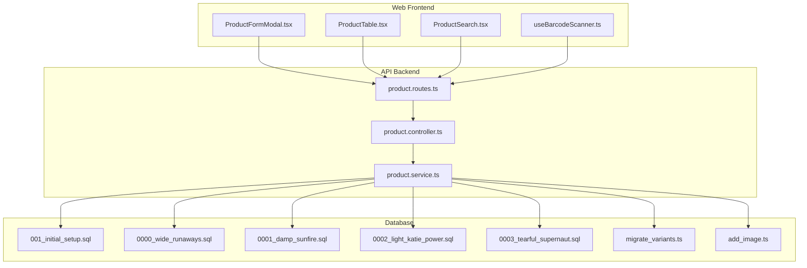
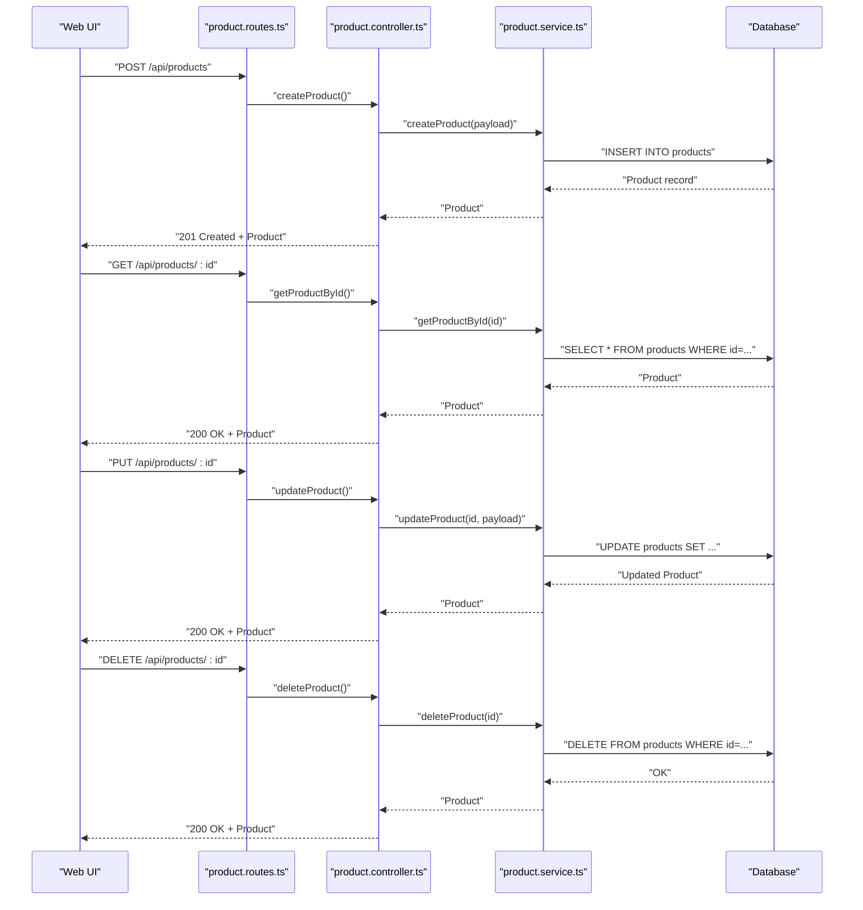
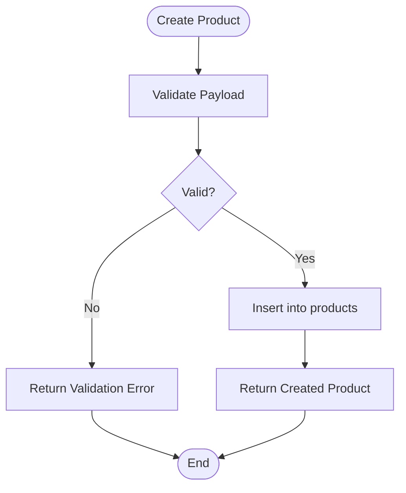
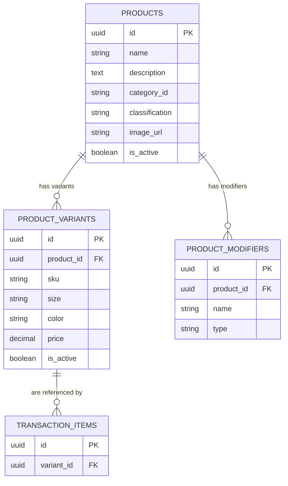
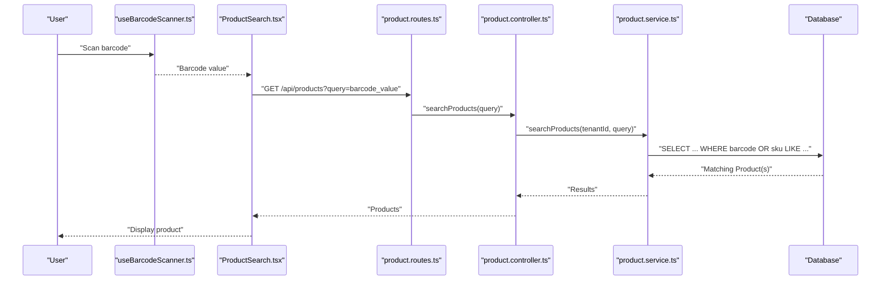

# Product Catalog Management

<cite>
**Referenced Files in This Document**
- [product.controller.ts](file://apps/api/src/controllers/product.controller.ts)
- [product.routes.ts](file://apps/api/src/routes/product.routes.ts)
- [product.service.ts](file://apps/api/src/services/product.service.ts)
- [migrate_variants.ts](file://apps/api/migrate_variants.ts)
- [add_image.ts](file://apps/api/add_image.ts)
- [product.controller.js](file://apps/api/src/controllers/product.controller.js)
- [product.routes.js](file://apps/api/src/routes/product.routes.js)
- [product.service.js](file://apps/api/src/services/product.service.js)
- [useBarcodeScanner.ts](file://apps/web/src/hooks/useBarcodeScanner.ts)
- [ProductFormModal.tsx](file://apps/web/src/components/products/ProductFormModal.tsx)
- [ProductTable.tsx](file://apps/web/src/components/products/ProductTable.tsx)
- [ProductSearch.tsx](file://apps/web/src/components/pos/ProductSearch.tsx)
- [scratch_test_search.ts](file://apps/api/src/scratch_test_search.ts)
- [scratch_test_search.js](file://apps/api/src/scratch_test_search.js)
- [001_initial_setup.sql](file://apps/api/migrations/001_initial_setup.sql)
- [0000_wide_runaways.sql](file://apps/api/migrations/0000_wide_runaways.sql)
- [0001_damp_sunfire.sql](file://apps/api/migrations/0001_damp_sunfire.sql)
- [0002_light_katie_power.sql](file://apps/api/migrations/0002_light_katie_power.sql)
- [0003_tearful_supernaut.sql](file://apps/api/migrations/0003_tearful_supernaut.sql)
</cite>

## Table of Contents
1. [Introduction](#introduction)
2. [Project Structure](#project-structure)
3. [Core Components](#core-components)
4. [Architecture Overview](#architecture-overview)
5. [Detailed Component Analysis](#detailed-component-analysis)
6. [Dependency Analysis](#dependency-analysis)
7. [Performance Considerations](#performance-considerations)
8. [Troubleshooting Guide](#troubleshooting-guide)
9. [Conclusion](#conclusion)
10. [Appendices](#appendices)

## Introduction
This document describes the Product Catalog Management system, focusing on product lifecycle operations (create, read, update, delete), product metadata and classification, variants management (size, color, SKU), barcode integration, images, bulk operations, import/export, search and filtering, and product status controls. It synthesizes backend API endpoints, service logic, frontend UI components, and database migrations to present a complete picture of the catalog system.

## Project Structure
The product catalog spans the backend API (controllers, routes, services) and the frontend web application (UI components for forms, tables, search, and barcode integration). Database migrations define the schema for products, variants, modifiers, and related tables.

**Diagram sources**
- [product.routes.ts](file://apps/api/src/routes/product.routes.ts)
- [product.controller.ts](file://apps/api/src/controllers/product.controller.ts)
- [product.service.ts](file://apps/api/src/services/product.service.ts)
- [ProductFormModal.tsx](file://apps/web/src/components/products/ProductFormModal.tsx)
- [ProductTable.tsx](file://apps/web/src/components/products/ProductTable.tsx)
- [ProductSearch.tsx](file://apps/web/src/components/pos/ProductSearch.tsx)
- [useBarcodeScanner.ts](file://apps/web/src/hooks/useBarcodeScanner.ts)
- [001_initial_setup.sql](file://apps/api/migrations/001_initial_setup.sql)
- [0000_wide_runaways.sql](file://apps/api/migrations/0000_wide_runaways.sql)
- [0001_damp_sunfire.sql](file://apps/api/migrations/0001_damp_sunfire.sql)
- [0002_light_katie_power.sql](file://apps/api/migrations/0002_light_katie_power.sql)
- [0003_tearful_supernaut.sql](file://apps/api/migrations/0003_tearful_supernaut.sql)
- [migrate_variants.ts](file://apps/api/migrate_variants.ts)
- [add_image.ts](file://apps/api/add_image.ts)

**Section sources**
- [product.controller.ts:1-70](file://apps/api/src/controllers/product.controller.ts#L1-L70)
- [product.routes.ts](file://apps/api/src/routes/product.routes.ts)
- [product.service.ts](file://apps/api/src/services/product.service.ts)
- [ProductFormModal.tsx](file://apps/web/src/components/products/ProductFormModal.tsx)
- [ProductTable.tsx](file://apps/web/src/components/products/ProductTable.tsx)
- [ProductSearch.tsx](file://apps/web/src/components/pos/ProductSearch.tsx)
- [useBarcodeScanner.ts](file://apps/web/src/hooks/useBarcodeScanner.ts)
- [001_initial_setup.sql](file://apps/api/migrations/001_initial_setup.sql)
- [0000_wide_runaways.sql](file://apps/api/migrations/0000_wide_runaways.sql)
- [0001_damp_sunfire.sql](file://apps/api/migrations/0001_damp_sunfire.sql)
- [0002_light_katie_power.sql](file://apps/api/migrations/0002_light_katie_power.sql)
- [0003_tearful_supernaut.sql](file://apps/api/migrations/0003_tearful_supernaut.sql)
- [migrate_variants.ts:1-40](file://apps/api/migrate_variants.ts#L1-L40)
- [add_image.ts:1-20](file://apps/api/add_image.ts#L1-L20)

## Core Components
- Product controller: Exposes CRUD endpoints and search, delegates to the service layer.
- Product service: Implements business logic for product operations, variants, and search.
- Product routes: Defines API endpoints for product management.
- Frontend components: Forms, tables, and search UI for product management and POS scanning.
- Database migrations: Define product, variants, modifiers, and supporting columns.

Key responsibilities:
- Product CRUD and search
- Variants and modifiers management
- Barcode scanning integration
- Image URL storage
- Bulk operations and import/export via API and migrations

**Section sources**
- [product.controller.ts:1-70](file://apps/api/src/controllers/product.controller.ts#L1-L70)
- [product.service.ts](file://apps/api/src/services/product.service.ts)
- [product.routes.ts](file://apps/api/src/routes/product.routes.ts)
- [ProductFormModal.tsx](file://apps/web/src/components/products/ProductFormModal.tsx)
- [ProductTable.tsx](file://apps/web/src/components/products/ProductTable.tsx)
- [ProductSearch.tsx](file://apps/web/src/components/pos/ProductSearch.tsx)
- [useBarcodeScanner.ts](file://apps/web/src/hooks/useBarcodeScanner.ts)
- [migrate_variants.ts:1-40](file://apps/api/migrate_variants.ts#L1-L40)
- [add_image.ts:1-20](file://apps/api/add_image.ts#L1-L20)

## Architecture Overview
The system follows a layered architecture:
- Web UI triggers actions (create/update/search) via product routes.
- Routes delegate to the product controller.
- Controller calls the product service.
- Service executes database operations and returns results.
- Migrations and scripts maintain schema and data integrity.

**Diagram sources**
- [product.routes.ts](file://apps/api/src/routes/product.routes.ts)
- [product.controller.ts:1-70](file://apps/api/src/controllers/product.controller.ts#L1-L70)
- [product.service.ts](file://apps/api/src/services/product.service.ts)
- [001_initial_setup.sql](file://apps/api/migrations/001_initial_setup.sql)

## Detailed Component Analysis

### Product CRUD Workflows
- Create: The controller invokes the service to insert a new product record, returning the created entity.
- Read: Fetch by ID with tenant scoping.
- Update: Patch product attributes; returns updated entity.
- Delete: Removes product by ID; returns deleted entity.

**Diagram sources**
- [product.controller.ts:25-36](file://apps/api/src/controllers/product.controller.ts#L25-L36)
- [product.service.ts](file://apps/api/src/services/product.service.ts)

**Section sources**
- [product.controller.ts:25-36](file://apps/api/src/controllers/product.controller.ts#L25-L36)
- [product.controller.ts:41-51](file://apps/api/src/controllers/product.controller.ts#L41-L51)
- [product.controller.ts:61-68](file://apps/api/src/controllers/product.controller.ts#L61-L68)
- [product.controller.ts:13-23](file://apps/api/src/controllers/product.controller.ts#L13-L23)
- [product.service.ts](file://apps/api/src/services/product.service.ts)

### Product Metadata, Descriptions, Categories, and Classifications
- Schema includes product metadata columns (name, description, category identifiers, classification fields) defined in initial migrations.
- Frontend form modal supports editing product metadata and classifications.
- Search and filtering leverage query parameters and service-level logic.

**Section sources**
- [001_initial_setup.sql](file://apps/api/migrations/001_initial_setup.sql)
- [ProductFormModal.tsx](file://apps/web/src/components/products/ProductFormModal.tsx)
- [scratch_test_search.ts:1-50](file://apps/api/src/scratch_test_search.ts#L1-L50)
- [scratch_test_search.js:1-50](file://apps/api/src/scratch_test_search.js#L1-L50)

### Product Variants Management (Size, Color, SKU, Pricing)
- Variants and modifiers are modeled with dedicated tables and foreign keys to products.
- Transaction items reference product variants, enabling variant-specific pricing and inventory tracking.
- Migration script creates variant and modifier tables and updates transaction items.

**Diagram sources**
- [migrate_variants.ts:1-40](file://apps/api/migrate_variants.ts#L1-L40)
- [001_initial_setup.sql](file://apps/api/migrations/001_initial_setup.sql)

**Section sources**
- [migrate_variants.ts:1-40](file://apps/api/migrate_variants.ts#L1-L40)
- [product.service.ts](file://apps/api/src/services/product.service.ts)

### Barcode Integration for Product Identification and Scanning
- The POS product search component integrates barcode scanning via a dedicated hook.
- Scanned input is processed to resolve a product (by barcode or SKU) for checkout.

**Diagram sources**
- [useBarcodeScanner.ts](file://apps/web/src/hooks/useBarcodeScanner.ts)
- [ProductSearch.tsx](file://apps/web/src/components/pos/ProductSearch.tsx)
- [product.routes.ts](file://apps/api/src/routes/product.routes.ts)
- [product.controller.ts:5-12](file://apps/api/src/controllers/product.controller.ts#L5-L12)
- [product.service.ts](file://apps/api/src/services/product.service.ts)
- [scratch_test_search.ts:1-50](file://apps/api/src/scratch_test_search.ts#L1-L50)

**Section sources**
- [useBarcodeScanner.ts](file://apps/web/src/hooks/useBarcodeScanner.ts)
- [ProductSearch.tsx](file://apps/web/src/components/pos/ProductSearch.tsx)
- [product.controller.ts:5-12](file://apps/api/src/controllers/product.controller.ts#L5-L12)
- [scratch_test_search.ts:1-50](file://apps/api/src/scratch_test_search.ts#L1-L50)

### Product Image Management
- A migration adds an image URL column to products.
- The product form supports updating product image URLs.

**Section sources**
- [add_image.ts:1-20](file://apps/api/add_image.ts#L1-L20)
- [ProductFormModal.tsx](file://apps/web/src/components/products/ProductFormModal.tsx)

### Bulk Operations and Import/Export Capabilities
- Seed scripts and migration scripts support initial data population and schema evolution.
- Bulk import/export can be implemented via API endpoints and scripts leveraging the existing routes and service methods.

**Section sources**
- [product.routes.ts](file://apps/api/src/routes/product.routes.ts)
- [product.service.ts](file://apps/api/src/services/product.service.ts)
- [0000_wide_runaways.sql](file://apps/api/migrations/0000_wide_runaways.sql)
- [0001_damp_sunfire.sql](file://apps/api/migrations/0001_damp_sunfire.sql)
- [0002_light_katie_power.sql](file://apps/api/migrations/0002_light_katie_power.sql)
- [0003_tearful_supernaut.sql](file://apps/api/migrations/0003_tearful_supernaut.sql)

### Product Search, Filtering, and Sorting
- Search endpoint accepts a query parameter and returns matching products.
- Filtering and sorting can be extended in the service method and route handler.

**Section sources**
- [product.controller.ts:5-12](file://apps/api/src/controllers/product.controller.ts#L5-L12)
- [product.service.ts](file://apps/api/src/services/product.service.ts)
- [scratch_test_search.ts:1-50](file://apps/api/src/scratch_test_search.ts#L1-L50)
- [scratch_test_search.js:1-50](file://apps/api/src/scratch_test_search.js#L1-L50)

### Product Status Management (Active, Inactive, Discontinued)
- Products include an active flag in the schema.
- UI components and service logic should honor status for visibility and availability.

**Section sources**
- [001_initial_setup.sql](file://apps/api/migrations/001_initial_setup.sql)
- [ProductTable.tsx](file://apps/web/src/components/products/ProductTable.tsx)

### Practical Examples
- Create a product: Call the create endpoint with product metadata; receive the created product object.
- Update a product: Call the update endpoint with partial fields; receive the updated product.
- Delete a product: Call the delete endpoint; receive the deleted product.
- Variant creation: Use service methods to create variants linked to a product; variants are referenced by transaction items.
- Barcode scanning: Use the barcode scanner hook to scan a product identifier; the search component resolves the product.

**Section sources**
- [product.controller.ts:25-36](file://apps/api/src/controllers/product.controller.ts#L25-L36)
- [product.controller.ts:41-51](file://apps/api/src/controllers/product.controller.ts#L41-L51)
- [product.controller.ts:61-68](file://apps/api/src/controllers/product.controller.ts#L61-L68)
- [migrate_variants.ts:1-40](file://apps/api/migrate_variants.ts#L1-L40)
- [useBarcodeScanner.ts](file://apps/web/src/hooks/useBarcodeScanner.ts)
- [ProductSearch.tsx](file://apps/web/src/components/pos/ProductSearch.tsx)

### Validation Rules, Duplicate Detection, and Data Consistency
- Validation: Controller validates inputs before delegating to the service.
- Duplicates: SKU uniqueness can be enforced at the database level via unique constraints in migrations.
- Consistency: Foreign keys link variants/modifiers to products; transaction items link to variants; migrations ensure referential integrity.

**Section sources**
- [product.controller.ts:25-36](file://apps/api/src/controllers/product.controller.ts#L25-L36)
- [migrate_variants.ts:1-40](file://apps/api/migrate_variants.ts#L1-L40)
- [001_initial_setup.sql](file://apps/api/migrations/001_initial_setup.sql)

## Dependency Analysis
The product module exhibits clear separation of concerns:
- Routes depend on the controller.
- Controller depends on the service.
- Service depends on the database schema defined by migrations.
- Frontend components depend on routes and service endpoints.

**Diagram sources**
- [product.routes.ts](file://apps/api/src/routes/product.routes.ts)
- [product.controller.ts:1-70](file://apps/api/src/controllers/product.controller.ts#L1-L70)
- [product.service.ts](file://apps/api/src/services/product.service.ts)
- [001_initial_setup.sql](file://apps/api/migrations/001_initial_setup.sql)

**Section sources**
- [product.routes.ts](file://apps/api/src/routes/product.routes.ts)
- [product.controller.ts:1-70](file://apps/api/src/controllers/product.controller.ts#L1-L70)
- [product.service.ts](file://apps/api/src/services/product.service.ts)
- [001_initial_setup.sql](file://apps/api/migrations/001_initial_setup.sql)

## Performance Considerations
- Indexing: Add indexes on frequently queried columns (SKU, barcode, category, classification) in migrations.
- Pagination: Implement pagination in search endpoints to limit result sets.
- Caching: Cache product lists and popular product details to reduce database load.
- Batch operations: Use bulk inserts/updates for import/export scenarios.

## Troubleshooting Guide
- Product not found: Ensure the ID exists and belongs to the current tenant.
- Variant linkage: Verify variant foreign keys and transaction item variant references.
- Barcode resolution: Confirm barcode or SKU values match stored identifiers.
- Image URL: Ensure the image URL column exists and is populated.

**Section sources**
- [product.controller.ts:13-23](file://apps/api/src/controllers/product.controller.ts#L13-L23)
- [product.controller.ts:41-51](file://apps/api/src/controllers/product.controller.ts#L41-L51)
- [product.controller.ts:61-68](file://apps/api/src/controllers/product.controller.ts#L61-L68)
- [migrate_variants.ts:1-40](file://apps/api/migrate_variants.ts#L1-L40)
- [add_image.ts:1-20](file://apps/api/add_image.ts#L1-L20)

## Conclusion
The Product Catalog Management system provides a robust foundation for managing products, variants, and barcodes, with clear API boundaries and frontend integration. Extending search, filtering, and bulk operations while enforcing validation and consistency will further strengthen the system.

## Appendices
- API endpoints and payloads are defined in the product routes and controller.
- Database schema evolution is managed via migrations and variant/image scripts.
- Frontend components provide forms, tables, and search experiences integrated with barcode scanning.