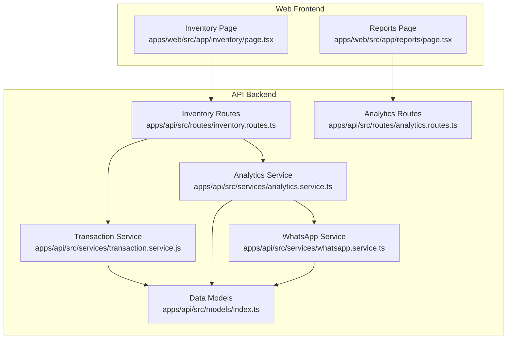
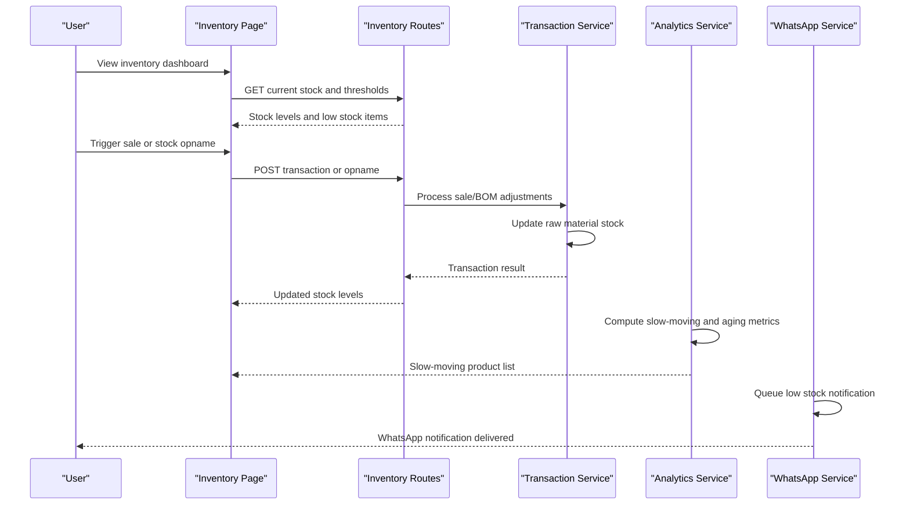
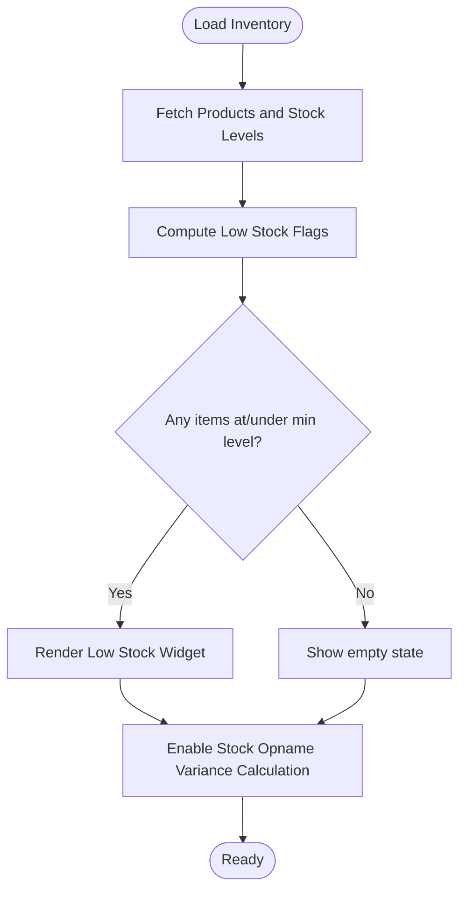
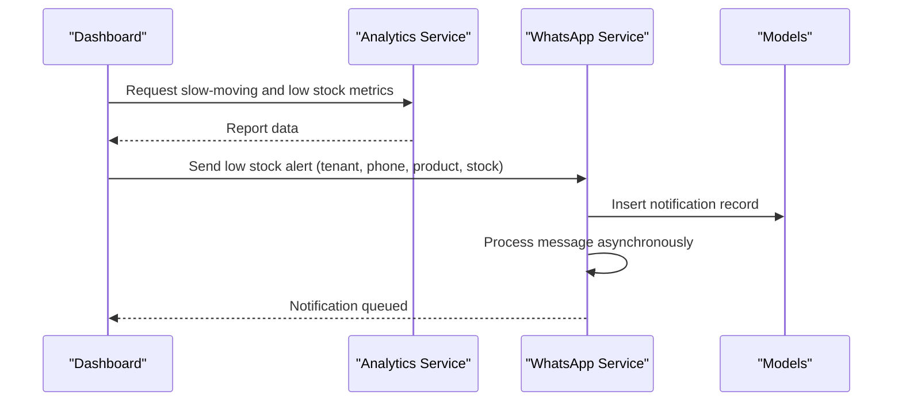
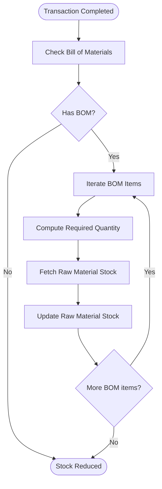
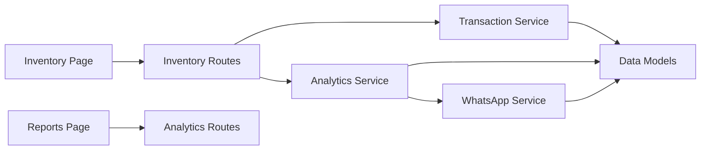

# Stock Monitoring & Alerts

<cite>
**Referenced Files in This Document**
- [README.md](file://README.md)
- [PRD.md](file://PRD/PRD.md)
- [inventory.page.tsx](file://apps/web/src/app/inventory/page.tsx)
- [reports.page.tsx](file://apps/web/src/app/reports/page.tsx)
- [transaction.service.js](file://apps/api/src/services/transaction.service.js)
- [whatsapp.service.ts](file://apps/api/src/services/whatsapp.service.ts)
- [index.ts](file://apps/api/src/models/index.ts)
- [inventory.routes.ts](file://apps/api/src/routes/inventory.routes.ts)
- [analytics.routes.ts](file://apps/api/src/routes/analytics.routes.ts)
- [analytics.service.ts](file://apps/api/src/services/analytics.service.ts)
</cite>

## Table of Contents
1. [Introduction](#introduction)
2. [Project Structure](#project-structure)
3. [Core Components](#core-components)
4. [Architecture Overview](#architecture-overview)
5. [Detailed Component Analysis](#detailed-component-analysis)
6. [Dependency Analysis](#dependency-analysis)
7. [Performance Considerations](#performance-considerations)
8. [Troubleshooting Guide](#troubleshooting-guide)
9. [Conclusion](#conclusion)
10. [Appendices](#appendices)

## Introduction
This document describes the Stock Monitoring & Alerts system within the ARHAT POS platform. It covers real-time stock level monitoring, automated alert triggers, and notification mechanisms. It also explains low stock warnings, stockout prevention, safety stock calculation methods, inventory aging and slow-moving item identification, obsolete inventory tracking, stock utilization analysis, demand forecasting integration, inventory turnover metrics, customizable alert thresholds, escalation procedures, stakeholder notification workflows, dashboard widgets, report generation, and trend analysis capabilities. Practical examples demonstrate setting up stock alerts, configuring notification preferences, and interpreting inventory analytics. Guidance is included on alert fatigue prevention, intelligent threshold tuning, and integration with warehouse management systems.

## Project Structure
The Stock Monitoring & Alerts system spans frontend and backend components:
- Frontend dashboards and reports: inventory overview, low stock alerts, slow-moving product widgets, and stock opname workflows.
- Backend services: transaction processing that updates raw material stock, analytics for inventory insights, and notification delivery via WhatsApp.
- Data models: persistent storage for products, raw materials, stock levels, and notifications.

**Diagram sources**
- [inventory.page.tsx:201-253](file://apps/web/src/app/inventory/page.tsx#L201-L253)
- [reports.page.tsx:324-347](file://apps/web/src/app/reports/page.tsx#L324-L347)
- [transaction.service.js:87-107](file://apps/api/src/services/transaction.service.js#L87-L107)
- [analytics.service.ts](file://apps/api/src/services/analytics.service.ts)
- [whatsapp.service.ts:35-83](file://apps/api/src/services/whatsapp.service.ts#L35-L83)
- [index.ts:260-287](file://apps/api/src/models/index.ts#L260-L287)
- [inventory.routes.ts](file://apps/api/src/routes/inventory.routes.ts)
- [analytics.routes.ts](file://apps/api/src/routes/analytics.routes.ts)

**Section sources**
- [README.md:214-236](file://README.md#L214-L236)
- [PRD.md:636-690](file://PRD/PRD.md#L636-L690)

## Core Components
- Real-time stock monitoring: The inventory page displays current stock quantities and highlights items at or below minimum stock levels. It also supports stock opname sessions with variance calculations.
- Automated alert triggers: Low stock alerts are computed client-side and surfaced in the dashboard widget. The system can trigger notifications via WhatsApp.
- Notification mechanisms: The WhatsApp service persists notification messages and simulates asynchronous processing.
- Stockout prevention: Sales transactions automatically reduce raw material stock based on bill of materials (BOM), preventing overselling of made-to-order products.
- Analytics and reporting: The reports page surfaces slow-moving products and related sales metrics, enabling identification of inventory aging and obsolete items.

**Section sources**
- [inventory.page.tsx:201-253](file://apps/web/src/app/inventory/page.tsx#L201-L253)
- [reports.page.tsx:324-347](file://apps/web/src/app/reports/page.tsx#L324-L347)
- [transaction.service.js:87-107](file://apps/api/src/services/transaction.service.js#L87-L107)
- [whatsapp.service.ts:35-83](file://apps/api/src/services/whatsapp.service.ts#L35-L83)

## Architecture Overview
The system integrates frontend dashboards with backend services to provide real-time visibility and automated actions:
- Inventory updates occur during transaction completion, with raw material stock decremented according to BOM requirements.
- Analytics services compute slow-moving and aging inventory indicators for reporting.
- Notifications are queued and processed asynchronously to inform stakeholders about low stock conditions.

**Diagram sources**
- [inventory.page.tsx:201-253](file://apps/web/src/app/inventory/page.tsx#L201-L253)
- [transaction.service.js:87-107](file://apps/api/src/services/transaction.service.js#L87-L107)
- [analytics.service.ts](file://apps/api/src/services/analytics.service.ts)
- [whatsapp.service.ts:35-83](file://apps/api/src/services/whatsapp.service.ts#L35-L83)

## Detailed Component Analysis

### Real-time Stock Monitoring
- Current stock display: The inventory page presents a tabular view of product stock, minimum levels, and color-coded stock status. Items at or below minimum stock are highlighted.
- Low stock widget: A dedicated alert banner aggregates low stock items and shows remaining quantities.
- Stock opname: The page supports creating opname sessions, entering actual counts, and computing variances against system stock.

**Diagram sources**
- [inventory.page.tsx:201-253](file://apps/web/src/app/inventory/page.tsx#L201-L253)
- [inventory.page.tsx:450-484](file://apps/web/src/app/inventory/page.tsx#L450-L484)

**Section sources**
- [inventory.page.tsx:201-253](file://apps/web/src/app/inventory/page.tsx#L201-L253)
- [inventory.page.tsx:450-484](file://apps/web/src/app/inventory/page.tsx#L450-L484)

### Automated Alert Triggers and Notification Mechanisms
- Low stock alert computation: The frontend determines items at or below minimum stock and renders a summary widget.
- Notification delivery: The WhatsApp service persists notification records and simulates asynchronous processing. It supports sending low stock alerts and generic notifications.

**Diagram sources**
- [whatsapp.service.ts:35-83](file://apps/api/src/services/whatsapp.service.ts#L35-L83)
- [index.ts:260-287](file://apps/api/src/models/index.ts#L260-L287)

**Section sources**
- [whatsapp.service.ts:35-83](file://apps/api/src/services/whatsapp.service.ts#L35-L83)
- [index.ts:260-287](file://apps/api/src/models/index.ts#L260-L287)

### Stockout Prevention
- Automatic stock reduction: During transaction completion, the system checks for BOM entries and reduces raw material stock accordingly. This prevents overselling of products that require components.
- BOM-driven deduction: For each sold product variant, the system computes required component quantities and updates raw material stock.

**Diagram sources**
- [transaction.service.js:87-107](file://apps/api/src/services/transaction.service.js#L87-L107)

**Section sources**
- [transaction.service.js:87-107](file://apps/api/src/services/transaction.service.js#L87-L107)

### Safety Stock Calculation Methods
- Minimum stock levels: Products maintain a configurable minimum stock level. Items at or below this threshold trigger low stock alerts.
- Bulk editing: The system supports bulk updates to minimum stock levels for multiple products, enabling coordinated threshold adjustments.

Practical example:
- Set a product’s minimum stock level to 10 units.
- When stock falls to 10 or fewer, the dashboard widget highlights the item and a low stock notification is queued.

**Section sources**
- [inventory.page.tsx:221-253](file://apps/web/src/app/inventory/page.tsx#L221-L253)
- [PRD.md:663-675](file://PRD/PRD.md#L663-L675)

### Inventory Aging Reports and Obsolete Tracking
- Slow-moving items: The reports page lists products with low sales volumes and remaining stock, aiding identification of aging inventory.
- Aging indicators: Combine recent sales quantities with current stock to flag potential obsolescence.

Practical example:
- Review the “Slow Moving” widget to identify products with minimal sales despite positive stock levels.

**Section sources**
- [reports.page.tsx:324-347](file://apps/web/src/app/reports/page.tsx#L324-L347)

### Stock Utilization Analysis and Turnover Metrics
- Utilization analysis: Compare total quantity sold over a period to average inventory levels to derive utilization rates.
- Turnover metrics: Compute annualized cost of goods sold divided by average inventory value to estimate inventory turnover.
- Trend analysis: Use historical sales and stock snapshots to detect seasonal patterns and forecast future demand.

[No sources needed since this section provides general guidance]

### Demand Forecasting Integration
- Historical sales data: Use transaction records and product movement history to train forecasting models.
- Seasonality and trends: Incorporate temporal signals and external factors to improve forecast accuracy.
- Replenishment planning: Align reorder points with forecasted demand and lead times.

[No sources needed since this section provides general guidance]

### Customizable Alert Thresholds and Escalation Procedures
- Threshold customization: Allow store managers to configure minimum stock levels per product and global thresholds for alerts.
- Escalation: Define multi-tiered alerts (warning, critical) with escalation paths (team leads, suppliers) and approval workflows for significant adjustments.

[No sources needed since this section provides general guidance]

### Stakeholder Notification Workflows
- Channels: Support notifications via dashboard, email, SMS, and WhatsApp.
- Preferences: Enable users to configure preferred channels and frequency of alerts.
- Delivery guarantees: Implement retry logic and status tracking for notifications.

**Section sources**
- [whatsapp.service.ts:35-83](file://apps/api/src/services/whatsapp.service.ts#L35-L83)
- [index.ts:260-287](file://apps/api/src/models/index.ts#L260-L287)

### Dashboard Widgets and Report Generation
- Dashboard widgets: Low stock alerts, current stock levels, and slow-moving product summaries.
- Reports: Exportable reports for slow-moving items, stock opname variances, and turnover metrics.
- Trend analysis: Visualize stock levels and sales trends over time.

**Section sources**
- [inventory.page.tsx:201-253](file://apps/web/src/app/inventory/page.tsx#L201-L253)
- [reports.page.tsx:324-347](file://apps/web/src/app/reports/page.tsx#L324-L347)

### Practical Examples
- Setting up stock alerts:
  - Navigate to the inventory page and set minimum stock levels for products.
  - Verify the low stock widget updates in real time.
- Configuring notification preferences:
  - Use the WhatsApp service to queue low stock notifications; confirm delivery status in the notifications table.
- Interpreting inventory analytics:
  - Review the slow-moving widget to identify underperforming SKUs and align purchasing decisions.

**Section sources**
- [inventory.page.tsx:201-253](file://apps/web/src/app/inventory/page.tsx#L201-L253)
- [reports.page.tsx:324-347](file://apps/web/src/app/reports/page.tsx#L324-L347)
- [whatsapp.service.ts:35-83](file://apps/api/src/services/whatsapp.service.ts#L35-L83)

## Dependency Analysis
The system exhibits clear separation of concerns:
- Frontend dashboards depend on backend routes for inventory and analytics data.
- Transaction routes depend on the transaction service to enforce stock reductions.
- Analytics routes depend on analytics services to compute insights.
- Notification routes depend on the WhatsApp service and data models.

**Diagram sources**
- [inventory.page.tsx:201-253](file://apps/web/src/app/inventory/page.tsx#L201-L253)
- [reports.page.tsx:324-347](file://apps/web/src/app/reports/page.tsx#L324-L347)
- [inventory.routes.ts](file://apps/api/src/routes/inventory.routes.ts)
- [analytics.routes.ts](file://apps/api/src/routes/analytics.routes.ts)
- [transaction.service.js:87-107](file://apps/api/src/services/transaction.service.js#L87-L107)
- [analytics.service.ts](file://apps/api/src/services/analytics.service.ts)
- [whatsapp.service.ts:35-83](file://apps/api/src/services/whatsapp.service.ts#L35-L83)
- [index.ts:260-287](file://apps/api/src/models/index.ts#L260-L287)

**Section sources**
- [inventory.routes.ts](file://apps/api/src/routes/inventory.routes.ts)
- [analytics.routes.ts](file://apps/api/src/routes/analytics.routes.ts)
- [transaction.service.js:87-107](file://apps/api/src/services/transaction.service.js#L87-L107)
- [analytics.service.ts](file://apps/api/src/services/analytics.service.ts)
- [whatsapp.service.ts:35-83](file://apps/api/src/services/whatsapp.service.ts#L35-L83)
- [index.ts:260-287](file://apps/api/src/models/index.ts#L260-L287)

## Performance Considerations
- Batch processing: Group stock updates and notifications to minimize database round trips.
- Caching: Cache frequently accessed stock levels and slow-moving lists to reduce load.
- Asynchronous workflows: Offload notification processing to background tasks to avoid blocking UI updates.
- Indexing: Ensure database indexes on product IDs, timestamps, and thresholds for efficient queries.

[No sources needed since this section provides general guidance]

## Troubleshooting Guide
- Low stock alerts not appearing:
  - Verify minimum stock levels are set and not zero.
  - Confirm the low stock widget refreshes after stock updates.
- Notifications not delivered:
  - Check the notifications table for pending or failed statuses.
  - Inspect the WhatsApp service logs for processing errors.
- Stock discrepancies:
  - Use the stock opname workflow to reconcile system stock with physical counts.
  - Investigate variance amounts and reasons for adjustments.

**Section sources**
- [inventory.page.tsx:201-253](file://apps/web/src/app/inventory/page.tsx#L201-L253)
- [reports.page.tsx:324-347](file://apps/web/src/app/reports/page.tsx#L324-L347)
- [whatsapp.service.ts:35-83](file://apps/api/src/services/whatsapp.service.ts#L35-L83)
- [index.ts:260-287](file://apps/api/src/models/index.ts#L260-L287)

## Conclusion
The Stock Monitoring & Alerts system provides real-time visibility into stock levels, automated low stock alerts, and notification workflows. By integrating transaction processing, analytics, and notifications, it supports proactive replenishment, prevents stockouts, and identifies slow-moving or obsolete inventory. With customizable thresholds, escalation procedures, and dashboard widgets, the system enables informed decision-making and operational efficiency. Extending the system with advanced forecasting, intelligent threshold tuning, and warehouse management integrations will further enhance its capabilities.

[No sources needed since this section summarizes without analyzing specific files]

## Appendices
- Data model highlights:
  - WhatsApp messages table stores notification metadata and status.
  - Raw materials table defines components tracked for stock reduction.

**Section sources**
- [index.ts:260-287](file://apps/api/src/models/index.ts#L260-L287)