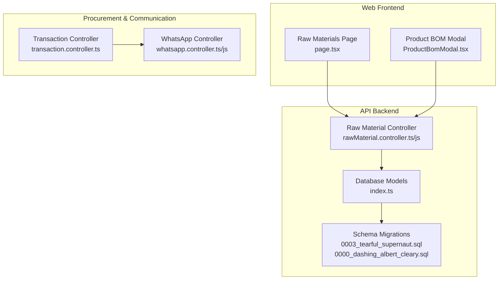
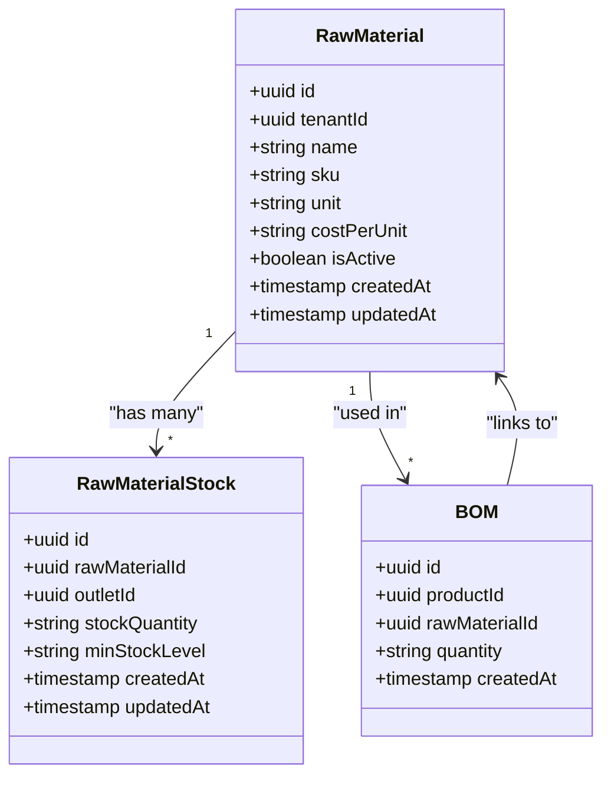
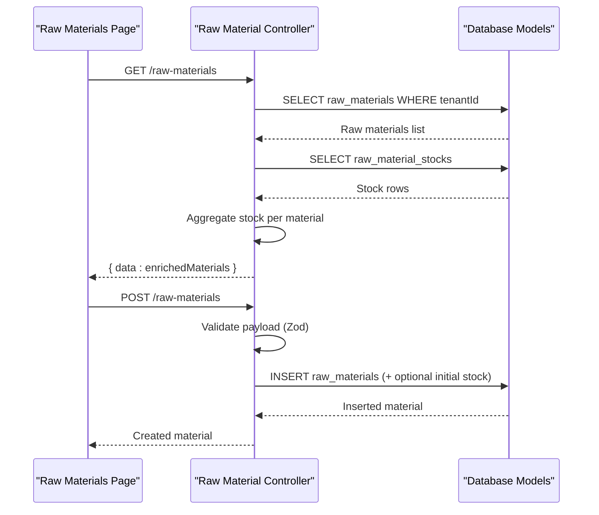
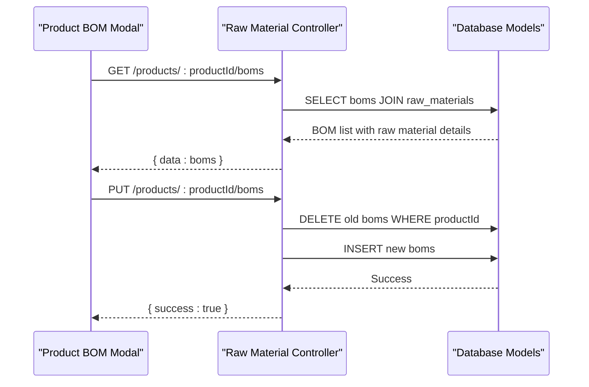
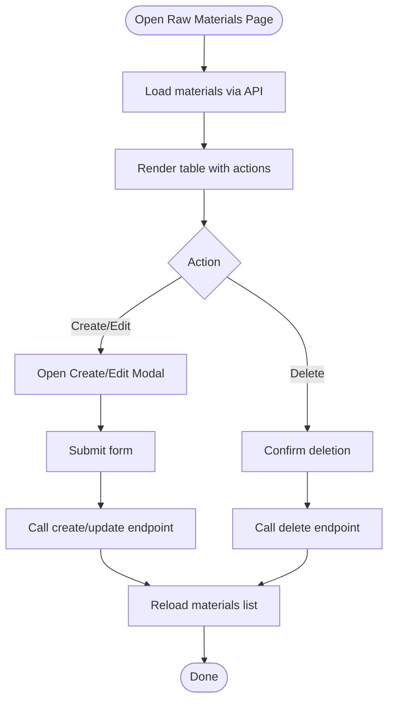
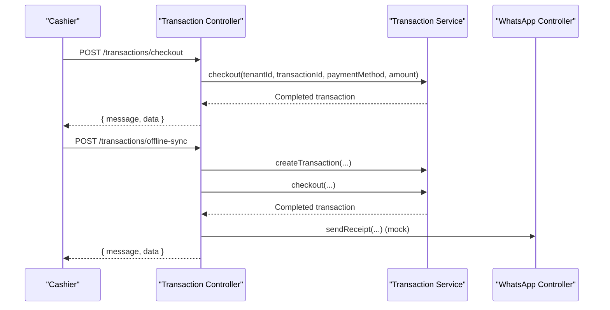
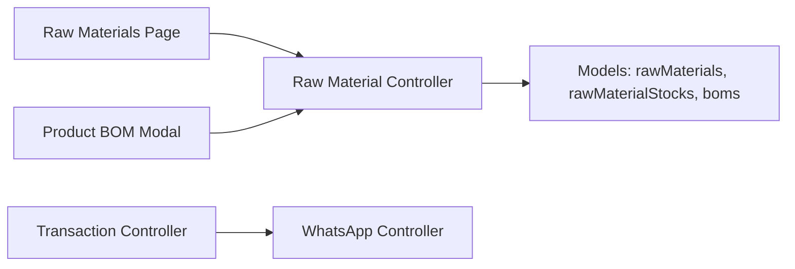

# Supplier & Raw Materials Management

<cite>
**Referenced Files in This Document**
- [PRD.md](file://PRD/PRD.md)
- [IMPLEMENTATION_CHECKLIST.md](file://PRD/IMPLEMENTATION_CHECKLIST.md)
- [README.md](file://README.md)
- [rawMaterial.controller.ts](file://apps/api/src/controllers/rawMaterial.controller.ts)
- [rawMaterial.controller.js](file://apps/api/src/controllers/rawMaterial.controller.js)
- [index.ts](file://apps/api/src/models/index.ts)
- [0003_tearful_supernaut.sql](file://apps/api/migrations/0003_tearful_supernaut.sql)
- [0000_dashing_albert_cleary.sql](file://apps/api/migrations/0000_dashing_albert_cleary.sql)
- [page.tsx](file://apps/web/src/app/(admin)/inventory/raw-materials/page.tsx)
- [ProductBomModal.tsx](file://apps/web/src/components/products/ProductBomModal.tsx)
- [transaction.controller.ts](file://apps/api/src/controllers/transaction.controller.ts)
- [whatsapp.controller.ts](file://apps/api/src/controllers/whatsapp.controller.ts)
- [whatsapp.controller.js](file://apps/api/src/controllers/whatsapp.controller.js)
- [whatsappMessages](file://apps/api/src/models/index.ts)
</cite>

## Table of Contents
1. [Introduction](#introduction)
2. [Project Structure](#project-structure)
3. [Core Components](#core-components)
4. [Architecture Overview](#architecture-overview)
5. [Detailed Component Analysis](#detailed-component-analysis)
6. [Dependency Analysis](#dependency-analysis)
7. [Performance Considerations](#performance-considerations)
8. [Troubleshooting Guide](#troubleshooting-guide)
9. [Conclusion](#conclusion)
10. [Appendices](#appendices)

## Introduction
This document describes the Supplier & Raw Materials Management capabilities enabled by the current codebase. It focuses on:
- Raw material master data and stock tracking
- Bill of Materials (BOM) linking raw materials to products
- Frontend surfaces for raw material management and BOM editing
- Procurement-related workflows that are conceptually supported by the existing POS and transaction infrastructure
- Practical examples of supplier onboarding, purchase order creation, and goods receipt validation aligned with the current system’s capabilities
- Supplier risk management, alternative sourcing strategies, and supplier communication workflows

Where the system does not yet implement explicit supplier registration, evaluation, performance tracking, purchase orders, or payment workflows, this document outlines how those features can be incrementally built upon the existing foundation.

## Project Structure
The Supplier & Raw Materials Management domain spans:
- Backend API (controllers, models, migrations)
- Frontend admin pages and modals for raw materials and BOMs
- PRD and implementation guidance for feature scope and testing

**Diagram sources**
- [page.tsx](file://apps/web/src/app/(admin)/inventory/raw-materials/page.tsx#L1-L38)
- [ProductBomModal.tsx:1-148](file://apps/web/src/components/products/ProductBomModal.tsx#L1-L148)
- [rawMaterial.controller.ts:1-45](file://apps/api/src/controllers/rawMaterial.controller.ts#L1-L45)
- [rawMaterial.controller.js:1-125](file://apps/api/src/controllers/rawMaterial.controller.js#L1-L125)
- [index.ts:277-305](file://apps/api/src/models/index.ts#L277-L305)
- [0003_tearful_supernaut.sql](file://apps/api/migrations/0003_tearful_supernaut.sql)
- [0000_dashing_albert_cleary.sql](file://apps/api/migrations/0000_dashing_albert_cleary.sql)
- [transaction.controller.ts:39-86](file://apps/api/src/controllers/transaction.controller.ts#L39-L86)
- [whatsapp.controller.ts](file://apps/api/src/controllers/whatsapp.controller.ts)
- [whatsapp.controller.js](file://apps/api/src/controllers/whatsapp.controller.js)

**Section sources**
- [README.md:264-281](file://README.md#L264-L281)
- [PRD.md:400-634](file://PRD/PRD.md#L400-L634)

## Core Components
- Raw Materials Master: CRUD operations, enrichment with stock quantities, and BOM linkage.
- Raw Material Stocks: Outlet-specific stock levels and minimum thresholds.
- Bill of Materials (BOM): Association of raw materials to products with required quantities.
- Frontend Surfaces: Raw materials listing/editing and BOM editor modal.
- Procurement-Related Workflows: Conceptualized via POS transactions and WhatsApp receipt integration.

Key implementation references:
- Raw materials controller and BOM endpoints
- Database models for raw materials, stocks, and BOM
- Frontend pages and modals for raw materials and BOM editing
- Transaction controller and WhatsApp controller supporting receipt workflows

**Section sources**
- [rawMaterial.controller.ts:11-25](file://apps/api/src/controllers/rawMaterial.controller.ts#L11-L25)
- [rawMaterial.controller.js:8-18](file://apps/api/src/controllers/rawMaterial.controller.js#L8-L18)
- [index.ts:277-305](file://apps/api/src/models/index.ts#L277-L305)
- [page.tsx](file://apps/web/src/app/(admin)/inventory/raw-materials/page.tsx#L15-L38)
- [ProductBomModal.tsx:11-43](file://apps/web/src/components/products/ProductBomModal.tsx#L11-L43)
- [transaction.controller.ts:39-86](file://apps/api/src/controllers/transaction.controller.ts#L39-L86)
- [whatsapp.controller.ts](file://apps/api/src/controllers/whatsapp.controller.ts)
- [whatsapp.controller.js](file://apps/api/src/controllers/whatsapp.controller.js)

## Architecture Overview
The system separates concerns across backend controllers, typed models, and frontend components. The raw materials domain integrates with product BOMs to compute ingredient needs for production.

**Diagram sources**
- [index.ts:277-305](file://apps/api/src/models/index.ts#L277-L305)

**Section sources**
- [index.ts:277-305](file://apps/api/src/models/index.ts#L277-L305)

## Detailed Component Analysis

### Raw Materials Management
- Purpose: Manage raw material records, units, costs, and outlet stock levels.
- Key operations:
  - List raw materials with aggregated stock quantities.
  - Create raw materials with optional initial stock and outlet association.
  - Update and delete raw materials with dependent cleanup.
- Data enrichment: Stock totals computed from per-outlet entries.

**Diagram sources**
- [rawMaterial.controller.ts:11-25](file://apps/api/src/controllers/rawMaterial.controller.ts#L11-L25)
- [rawMaterial.controller.js:8-18](file://apps/api/src/controllers/rawMaterial.controller.js#L8-L18)
- [index.ts:277-305](file://apps/api/src/models/index.ts#L277-L305)

**Section sources**
- [rawMaterial.controller.ts:11-25](file://apps/api/src/controllers/rawMaterial.controller.ts#L11-L25)
- [rawMaterial.controller.js:8-18](file://apps/api/src/controllers/rawMaterial.controller.js#L8-L18)
- [page.tsx](file://apps/web/src/app/(admin)/inventory/raw-materials/page.tsx#L15-L38)

### Bill of Materials (BOM) Management
- Purpose: Define how much of each raw material is required to produce a product.
- Key operations:
  - Retrieve BOM for a product, including raw material metadata.
  - Replace entire BOM for a product with a new set of ingredients and quantities.

**Diagram sources**
- [rawMaterial.controller.ts:91-125](file://apps/api/src/controllers/rawMaterial.controller.ts#L91-L125)
- [rawMaterial.controller.js:91-125](file://apps/api/src/controllers/rawMaterial.controller.js#L91-L125)
- [index.ts:299-305](file://apps/api/src/models/index.ts#L299-L305)

**Section sources**
- [rawMaterial.controller.ts:91-125](file://apps/api/src/controllers/rawMaterial.controller.ts#L91-L125)
- [rawMaterial.controller.js:91-125](file://apps/api/src/controllers/rawMaterial.controller.js#L91-L125)
- [ProductBomModal.tsx:11-43](file://apps/web/src/components/products/ProductBomModal.tsx#L11-L43)

### Frontend Surfaces
- Raw Materials Page: Lists materials, supports search, and opens modals for create/update/delete.
- Product BOM Modal: Loads raw materials and BOMs, allows editing ingredient quantities.

**Diagram sources**
- [page.tsx](file://apps/web/src/app/(admin)/inventory/raw-materials/page.tsx#L15-L38)
- [ProductBomModal.tsx:11-43](file://apps/web/src/components/products/ProductBomModal.tsx#L11-L43)

**Section sources**
- [page.tsx](file://apps/web/src/app/(admin)/inventory/raw-materials/page.tsx#L15-L38)
- [ProductBomModal.tsx:11-43](file://apps/web/src/components/products/ProductBomModal.tsx#L11-L43)

### Procurement Workflows and Goods Receiving
While dedicated supplier registration, purchase orders, and payment workflows are not present in the current codebase, the existing POS and transaction infrastructure enables:
- Creating transactions (including offline sync)
- Generating receipts (print/email/WhatsApp)
- Supporting goods receiving via stock-in operations conceptually aligned with stock movement

**Diagram sources**
- [transaction.controller.ts:39-86](file://apps/api/src/controllers/transaction.controller.ts#L39-L86)
- [whatsapp.controller.ts](file://apps/api/src/controllers/whatsapp.controller.ts)
- [whatsapp.controller.js](file://apps/api/src/controllers/whatsapp.controller.js)

**Section sources**
- [transaction.controller.ts:39-86](file://apps/api/src/controllers/transaction.controller.ts#L39-L86)
- [README.md:154-186](file://README.md#L154-L186)

## Dependency Analysis
- Controllers depend on typed models for raw materials, stocks, and BOMs.
- Frontend components depend on API endpoints for raw materials and BOMs.
- Transaction and WhatsApp controllers enable receipt workflows that can be extended to procurement-related communications.

**Diagram sources**
- [rawMaterial.controller.ts:1-45](file://apps/api/src/controllers/rawMaterial.controller.ts#L1-L45)
- [index.ts:277-305](file://apps/api/src/models/index.ts#L277-L305)
- [page.tsx](file://apps/web/src/app/(admin)/inventory/raw-materials/page.tsx#L1-L38)
- [ProductBomModal.tsx:1-148](file://apps/web/src/components/products/ProductBomModal.tsx#L1-L148)
- [transaction.controller.ts:39-86](file://apps/api/src/controllers/transaction.controller.ts#L39-L86)
- [whatsapp.controller.ts](file://apps/api/src/controllers/whatsapp.controller.ts)

**Section sources**
- [index.ts:277-305](file://apps/api/src/models/index.ts#L277-L305)
- [rawMaterial.controller.ts:1-45](file://apps/api/src/controllers/rawMaterial.controller.ts#L1-L45)

## Performance Considerations
- API response targets and performance benchmarks are documented in the PRD implementation checklist.
- Recommendations:
  - Index newly added procurement-related columns in migrations.
  - Batch operations for BOM updates to minimize round trips.
  - Pagination for raw materials listing when datasets grow.

**Section sources**
- [IMPLEMENTATION_CHECKLIST.md:570-595](file://PRD/IMPLEMENTATION_CHECKLIST.md#L570-L595)

## Troubleshooting Guide
- Validation failures: Zod schema validation in raw material controller returns structured errors for malformed requests.
- Not found errors: Deleting raw materials checks tenant-scoped existence before deletion.
- Stock aggregation: Ensure stock rows exist per outlet; missing rows will yield zero quantities.

Common checks:
- Verify tenant scoping in queries.
- Confirm BOM replacement logic clears prior entries before inserting new ones.
- Validate frontend form inputs align with controller expectations.

**Section sources**
- [rawMaterial.controller.ts:40-43](file://apps/api/src/controllers/rawMaterial.controller.ts#L40-L43)
- [rawMaterial.controller.js:31-34](file://apps/api/src/controllers/rawMaterial.controller.js#L31-L34)
- [rawMaterial.controller.js:77-81](file://apps/api/src/controllers/rawMaterial.controller.js#L77-L81)

## Conclusion
The current codebase provides a solid foundation for Supplier & Raw Materials Management:
- Raw materials and BOMs are modeled and editable.
- Frontend surfaces enable efficient administration.
- Procurement workflows can be extended using the existing transaction and WhatsApp controllers.

Future enhancements can include explicit supplier registration, purchase orders, payment tracking, and supplier performance dashboards built atop these foundations.

## Appendices

### Practical Examples

- Supplier Onboarding (conceptual)
  - Use the raw materials master to add new ingredients with units and default cost per unit.
  - Link ingredients to products via BOM editor to define required quantities.
  - Monitor stock levels per outlet to inform reorder decisions.

- Purchase Order Creation (conceptual)
  - Create a transaction representing goods received (conceptually aligned with stock-in).
  - Attach supplier reference and batch/expiry details where applicable.
  - Generate a receipt via WhatsApp controller integration.

- Goods Receipt Validation (conceptual)
  - Validate received quantities against purchase order expectations.
  - Update stock levels and trigger low-stock alerts if thresholds are breached.

**Section sources**
- [README.md:264-281](file://README.md#L264-L281)
- [PRD.md:400-634](file://PRD/PRD.md#L400-L634)
- [transaction.controller.ts:39-86](file://apps/api/src/controllers/transaction.controller.ts#L39-L86)
- [whatsapp.controller.ts](file://apps/api/src/controllers/whatsapp.controller.ts)

### Supplier Relationship Management (Planned Enhancements)
- Supplier Registration: Add suppliers table and tenant scoping.
- Evaluation & Performance Tracking: Add supplier scorecards and KPIs.
- Contract Terms & Pricing: Store pricing tiers, validity dates, and contract terms.
- Payment Workflows: Introduce payable/invoice entities and payment tracking.
- Delivery Schedules & Lead Times: Track supplier SLAs and forecast supply.
- Risk Management & Alternative Sourcing: Maintain alternate suppliers and risk ratings.
- Communication Workflows: Extend WhatsApp messaging to supplier notifications.

[No sources needed since this section proposes future features not yet implemented]