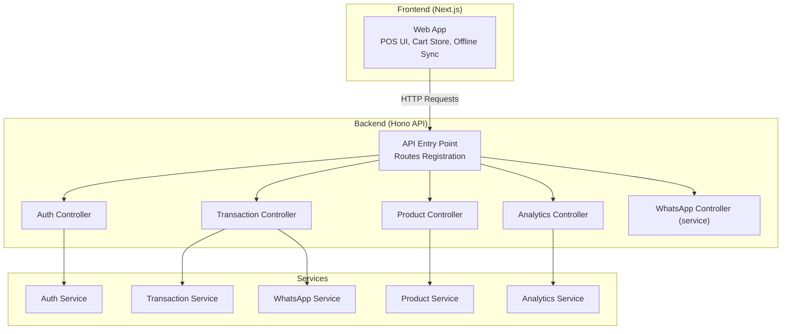
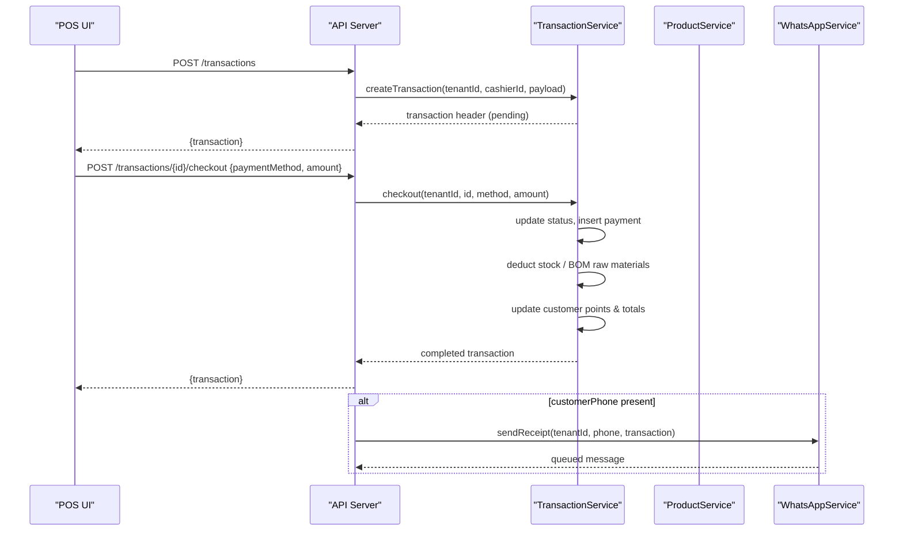
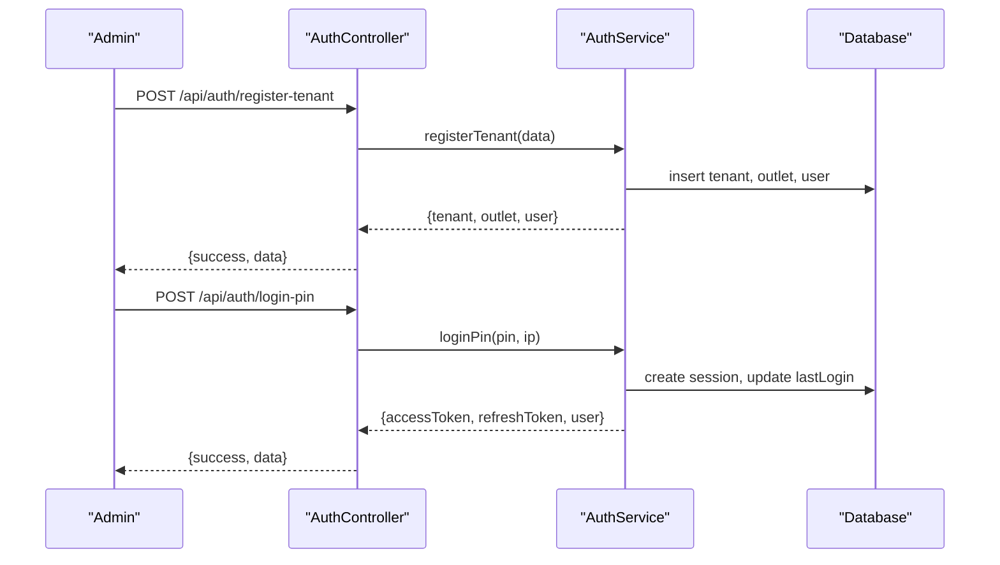
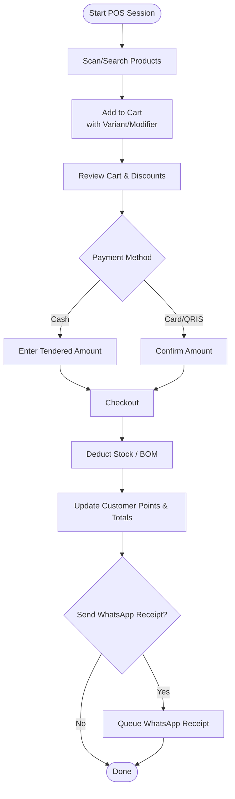
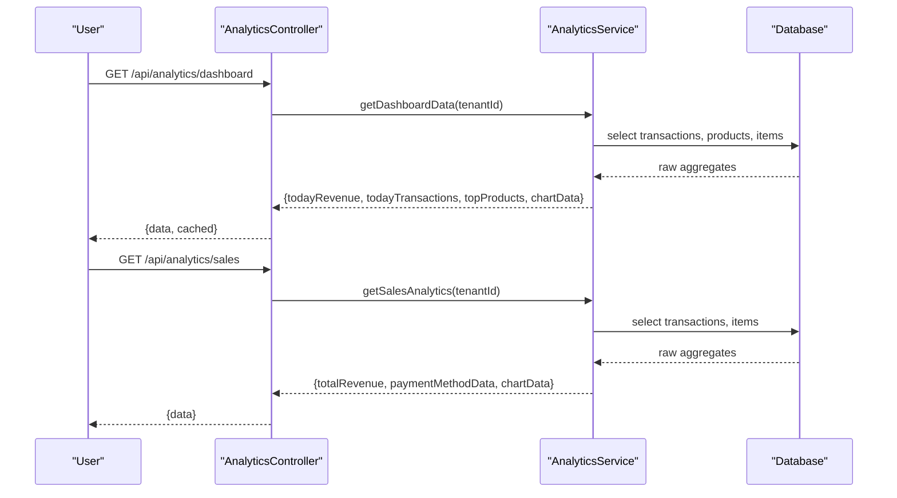
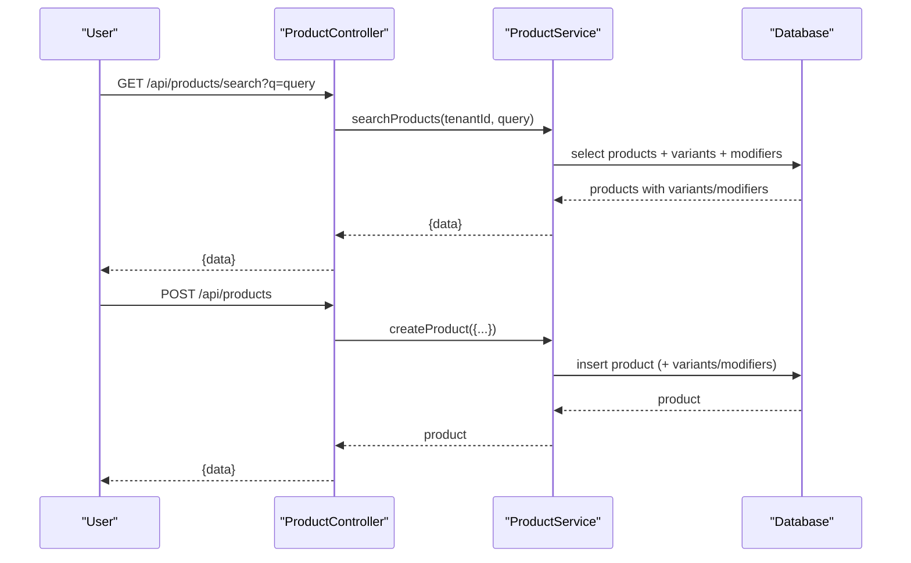
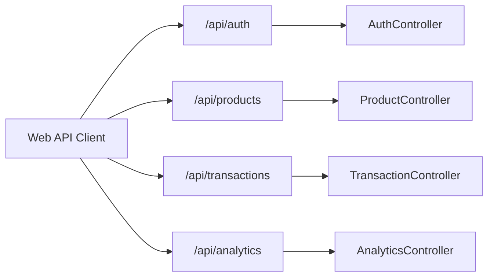

# Core Modules & Features

<cite>
**Referenced Files in This Document**
- [apps/api/src/index.ts](file://apps/api/src/index.ts)
- [apps/api/src/controllers/auth.controller.ts](file://apps/api/src/controllers/auth.controller.ts)
- [apps/api/src/services/auth.service.ts](file://apps/api/src/services/auth.service.ts)
- [apps/api/src/routes/auth.routes.ts](file://apps/api/src/routes/auth.routes.ts)
- [apps/web/src/lib/api.ts](file://apps/web/src/lib/api.ts)
- [apps/web/src/store/useCartStore.ts](file://apps/web/src/store/useCartStore.ts)
- [apps/web/src/components/pos/CartPanel.tsx](file://apps/web/src/components/pos/CartPanel.tsx)
- [apps/web/src/components/pos/POSHeaderActions.tsx](file://apps/web/src/components/pos/POSHeaderActions.tsx)
- [apps/api/src/controllers/transaction.controller.ts](file://apps/api/src/controllers/transaction.controller.ts)
- [apps/api/src/services/transaction.service.ts](file://apps/api/src/services/transaction.service.ts)
- [apps/api/src/routes/transaction.routes.ts](file://apps/api/src/routes/transaction.routes.ts)
- [apps/api/src/controllers/analytics.controller.ts](file://apps/api/src/controllers/analytics.controller.ts)
- [apps/api/src/services/analytics.service.ts](file://apps/api/src/services/analytics.service.ts)
- [apps/api/src/controllers/product.controller.ts](file://apps/api/src/controllers/product.controller.ts)
- [apps/api/src/services/product.service.ts](file://apps/api/src/services/product.service.ts)
- [apps/api/src/routes/product.routes.ts](file://apps/api/src/routes/product.routes.ts)
- [apps/api/src/services/whatsapp.service.ts](file://apps/api/src/services/whatsapp.service.ts)
</cite>

## Table of Contents
1. [Introduction](#introduction)
2. [Project Structure](#project-structure)
3. [Core Components](#core-components)
4. [Architecture Overview](#architecture-overview)
5. [Detailed Component Analysis](#detailed-component-analysis)
6. [Dependency Analysis](#dependency-analysis)
7. [Performance Considerations](#performance-considerations)
8. [Troubleshooting Guide](#troubleshooting-guide)
9. [Conclusion](#conclusion)

## Introduction
This document presents the ARHAT POS core modules and features, derived from the repository’s backend (Hono API) and frontend (Next.js web app). It organizes functionality into major modules and describes key features, user workflows, and integration points across modules. The goal is to help both technical and non-technical stakeholders understand how the system works end-to-end.

## Project Structure
The system comprises:
- Backend API built with Hono, exposing REST endpoints for authentication, POS transactions, analytics, product management, and more.
- Frontend Next.js application with a POS interface, cart management, offline support, and integration with the backend API.
- Shared client library for API calls and offline synchronization.

**Diagram sources**
- [apps/api/src/index.ts:80-92](file://apps/api/src/index.ts#L80-L92)
- [apps/api/src/controllers/auth.controller.ts:25-90](file://apps/api/src/controllers/auth.controller.ts#L25-L90)
- [apps/api/src/controllers/transaction.controller.ts:5-141](file://apps/api/src/controllers/transaction.controller.ts#L5-L141)
- [apps/api/src/controllers/product.controller.ts:4-72](file://apps/api/src/controllers/product.controller.ts#L4-L72)
- [apps/api/src/controllers/analytics.controller.ts:5-62](file://apps/api/src/controllers/analytics.controller.ts#L5-L62)
- [apps/api/src/services/auth.service.ts:9-254](file://apps/api/src/services/auth.service.ts#L9-L254)
- [apps/api/src/services/transaction.service.ts:15-414](file://apps/api/src/services/transaction.service.ts#L15-L414)
- [apps/api/src/services/product.service.ts:5-139](file://apps/api/src/services/product.service.ts#L5-L139)
- [apps/api/src/services/analytics.service.ts:5-383](file://apps/api/src/services/analytics.service.ts#L5-L383)
- [apps/api/src/services/whatsapp.service.ts:5-127](file://apps/api/src/services/whatsapp.service.ts#L5-L127)

**Section sources**
- [apps/api/src/index.ts:1-99](file://apps/api/src/index.ts#L1-L99)

## Core Components
- Authentication & User Management
  - Tenant and user registration, login via email/password or PIN, session management, JWT tokens, and user CRUD.
- Point of Sale (POS)
  - Cart management, checkout, payment processing, transaction hold/resume/void/refund, offline sync, and receipt generation.
- Dashboard Analytics
  - Real-time dashboard metrics, sales analytics, product analytics, profit and loss, and customer analytics.
- Product Management
  - Product catalog, variants, modifiers, pricing, barcode/SKU search, and CRUD operations.
- Inventory Management
  - Stock movements, BOM (raw materials), adjustments, transfers, and outlet-level stock tracking.
- Customer Relationship Management
  - Customer profiles, purchase history, and communication via WhatsApp notifications.
- WhatsApp Integration
  - Automated receipts, low stock alerts, and generic notifications.
- Reporting & Analytics
  - Sales reports, product performance, profitability, and customer insights.
- Multi Outlet Management
  - Outlets, stock movements, adjustments, and transfers between locations.
- Shift Management
  - Opening/closing shifts, cash handling, and shift records.

**Section sources**
- [apps/api/src/controllers/auth.controller.ts:25-90](file://apps/api/src/controllers/auth.controller.ts#L25-L90)
- [apps/api/src/services/auth.service.ts:9-254](file://apps/api/src/services/auth.service.ts#L9-L254)
- [apps/api/src/controllers/transaction.controller.ts:5-141](file://apps/api/src/controllers/transaction.controller.ts#L5-L141)
- [apps/api/src/services/transaction.service.ts:15-414](file://apps/api/src/services/transaction.service.ts#L15-L414)
- [apps/web/src/components/pos/CartPanel.tsx:12-497](file://apps/web/src/components/pos/CartPanel.tsx#L12-L497)
- [apps/web/src/store/useCartStore.ts:45-70](file://apps/web/src/store/useCartStore.ts#L45-L70)
- [apps/api/src/controllers/analytics.controller.ts:5-62](file://apps/api/src/controllers/analytics.controller.ts#L5-L62)
- [apps/api/src/services/analytics.service.ts:5-383](file://apps/api/src/services/analytics.service.ts#L5-L383)
- [apps/api/src/controllers/product.controller.ts:4-72](file://apps/api/src/controllers/product.controller.ts#L4-L72)
- [apps/api/src/services/product.service.ts:5-139](file://apps/api/src/services/product.service.ts#L5-L139)
- [apps/api/src/services/whatsapp.service.ts:5-127](file://apps/api/src/services/whatsapp.service.ts#L5-L127)
- [apps/web/src/lib/api.ts:75-119](file://apps/web/src/lib/api.ts#L75-L119)

## Architecture Overview
The frontend interacts with the backend via REST endpoints. The backend orchestrates services for persistence, calculations, and integrations. Transactions are persisted atomically, stock is managed with BOM-aware logic, and WhatsApp receipts are queued and processed asynchronously.

**Diagram sources**
- [apps/web/src/components/pos/CartPanel.tsx:54-103](file://apps/web/src/components/pos/CartPanel.tsx#L54-L103)
- [apps/api/src/controllers/transaction.controller.ts:16-37](file://apps/api/src/controllers/transaction.controller.ts#L16-L37)
- [apps/api/src/services/transaction.service.ts:31-234](file://apps/api/src/services/transaction.service.ts#L31-L234)
- [apps/api/src/services/whatsapp.service.ts:9-36](file://apps/api/src/services/whatsapp.service.ts#L9-L36)

## Detailed Component Analysis

### Authentication & User Management
- Key functionalities
  - Tenant registration (creates tenant, HQ outlet, admin user).
  - User registration (verifies email via token).
  - Login (email/password or PIN), session creation, refresh tokens, and last login updates.
  - Role-based access control enforced by route middleware.
- User workflows
  - New business owner registers tenant → receives admin account and default outlet.
  - Staff registration under tenant with role assignment.
  - Login via PIN for quick access; JWT bearer token used for protected routes.
- Integration points
  - Auth routes mounted under /api/auth.
  - Protected routes enforced by auth middleware.
  - Sessions stored for refresh token lifecycle.

**Diagram sources**
- [apps/api/src/controllers/auth.controller.ts:25-90](file://apps/api/src/controllers/auth.controller.ts#L25-L90)
- [apps/api/src/services/auth.service.ts:15-83](file://apps/api/src/services/auth.service.ts#L15-L83)
- [apps/api/src/services/auth.service.ts:179-209](file://apps/api/src/services/auth.service.ts#L179-L209)
- [apps/api/src/routes/auth.routes.ts:7-15](file://apps/api/src/routes/auth.routes.ts#L7-L15)

**Section sources**
- [apps/api/src/controllers/auth.controller.ts:25-90](file://apps/api/src/controllers/auth.controller.ts#L25-L90)
- [apps/api/src/services/auth.service.ts:9-254](file://apps/api/src/services/auth.service.ts#L9-L254)
- [apps/api/src/routes/auth.routes.ts:1-18](file://apps/api/src/routes/auth.routes.ts#L1-L18)

### Point of Sale (POS)
- Key functionalities
  - Cart management (add/remove/update quantity/discount, variants/modifiers).
  - Checkout (cash/card/qris), payment recording, stock deduction, BOM handling, customer points.
  - Transaction hold/resume/void/refund.
  - Offline sync with queueing and simulated success response.
  - Receipt generation and optional WhatsApp receipt delivery.
- User workflows
  - Scan/select products, configure variants/modifiers, apply discounts, choose payment method.
  - Cash: specify tendered amount, see change.
  - Non-cash: confirm amount, then finalize checkout.
  - Hold bill for later completion; resume later.
- Integration points
  - Frontend uses CartPanel and useCartStore to orchestrate UI and state.
  - API endpoints for create/checkout/held/resume/refund/void.
  - WhatsApp service triggered after checkout when customer phone is provided.

**Diagram sources**
- [apps/web/src/components/pos/CartPanel.tsx:46-103](file://apps/web/src/components/pos/CartPanel.tsx#L46-L103)
- [apps/web/src/store/useCartStore.ts:72-183](file://apps/web/src/store/useCartStore.ts#L72-L183)
- [apps/api/src/controllers/transaction.controller.ts:16-37](file://apps/api/src/controllers/transaction.controller.ts#L16-L37)
- [apps/api/src/services/transaction.service.ts:107-234](file://apps/api/src/services/transaction.service.ts#L107-L234)
- [apps/api/src/services/whatsapp.service.ts:9-36](file://apps/api/src/services/whatsapp.service.ts#L9-L36)

**Section sources**
- [apps/web/src/components/pos/CartPanel.tsx:12-497](file://apps/web/src/components/pos/CartPanel.tsx#L12-L497)
- [apps/web/src/store/useCartStore.ts:45-70](file://apps/web/src/store/useCartStore.ts#L45-L70)
- [apps/api/src/controllers/transaction.controller.ts:5-141](file://apps/api/src/controllers/transaction.controller.ts#L5-L141)
- [apps/api/src/services/transaction.service.ts:15-414](file://apps/api/src/services/transaction.service.ts#L15-L414)
- [apps/web/src/lib/api.ts:75-119](file://apps/web/src/lib/api.ts#L75-L119)

### Dashboard Analytics
- Key functionalities
  - Today’s revenue and transaction counts.
  - Active products and top-selling products.
  - 7-day revenue chart.
  - Sales analytics (revenue, transactions, payment methods, 30-day chart).
  - Product analytics (top by quantity/revenue, slow-moving).
  - Profit and loss (COGS, revenue, margin, daily profit).
  - Customer analytics (total/new/top customers).
- User workflows
  - View dashboard summary cards and charts.
  - Drill down into sales/product/customer analytics.
- Integration points
  - Analytics controller caches dashboard data for short TTL.
  - Services aggregate data from transactions, items, products, and customers.

**Diagram sources**
- [apps/api/src/controllers/analytics.controller.ts:6-61](file://apps/api/src/controllers/analytics.controller.ts#L6-L61)
- [apps/api/src/services/analytics.service.ts:6-129](file://apps/api/src/services/analytics.service.ts#L6-L129)
- [apps/api/src/services/analytics.service.ts:131-200](file://apps/api/src/services/analytics.service.ts#L131-L200)
- [apps/api/src/services/analytics.service.ts:202-258](file://apps/api/src/services/analytics.service.ts#L202-L258)
- [apps/api/src/services/analytics.service.ts:260-331](file://apps/api/src/services/analytics.service.ts#L260-L331)
- [apps/api/src/services/analytics.service.ts:333-381](file://apps/api/src/services/analytics.service.ts#L333-L381)

**Section sources**
- [apps/api/src/controllers/analytics.controller.ts:5-62](file://apps/api/src/controllers/analytics.controller.ts#L5-L62)
- [apps/api/src/services/analytics.service.ts:5-383](file://apps/api/src/services/analytics.service.ts#L5-L383)

### Product Management
- Key functionalities
  - Search by name, SKU, or barcode.
  - CRUD operations with variants and modifiers.
  - Pricing and stock normalization.
- User workflows
  - Browse products, edit SKUs/prices/stock, manage variants/modifiers.
- Integration points
  - Product controller delegates to ProductService.
  - Search joins variants and modifiers for enriched results.

**Diagram sources**
- [apps/api/src/controllers/product.controller.ts:5-41](file://apps/api/src/controllers/product.controller.ts#L5-L41)
- [apps/api/src/services/product.service.ts:36-60](file://apps/api/src/services/product.service.ts#L36-L60)
- [apps/api/src/services/product.service.ts:88-124](file://apps/api/src/services/product.service.ts#L88-L124)

**Section sources**
- [apps/api/src/controllers/product.controller.ts:4-72](file://apps/api/src/controllers/product.controller.ts#L4-L72)
- [apps/api/src/services/product.service.ts:5-139](file://apps/api/src/services/product.service.ts#L5-L139)

### Inventory Management
- Key functionalities
  - Stock movements (in/out) linked to transactions.
  - BOM (Bill of Materials) for raw materials consumption.
  - Adjustments, transfers, and outlet-level stock visibility.
- User workflows
  - Record stock in/out, adjust stock, transfer between outlets, and track BOM usage.
- Integration points
  - TransactionService handles stock deduction and BOM logic during checkout.
  - Raw materials and BOM APIs are exposed in the client library.

**Section sources**
- [apps/api/src/services/transaction.service.ts:139-190](file://apps/api/src/services/transaction.service.ts#L139-L190)
- [apps/web/src/lib/api.ts:258-313](file://apps/web/src/lib/api.ts#L258-L313)

### Customer Relationship Management
- Key functionalities
  - Customer profiles, purchase history retrieval, and notifications.
  - WhatsApp notifications to customers.
- User workflows
  - Select customer during checkout, redeem points, receive receipts via WhatsApp.
- Integration points
  - Customer search and CRUD via client library.
  - Notification sending via WhatsApp service.

**Section sources**
- [apps/web/src/lib/api.ts:418-480](file://apps/web/src/lib/api.ts#L418-L480)
- [apps/api/src/services/whatsapp.service.ts:62-76](file://apps/api/src/services/whatsapp.service.ts#L62-L76)

### WhatsApp Integration
- Key functionalities
  - Automated receipt sending after checkout.
  - Low stock alerts and generic notifications.
  - Pending queue processing.
- User workflows
  - Enable “Send WhatsApp Receipt” during checkout; receipts are queued and sent.
- Integration points
  - TransactionController triggers WhatsAppService upon successful checkout when customer phone is provided.

**Section sources**
- [apps/api/src/controllers/transaction.controller.ts:27-31](file://apps/api/src/controllers/transaction.controller.ts#L27-L31)
- [apps/api/src/services/whatsapp.service.ts:9-36](file://apps/api/src/services/whatsapp.service.ts#L9-L36)
- [apps/api/src/services/whatsapp.service.ts:110-125](file://apps/api/src/services/whatsapp.service.ts#L110-L125)

### Reporting & Analytics
- Key functionalities
  - Sales reports, product performance, profitability, and customer insights.
- User workflows
  - Load analytics dashboards and exportable views.
- Integration points
  - Dedicated endpoints for sales, product, profit/loss, and customer analytics.

**Section sources**
- [apps/api/src/controllers/analytics.controller.ts:23-61](file://apps/api/src/controllers/analytics.controller.ts#L23-L61)
- [apps/api/src/services/analytics.service.ts:131-381](file://apps/api/src/services/analytics.service.ts#L131-L381)
- [apps/web/src/lib/api.ts:486-520](file://apps/web/src/lib/api.ts#L486-L520)

### Multi Outlet Management
- Key functionalities
  - Outlets, stock movements, adjustments, and inter-outlet transfers.
- User workflows
  - Manage stock per outlet, reconcile discrepancies, and transfer inventory.
- Integration points
  - Client library exposes outlet and inventory endpoints.

**Section sources**
- [apps/web/src/lib/api.ts:247-412](file://apps/web/src/lib/api.ts#L247-L412)

### Shift Management
- Key functionalities
  - Open/close shifts with starting/ending cash, view shifts, and current shift.
- User workflows
  - Open shift at start of workday, record ending cash, and reconcile at close.
- Integration points
  - Client library exposes shift endpoints.

**Section sources**
- [apps/web/src/lib/api.ts:526-559](file://apps/web/src/lib/api.ts#L526-L559)

## Dependency Analysis
- Route-to-controller mapping
  - Authentication routes under /api/auth.
  - Product routes under /api/products.
  - Transaction routes under /api/transactions.
  - Analytics routes under /api/analytics.
  - Additional modules (inventory, customers, shifts, raw materials, settings, users, upload, whatsapp) are mounted similarly.
- Middleware and CORS
  - CORS configured per allowed origins.
  - Logger and error handler applied globally.
- Frontend-to-backend contracts
  - Web app uses a typed API client with offline fallback and cookie-based auth.

**Diagram sources**
- [apps/api/src/index.ts:80-92](file://apps/api/src/index.ts#L80-L92)
- [apps/api/src/routes/auth.routes.ts:1-18](file://apps/api/src/routes/auth.routes.ts#L1-L18)
- [apps/api/src/routes/product.routes.ts:1-19](file://apps/api/src/routes/product.routes.ts#L1-L19)
- [apps/api/src/routes/transaction.routes.ts:1-23](file://apps/api/src/routes/transaction.routes.ts#L1-L23)
- [apps/api/src/controllers/analytics.controller.ts:5-62](file://apps/api/src/controllers/analytics.controller.ts#L5-L62)

**Section sources**
- [apps/api/src/index.ts:19-36](file://apps/api/src/index.ts#L19-L36)
- [apps/api/src/index.ts:80-92](file://apps/api/src/index.ts#L80-L92)

## Performance Considerations
- Caching
  - Dashboard analytics are cached in-memory for short intervals to reduce DB load.
- Batch processing
  - WhatsApp pending queue can process a batch of messages periodically.
- Offline-first UX
  - Frontend queues transactions when offline and simulates success while deferring real sync.

**Section sources**
- [apps/api/src/controllers/analytics.controller.ts:9-17](file://apps/api/src/controllers/analytics.controller.ts#L9-L17)
- [apps/api/src/services/whatsapp.service.ts:110-125](file://apps/api/src/services/whatsapp.service.ts#L110-L125)
- [apps/web/src/lib/api.ts:99-118](file://apps/web/src/lib/api.ts#L99-L118)

## Troubleshooting Guide
- Authentication failures
  - Invalid credentials or unverified email lead to explicit errors; ensure email verification and correct password/pin.
- Transaction errors
  - Insufficient stock or invalid transaction state can cause failures; verify product stock and BOM entries.
  - Offline mode queues transactions; check queue and retry.
- Analytics errors
  - If analytics fail, verify tenant context and permissions; cached dashboard data may be stale.
- WhatsApp delivery
  - Pending messages are logged; inspect logs and retry processing.

**Section sources**
- [apps/api/src/services/auth.service.ts:140-177](file://apps/api/src/services/auth.service.ts#L140-L177)
- [apps/api/src/services/transaction.service.ts:139-190](file://apps/api/src/services/transaction.service.ts#L139-L190)
- [apps/web/src/lib/api.ts:99-118](file://apps/web/src/lib/api.ts#L99-L118)
- [apps/api/src/services/whatsapp.service.ts:81-105](file://apps/api/src/services/whatsapp.service.ts#L81-L105)

## Conclusion
ARHAT POS integrates a modern frontend with a modular backend to deliver a complete retail solution. The system emphasizes robust POS workflows, insightful analytics, and flexible integrations (including WhatsApp). The documented modules and workflows provide a clear blueprint for extending functionality, adding features, and maintaining reliability across tenants and outlets.