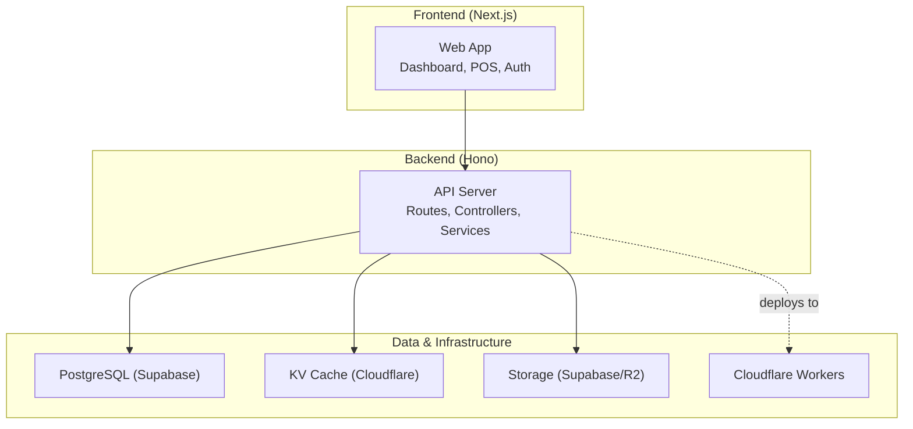
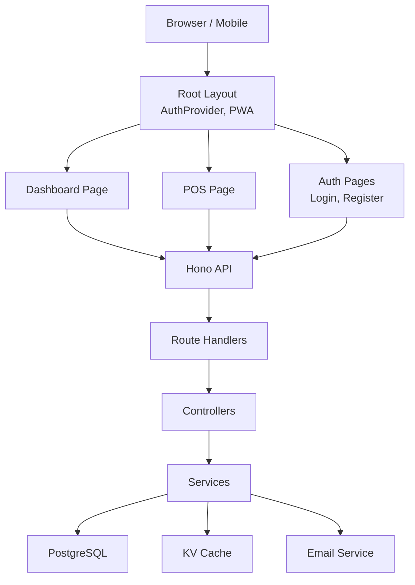
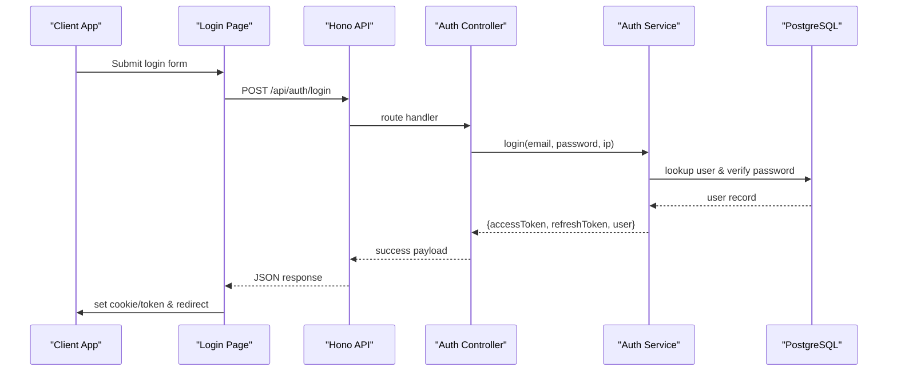
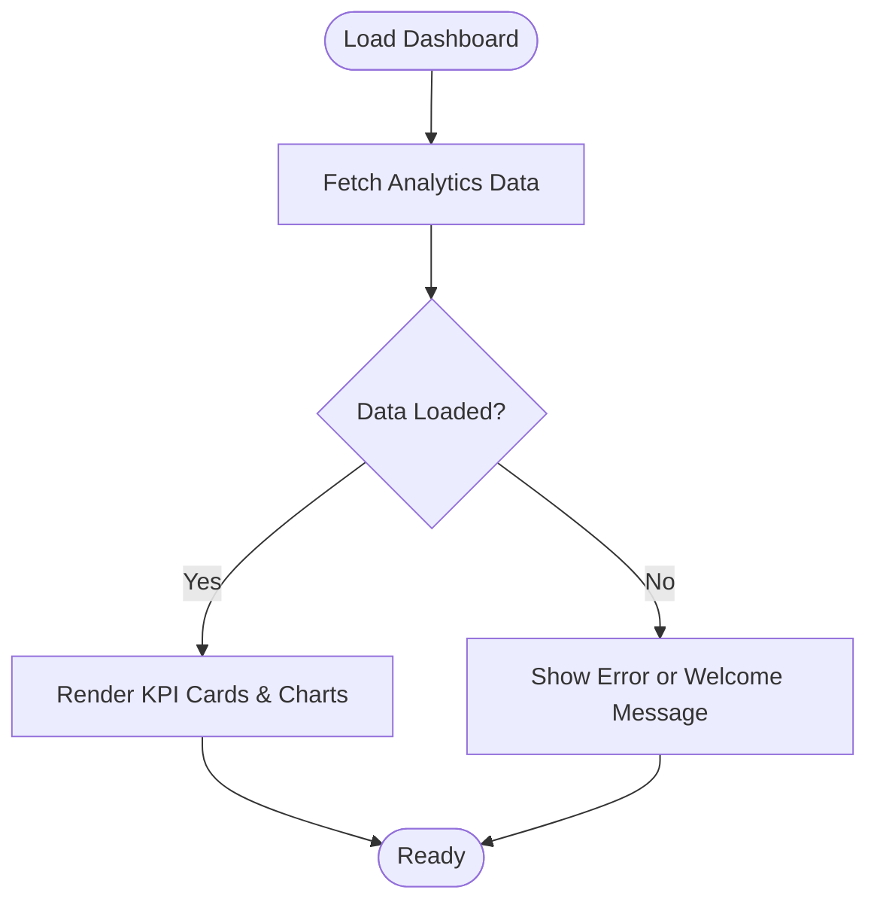
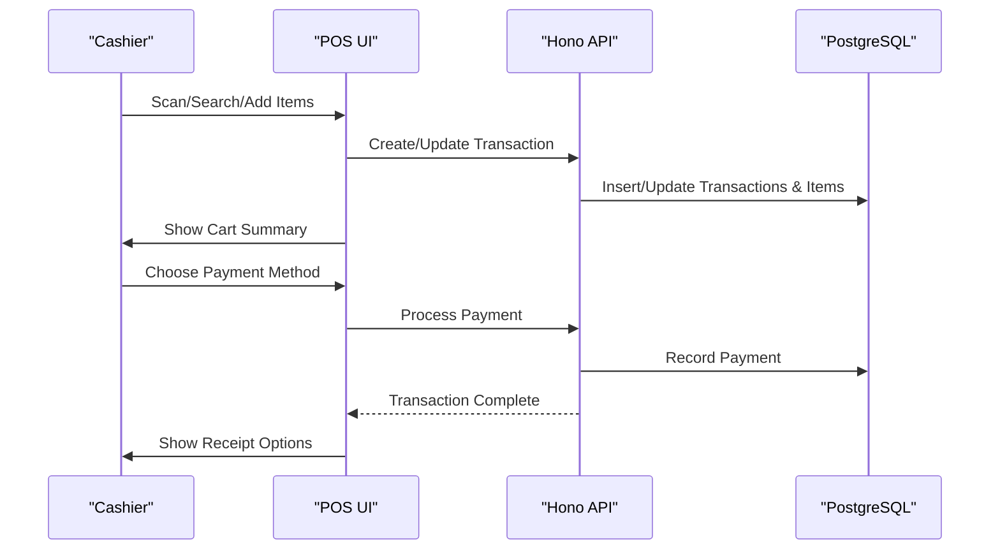
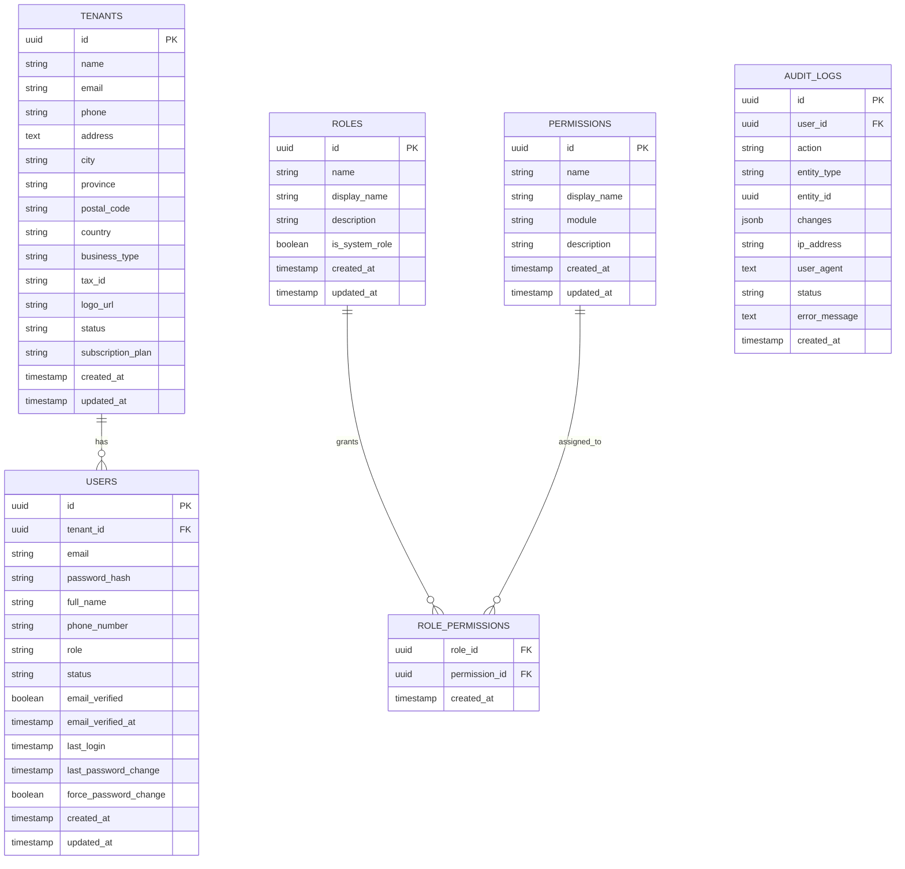
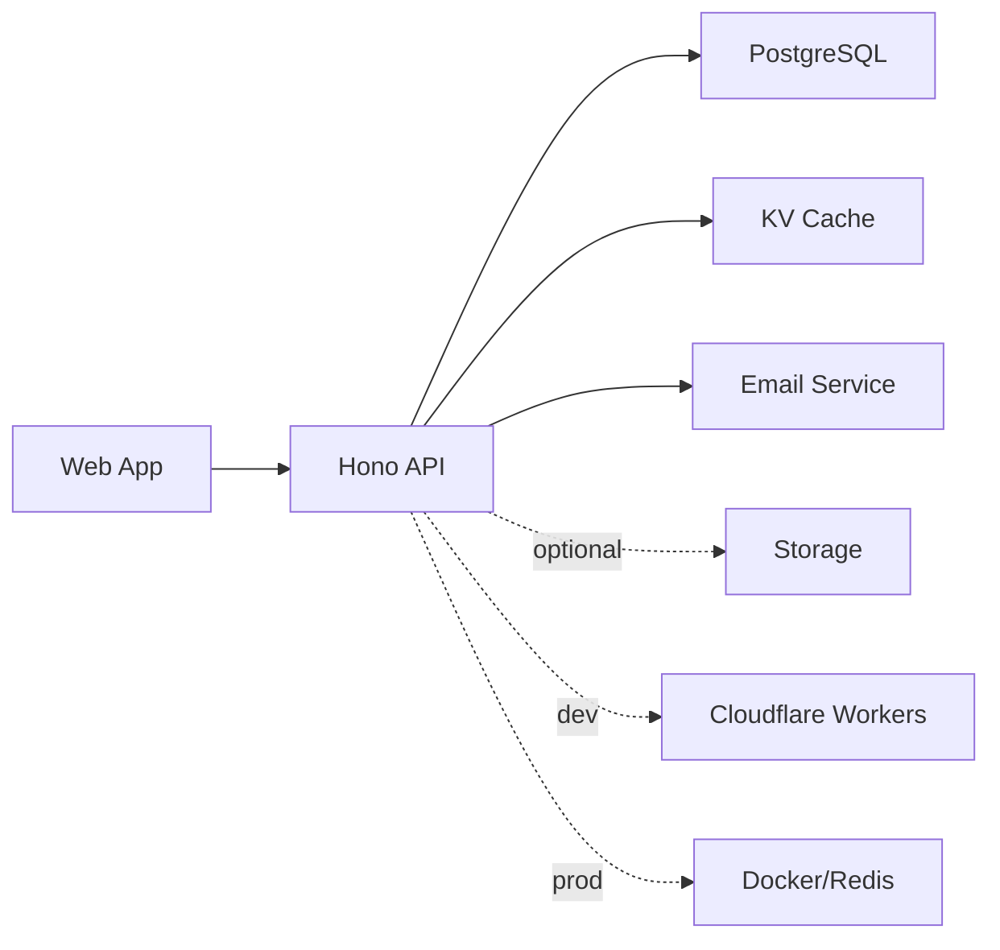

# Introduction & Vision

<cite>
**Referenced Files in This Document**
- [README.md](file://README.md)
- [PRD.md](file://PRD/PRD.md)
- [PHASE1_TEMPLATES.md](file://PRD/PHASE1_TEMPLATES.md)
- [apps/api/src/index.ts](file://apps/api/src/index.ts)
- [apps/api/src/controllers/auth.controller.ts](file://apps/api/src/controllers/auth.controller.ts)
- [apps/api/src/services/auth.service.ts](file://apps/api/src/services/auth.service.ts)
- [apps/web/src/app/layout.tsx](file://apps/web/src/app/layout.tsx)
- [apps/web/src/app/auth/login/page.tsx](file://apps/web/src/app/auth/login/page.tsx)
- [apps/web/src/app/dashboard/page.tsx](file://apps/web/src/app/dashboard/page.tsx)
- [apps/web/src/components/layout/DashboardLayout.tsx](file://apps/web/src/components/layout/DashboardLayout.tsx)
- [apps/web/src/components/pos/POSHeaderActions.tsx](file://apps/web/src/components/pos/POSHeaderActions.tsx)
- [docker-compose.yml](file://docker-compose.yml)
- [apps/api/wrangler.toml](file://apps/api/wrangler.toml)
</cite>

## Table of Contents
1. [Introduction](#introduction)
2. [Project Structure](#project-structure)
3. [Core Components](#core-components)
4. [Architecture Overview](#architecture-overview)
5. [Detailed Component Analysis](#detailed-component-analysis)
6. [Dependency Analysis](#dependency-analysis)
7. [Performance Considerations](#performance-considerations)
8. [Troubleshooting Guide](#troubleshooting-guide)
9. [Conclusion](#conclusion)

## Introduction
ARHAT POS is a cloud-based Point of Sale (POS) and business management platform designed to digitally transform small and medium enterprises (UMKM) in Indonesia. Its mission is to modernize traditional business operations by replacing manual bookkeeping and inefficient inventory management with integrated, real-time systems that reduce operational costs, improve customer experience, and enable data-driven decision-making.

The vision is to become a simple, affordable, and scalable platform that empowers UMKM owners to gain full control over transactions, inventory, customers, and business performance—without juggling multiple disconnected applications. This aligns with Indonesia’s digital transformation goals, especially for UMKM that often lack access to modern, integrated solutions tailored to their needs.

Why this matters:
- Indonesia’s UMKM sector forms the backbone of the economy but frequently struggles with outdated processes.
- Many still rely on manual recording, leading to inefficiencies, errors, and limited visibility into business health.
- ARHAT POS bridges this gap by offering a unified, cloud-native platform that grows with the business—from a single store to multi-outlet operations.

Core value propositions:
- Reduce operational costs by automating routine tasks and minimizing human error.
- Improve customer experience through seamless transactions, digital receipts, and CRM capabilities.
- Enable data-driven decisions with real-time dashboards, sales analytics, and inventory insights.

Target audience:
- Small retailers (traditional stores, minimarkets, wholesalers)
- Food & beverage outlets (cafes, coffee shops, restaurants)
- Service providers (laundry, barbershop, salon, mechanic workshops)
- Multi-outlet businesses (franchises and chain stores)

**Section sources**
- [README.md:19-34](file://README.md#L19-L34)
- [README.md:37-66](file://README.md#L37-L66)
- [README.md:69-95](file://README.md#L69-L95)
- [PRD.md:28-51](file://PRD/PRD.md#L28-L51)

## Project Structure
At a high level, ARHAT POS consists of:
- A frontend built with Next.js (React) for the admin dashboard, POS interface, and user-facing features.
- A backend API powered by Hono (Cloudflare Workers) for authentication, business logic, and integrations.
- A PostgreSQL database (via Supabase in development) for persistent storage.
- Optional deployment targets including Vercel and Cloudflare Workers for rapid scaling.

**Diagram sources**
- [apps/api/src/index.ts:17-92](file://apps/api/src/index.ts#L17-L92)
- [apps/web/src/app/layout.tsx:17-31](file://apps/web/src/app/layout.tsx#L17-L31)
- [apps/api/wrangler.toml:1-10](file://apps/api/wrangler.toml#L1-10)
- [docker-compose.yml:4-24](file://docker-compose.yml#L4-L24)

**Section sources**
- [apps/api/src/index.ts:17-92](file://apps/api/src/index.ts#L17-L92)
- [apps/web/src/app/layout.tsx:17-31](file://apps/web/src/app/layout.tsx#L17-L31)
- [docker-compose.yml:4-24](file://docker-compose.yml#L4-L24)
- [apps/api/wrangler.toml:1-10](file://apps/api/wrangler.toml#L1-10)

## Core Components
- Authentication & User Management: Handles registration, email verification, login, password reset, and role-based access control (RBAC).
- Dashboard Analytics: Provides real-time KPIs, charts, and top product insights.
- Point of Sale (POS): Supports product search, barcode scanning, cart management, discounts, taxes, multiple payment methods, transaction hold/resume, and digital receipts.
- Product & Inventory Management: Manages products, variants, categories, stock movements, low stock alerts, stock opname, transfers, and expiry monitoring.
- CRM & Customer Management: Maintains customer profiles, purchase history, segmentation, and loyalty programs.
- Reporting & Analytics: Generates sales, product, and customer reports with export options.
- WhatsApp Integration: Sends digital receipts and notifications to customers.
- Multi-Outlet & Subscription Management: Enables centralized management across multiple locations and tiered plans.

These components collectively address the core problems UMKM face: manual transactions, poor inventory visibility, weak customer retention, and time-consuming reporting.

**Section sources**
- [README.md:97-372](file://README.md#L97-L372)
- [PRD.md:28-70](file://PRD/PRD.md#L28-L70)

## Architecture Overview
ARHAT POS follows a cloud-first, microservice-friendly backend built on Hono and hosted on Cloudflare Workers. The frontend is a modern Next.js application with offline-ready capabilities and PWA support. Data is persisted in PostgreSQL, with caching via KV and storage via Supabase or R2.

**Diagram sources**
- [apps/web/src/app/layout.tsx:41-59](file://apps/web/src/app/layout.tsx#L41-L59)
- [apps/web/src/app/dashboard/page.tsx:10-26](file://apps/web/src/app/dashboard/page.tsx#L10-L26)
- [apps/web/src/app/auth/login/page.tsx:10-41](file://apps/web/src/app/auth/login/page.tsx#L10-L41)
- [apps/api/src/index.ts:80-92](file://apps/api/src/index.ts#L80-L92)

**Section sources**
- [apps/api/src/index.ts:17-92](file://apps/api/src/index.ts#L17-L92)
- [apps/web/src/app/layout.tsx:41-59](file://apps/web/src/app/layout.tsx#L41-L59)

## Detailed Component Analysis

### Authentication & User Management
ARHAT POS implements secure authentication with JWT access/refresh tokens, email verification, and PIN-based login for POS cashiers. The backend enforces RBAC and session management, while the frontend integrates with the auth context and handles redirects and UI feedback.

**Diagram sources**
- [apps/web/src/app/auth/login/page.tsx:17-41](file://apps/web/src/app/auth/login/page.tsx#L17-L41)
- [apps/api/src/controllers/auth.controller.ts:56-71](file://apps/api/src/controllers/auth.controller.ts#L56-L71)
- [apps/api/src/services/auth.service.ts:140-177](file://apps/api/src/services/auth.service.ts#L140-L177)

**Section sources**
- [apps/web/src/app/auth/login/page.tsx:10-41](file://apps/web/src/app/auth/login/page.tsx#L10-L41)
- [apps/api/src/controllers/auth.controller.ts:25-90](file://apps/api/src/controllers/auth.controller.ts#L25-L90)
- [apps/api/src/services/auth.service.ts:9-254](file://apps/api/src/services/auth.service.ts#L9-L254)

### Dashboard Analytics
The dashboard aggregates real-time metrics and visualizes revenue trends and top products. It demonstrates the platform’s ability to transform raw transaction data into actionable insights for decision-making.

**Diagram sources**
- [apps/web/src/app/dashboard/page.tsx:14-26](file://apps/web/src/app/dashboard/page.tsx#L14-L26)
- [apps/web/src/app/dashboard/page.tsx:72-161](file://apps/web/src/app/dashboard/page.tsx#L72-L161)

**Section sources**
- [apps/web/src/app/dashboard/page.tsx:10-166](file://apps/web/src/app/dashboard/page.tsx#L10-L166)

### POS Operations
The POS supports end-to-end transaction processing, including product search, cart management, discounts, taxes, multiple payment methods, and digital receipts. Offline capability is indicated by network status indicators in the POS header.

**Diagram sources**
- [apps/web/src/components/pos/POSHeaderActions.tsx:8-27](file://apps/web/src/components/pos/POSHeaderActions.tsx#L8-L27)
- [apps/api/src/index.ts:80-92](file://apps/api/src/index.ts#L80-L92)

**Section sources**
- [apps/web/src/components/pos/POSHeaderActions.tsx:1-67](file://apps/web/src/components/pos/POSHeaderActions.tsx#L1-L67)
- [apps/api/src/index.ts:17-92](file://apps/api/src/index.ts#L17-L92)

### Database Schema (Authentication & RBAC)
The authentication and RBAC foundation is established early, with tenants, users, roles, permissions, and audit logging. This enables multi-tenant support and granular access control across UMKM environments.

**Diagram sources**
- [PHASE1_TEMPLATES.md:22-196](file://PRD/PHASE1_TEMPLATES.md#L22-L196)

**Section sources**
- [PHASE1_TEMPLATES.md:13-244](file://PRD/PHASE1_TEMPLATES.md#L13-L244)

## Dependency Analysis
ARHAT POS exhibits clean separation of concerns:
- Frontend depends on the backend API for all business operations.
- Backend depends on PostgreSQL for persistence, KV for caching, and external services for email and storage.
- Development and production targets differ slightly (Cloudflare Workers vs. Docker/Redis), ensuring scalability and flexibility.

**Diagram sources**
- [apps/api/src/index.ts:17-92](file://apps/api/src/index.ts#L17-L92)
- [docker-compose.yml:4-24](file://docker-compose.yml#L4-L24)
- [apps/api/wrangler.toml:1-10](file://apps/api/wrangler.toml#L1-10)

**Section sources**
- [apps/api/src/index.ts:17-92](file://apps/api/src/index.ts#L17-L92)
- [docker-compose.yml:4-24](file://docker-compose.yml#L4-L24)
- [apps/api/wrangler.toml:1-10](file://apps/api/wrangler.toml#L1-10)

## Performance Considerations
- Response time targets and real-time updates are emphasized in the documentation.
- The frontend leverages chart libraries and responsive layouts for fast, usable experiences.
- Backend uses optimized queries and caching to maintain performance under load.

[No sources needed since this section provides general guidance]

## Troubleshooting Guide
Common areas to check:
- Authentication failures: verify email verification, password policies, and rate-limiting behavior.
- Network connectivity: POS offline indicator helps diagnose local connectivity issues.
- Dashboard analytics: confirm API availability and data freshness.
- Database connectivity: ensure proper credentials and migrations are applied.

**Section sources**
- [apps/web/src/components/pos/POSHeaderActions.tsx:13-27](file://apps/web/src/components/pos/POSHeaderActions.tsx#L13-L27)
- [apps/api/src/services/auth.service.ts:140-177](file://apps/api/src/services/auth.service.ts#L140-L177)

## Conclusion
ARHAT POS delivers a practical, scalable solution for Indonesia’s UMKM by digitizing core business functions—POS, inventory, CRM, reporting, and communication—into a unified, cloud-native platform. Its mission and vision align with the urgent need to modernize small businesses, reduce operational friction, and empower data-driven growth. By focusing on simplicity, affordability, and scalability, ARHAT POS positions itself as a catalyst for Indonesia’s digital transformation journey.

[No sources needed since this section summarizes without analyzing specific files]