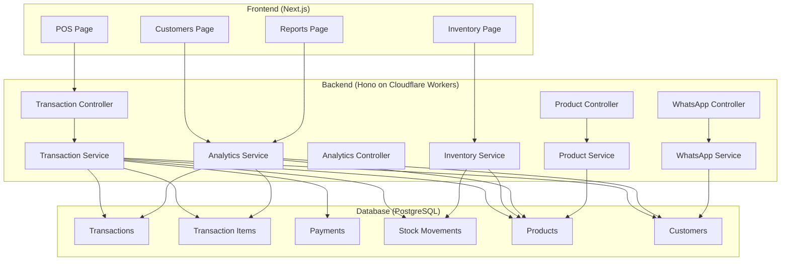
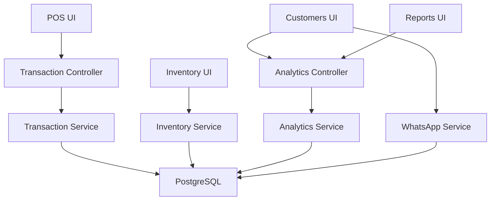
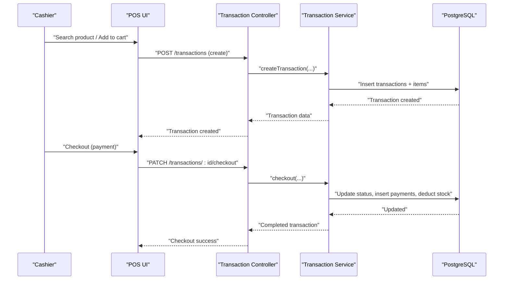
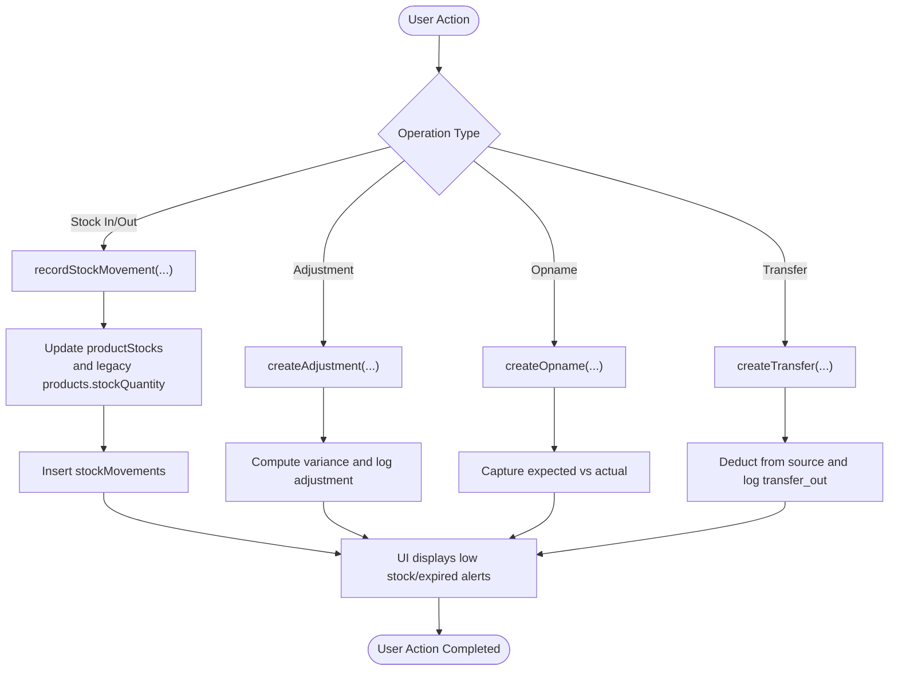
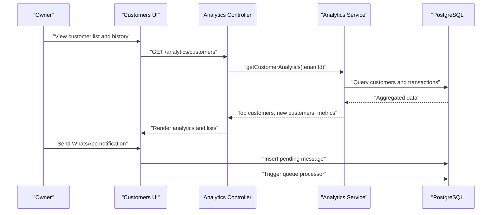
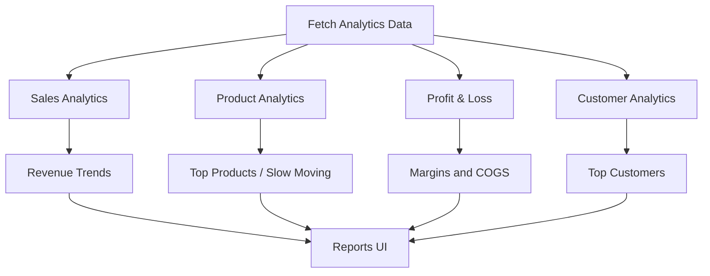
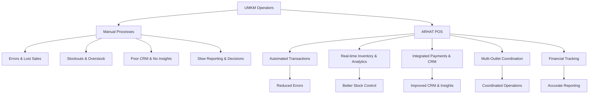
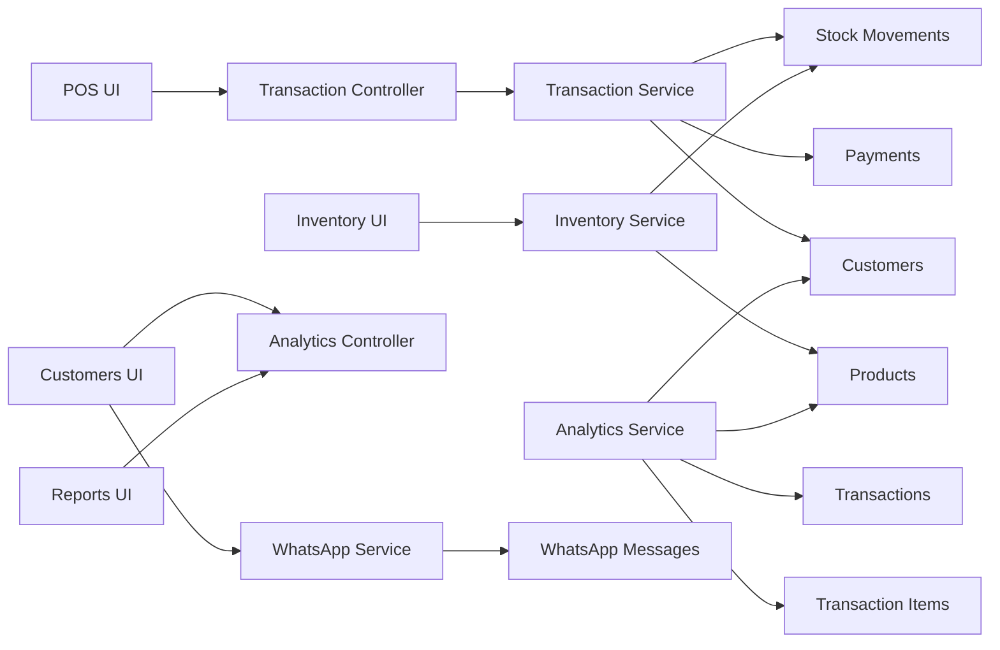

# Problem Statement

<cite>
**Referenced Files in This Document**
- [README.md](file://README.md)
- [PRD.md](file://PRD/PRD.md)
- [apps/web/src/app/pos/page.tsx](file://apps/web/src/app/pos/page.tsx)
- [apps/web/src/app/inventory/page.tsx](file://apps/web/src/app/inventory/page.tsx)
- [apps/web/src/app/customers/page.tsx](file://apps/web/src/app/customers/page.tsx)
- [apps/web/src/app/reports/page.tsx](file://apps/web/src/app/reports/page.tsx)
- [apps/api/src/controllers/transaction.controller.ts](file://apps/api/src/controllers/transaction.controller.ts)
- [apps/api/src/services/transaction.service.ts](file://apps/api/src/services/transaction.service.ts)
- [apps/api/src/controllers/analytics.controller.ts](file://apps/api/src/controllers/analytics.controller.ts)
- [apps/api/src/services/analytics.service.ts](file://apps/api/src/services/analytics.service.ts)
- [apps/api/src/controllers/product.controller.ts](file://apps/api/src/controllers/product.controller.ts)
- [apps/api/src/services/product.service.ts](file://apps/api/src/services/product.service.ts)
- [apps/api/src/services/inventory.service.ts](file://apps/api/src/services/inventory.service.ts)
- [apps/api/src/controllers/whatsapp.controller.ts](file://apps/api/src/controllers/whatsapp.controller.ts)
- [apps/api/src/services/whatsapp.service.ts](file://apps/api/src/services/whatsapp.service.ts)
</cite>

## Table of Contents
1. [Introduction](#introduction)
2. [Project Structure](#project-structure)
3. [Core Components](#core-components)
4. [Architecture Overview](#architecture-overview)
5. [Detailed Component Analysis](#detailed-component-analysis)
6. [Dependency Analysis](#dependency-analysis)
7. [Performance Considerations](#performance-considerations)
8. [Troubleshooting Guide](#troubleshooting-guide)
9. [Conclusion](#conclusion)
10. [Appendices](#appendices)

## Introduction
This document presents the ARHAT POS problem statement grounded in the current codebase and product vision. It outlines the critical operational challenges that Indonesian UMKM face—manual transaction recording, inventory mismanagement, lack of customer purchase history and preferences tracking, inefficient reporting, absence of real-time insights, weak CRM, limited modern payment integration, multi-outlet coordination gaps, and inadequate financial tracking. These pain points collectively hinder growth, reduce profitability, and erode competitiveness. The document synthesizes evidence from the repository’s front-end pages and backend services to illustrate how ARHAT POS is designed to address these systemic issues.

## Project Structure
The repository is a full-stack cloud-based POS and business management platform with:
- Frontend (Next.js): POS, inventory, CRM, reports, and supporting UI modules.
- Backend (Cloudflare Workers/Hono): Controllers, services, and analytics focused on transactions, inventory, CRM, and WhatsApp notifications.
- Database (PostgreSQL): Multi-tenant schema for users, products, transactions, inventory movements, customers, and analytics.

**Diagram sources**
- [apps/web/src/app/pos/page.tsx:12-134](file://apps/web/src/app/pos/page.tsx#L12-L134)
- [apps/web/src/app/inventory/page.tsx:13-194](file://apps/web/src/app/inventory/page.tsx#L13-L194)
- [apps/web/src/app/customers/page.tsx:27-499](file://apps/web/src/app/customers/page.tsx#L27-L499)
- [apps/web/src/app/reports/page.tsx:15-416](file://apps/web/src/app/reports/page.tsx#L15-L416)
- [apps/api/src/controllers/transaction.controller.ts:5-142](file://apps/api/src/controllers/transaction.controller.ts#L5-L142)
- [apps/api/src/services/transaction.service.ts:15-414](file://apps/api/src/services/transaction.service.ts#L15-L414)
- [apps/api/src/services/inventory.service.ts:11-366](file://apps/api/src/services/inventory.service.ts#L11-L366)
- [apps/api/src/controllers/analytics.controller.ts:5-63](file://apps/api/src/controllers/analytics.controller.ts#L5-L63)
- [apps/api/src/services/analytics.service.ts:5-383](file://apps/api/src/services/analytics.service.ts#L5-L383)
- [apps/api/src/controllers/product.controller.ts:4-73](file://apps/api/src/controllers/product.controller.ts#L4-L73)
- [apps/api/src/services/product.service.ts:5-139](file://apps/api/src/services/product.service.ts#L5-L139)
- [apps/api/src/controllers/whatsapp.controller.ts:4-71](file://apps/api/src/controllers/whatsapp.controller.ts#L4-L71)
- [apps/api/src/services/whatsapp.service.ts:5-127](file://apps/api/src/services/whatsapp.service.ts#L5-L127)

**Section sources**
- [README.md:1-574](file://README.md#L1-L574)
- [PRD.md:1-800](file://PRD/PRD.md#L1-L800)

## Core Components
- POS module: Handles product search, cart, discounts, taxes, multiple payment methods, transaction hold/resume, refunds, voids, and receipts.
- Inventory module: Manages stock in/out, adjustments, opname (physical count), transfers, and low/expiry alerts.
- CRM module: Maintains customer database, purchase history, segmentation, and WhatsApp notifications.
- Reporting and analytics: Provides dashboards, sales trends, product performance, customer insights, and profit/loss metrics.
- WhatsApp integration: Queues and sends receipts and notifications to customers.

These components directly address the core problems:
- Manual transaction recording errors and lost sales are mitigated by automated transaction creation, checkout, and payment records.
- Inventory mismanagement is addressed by real-time stock tracking, movement logs, and alerts.
- Customer purchase history and preferences are captured and surfaced via analytics and CRM.
- Reporting inefficiencies are resolved by built-in analytics and exportable reports.
- Real-time insights are enabled by caching and dashboard endpoints.
- Modern payment integration supports cash, QRIS, bank transfer, debit/credit cards, and e-wallets.
- Multi-outlet coordination is supported through centralized inventory and transfer workflows.
- Financial tracking is integrated via payment records and profit/loss analytics.

**Section sources**
- [apps/web/src/app/pos/page.tsx:12-134](file://apps/web/src/app/pos/page.tsx#L12-L134)
- [apps/web/src/app/inventory/page.tsx:13-194](file://apps/web/src/app/inventory/page.tsx#L13-L194)
- [apps/web/src/app/customers/page.tsx:27-499](file://apps/web/src/app/customers/page.tsx#L27-L499)
- [apps/web/src/app/reports/page.tsx:15-416](file://apps/web/src/app/reports/page.tsx#L15-L416)
- [apps/api/src/controllers/transaction.controller.ts:5-142](file://apps/api/src/controllers/transaction.controller.ts#L5-L142)
- [apps/api/src/services/transaction.service.ts:15-414](file://apps/api/src/services/transaction.service.ts#L15-L414)
- [apps/api/src/services/inventory.service.ts:11-366](file://apps/api/src/services/inventory.service.ts#L11-L366)
- [apps/api/src/controllers/analytics.controller.ts:5-63](file://apps/api/src/controllers/analytics.controller.ts#L5-L63)
- [apps/api/src/services/analytics.service.ts:5-383](file://apps/api/src/services/analytics.service.ts#L5-L383)
- [apps/api/src/controllers/whatsapp.controller.ts:4-71](file://apps/api/src/controllers/whatsapp.controller.ts#L4-L71)
- [apps/api/src/services/whatsapp.service.ts:5-127](file://apps/api/src/services/whatsapp.service.ts#L5-L127)

## Architecture Overview
The system follows a layered architecture:
- Presentation layer: Next.js pages/components for POS, inventory, CRM, and reports.
- Application layer: Hono controllers delegate to services.
- Domain services: Transaction, inventory, product, analytics, and WhatsApp services encapsulate business logic.
- Data layer: PostgreSQL tables for tenants, users, products, transactions, inventory movements, customers, and analytics.

**Diagram sources**
- [apps/web/src/app/pos/page.tsx:12-134](file://apps/web/src/app/pos/page.tsx#L12-L134)
- [apps/web/src/app/inventory/page.tsx:13-194](file://apps/web/src/app/inventory/page.tsx#L13-L194)
- [apps/web/src/app/customers/page.tsx:27-499](file://apps/web/src/app/customers/page.tsx#L27-L499)
- [apps/web/src/app/reports/page.tsx:15-416](file://apps/web/src/app/reports/page.tsx#L15-L416)
- [apps/api/src/controllers/transaction.controller.ts:5-142](file://apps/api/src/controllers/transaction.controller.ts#L5-L142)
- [apps/api/src/services/transaction.service.ts:15-414](file://apps/api/src/services/transaction.service.ts#L15-L414)
- [apps/api/src/services/inventory.service.ts:11-366](file://apps/api/src/services/inventory.service.ts#L11-L366)
- [apps/api/src/controllers/analytics.controller.ts:5-63](file://apps/api/src/controllers/analytics.controller.ts#L5-L63)
- [apps/api/src/services/analytics.service.ts:5-383](file://apps/api/src/services/analytics.service.ts#L5-L383)
- [apps/api/src/services/whatsapp.service.ts:5-127](file://apps/api/src/services/whatsapp.service.ts#L5-L127)

## Detailed Component Analysis

### POS Transaction Workflow
The POS end-to-end flow demonstrates automation reducing manual errors and enabling real-time updates:
- Product search and selection
- Cart management with real-time totals
- Discount and tax calculations
- Payment processing across multiple channels
- Transaction hold/resume and refund/void operations
- Receipt generation and optional WhatsApp delivery

**Diagram sources**
- [apps/web/src/app/pos/page.tsx:12-134](file://apps/web/src/app/pos/page.tsx#L12-L134)
- [apps/api/src/controllers/transaction.controller.ts:16-55](file://apps/api/src/controllers/transaction.controller.ts#L16-L55)
- [apps/api/src/services/transaction.service.ts:31-102](file://apps/api/src/services/transaction.service.ts#L31-L102)
- [apps/api/src/services/transaction.service.ts:107-234](file://apps/api/src/services/transaction.service.ts#L107-L234)

**Section sources**
- [apps/web/src/app/pos/page.tsx:12-134](file://apps/web/src/app/pos/page.tsx#L12-L134)
- [apps/api/src/controllers/transaction.controller.ts:16-55](file://apps/api/src/controllers/transaction.controller.ts#L16-L55)
- [apps/api/src/services/transaction.service.ts:31-102](file://apps/api/src/services/transaction.service.ts#L31-L102)
- [apps/api/src/services/transaction.service.ts:107-234](file://apps/api/src/services/transaction.service.ts#L107-L234)

### Inventory Management and Alerts
The inventory module centralizes stock operations and provides visibility:
- Real-time stock monitoring per outlet
- Manual stock in/out entries
- Stock adjustments with approvals
- Stock opname sessions with variance tracking
- Inter-outlet transfers with movement logging
- Low stock and expiry alerts surfaced in UI

**Diagram sources**
- [apps/web/src/app/inventory/page.tsx:198-547](file://apps/web/src/app/inventory/page.tsx#L198-L547)
- [apps/api/src/services/inventory.service.ts:66-122](file://apps/api/src/services/inventory.service.ts#L66-L122)
- [apps/api/src/services/inventory.service.ts:132-203](file://apps/api/src/services/inventory.service.ts#L132-L203)
- [apps/api/src/services/inventory.service.ts:206-271](file://apps/api/src/services/inventory.service.ts#L206-L271)
- [apps/api/src/services/inventory.service.ts:274-362](file://apps/api/src/services/inventory.service.ts#L274-L362)

**Section sources**
- [apps/web/src/app/inventory/page.tsx:198-547](file://apps/web/src/app/inventory/page.tsx#L198-L547)
- [apps/api/src/services/inventory.service.ts:66-122](file://apps/api/src/services/inventory.service.ts#L66-L122)
- [apps/api/src/services/inventory.service.ts:132-203](file://apps/api/src/services/inventory.service.ts#L132-L203)
- [apps/api/src/services/inventory.service.ts:206-271](file://apps/api/src/services/inventory.service.ts#L206-L271)
- [apps/api/src/services/inventory.service.ts:274-362](file://apps/api/src/services/inventory.service.ts#L274-L362)

### Customer Relationship Management and Analytics
The CRM and analytics modules enable data-driven customer engagement:
- Customer database with contact info and notes
- Purchase history and segmentation by spending tiers
- WhatsApp notifications and receipts
- Analytics dashboards for top customers and retention indicators

**Diagram sources**
- [apps/web/src/app/customers/page.tsx:27-499](file://apps/web/src/app/customers/page.tsx#L27-L499)
- [apps/api/src/controllers/analytics.controller.ts:53-61](file://apps/api/src/controllers/analytics.controller.ts#L53-L61)
- [apps/api/src/services/analytics.service.ts:333-382](file://apps/api/src/services/analytics.service.ts#L333-L382)
- [apps/api/src/controllers/whatsapp.controller.ts:15-30](file://apps/api/src/controllers/whatsapp.controller.ts#L15-L30)
- [apps/api/src/services/whatsapp.service.ts:6-36](file://apps/api/src/services/whatsapp.service.ts#L6-L36)

**Section sources**
- [apps/web/src/app/customers/page.tsx:27-499](file://apps/web/src/app/customers/page.tsx#L27-L499)
- [apps/api/src/controllers/analytics.controller.ts:53-61](file://apps/api/src/controllers/analytics.controller.ts#L53-L61)
- [apps/api/src/services/analytics.service.ts:333-382](file://apps/api/src/services/analytics.service.ts#L333-L382)
- [apps/api/src/controllers/whatsapp.controller.ts:15-30](file://apps/api/src/controllers/whatsapp.controller.ts#L15-L30)
- [apps/api/src/services/whatsapp.service.ts:6-36](file://apps/api/src/services/whatsapp.service.ts#L6-L36)

### Reporting and Financial Tracking
Real-time reporting and financial insights are provided through aggregated analytics:
- Sales trends, payment method distribution, and revenue charts
- Product performance (best/slow-moving)
- Customer insights (top spenders, new customers)
- Profit and loss with COGS and margins

**Diagram sources**
- [apps/web/src/app/reports/page.tsx:15-416](file://apps/web/src/app/reports/page.tsx#L15-L416)
- [apps/api/src/controllers/analytics.controller.ts:23-61](file://apps/api/src/controllers/analytics.controller.ts#L23-L61)
- [apps/api/src/services/analytics.service.ts:131-200](file://apps/api/src/services/analytics.service.ts#L131-L200)
- [apps/api/src/services/analytics.service.ts:202-258](file://apps/api/src/services/analytics.service.ts#L202-L258)
- [apps/api/src/services/analytics.service.ts:260-331](file://apps/api/src/services/analytics.service.ts#L260-L331)
- [apps/api/src/services/analytics.service.ts:333-382](file://apps/api/src/services/analytics.service.ts#L333-L382)

**Section sources**
- [apps/web/src/app/reports/page.tsx:15-416](file://apps/web/src/app/reports/page.tsx#L15-L416)
- [apps/api/src/controllers/analytics.controller.ts:23-61](file://apps/api/src/controllers/analytics.controller.ts#L23-L61)
- [apps/api/src/services/analytics.service.ts:131-200](file://apps/api/src/services/analytics.service.ts#L131-L200)
- [apps/api/src/services/analytics.service.ts:202-258](file://apps/api/src/services/analytics.service.ts#L202-L258)
- [apps/api/src/services/analytics.service.ts:260-331](file://apps/api/src/services/analytics.service.ts#L260-L331)
- [apps/api/src/services/analytics.service.ts:333-382](file://apps/api/src/services/analytics.service.ts#L333-L382)

### Conceptual Overview
The following conceptual diagram illustrates how ARHAT POS transforms UMKM operations by automating manual tasks, centralizing data, and enabling real-time decision-making.

[No sources needed since this diagram shows conceptual workflow, not actual code structure]

[No sources needed since this section doesn't analyze specific source files]

## Dependency Analysis
The POS, inventory, CRM, and analytics modules depend on shared backend services and a relational database. The transaction service orchestrates inventory and customer updates during checkout, while analytics services aggregate data for dashboards. WhatsApp service integrates notifications and receipts.

**Diagram sources**
- [apps/api/src/controllers/transaction.controller.ts:5-142](file://apps/api/src/controllers/transaction.controller.ts#L5-L142)
- [apps/api/src/services/transaction.service.ts:15-414](file://apps/api/src/services/transaction.service.ts#L15-L414)
- [apps/api/src/services/inventory.service.ts:11-366](file://apps/api/src/services/inventory.service.ts#L11-L366)
- [apps/api/src/controllers/analytics.controller.ts:5-63](file://apps/api/src/controllers/analytics.controller.ts#L5-L63)
- [apps/api/src/services/analytics.service.ts:5-383](file://apps/api/src/services/analytics.service.ts#L5-L383)
- [apps/api/src/services/whatsapp.service.ts:5-127](file://apps/api/src/services/whatsapp.service.ts#L5-L127)

**Section sources**
- [apps/api/src/controllers/transaction.controller.ts:5-142](file://apps/api/src/controllers/transaction.controller.ts#L5-L142)
- [apps/api/src/services/transaction.service.ts:15-414](file://apps/api/src/services/transaction.service.ts#L15-L414)
- [apps/api/src/services/inventory.service.ts:11-366](file://apps/api/src/services/inventory.service.ts#L11-L366)
- [apps/api/src/controllers/analytics.controller.ts:5-63](file://apps/api/src/controllers/analytics.controller.ts#L5-L63)
- [apps/api/src/services/analytics.service.ts:5-383](file://apps/api/src/services/analytics.service.ts#L5-L383)
- [apps/api/src/services/whatsapp.service.ts:5-127](file://apps/api/src/services/whatsapp.service.ts#L5-L127)

## Performance Considerations
- Real-time dashboards leverage in-memory caching for dashboard analytics to reduce latency.
- Batch processing of WhatsApp notifications prevents blocking transaction responses.
- Database queries are optimized with joins and aggregations in analytics services.
- Frontend components debounce search and loading states to improve responsiveness.

[No sources needed since this section provides general guidance]

## Troubleshooting Guide
Common issues and mitigation strategies:
- Transaction creation failures: Validate inputs, check tenant/user context, and review error responses from transaction controller.
- Insufficient stock during checkout: Verify product stock and BOM materials before checkout; ensure stock movements are logged.
- Inventory adjustment approvals: Confirm pending adjustments are approved and movements recorded.
- Analytics data delays: Confirm cache TTL and queue processing for analytics endpoints.
- WhatsApp delivery issues: Check pending message queue and provider message IDs.

**Section sources**
- [apps/api/src/controllers/transaction.controller.ts:16-55](file://apps/api/src/controllers/transaction.controller.ts#L16-L55)
- [apps/api/src/services/transaction.service.ts:107-234](file://apps/api/src/services/transaction.service.ts#L107-L234)
- [apps/api/src/services/inventory.service.ts:164-203](file://apps/api/src/services/inventory.service.ts#L164-L203)
- [apps/api/src/controllers/analytics.controller.ts:9-21](file://apps/api/src/controllers/analytics.controller.ts#L9-L21)
- [apps/api/src/services/whatsapp.service.ts:110-125](file://apps/api/src/services/whatsapp.service.ts#L110-L125)

## Conclusion
ARHAT POS addresses the most pressing challenges in Indonesian UMKM by automating manual processes, centralizing data, and delivering real-time insights. The POS module reduces transaction errors and speeds up checkout; inventory management ensures optimal stock levels; CRM and analytics enable customer-centric decisions; integrated payments and multi-outlet coordination streamline operations; and financial tracking provides accurate reporting. Together, these capabilities drive growth, profitability, and competitiveness for UMKM across retail, F&B, services, and multi-outlet businesses.

[No sources needed since this section summarizes without analyzing specific files]

## Appendices
- Product overview and mission align with solving manual recording, inventory mismanagement, CRM gaps, reporting inefficiencies, real-time insights, modern payment integration, multi-outlet coordination, and financial tracking.
- MVP scope includes authentication, POS, inventory, CRM, sales reporting, and WhatsApp receipt integration.

**Section sources**
- [README.md:19-574](file://README.md#L19-L574)
- [PRD.md:28-70](file://PRD/PRD.md#L28-L70)