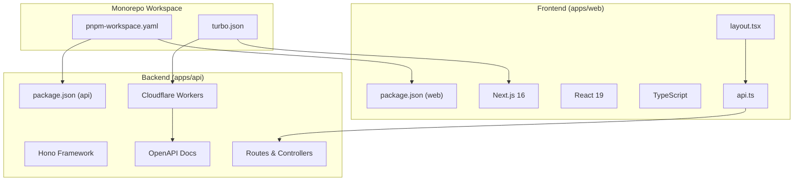
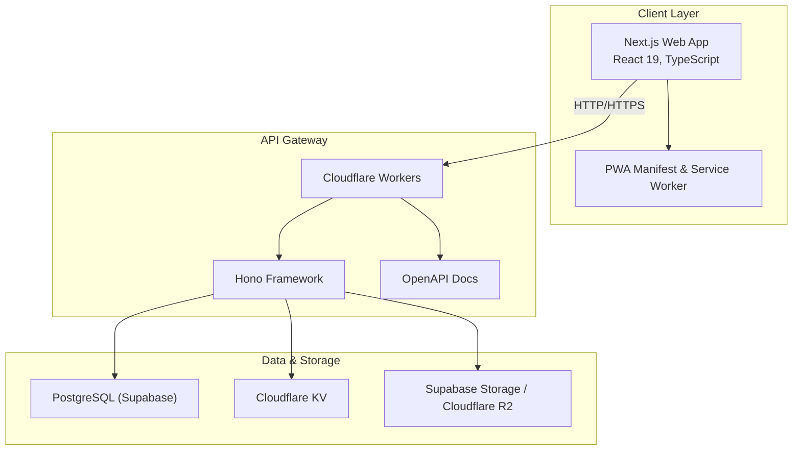
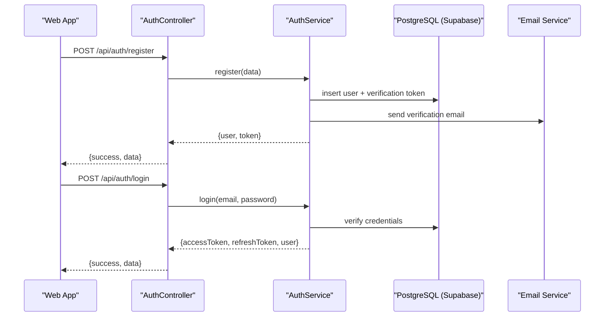
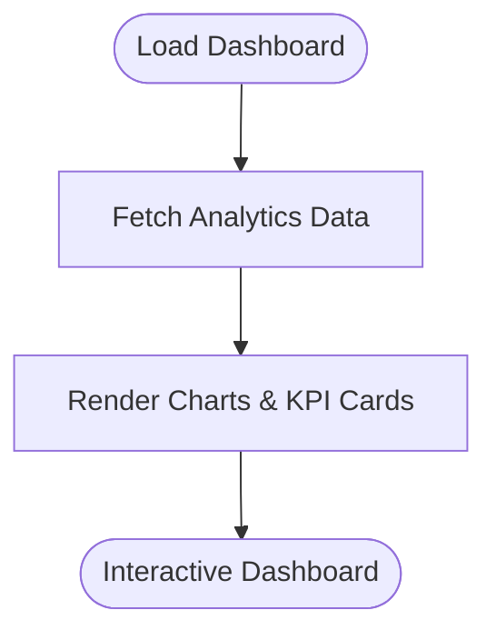
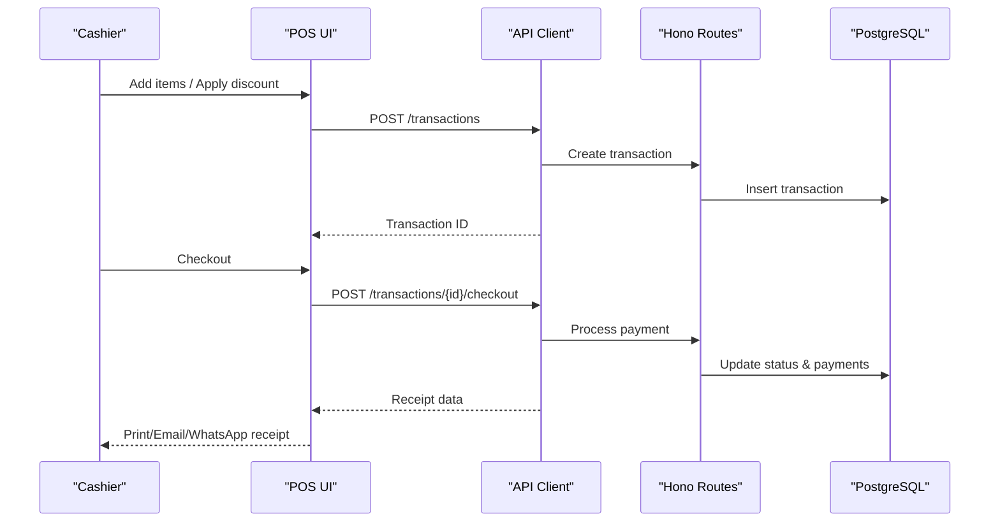
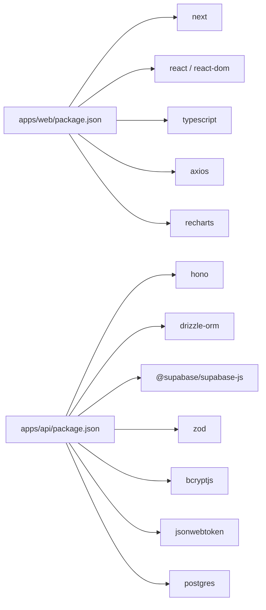

# Project Overview

<cite>
**Referenced Files in This Document**
- [README.md](file://README.md)
- [PRD.md](file://PRD/PRD.md)
- [PHASE1_TEMPLATES.md](file://PRD/PHASE1_TEMPLATES.md)
- [IMPLEMENTATION_CHECKLIST.md](file://PRD/IMPLEMENTATION_CHECKLIST.md)
- [layout.tsx](file://apps/web/src/app/layout.tsx)
- [api.ts](file://apps/web/src/lib/api.ts)
- [index.ts](file://apps/api/src/index.ts)
- [wrangler.toml](file://apps/api/wrangler.toml)
- [package.json (web)](file://apps/web/package.json)
- [package.json (api)](file://apps/api/package.json)
- [turbo.json](file://turbo.json)
- [pnpm-workspace.yaml](file://pnpm-workspace.yaml)
</cite>

## Table of Contents
1. [Introduction](#introduction)
2. [Project Structure](#project-structure)
3. [Core Components](#core-components)
4. [Architecture Overview](#architecture-overview)
5. [Detailed Component Analysis](#detailed-component-analysis)
6. [Dependency Analysis](#dependency-analysis)
7. [Performance Considerations](#performance-considerations)
8. [Troubleshooting Guide](#troubleshooting-guide)
9. [Conclusion](#conclusion)
10. [Appendices](#appendices)

## Introduction
ARHAT POS is a cloud-based Point of Sale (POS) and business management platform designed to modernize operations for Indonesian UMKM (Micro, Small, and Medium Enterprises). It integrates digital cash registers, inventory management, customer relationship management (CRM), business reporting, and customer communication automation into a unified, scalable solution. The platform aims to give business owners real-time control over transactions, stock, customers, and performance—without juggling multiple disconnected applications.

Key goals:
- Digitize UMKM operations
- Simplify sales transactions
- Reduce manual recording errors
- Optimize stock management
- Improve customer retention
- Provide accessible business reports
- Scale with growing businesses

**Section sources**
- [README.md:9-34](file://README.md#L9-L34)

## Project Structure
The repository follows a monorepo workspace managed by pnpm and Turborepo. It includes:
- apps/web: Next.js 16 frontend (React 19, TypeScript) with PWA support and offline caching
- apps/api: Cloudflare Workers backend built with Hono framework, serving REST APIs and OpenAPI documentation
- PRD: Product Requirements Document and implementation templates
- Shared tooling and configs for linting, TypeScript, and build orchestration

**Diagram sources**
- [pnpm-workspace.yaml:1-10](file://pnpm-workspace.yaml#L1-L10)
- [turbo.json:1-28](file://turbo.json#L1-L28)
- [package.json (web):1-40](file://apps/web/package.json#L1-L40)
- [package.json (api):1-37](file://apps/api/package.json#L1-L37)
- [layout.tsx:1-60](file://apps/web/src/app/layout.tsx#L1-L60)
- [api.ts:1-618](file://apps/web/src/lib/api.ts#L1-L618)
- [index.ts:1-99](file://apps/api/src/index.ts#L1-L99)
- [wrangler.toml:1-10](file://apps/api/wrangler.toml#L1-L10)

**Section sources**
- [pnpm-workspace.yaml:1-10](file://pnpm-workspace.yaml#L1-L10)
- [turbo.json:1-28](file://turbo.json#L1-L28)
- [package.json (web):11-28](file://apps/web/package.json#L11-L28)
- [package.json (api):13-24](file://apps/api/package.json#L13-L24)

## Core Components
ARHAT POS provides a comprehensive suite of modules tailored to UMKM needs:

- Authentication & User Management
  - Registration, email verification, login, password reset, session management, and role-based access control (RBAC)
  - Multi-role hierarchy: Super Admin, Owner, Manager, Cashier

- Dashboard Analytics
  - Real-time KPIs and visualizations for today/monthly sales, transactions, products, customers, and stock

- Point of Sale (POS)
  - Product search, barcode scanning, cart management, discounts, taxes, multiple payment methods, transaction hold/resume/refund/void, and digital receipts

- Product Management
  - CRUD operations, categories, variants, import/export, and product attributes (name, SKU, barcode, price, image, status)

- Inventory Management
  - Stock in/out/adjustment, transfers, stock opname, real-time monitoring, low/expiry alerts, and movement history

- Customer Relationship Management (CRM)
  - Customer database, purchase history, notes, segmentation, and loyalty program (planned)

- Supplier Management
  - Supplier database, purchase orders, goods receiving, and payment tracking (planned)

- Financial Management
  - Cash management, income/expense tracking, petty cash, and financial reports (planned)

- Reporting & Analytics
  - Sales, product, and customer reports with export options (PDF, Excel, CSV)

- WhatsApp Integration
  - Digital receipts, notifications, promotional messages, reminders, and order updates (planned)

- Multi Outlet Management
  - Multi-store management, centralized inventory, performance monitoring, and comparative reporting (planned)

- Subscription Management
  - Starter, Professional, and Enterprise plans with user/outlet limits and feature tiers

**Section sources**
- [README.md:99-372](file://README.md#L99-L372)
- [PRD.md:52-61](file://PRD/PRD.md#L52-L61)
- [PRD.md:40-51](file://PRD/PRD.md#L40-L51)

## Architecture Overview
ARHAT POS adopts a modern cloud-native architecture:
- Frontend: Next.js 16 with React 19, TypeScript, Tailwind CSS, and Shadcn/UI
- Backend: Cloudflare Workers with Hono framework for lightweight, serverless APIs
- Database: PostgreSQL (via Supabase)
- Storage: Supabase Storage and Cloudflare R2
- Cache: Cloudflare KV
- DevOps: GitHub for source control and CI/CD via GitHub Actions
- Deployment: Vercel for frontend, Cloudflare Workers for backend

**Diagram sources**
- [package.json (web):17, 19, 22, 26](file://apps/web/package.json#L17,L19,L22,L26)
- [package.json (api):14-24](file://apps/api/package.json#L14-L24)
- [index.ts:1-99](file://apps/api/src/index.ts#L1-L99)
- [wrangler.toml:1-10](file://apps/api/wrangler.toml#L1-L10)

**Section sources**
- [README.md:403-480](file://README.md#L403-L480)
- [layout.tsx:17-31](file://apps/web/src/app/layout.tsx#L17-L31)

## Detailed Component Analysis

### Authentication & User Management
- Implements secure registration, email verification, login with JWT, refresh tokens, and password reset
- RBAC with four roles and permission matrices
- Audit logs and rate limiting for security
- Frontend pages: login, register, email verification, forgot/reset password
- Backend routes: auth endpoints, user management, RBAC middleware

**Diagram sources**
- [index.ts:5-16](file://apps/api/src/index.ts#L5-L16)
- [api.ts:28-40](file://apps/web/src/lib/api.ts#L28-L40)

**Section sources**
- [PRD.md:101-187](file://PRD/PRD.md#L101-L187)
- [PHASE1_TEMPLATES.md:250-617](file://PRD/PHASE1_TEMPLATES.md#L250-L617)
- [IMPLEMENTATION_CHECKLIST.md:7-314](file://PRD/IMPLEMENTATION_CHECKLIST.md#L7-L314)

### Dashboard Analytics
- Provides real-time KPIs and charts for sales, top products/categories, and peak transaction hours
- Frontend dashboard page with chart libraries and data fetching from analytics endpoints

**Diagram sources**
- [api.ts:226-236](file://apps/web/src/lib/api.ts#L226-L236)

**Section sources**
- [README.md:131-151](file://README.md#L131-L151)

### Point of Sale (POS)
- Full transaction lifecycle: search, cart, discounts, taxes, payments, hold/resume/refund/void, and receipts
- Offline capability with IndexedDB caching and sync queue
- Multi-payment methods and receipt generation

**Diagram sources**
- [api.ts:75-119](file://apps/web/src/lib/api.ts#L75-L119)
- [index.ts:80-92](file://apps/api/src/index.ts#L80-L92)

**Section sources**
- [README.md:154-186](file://README.md#L154-L186)
- [PRD.md:329-591](file://PRD/PRD.md#L329-L591)

### Product Management
- CRUD for products, categories, variants, and import/export
- Rich product metadata and image handling

**Section sources**
- [README.md:188-212](file://README.md#L188-L212)
- [PRD.md:507-578](file://PRD/PRD.md#L507-L578)

### Inventory Management
- Real-time stock tracking, stock movements, adjustments, transfers, and opname
- Alerts for low stock and expiring items

**Section sources**
- [README.md:214-236](file://README.md#L214-L236)
- [PRD.md:619-734](file://PRD/PRD.md#L619-L734)

### CRM
- Customer database, purchase history, notes, segmentation, and loyalty program (planned)

**Section sources**
- [README.md:238-261](file://README.md#L238-L261)
- [PRD.md:390-423](file://PRD/PRD.md#L390-L423)

### Supplier Management
- Supplier database, purchase orders, goods receiving, and payment tracking (planned)

**Section sources**
- [README.md:264-281](file://README.md#L264-L281)
- [PRD.md:539-544](file://PRD/PRD.md#L539-L544)

### Financial Management
- Cash management, income/expense tracking, petty cash, and financial reports (planned)

**Section sources**
- [README.md:283-299](file://README.md#L283-L299)
- [PRD.md:545-549](file://PRD/PRD.md#L545-L549)

### Reporting & Analytics
- Sales, product, and customer reports with export to PDF/Excel/CSV

**Section sources**
- [README.md:301-327](file://README.md#L301-L327)
- [PRD.md:426-456](file://PRD/PRD.md#L426-L456)

### WhatsApp Integration
- Digital receipts, notifications, promotional messages, reminders, and order updates (planned)

**Section sources**
- [README.md:330-339](file://README.md#L330-L339)
- [PRD.md:547-549](file://PRD/PRD.md#L547-L549)

### Multi Outlet Management
- Multi-store management, centralized inventory, performance monitoring, and comparative reporting (planned)

**Section sources**
- [README.md:342-350](file://README.md#L342-L350)
- [PRD.md:545-549](file://PRD/PRD.md#L545-L549)

### Subscription Management
- Starter, Professional, and Enterprise plans with user/outlet limits and feature tiers

**Section sources**
- [README.md:353-372](file://README.md#L353-L372)
- [PRD.md:539-562](file://PRD/PRD.md#L539-L562)

## Dependency Analysis
- Frontend depends on:
  - Next.js runtime and React for UI
  - TypeScript for type safety
  - Tailwind CSS and Recharts for UI and charts
  - Axios for HTTP requests
  - Zustand for state management
- Backend depends on:
  - Hono for routing and middleware
  - Drizzle ORM for database operations
  - Supabase client for database connectivity
  - Zod for validation
  - Bcrypt for password hashing
  - JSON Web Token for auth
- Monorepo orchestration:
  - Turborepo for build and test pipelines
  - pnpm workspace for package management

**Diagram sources**
- [package.json (web):11-28](file://apps/web/package.json#L11-L28)
- [package.json (api):13-24](file://apps/api/package.json#L13-L24)

**Section sources**
- [package.json (web):11-28](file://apps/web/package.json#L11-L28)
- [package.json (api):13-24](file://apps/api/package.json#L13-L24)
- [turbo.json:1-28](file://turbo.json#L1-L28)
- [pnpm-workspace.yaml:1-10](file://pnpm-workspace.yaml#L1-L10)

## Performance Considerations
- Frontend
  - Lightweight Next.js 16 with React 19 and optimized asset loading
  - PWA support for offline readiness and fast reloads
  - Chart rendering with Recharts for efficient visuals
- Backend
  - Cloudflare Workers with Hono for low-latency API responses
  - Supabase PostgreSQL for managed database performance
  - Cloudflare KV for caching frequently accessed data
- Observability
  - OpenAPI documentation embedded in the backend for API clarity
  - Planned growth-stage stack includes Grafana, Prometheus, and Loki for monitoring

**Section sources**
- [README.md:375-401](file://README.md#L375-L401)
- [README.md:482-514](file://README.md#L482-L514)
- [index.ts:46-78](file://apps/api/src/index.ts#L46-L78)

## Troubleshooting Guide
Common areas to check during development and deployment:
- Authentication failures
  - Verify JWT secret configuration and refresh token validity
  - Confirm rate limiting thresholds and login attempt tracking
- Database connectivity
  - Ensure Supabase connection string and SSL settings are correct
  - Validate migrations and indices for performance
- Frontend API errors
  - Inspect Authorization headers and cookie-based session handling
  - Check offline sync queue and IndexedDB fallback behavior
- CORS and origins
  - Confirm allowed origins list and credentials handling in middleware

**Section sources**
- [index.ts:19-36](file://apps/api/src/index.ts#L19-L36)
- [api.ts:4-8](file://apps/web/src/lib/api.ts#L4-L8)
- [test_conn.js:1-24](file://apps/api/test_conn.js#L1-L24)

## Conclusion
ARHAT POS delivers a modern, cloud-first solution for UMKM, combining a robust POS, inventory, CRM, and reporting suite with scalable infrastructure. Its modular roadmap—from MVP features to advanced analytics and multi-outlet operations—ensures steady growth alongside business expansion. The technology stack emphasizes performance, maintainability, and developer productivity through a well-structured monorepo and cloud-native services.

[No sources needed since this section summarizes without analyzing specific files]

## Appendices

### Success Metrics
- 1,000+ active UMKM within the first year
- User retention above 80%
- Stock accuracy above 95%
- Average cashier transaction time under 30 seconds
- 90% reduction in manual recording errors

**Section sources**
- [README.md:565-572](file://README.md#L565-L572)

### Future Roadmap
- Version 2.0: Loyalty Program, Supplier Management, Expense Management
- Version 3.0: WhatsApp Marketing Automation, Customer Segmentation, Campaign Management
- Version 4.0: AI Sales Analytics, Stock Forecasting, Business Insights
- Version 5.0: Marketplace Integration, Accounting Module, Multi Warehouse Management

**Section sources**
- [README.md:537-562](file://README.md#L537-L562)
- [PRD.md:539-562](file://PRD/PRD.md#L539-L562)