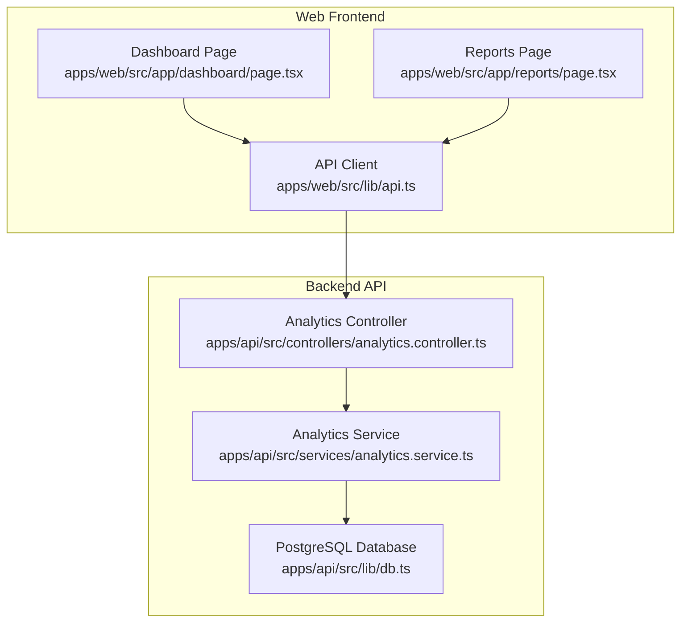
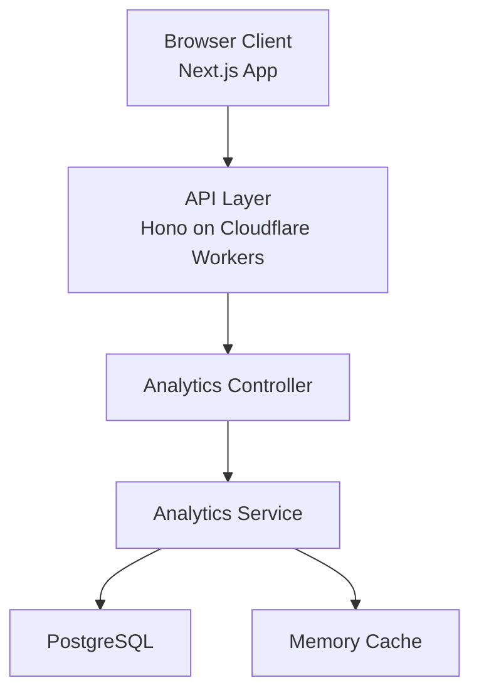
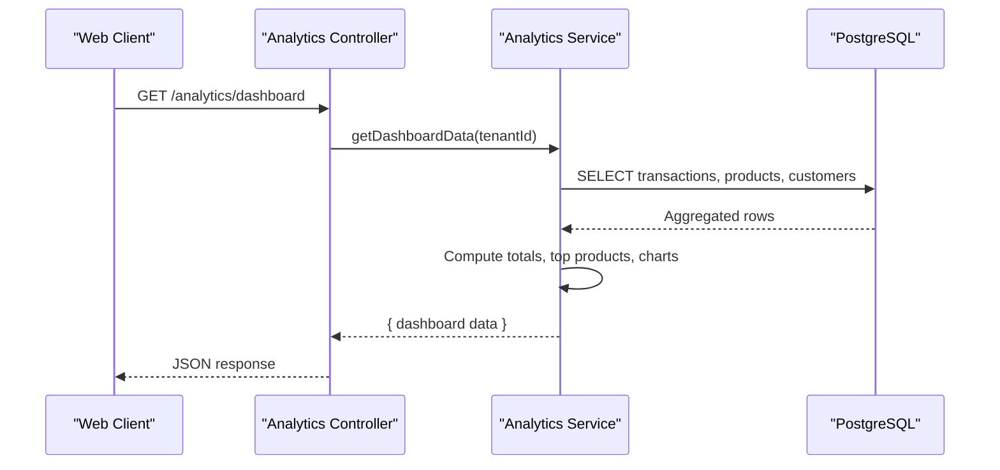
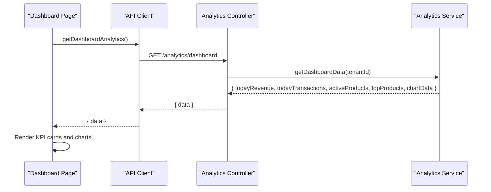
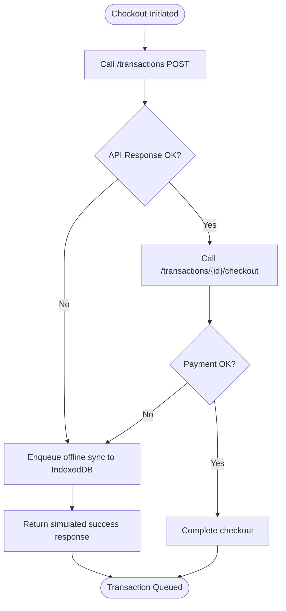
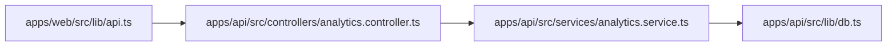

# Success Metrics & Roadmap

<cite>
**Referenced Files in This Document**
- [PRD.md](file://PRD/PRD.md)
- [IMPLEMENTATION_CHECKLIST.md](file://PRD/IMPLEMENTATION_CHECKLIST.md)
- [PHASE1_TEMPLATES.md](file://PRD/PHASE1_TEMPLATES.md)
- [README.md](file://README.md)
- [analytics.controller.ts](file://apps/api/src/controllers/analytics.controller.ts)
- [analytics.service.ts](file://apps/api/src/services/analytics.service.ts)
- [dashboard.page.tsx](file://apps/web/src/app/dashboard/page.tsx)
- [reports.page.tsx](file://apps/web/src/app/reports/page.tsx)
- [api.ts](file://apps/web/src/lib/api.ts)
- [db.ts](file://apps/api/src/lib/db.ts)
- [package.json](file://apps/api/package.json)
- [package.json](file://apps/web/package.json)
- [package.json](file://package.json)
</cite>

## Table of Contents
1. [Introduction](#introduction)
2. [Project Structure](#project-structure)
3. [Core Components](#core-components)
4. [Architecture Overview](#architecture-overview)
5. [Detailed Component Analysis](#detailed-component-analysis)
6. [Dependency Analysis](#dependency-analysis)
7. [Performance Considerations](#performance-considerations)
8. [Troubleshooting Guide](#troubleshooting-guide)
9. [Conclusion](#conclusion)
10. [Appendices](#appendices)

## Introduction
This document presents the success metrics and roadmap for ARHAT POS, a cloud-based Point of Sale and Business Management platform designed for Indonesian UMKM. It consolidates measurable outcomes, implementation phases from version 1.0 through 5.0, and the technical and business criteria that define success at each stage. The content is grounded in the project's Product Requirements Document (PRD), implementation checklists, and current codebase capabilities.

## Project Structure
ARHAT POS is organized as a monorepo with a frontend (Next.js) and backend (Cloudflare Workers/Hono) serving a PostgreSQL-backed multi-tenant SaaS. The analytics module exposes real-time dashboards and reports consumed by the web application.

**Diagram sources**
- [dashboard.page.tsx:10-166](file://apps/web/src/app/dashboard/page.tsx#L10-L166)
- [reports.page.tsx:1-416](file://apps/web/src/app/reports/page.tsx#L1-L416)
- [api.ts:226-520](file://apps/web/src/lib/api.ts#L226-L520)
- [analytics.controller.ts:1-63](file://apps/api/src/controllers/analytics.controller.ts#L1-L63)
- [analytics.service.ts:1-383](file://apps/api/src/services/analytics.service.ts#L1-L383)
- [db.ts:1-27](file://apps/api/src/lib/db.ts#L1-L27)

**Section sources**
- [PRD.md: Development Phases:73-85](file://PRD/PRD.md#L73-L85)
- [PRD.md: Success Metrics:62-70](file://PRD/PRD.md#L62-L70)
- [README.md: MVP Scope Version 1.0:517-535](file://README.md#L517-L535)

## Core Components
- Success Metrics: The PRD defines quantifiable targets for user adoption, retention, accuracy, transaction speed, and error reduction.
- Analytics Engine: The backend analytics controller and service aggregate real-time data for dashboards and reports.
- Web Dashboard: The frontend renders KPIs, charts, and drill-down analytics for business insights.
- Offline Capability: The web API client supports offline transaction queuing and caching for resilience.

**Section sources**
- [PRD.md: Success Metrics:62-70](file://PRD/PRD.md#L62-L70)
- [analytics.controller.ts:1-63](file://apps/api/src/controllers/analytics.controller.ts#L1-L63)
- [analytics.service.ts:1-383](file://apps/api/src/services/analytics.service.ts#L1-L383)
- [dashboard.page.tsx:10-166](file://apps/web/src/app/dashboard/page.tsx#L10-L166)
- [api.ts:17-119](file://apps/web/src/lib/api.ts#L17-L119)

## Architecture Overview
The system architecture integrates a responsive frontend with a stateless backend and a relational database. The analytics layer computes aggregated metrics for dashboards and reports, while the API layer handles offline-first transaction processing.

**Diagram sources**
- [analytics.controller.ts:1-63](file://apps/api/src/controllers/analytics.controller.ts#L1-L63)
- [analytics.service.ts:1-383](file://apps/api/src/services/analytics.service.ts#L1-L383)
- [db.ts:1-27](file://apps/api/src/lib/db.ts#L1-L27)

## Detailed Component Analysis

### Success Metrics Catalog
The project defines the following success metrics aligned with UMKM operational goals:
- Active UMKM (Year 1): ≥ 1,000
- User Retention: > 80%
- Stock Accuracy: > 95%
- Kasir Transaction Time: < 30 seconds
- Manual Recording Error Reduction: 90%

These metrics are used to evaluate progress across phases and versions, with concrete targets for user feedback, performance, and business impact.

**Section sources**
- [PRD.md: Success Metrics:62-70](file://PRD/PRD.md#L62-L70)
- [README.md: Success Metrics:565-572](file://README.md#L565-L572)

### Implementation Roadmap: Versions 1.0 through 5.0
The roadmap is structured as six sequential phases, each with deliverables, acceptance criteria, and success benchmarks. The timeline and feature priorities are derived from the PRD and implementation checklist.

- Version 1.0 (Phase 1: Foundation & Authentication)
  - Focus: Authentication, RBAC, user management, CI/CD, and foundational database migrations.
  - Success criteria: All user stories completed, > 85% test coverage, security audit, API response time < 300ms, stakeholder sign-off.
  - Timeline: Weeks 1–3.

- Version 2.0 (Phase 2: POS & Basic Sales)
  - Focus: POS transaction engine, barcode scanning, discounts, taxes, payment processing, transaction hold/resume, refunds/voids, and digital receipts.
  - Success criteria: End-to-end POS testing, transaction processing time < 30 seconds, barcode hardware testing, payment method simulation, receipt approvals.
  - Timeline: Weeks 4–6.

- Version 3.0 (Phase 3: Inventory Management)
  - Focus: Stock in/out/adjustment, low stock alerts, stock opname, transfers, history monitoring, expired product alerts.
  - Success criteria: Real-time inventory tracking, alerting validated, stock opname workflow tested, multi-outlet transfer validated.
  - Timeline: Weeks 7–9.

- Version 4.0 (Phase 4: Customer Management & CRM)
  - Focus: Customer database, purchase history, segmentation, loyalty program (points, tiers, redemptions), notes.
  - Success criteria: Customer analytics computed, loyalty program functional, segmentation reports generated.
  - Timeline: Weeks 10–11.

- Version 5.0 (Phase 5: Reporting & Analytics)
  - Focus: Sales dashboard, product performance, profit & loss, customer analytics, export capabilities.
  - Success criteria: All analytics endpoints functional, charts rendered, export formats available, scheduled reports operational.
  - Timeline: Weeks 13–14.

- Future Enhancements (Phase 6: Advanced Features)
  - Focus: WhatsApp receipt integration, customer notifications, performance optimization, UI/UX polish, documentation finalization.
  - Timeline: Weeks 15–16.

**Section sources**
- [PRD.md: Development Phases:73-85](file://PRD/PRD.md#L73-L85)
- [PRD.md: Phase 1 Objectives:88-304](file://PRD/PRD.md#L88-L304)
- [PRD.md: Phase 2 Objectives:316-603](file://PRD/PRD.md#L316-L603)
- [PRD.md: Phase 3 Objectives:606-734](file://PRD/PRD.md#L606-L734)
- [PRD.md: Phase 4 Objectives:390-424](file://PRD/PRD.md#L390-L424)
- [PRD.md: Phase 5 Objectives:426-456](file://PRD/PRD.md#L426-L456)
- [PRD.md: Phase 6 Objectives:458-468](file://PRD/PRD.md#L458-L468)
- [IMPLEMENTATION_CHECKLIST.md: Phase 1 Definition of Done:286-311](file://PRD/IMPLEMENTATION_CHECKLIST.md#L286-L311)
- [IMPLEMENTATION_CHECKLIST.md: Phase 2–5 Workflows:314-468](file://PRD/IMPLEMENTATION_CHECKLIST.md#L314-L468)

### Analytics Engine: Data Aggregation and Delivery
The analytics controller delegates requests to the analytics service, which performs aggregations and computations against the database. Results are returned to the frontend for rendering.

**Diagram sources**
- [analytics.controller.ts:6-21](file://apps/api/src/controllers/analytics.controller.ts#L6-L21)
- [analytics.service.ts:6-129](file://apps/api/src/services/analytics.service.ts#L6-L129)
- [db.ts:1-27](file://apps/api/src/lib/db.ts#L1-L27)

**Section sources**
- [analytics.controller.ts:1-63](file://apps/api/src/controllers/analytics.controller.ts#L1-L63)
- [analytics.service.ts:1-383](file://apps/api/src/services/analytics.service.ts#L1-L383)

### Web Dashboard and Reports: KPI Rendering and Export
The dashboard page fetches and renders real-time KPIs and charts, while the reports page aggregates sales, product, profit/loss, and customer analytics with export capabilities.

**Diagram sources**
- [dashboard.page.tsx:14-26](file://apps/web/src/app/dashboard/page.tsx#L14-L26)
- [api.ts:226-236](file://apps/web/src/lib/api.ts#L226-L236)
- [analytics.controller.ts:6-21](file://apps/api/src/controllers/analytics.controller.ts#L6-L21)
- [analytics.service.ts:6-129](file://apps/api/src/services/analytics.service.ts#L6-L129)

**Section sources**
- [dashboard.page.tsx:10-166](file://apps/web/src/app/dashboard/page.tsx#L10-L166)
- [reports.page.tsx:1-416](file://apps/web/src/app/reports/page.tsx#L1-L416)
- [api.ts:226-520](file://apps/web/src/lib/api.ts#L226-L520)

### Offline Transaction Processing: Resilience and Recovery
The web API client supports offline transaction creation and queues synchronization when network conditions fail, ensuring continuity of operations.

**Diagram sources**
- [api.ts:75-119](file://apps/web/src/lib/api.ts#L75-L119)

**Section sources**
- [api.ts:17-119](file://apps/web/src/lib/api.ts#L17-L119)

### Technical Debt Reduction Goals
- Maintain > 85% test coverage across backend services and frontend components.
- Implement comprehensive security checks (input validation, authorization, rate limiting, XSS/SQL injection prevention).
- Enforce performance benchmarks: frontend page load < 2s, backend API response time < 300ms (p99), error rate < 0.1%.
- Regular audits: weekly security reviews, monthly dependency audits, quarterly penetration testing.

**Section sources**
- [IMPLEMENTATION_CHECKLIST.md: Phase 1 Testing Summary:241-282](file://PRD/IMPLEMENTATION_CHECKLIST.md#L241-L282)
- [IMPLEMENTATION_CHECKLIST.md: Security Checklist:596-615](file://PRD/IMPLEMENTATION_CHECKLIST.md#L596-L615)
- [IMPLEMENTATION_CHECKLIST.md: Performance Benchmarks:570-593](file://PRD/IMPLEMENTATION_CHECKLIST.md#L570-L593)

### Alignment with Market Needs, Competitive Landscape, and Technological Evolution
- Market Needs: ARHAT POS addresses manual recording, inventory visibility, customer retention, and reporting inefficiencies typical in UMKM.
- Competitive Landscape: The solution leverages a cloud-native stack (Next.js, Hono, PostgreSQL) to compete on ease-of-use, scalability, and real-time insights.
- Technological Evolution: The roadmap progresses from foundational modules to advanced features (loyalty, forecasting, marketplace integration), keeping pace with UMKM digital transformation.

**Section sources**
- [README.md: Problems to Solve:69-94](file://README.md#L69-L94)
- [README.md: Technology Stack:403-463](file://README.md#L403-L463)
- [README.md: Future Roadmap:537-562](file://README.md#L537-L562)

## Dependency Analysis
The analytics module depends on the database abstraction and Drizzle ORM for query construction. The frontend depends on the API client for all backend interactions.

**Diagram sources**
- [api.ts:226-520](file://apps/web/src/lib/api.ts#L226-L520)
- [analytics.controller.ts:1-63](file://apps/api/src/controllers/analytics.controller.ts#L1-L63)
- [analytics.service.ts:1-383](file://apps/api/src/services/analytics.service.ts#L1-L383)
- [db.ts:1-27](file://apps/api/src/lib/db.ts#L1-L27)

**Section sources**
- [package.json:13-24](file://apps/api/package.json#L13-L24)
- [package.json:11-27](file://apps/web/package.json#L11-L27)
- [package.json:10-18](file://package.json#L10-L18)

## Performance Considerations
- Backend: Target API response time < 300ms (p99), optimized database queries, connection pooling, and throughput > 1,000 req/sec.
- Frontend: Page load time < 2s, Lighthouse score > 85, FCP < 1.5s, LCP < 2.5s, CLS < 0.1.
- Database: Query execution < 100ms, proper indexing, and storage efficiency.

**Section sources**
- [IMPLEMENTATION_CHECKLIST.md: Performance Benchmarks:570-593](file://PRD/IMPLEMENTATION_CHECKLIST.md#L570-L593)

## Troubleshooting Guide
- Authentication Failures: Verify JWT secret configuration, refresh token lifecycle, and rate-limiting thresholds.
- Analytics Errors: Confirm database connectivity, schema initialization, and cache availability for dashboard data.
- Offline Sync Issues: Validate IndexedDB enqueue logic and retry mechanisms for queued transactions.
- Security Audits: Ensure input validation, authorization checks, and secure error messaging across endpoints.

**Section sources**
- [PHASE1_TEMPLATES.md: Backend Templates:248-617](file://PRD/PHASE1_TEMPLATES.md#L248-L617)
- [db.ts:9-24](file://apps/api/src/lib/db.ts#L9-L24)
- [api.ts:75-119](file://apps/web/src/lib/api.ts#L75-L119)
- [IMPLEMENTATION_CHECKLIST.md: Security Checklist:596-615](file://PRD/IMPLEMENTATION_CHECKLIST.md#L596-L615)

## Conclusion
ARHAT POS’s success metrics and roadmap provide a clear, data-driven path to delivering value for UMKM. By focusing on user adoption, retention, accuracy, transaction speed, and error reduction—while implementing robust analytics, offline resilience, and continuous performance monitoring—the project aligns with market demands and technological evolution. The phased approach ensures steady delivery of capabilities from version 1.0 through 5.0, with clear success criteria and technical debt reduction goals.

## Appendices
- Implementation Templates: Phase 1 authentication templates and boilerplate are available for rapid feature development.
- Testing and Security Playbooks: Comprehensive checklists and benchmarks are documented for consistent quality assurance.

**Section sources**
- [PHASE1_TEMPLATES.md: Backend Templates:1-245](file://PRD/PHASE1_TEMPLATES.md#L1-L245)
- [IMPLEMENTATION_CHECKLIST.md: Testing Checklist Template:526-567](file://PRD/IMPLEMENTATION_CHECKLIST.md#L526-L567)
- [IMPLEMENTATION_CHECKLIST.md: Security Checklist:596-615](file://PRD/IMPLEMENTATION_CHECKLIST.md#L596-L615)