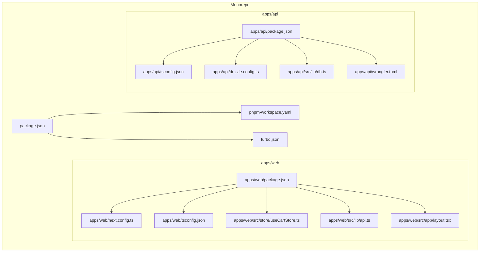
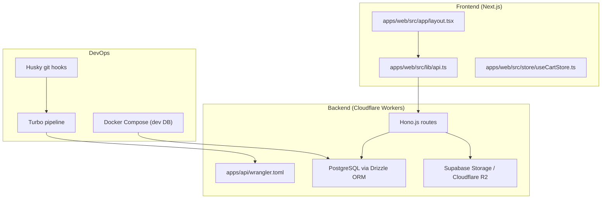
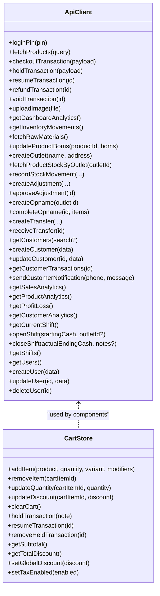
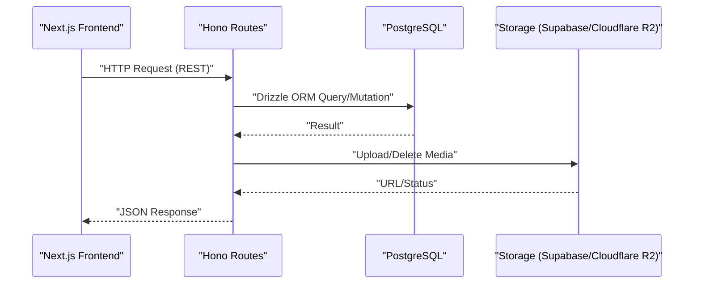
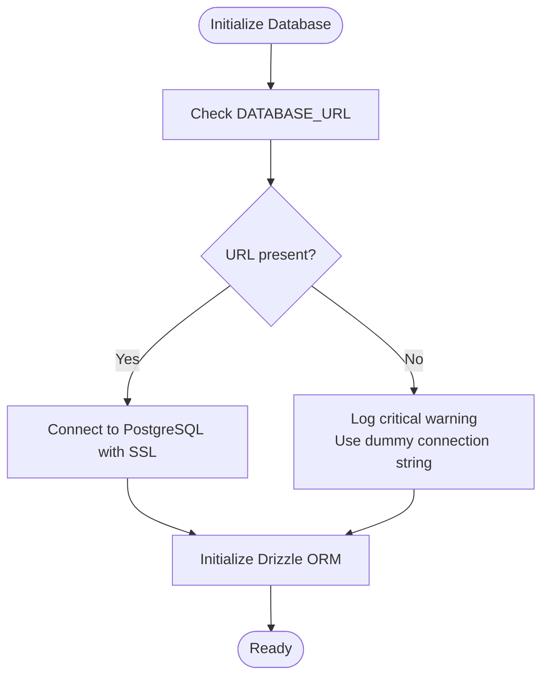
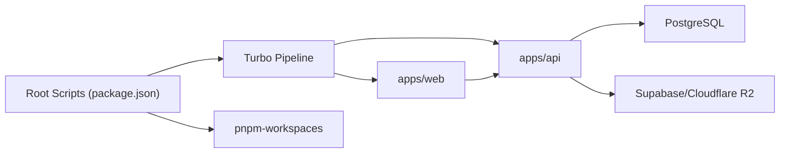

# Technology Stack

<cite>
**Referenced Files in This Document**
- [package.json](file://package.json)
- [pnpm-workspace.yaml](file://pnpm-workspace.yaml)
- [turbo.json](file://turbo.json)
- [.eslintrc.json](file://.eslintrc.json)
- [.prettierrc](file://.prettierrc)
- [apps/web/package.json](file://apps/web/package.json)
- [apps/web/next.config.ts](file://apps/web/next.config.ts)
- [apps/web/tsconfig.json](file://apps/web/tsconfig.json)
- [apps/web/components.json](file://apps/web/components.json)
- [apps/web/src/store/useCartStore.ts](file://apps/web/src/store/useCartStore.ts)
- [apps/web/src/lib/api.ts](file://apps/web/src/lib/api.ts)
- [apps/web/src/app/layout.tsx](file://apps/web/src/app/layout.tsx)
- [apps/api/package.json](file://apps/api/package.json)
- [apps/api/tsconfig.json](file://apps/api/tsconfig.json)
- [apps/api/drizzle.config.ts](file://apps/api/drizzle.config.ts)
- [apps/api/src/lib/db.ts](file://apps/api/src/lib/db.ts)
- [apps/api/wrangler.toml](file://apps/api/wrangler.toml)
- [docker-compose.yml](file://docker-compose.yml)
</cite>

## Table of Contents
1. [Introduction](#introduction)
2. [Project Structure](#project-structure)
3. [Core Components](#core-components)
4. [Architecture Overview](#architecture-overview)
5. [Detailed Component Analysis](#detailed-component-analysis)
6. [Dependency Analysis](#dependency-analysis)
7. [Performance Considerations](#performance-considerations)
8. [Troubleshooting Guide](#troubleshooting-guide)
9. [Conclusion](#conclusion)

## Introduction
This document presents the ARHAT POS technology stack, detailing the frontend, backend, database, storage, DevOps, and development tooling. It explains the rationale behind each technology choice, highlights integration patterns, and provides practical guidance for building, testing, and deploying the system.

## Project Structure
ARHAT POS follows a monorepo architecture using pnpm workspaces and Turbo for orchestration:
- apps/web: Next.js 16+ application with App Router, TypeScript, Tailwind CSS, and Zustand state management
- apps/api: Cloudflare Workers backend built with Hono.js, Express-compatible routing, Drizzle ORM, and PostgreSQL
- packages: Shared configurations for TypeScript, ESLint, and UI
- Root scripts manage development, linting, formatting, and CI/CD via Turbo pipeline

**Diagram sources**
- [package.json:1-30](file://package.json#L1-L30)
- [pnpm-workspace.yaml:1-10](file://pnpm-workspace.yaml#L1-L10)
- [turbo.json:1-28](file://turbo.json#L1-L28)
- [apps/web/package.json:1-40](file://apps/web/package.json#L1-L40)
- [apps/web/next.config.ts:1-17](file://apps/web/next.config.ts#L1-L17)
- [apps/web/tsconfig.json:1-35](file://apps/web/tsconfig.json#L1-L35)
- [apps/web/src/store/useCartStore.ts:1-184](file://apps/web/src/store/useCartStore.ts#L1-L184)
- [apps/web/src/lib/api.ts:1-618](file://apps/web/src/lib/api.ts#L1-L618)
- [apps/web/src/app/layout.tsx:1-60](file://apps/web/src/app/layout.tsx#L1-L60)
- [apps/api/package.json:1-37](file://apps/api/package.json#L1-L37)
- [apps/api/tsconfig.json:1-19](file://apps/api/tsconfig.json#L1-L19)
- [apps/api/drizzle.config.ts:1-13](file://apps/api/drizzle.config.ts#L1-L13)
- [apps/api/src/lib/db.ts:1-27](file://apps/api/src/lib/db.ts#L1-L27)
- [apps/api/wrangler.toml:1-10](file://apps/api/wrangler.toml#L1-L10)

**Section sources**
- [package.json:1-30](file://package.json#L1-L30)
- [pnpm-workspace.yaml:1-10](file://pnpm-workspace.yaml#L1-L10)
- [turbo.json:1-28](file://turbo.json#L1-L28)

## Core Components
- Frontend (Next.js 16+, App Router, React 19, TypeScript, Tailwind CSS, Zustand)
- Backend (Cloudflare Workers, Hono.js, Express-compatible routing)
- Database (PostgreSQL with Drizzle ORM; SQLite for development via Docker Compose)
- Storage (Supabase Storage and Cloudflare R2 for media)
- DevOps (GitHub for version control, GitHub Actions for CI/CD, Docker for local environments)
- Development Tools (ESLint, Prettier, Husky, Turbo)
- Deployment (Cloudflare Workers for backend, Vercel for frontend)

Rationale and benefits:
- Next.js 16+ with App Router delivers server-side rendering, static generation, route handling, and modern React features
- Hono.js provides a lightweight, Express-compatible router optimized for edge computing
- Drizzle ORM offers a type-safe, SQL-first migration and query toolkit for PostgreSQL
- Zustand simplifies state management with minimal boilerplate
- Cloudflare Workers enable low-latency, globally distributed compute with seamless deployment
- Supabase Storage and Cloudflare R2 provide scalable, secure media storage
- pnpm workspaces and Turbo optimize monorepo builds and caching
- ESLint and Prettier enforce code quality; Husky ensures pre-commit hygiene

**Section sources**
- [apps/web/package.json:1-40](file://apps/web/package.json#L1-L40)
- [apps/api/package.json:1-37](file://apps/api/package.json#L1-L37)
- [apps/api/drizzle.config.ts:1-13](file://apps/api/drizzle.config.ts#L1-L13)
- [apps/api/src/lib/db.ts:1-27](file://apps/api/src/lib/db.ts#L1-L27)
- [docker-compose.yml:1-43](file://docker-compose.yml#L1-L43)
- [package.json:1-30](file://package.json#L1-L30)

## Architecture Overview
The system comprises a frontend SPA served by Next.js and a backend hosted on Cloudflare Workers. The frontend communicates with the backend via RESTful endpoints, while the backend persists data in PostgreSQL and stores media assets in Supabase Storage or Cloudflare R2. Development tooling and CI/CD are orchestrated through Turbo and Git hooks.

**Diagram sources**
- [apps/web/src/app/layout.tsx:1-60](file://apps/web/src/app/layout.tsx#L1-L60)
- [apps/web/src/lib/api.ts:1-618](file://apps/web/src/lib/api.ts#L1-L618)
- [apps/web/src/store/useCartStore.ts:1-184](file://apps/web/src/store/useCartStore.ts#L1-L184)
- [apps/api/wrangler.toml:1-10](file://apps/api/wrangler.toml#L1-L10)
- [apps/api/drizzle.config.ts:1-13](file://apps/api/drizzle.config.ts#L1-L13)
- [apps/api/src/lib/db.ts:1-27](file://apps/api/src/lib/db.ts#L1-L27)
- [turbo.json:1-28](file://turbo.json#L1-L28)
- [docker-compose.yml:1-43](file://docker-compose.yml#L1-L43)

## Detailed Component Analysis

### Frontend Technologies
- Next.js 16+ with App Router: Provides file-system routing, server-side rendering, and static generation
- React 19: Latest React features and performance improvements
- TypeScript: Strict typing across components, stores, and API clients
- Tailwind CSS: Utility-first styling with shadcn/ui component library
- Zustand: Lightweight state management for cart and POS operations

Key integration patterns:
- Centralized API client encapsulates authentication, error handling, and offline fallback
- Zustand store manages cart items, modifiers, variants, and held transactions
- Layout composes AuthProvider and PWA registration for offline-first UX

**Diagram sources**
- [apps/web/src/lib/api.ts:1-618](file://apps/web/src/lib/api.ts#L1-L618)
- [apps/web/src/store/useCartStore.ts:1-184](file://apps/web/src/store/useCartStore.ts#L1-L184)

**Section sources**
- [apps/web/package.json:1-40](file://apps/web/package.json#L1-L40)
- [apps/web/next.config.ts:1-17](file://apps/web/next.config.ts#L1-L17)
- [apps/web/tsconfig.json:1-35](file://apps/web/tsconfig.json#L1-L35)
- [apps/web/components.json:1-26](file://apps/web/components.json#L1-L26)
- [apps/web/src/store/useCartStore.ts:1-184](file://apps/web/src/store/useCartStore.ts#L1-L184)
- [apps/web/src/lib/api.ts:1-618](file://apps/web/src/lib/api.ts#L1-L618)
- [apps/web/src/app/layout.tsx:1-60](file://apps/web/src/app/layout.tsx#L1-L60)

### Backend Technologies
- Cloudflare Workers: Serverless runtime for global edge deployment
- Hono.js: Express-compatible routing and middleware support
- Drizzle ORM: Type-safe migrations and queries for PostgreSQL
- PostgreSQL: Primary relational database for production
- SQLite: Development database via Docker Compose

Integration patterns:
- Wrangler configuration defines the Worker entrypoint and compatibility flags
- Drizzle config maps schema and credentials for migrations and runtime
- Database client initialization handles environment-driven connection strings and SSL

**Diagram sources**
- [apps/api/wrangler.toml:1-10](file://apps/api/wrangler.toml#L1-L10)
- [apps/api/drizzle.config.ts:1-13](file://apps/api/drizzle.config.ts#L1-L13)
- [apps/api/src/lib/db.ts:1-27](file://apps/api/src/lib/db.ts#L1-L27)
- [apps/web/src/lib/api.ts:1-618](file://apps/web/src/lib/api.ts#L1-L618)

**Section sources**
- [apps/api/package.json:1-37](file://apps/api/package.json#L1-L37)
- [apps/api/tsconfig.json:1-19](file://apps/api/tsconfig.json#L1-L19)
- [apps/api/drizzle.config.ts:1-13](file://apps/api/drizzle.config.ts#L1-L13)
- [apps/api/src/lib/db.ts:1-27](file://apps/api/src/lib/db.ts#L1-L27)
- [apps/api/wrangler.toml:1-10](file://apps/api/wrangler.toml#L1-L10)

### Database Layer
- Production: PostgreSQL with Drizzle ORM for migrations and queries
- Development: Docker Compose provides a local Postgres instance with optional Redis and pgAdmin

Key configuration:
- Drizzle Kit configuration defines schema path, output migrations, and credentials
- Runtime database client initializes with environment-provided connection string and SSL requirements
- Docker Compose sets up containers, volumes, and networking for local development

**Diagram sources**
- [apps/api/src/lib/db.ts:1-27](file://apps/api/src/lib/db.ts#L1-L27)
- [apps/api/drizzle.config.ts:1-13](file://apps/api/drizzle.config.ts#L1-L13)
- [docker-compose.yml:1-43](file://docker-compose.yml#L1-L43)

**Section sources**
- [apps/api/drizzle.config.ts:1-13](file://apps/api/drizzle.config.ts#L1-L13)
- [apps/api/src/lib/db.ts:1-27](file://apps/api/src/lib/db.ts#L1-L27)
- [docker-compose.yml:1-43](file://docker-compose.yml#L1-L43)

### Storage Solutions
- Supabase Storage and Cloudflare R2 are integrated via the backend upload endpoint
- Frontend uploads use multipart/form-data with automatic boundary handling
- Backend validates responses and returns asset URLs for persistence

Integration pattern:
- Frontend calls upload endpoint with FormData
- Backend stores media and returns URL
- Frontend persists URLs in product records

**Section sources**
- [apps/web/src/lib/api.ts:211-224](file://apps/web/src/lib/api.ts#L211-L224)
- [apps/api/package.json:1-37](file://apps/api/package.json#L1-L37)

### DevOps Infrastructure
- Version Control: GitHub (repository hosting)
- CI/CD: GitHub Actions workflows (configured externally)
- Containerization: Docker Compose for local databases and tools
- Monorepo Orchestration: Turbo pipeline with caching and parallel execution

Tooling:
- ESLint and Prettier configured centrally and extended by shared packages
- Husky installed via root script to enforce commit hygiene

**Section sources**
- [package.json:1-30](file://package.json#L1-L30)
- [.eslintrc.json:1-4](file://.eslintrc.json#L1-L4)
- [.prettierrc:1-9](file://.prettierrc#L1-L9)
- [turbo.json:1-28](file://turbo.json#L1-L28)
- [docker-compose.yml:1-43](file://docker-compose.yml#L1-L43)

### Development Tools
- ESLint: Centralized configuration extended by shared package
- Prettier: Formatting rules applied across the monorepo
- Husky: Git hooks installed via root script
- Turbo: Pipeline tasks for build, lint, type-check, test, and dev

**Section sources**
- [.eslintrc.json:1-4](file://.eslintrc.json#L1-L4)
- [.prettierrc:1-9](file://.prettierrc#L1-L9)
- [package.json:1-30](file://package.json#L1-L30)
- [turbo.json:1-28](file://turbo.json#L1-L28)

### Deployment Platforms
- Backend: Cloudflare Workers deployed via Wrangler
- Frontend: Vercel deployment configured via per-app configuration

Note: While Vercel configuration exists in the repository, deployment targets are environment-specific and managed outside this codebase.

**Section sources**
- [apps/api/wrangler.toml:1-10](file://apps/api/wrangler.toml#L1-L10)
- [apps/web/package.json:1-40](file://apps/web/package.json#L1-L40)

## Dependency Analysis
The monorepo uses pnpm workspaces to organize packages and apps. Root scripts coordinate development, linting, formatting, and CI/CD through Turbo. The frontend depends on the backend API, while the backend depends on the database and storage services.

**Diagram sources**
- [package.json:1-30](file://package.json#L1-L30)
- [pnpm-workspace.yaml:1-10](file://pnpm-workspace.yaml#L1-L10)
- [turbo.json:1-28](file://turbo.json#L1-L28)
- [apps/web/package.json:1-40](file://apps/web/package.json#L1-L40)
- [apps/api/package.json:1-37](file://apps/api/package.json#L1-L37)

**Section sources**
- [package.json:1-30](file://package.json#L1-L30)
- [pnpm-workspace.yaml:1-10](file://pnpm-workspace.yaml#L1-L10)
- [turbo.json:1-28](file://turbo.json#L1-L28)

## Performance Considerations
- Edge deployment: Cloudflare Workers reduce latency by running code closer to users
- Streaming and caching: Leverage Hono’s middleware and response streaming where appropriate
- Database connections: Use connection pooling and SSL in production; avoid unnecessary reconnects
- Frontend caching: Persist frequently accessed lists (products, customers) to IndexedDB for offline resilience
- Asset delivery: Serve media from CDN-backed storage (Supabase/Cloudflare R2) for fast global delivery

## Troubleshooting Guide
Common issues and resolutions:
- Missing DATABASE_URL: The runtime database client logs a critical warning and falls back to a dummy connection string; ensure environment variables are set in production
- Authentication failures: The API client clears expired tokens and redirects to login; verify token cookie handling and backend auth routes
- Network errors during checkout: The API client queues offline sync requests and simulates a successful response; monitor the sync queue and retry logic
- ESLint/Prettier errors: Run root scripts to lint/format across the monorepo; ensure Husky hooks are installed

**Section sources**
- [apps/api/src/lib/db.ts:1-27](file://apps/api/src/lib/db.ts#L1-L27)
- [apps/web/src/lib/api.ts:1-618](file://apps/web/src/lib/api.ts#L1-L618)
- [package.json:1-30](file://package.json#L1-L30)

## Conclusion
ARHAT POS leverages a modern, cloud-native stack to deliver a responsive, scalable Point of Sale solution. The combination of Next.js, Hono.js, Drizzle ORM, and Cloudflare Workers enables rapid iteration and global performance. The monorepo structure, powered by pnpm and Turbo, streamlines development and deployment. By adhering to the established patterns and tooling, teams can maintain code quality, reliability, and developer productivity.