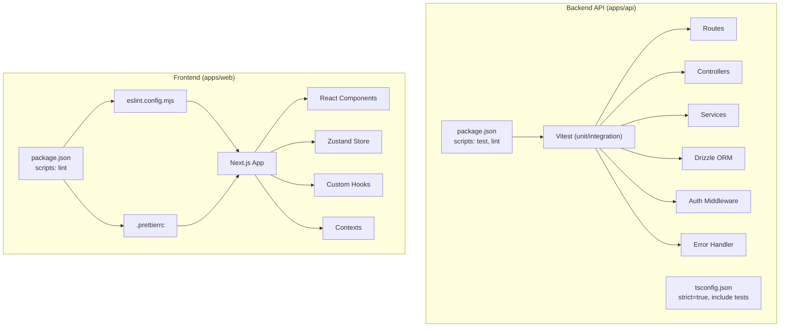
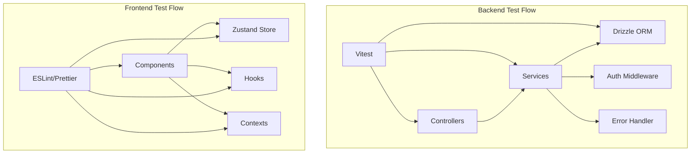
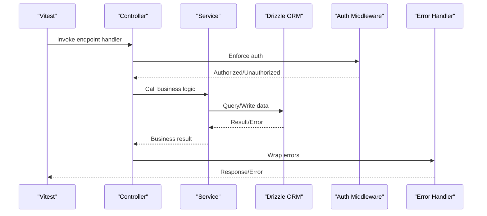
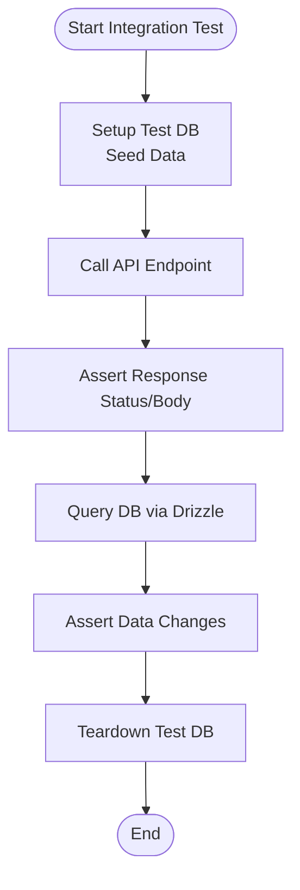
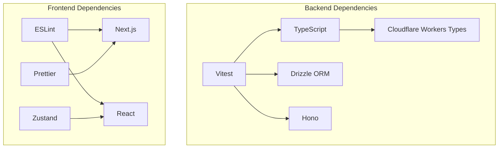

# Testing & Quality Assurance

<cite>
**Referenced Files in This Document**
- [apps/api/package.json](file://apps/api/package.json)
- [apps/web/package.json](file://apps/web/package.json)
- [apps/api/tsconfig.json](file://apps/api/tsconfig.json)
- [apps/web/tsconfig.json](file://apps/web/tsconfig.json)
- [apps/web/eslint.config.mjs](file://apps/web/eslint.config.mjs)
- [.prettierrc](file://.prettierrc)
- [apps/api/test-db.js](file://apps/api/test-db.js)
- [apps/api/test_checkout.ts](file://apps/api/test_checkout.ts)
- [apps/api/test_conn.js](file://apps/api/test_conn.js)
- [apps/api/test_fetch.js](file://apps/api/test_fetch.js)
- [apps/api/test_select.ts](file://apps/api/test_select.ts)
- [apps/api/src/controllers/auth.controller.ts](file://apps/api/src/controllers/auth.controller.ts)
- [apps/api/src/controllers/product.controller.ts](file://apps/api/src/controllers/product.controller.ts)
- [apps/api/src/controllers/transaction.controller.ts](file://apps/api/src/controllers/transaction.controller.ts)
- [apps/api/src/services/auth.service.ts](file://apps/api/src/services/auth.service.ts)
- [apps/api/src/services/product.service.ts](file://apps/api/src/services/product.service.ts)
- [apps/api/src/services/transaction.service.ts](file://apps/api/src/services/transaction.service.ts)
- [apps/api/src/routes/auth.routes.ts](file://apps/api/src/routes/auth.routes.ts)
- [apps/api/src/routes/product.routes.ts](file://apps/api/src/routes/product.routes.ts)
- [apps/api/src/routes/transaction.routes.ts](file://apps/api/src/routes/transaction.routes.ts)
- [apps/api/src/lib/db.ts](file://apps/api/src/lib/db.ts)
- [apps/api/src/middleware/auth.ts](file://apps/api/src/middleware/auth.ts)
- [apps/api/src/middleware/errorHandler.ts](file://apps/api/src/middleware/errorHandler.ts)
- [apps/web/src/app/(dashboard)/page.tsx](file://apps/web/src/app/(dashboard)/page.tsx)
- [apps/web/src/components/pos/ProductGrid.tsx](file://apps/web/src/components/pos/ProductGrid.tsx)
- [apps/web/src/components/pos/CartPanel.tsx](file://apps/web/src/components/pos/CartPanel.tsx)
- [apps/web/src/store/useCartStore.ts](file://apps/web/src/store/useCartStore.ts)
- [apps/web/src/lib/api.ts](file://apps/web/src/lib/api.ts)
- [apps/web/src/contexts/AuthContext.tsx](file://apps/web/src/contexts/AuthContext.tsx)
- [apps/web/src/hooks/useBarcodeScanner.ts](file://apps/web/src/hooks/useBarcodeScanner.ts)
- [apps/web/src/components/ErrorBoundary.tsx](file://apps/web/src/components/ErrorBoundary.tsx)
- [apps/web/src/middleware.ts](file://apps/web/src/middleware.ts)
</cite>

## Table of Contents
1. [Introduction](#introduction)
2. [Project Structure](#project-structure)
3. [Core Components](#core-components)
4. [Architecture Overview](#architecture-overview)
5. [Detailed Component Analysis](#detailed-component-analysis)
6. [Dependency Analysis](#dependency-analysis)
7. [Performance Considerations](#performance-considerations)
8. [Troubleshooting Guide](#troubleshooting-guide)
9. [Conclusion](#conclusion)
10. [Appendices](#appendices)

## Introduction
This document defines the testing and quality assurance strategy for the ARHAT POS development workflow. It covers unit testing for backend services and frontend components, integration testing for API endpoints and database operations, end-to-end testing for user workflows, code quality standards (ESLint, Prettier, TypeScript strict mode), best practices for test data management and continuous integration, performance and security testing approaches, and guidance for bug tracking, issue management, and quality metrics collection. The document also outlines testing automation, mock strategies, and test environment management aligned with the current repository structure and tooling.

## Project Structure
The project follows a monorepo-like structure with two primary applications:
- Backend API (Cloudflare Workers/Hono): located under apps/api, using Vitest for unit/integration tests and Drizzle ORM for database operations.
- Frontend (Next.js): located under apps/web, using Next.js runtime and React components.

Key testing and quality configuration:
- Backend uses Vitest via npm script "test".
- Frontend uses ESLint via npm script "lint".
- Shared code quality tools include TypeScript strict mode, Prettier formatting, and ESLint configuration.

**Diagram sources**
- [apps/api/package.json:1-37](file://apps/api/package.json#L1-L37)
- [apps/api/tsconfig.json:1-19](file://apps/api/tsconfig.json#L1-L19)
- [apps/web/package.json:1-40](file://apps/web/package.json#L1-L40)
- [apps/web/eslint.config.mjs:1-19](file://apps/web/eslint.config.mjs#L1-L19)
- [.prettierrc:1-9](file://.prettierrc#L1-L9)

**Section sources**
- [apps/api/package.json:1-37](file://apps/api/package.json#L1-L37)
- [apps/web/package.json:1-40](file://apps/web/package.json#L1-L40)
- [apps/api/tsconfig.json:1-19](file://apps/api/tsconfig.json#L1-L19)
- [apps/web/tsconfig.json:1-35](file://apps/web/tsconfig.json#L1-L35)
- [apps/web/eslint.config.mjs:1-19](file://apps/web/eslint.config.mjs#L1-L19)
- [.prettierrc:1-9](file://.prettierrc#L1-L9)

## Core Components
This section outlines the testing and quality assurance components currently present in the repository and how they map to the backend and frontend applications.

- Backend Unit/Integration Testing
  - Test runner: Vitest configured via npm script "test".
  - Test files: Located under apps/api/tests and included by tsconfig.json include pattern.
  - Example test scaffolding exists under apps/api (test-db.js, test_checkout.ts, test_conn.js, test_fetch.js, test_select.ts).

- Frontend Code Quality
  - Linting: ESLint via npm script "lint" with Next.js recommended config and TypeScript enabled.
  - Formatting: Prettier configuration for consistent formatting across the frontend.
  - Strict type checking: TypeScript strict mode enabled in tsconfig.json.

- Database and Middleware
  - Database abstraction: Drizzle ORM client configured in apps/api/src/lib/db.ts.
  - Authentication middleware: apps/api/src/middleware/auth.ts.
  - Global error handler: apps/api/src/middleware/errorHandler.ts.

- Frontend Components and Stores
  - POS components: ProductGrid.tsx, CartPanel.tsx.
  - State management: useCartStore.ts.
  - API client: api.ts.
  - Contexts and hooks: AuthContext.tsx, useBarcodeScanner.ts.
  - Error boundary: ErrorBoundary.tsx.
  - Middleware: middleware.ts.

**Section sources**
- [apps/api/package.json:10-11](file://apps/api/package.json#L10-L11)
- [apps/api/tsconfig.json:17-18](file://apps/api/tsconfig.json#L17-L18)
- [apps/api/test-db.js:1-50](file://apps/api/test-db.js#L1-L50)
- [apps/api/test_checkout.ts:1-50](file://apps/api/test_checkout.ts#L1-L50)
- [apps/api/test_conn.js:1-50](file://apps/api/test_conn.js#L1-L50)
- [apps/api/test_fetch.js:1-50](file://apps/api/test_fetch.js#L1-L50)
- [apps/api/test_select.ts:1-50](file://apps/api/test_select.ts#L1-L50)
- [apps/api/src/lib/db.ts:1-50](file://apps/api/src/lib/db.ts#L1-L50)
- [apps/api/src/middleware/auth.ts:1-50](file://apps/api/src/middleware/auth.ts#L1-L50)
- [apps/api/src/middleware/errorHandler.ts:1-50](file://apps/api/src/middleware/errorHandler.ts#L1-L50)
- [apps/web/eslint.config.mjs:1-19](file://apps/web/eslint.config.mjs#L1-L19)
- [.prettierrc:1-9](file://.prettierrc#L1-L9)
- [apps/web/tsconfig.json:7-7](file://apps/web/tsconfig.json#L7-L7)
- [apps/web/src/components/pos/ProductGrid.tsx:1-50](file://apps/web/src/components/pos/ProductGrid.tsx#L1-L50)
- [apps/web/src/components/pos/CartPanel.tsx:1-50](file://apps/web/src/components/pos/CartPanel.tsx#L1-L50)
- [apps/web/src/store/useCartStore.ts:1-50](file://apps/web/src/store/useCartStore.ts#L1-L50)
- [apps/web/src/lib/api.ts:1-50](file://apps/web/src/lib/api.ts#L1-L50)
- [apps/web/src/contexts/AuthContext.tsx:1-50](file://apps/web/src/contexts/AuthContext.tsx#L1-L50)
- [apps/web/src/hooks/useBarcodeScanner.ts:1-50](file://apps/web/src/hooks/useBarcodeScanner.ts#L1-L50)
- [apps/web/src/components/ErrorBoundary.tsx:1-50](file://apps/web/src/components/ErrorBoundary.tsx#L1-L50)
- [apps/web/src/middleware.ts:1-50](file://apps/web/src/middleware.ts#L1-L50)

## Architecture Overview
The testing architecture integrates unit, integration, and quality gates across backend and frontend:

- Backend
  - Controllers expose HTTP endpoints.
  - Services encapsulate business logic and depend on Drizzle ORM for persistence.
  - Middleware handles authentication and error handling.
  - Tests target controllers/services and routes to validate behavior and data access.

- Frontend
  - Next.js app with React components, Zustand stores, and API clients.
  - ESLint and Prettier enforce code quality and formatting.
  - Components and stores are prime candidates for unit testing and snapshot verification.

**Diagram sources**
- [apps/api/src/controllers/auth.controller.ts:1-50](file://apps/api/src/controllers/auth.controller.ts#L1-L50)
- [apps/api/src/controllers/product.controller.ts:1-50](file://apps/api/src/controllers/product.controller.ts#L1-L50)
- [apps/api/src/controllers/transaction.controller.ts:1-50](file://apps/api/src/controllers/transaction.controller.ts#L1-L50)
- [apps/api/src/services/auth.service.ts:1-50](file://apps/api/src/services/auth.service.ts#L1-L50)
- [apps/api/src/services/product.service.ts:1-50](file://apps/api/src/services/product.service.ts#L1-L50)
- [apps/api/src/services/transaction.service.ts:1-50](file://apps/api/src/services/transaction.service.ts#L1-L50)
- [apps/api/src/routes/auth.routes.ts:1-50](file://apps/api/src/routes/auth.routes.ts#L1-L50)
- [apps/api/src/routes/product.routes.ts:1-50](file://apps/api/src/routes/product.routes.ts#L1-L50)
- [apps/api/src/routes/transaction.routes.ts:1-50](file://apps/api/src/routes/transaction.routes.ts#L1-L50)
- [apps/api/src/lib/db.ts:1-50](file://apps/api/src/lib/db.ts#L1-L50)
- [apps/api/src/middleware/auth.ts:1-50](file://apps/api/src/middleware/auth.ts#L1-L50)
- [apps/api/src/middleware/errorHandler.ts:1-50](file://apps/api/src/middleware/errorHandler.ts#L1-L50)
- [apps/web/eslint.config.mjs:1-19](file://apps/web/eslint.config.mjs#L1-L19)
- [.prettierrc:1-9](file://.prettierrc#L1-L9)

## Detailed Component Analysis

### Backend Unit Testing Approach (Vitest)
- Runner and Scripts
  - The backend package.json defines a "test" script invoking Vitest.
  - TypeScript strict mode is enabled in tsconfig.json, ensuring robust type safety during tests.
- Test Coverage Areas
  - Controllers: Validate request handling, response shapes, and middleware effects.
  - Services: Exercise business logic independently of HTTP concerns.
  - Routes: Verify endpoint routing and parameter binding.
  - Database: Use Drizzle ORM client to run assertions against schema and data.
- Mock Strategies
  - Replace Drizzle client with a mock adapter for unit tests.
  - Stub external services (e.g., authentication tokens, third-party APIs) via dependency injection.
- Example Test Files
  - Existing scaffolding under apps/api/test-*.ts/js indicates test intent and can be extended with Vitest assertions.

**Diagram sources**
- [apps/api/package.json:10-11](file://apps/api/package.json#L10-L11)
- [apps/api/tsconfig.json:6-6](file://apps/api/tsconfig.json#L6-L6)
- [apps/api/src/controllers/auth.controller.ts:1-50](file://apps/api/src/controllers/auth.controller.ts#L1-L50)
- [apps/api/src/services/auth.service.ts:1-50](file://apps/api/src/services/auth.service.ts#L1-L50)
- [apps/api/src/lib/db.ts:1-50](file://apps/api/src/lib/db.ts#L1-L50)
- [apps/api/src/middleware/auth.ts:1-50](file://apps/api/src/middleware/auth.ts#L1-L50)
- [apps/api/src/middleware/errorHandler.ts:1-50](file://apps/api/src/middleware/errorHandler.ts#L1-L50)

**Section sources**
- [apps/api/package.json:10-11](file://apps/api/package.json#L10-L11)
- [apps/api/tsconfig.json:6-6](file://apps/api/tsconfig.json#L6-L6)
- [apps/api/test-db.js:1-50](file://apps/api/test-db.js#L1-L50)
- [apps/api/test_checkout.ts:1-50](file://apps/api/test_checkout.ts#L1-L50)
- [apps/api/test_conn.js:1-50](file://apps/api/test_conn.js#L1-L50)
- [apps/api/test_fetch.js:1-50](file://apps/api/test_fetch.js#L1-L50)
- [apps/api/test_select.ts:1-50](file://apps/api/test_select.ts#L1-L50)

### Integration Testing for API Endpoints and Database
- Endpoint Coverage
  - Auth routes/controllers/services for login/register flows.
  - Product routes/controllers/services for CRUD operations.
  - Transaction routes/controllers/services for checkout and reporting.
- Database Integration
  - Use Drizzle ORM client to connect to the test database.
  - Seed test data and assert schema correctness.
  - Validate transactional behavior and referential integrity.
- External Integrations
  - Authentication services and third-party APIs should be mocked or stubbed.
  - Use dependency injection to swap real implementations with test doubles.

**Diagram sources**
- [apps/api/src/lib/db.ts:1-50](file://apps/api/src/lib/db.ts#L1-L50)
- [apps/api/src/routes/auth.routes.ts:1-50](file://apps/api/src/routes/auth.routes.ts#L1-L50)
- [apps/api/src/routes/product.routes.ts:1-50](file://apps/api/src/routes/product.routes.ts#L1-L50)
- [apps/api/src/routes/transaction.routes.ts:1-50](file://apps/api/src/routes/transaction.routes.ts#L1-L50)
- [apps/api/src/services/auth.service.ts:1-50](file://apps/api/src/services/auth.service.ts#L1-L50)
- [apps/api/src/services/product.service.ts:1-50](file://apps/api/src/services/product.service.ts#L1-L50)
- [apps/api/src/services/transaction.service.ts:1-50](file://apps/api/src/services/transaction.service.ts#L1-L50)

**Section sources**
- [apps/api/src/lib/db.ts:1-50](file://apps/api/src/lib/db.ts#L1-L50)
- [apps/api/src/routes/auth.routes.ts:1-50](file://apps/api/src/routes/auth.routes.ts#L1-L50)
- [apps/api/src/routes/product.routes.ts:1-50](file://apps/api/src/routes/product.routes.ts#L1-L50)
- [apps/api/src/routes/transaction.routes.ts:1-50](file://apps/api/src/routes/transaction.routes.ts#L1-L50)
- [apps/api/src/services/auth.service.ts:1-50](file://apps/api/src/services/auth.service.ts#L1-L50)
- [apps/api/src/services/product.service.ts:1-50](file://apps/api/src/services/product.service.ts#L1-L50)
- [apps/api/src/services/transaction.service.ts:1-50](file://apps/api/src/services/transaction.service.ts#L1-L50)

### End-to-End Testing for User Workflows (Recommended Tools)
- Recommended Tools
  - Cypress or Playwright for browser-based E2E testing.
- Target Workflows
  - POS checkout flow: product search, add to cart, payment modal, receipt generation.
  - User authentication: login and protected route navigation.
  - Inventory management: product creation/editing and stock updates.
- Test Environment
  - Use a dedicated test database and API server for E2E runs.
  - Mock external services (payment providers, WhatsApp) to ensure determinism.

[No sources needed since this section provides general guidance]

### Code Quality Standards
- ESLint Configuration
  - Next.js core-web-vitals and TypeScript configurations are combined in apps/web/eslint.config.mjs.
  - Ignores are overridden to exclude default Next.js build artifacts.
- Prettier Formatting
  - Consistent formatting rules defined in .prettierrc.
- TypeScript Strict Mode
  - Enabled in both backend and frontend tsconfig.json files to catch type-related issues early.

**Section sources**
- [apps/web/eslint.config.mjs:1-19](file://apps/web/eslint.config.mjs#L1-L19)
- [.prettierrc:1-9](file://.prettierrc#L1-L9)
- [apps/api/tsconfig.json:6-6](file://apps/api/tsconfig.json#L6-L6)
- [apps/web/tsconfig.json:7-7](file://apps/web/tsconfig.json#L7-L7)

### Testing Best Practices
- Test Organization
  - Group tests by feature or module (e.g., auth, product, transaction).
  - Use descriptive test names and clear assertions.
- Test Data Management
  - Use deterministic seeds and fixtures; isolate tests with transaction rollbacks or schema resets.
- Continuous Integration
  - Run linting, unit tests, and integration tests on pull requests.
  - Gate deployments on passing tests and coverage thresholds.
- Mock Strategies
  - Prefer dependency injection to swap real implementations with mocks/stubs.
  - Keep mocks minimal and focused on the unit under test.

[No sources needed since this section provides general guidance]

### Bug Tracking, Issue Management, and Quality Metrics
- Bug Tracking
  - Use GitHub Issues or Jira to track bugs and regressions.
- Quality Metrics
  - Track test coverage, failure rates, flakiness, and mean time to detect/failures.
- Reporting
  - Integrate test results and coverage reports into CI dashboards.

[No sources needed since this section provides general guidance]

### Security Testing Procedures
- Input Validation
  - Validate and sanitize all inputs at controller/service boundaries.
- Authentication and Authorization
  - Verify middleware enforcement and role-based access controls.
- Secret Management
  - Avoid hardcoding secrets in tests; use environment variables or secure vaults.
- Dependency Review
  - Regularly audit dependencies for vulnerabilities.

[No sources needed since this section provides general guidance]

## Dependency Analysis
This section maps testing dependencies and their relationships to backend and frontend components.

**Diagram sources**
- [apps/api/package.json:25-34](file://apps/api/package.json#L25-L34)
- [apps/api/tsconfig.json:9-9](file://apps/api/tsconfig.json#L9-L9)
- [apps/web/package.json:29-37](file://apps/web/package.json#L29-L37)
- [apps/web/eslint.config.mjs:1-19](file://apps/web/eslint.config.mjs#L1-L19)
- [.prettierrc:1-9](file://.prettierrc#L1-L9)

**Section sources**
- [apps/api/package.json:25-34](file://apps/api/package.json#L25-L34)
- [apps/web/package.json:29-37](file://apps/web/package.json#L29-L37)
- [apps/api/tsconfig.json:9-9](file://apps/api/tsconfig.json#L9-L9)
- [apps/web/eslint.config.mjs:1-19](file://apps/web/eslint.config.mjs#L1-L19)
- [.prettierrc:1-9](file://.prettierrc#L1-L9)

## Performance Considerations
- Unit and Integration Test Performance
  - Use lightweight in-memory databases for tests; avoid real network calls.
  - Parallelize independent tests to reduce CI time.
- End-to-End Performance
  - Use headless browsers and minimize DOM queries.
  - Profile slow tests and refactor heavy fixtures.
- Load Testing
  - Use tools like k6 or Artillery to simulate concurrent users on backend endpoints.
  - Monitor latency, throughput, and error rates under load.

[No sources needed since this section provides general guidance]

## Troubleshooting Guide
- Common Issues
  - Type errors in tests due to missing strict mode configuration.
  - Database connection failures in CI environments.
  - Flaky tests caused by external service timing.
- Remediation
  - Enable strict TypeScript mode and fix type mismatches.
  - Use retry logic and timeouts for external services; prefer mocks.
  - Reset test databases per suite to avoid cross-test contamination.

**Section sources**
- [apps/api/tsconfig.json:6-6](file://apps/api/tsconfig.json#L6-L6)
- [apps/api/src/lib/db.ts:1-50](file://apps/api/src/lib/db.ts#L1-L50)
- [apps/web/eslint.config.mjs:8-15](file://apps/web/eslint.config.mjs#L8-L15)

## Conclusion
The ARHAT POS project has a solid foundation for testing and quality assurance with Vitest for backend unit/integration tests, Next.js ESLint/Prettier for frontend quality, and TypeScript strict mode across both applications. To mature the QA process, adopt E2E testing with Cypress/Playwright, formalize test data management, integrate performance and security testing, and establish CI gates with quality metrics. These steps will improve reliability, maintainability, and developer confidence.

## Appendices
- Appendix A: Backend Test Execution
  - Run backend tests via npm script "test" defined in apps/api/package.json.
- Appendix B: Frontend Linting
  - Run frontend linting via npm script "lint" defined in apps/web/package.json.

**Section sources**
- [apps/api/package.json:10-11](file://apps/api/package.json#L10-L11)
- [apps/web/package.json:9-9](file://apps/web/package.json#L9-L9)