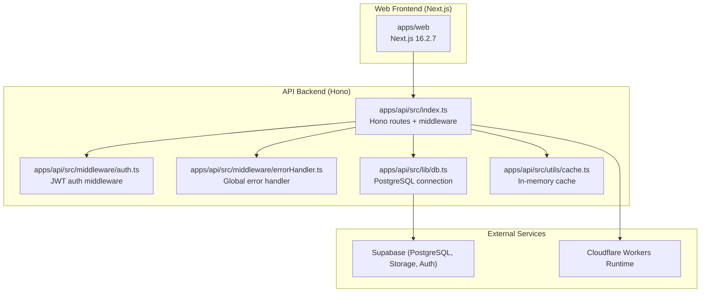
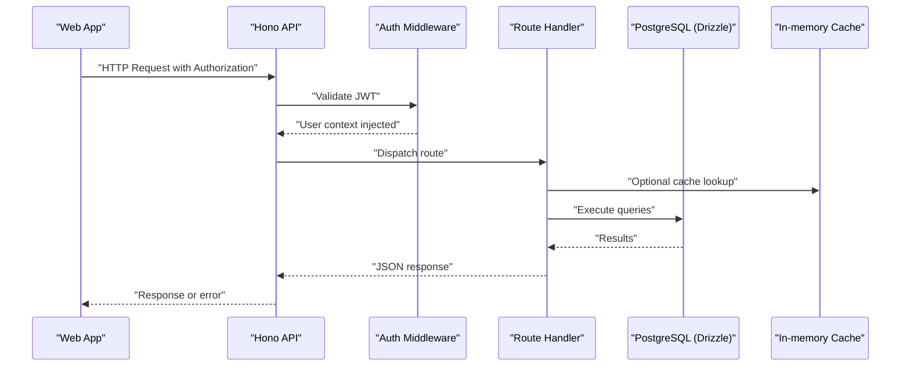
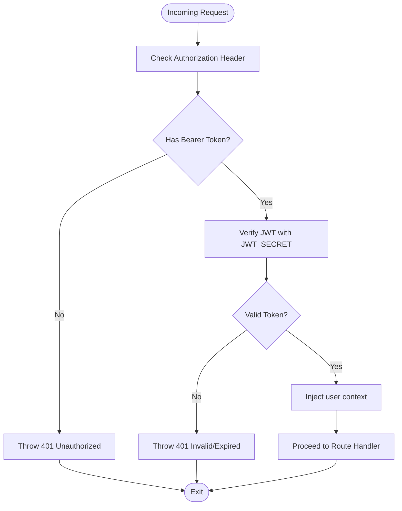
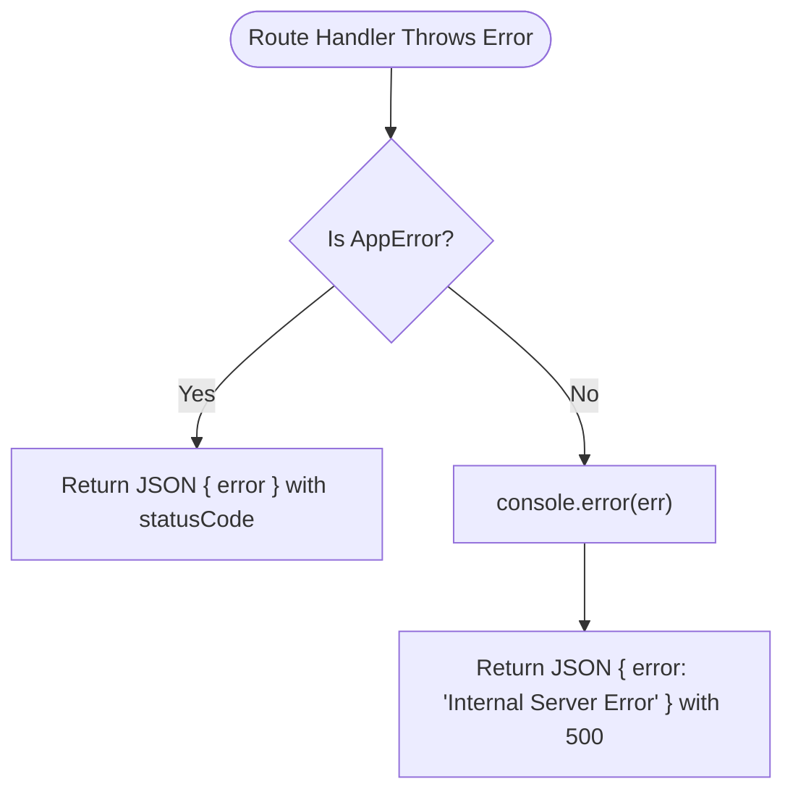
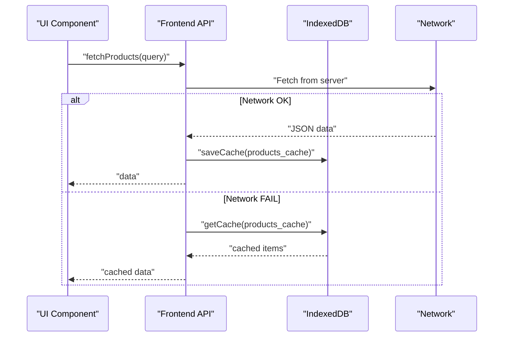
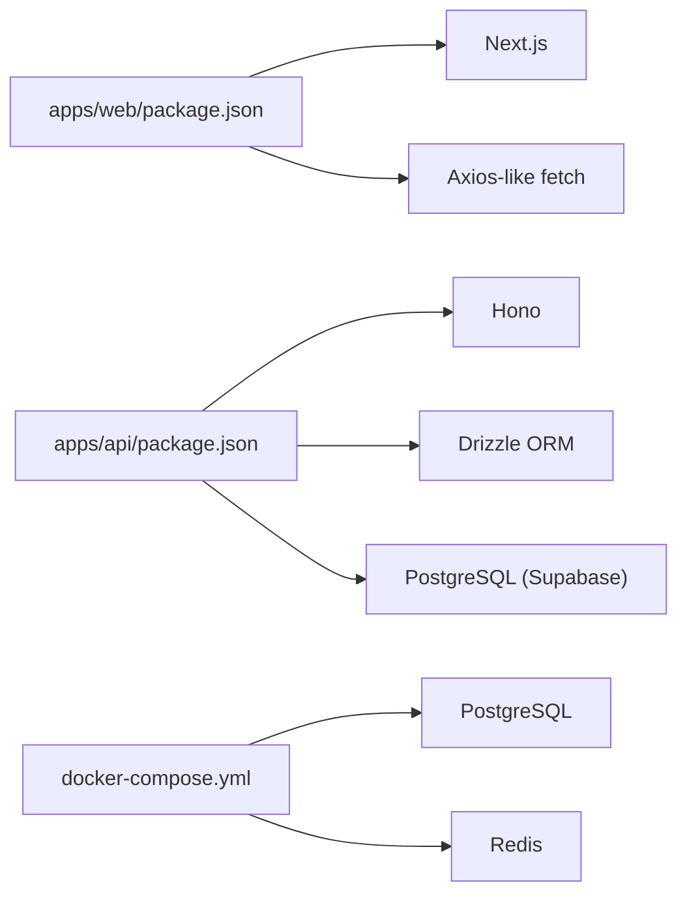

# Troubleshooting & FAQ

<cite>
**Referenced Files in This Document**
- [README.md](file://README.md)
- [apps/api/package.json](file://apps/api/package.json)
- [apps/web/package.json](file://apps/web/package.json)
- [apps/api/src/index.ts](file://apps/api/src/index.ts)
- [apps/api/src/lib/db.ts](file://apps/api/src/lib/db.ts)
- [apps/api/src/lib/errors.ts](file://apps/api/src/lib/errors.ts)
- [apps/api/src/middleware/errorHandler.ts](file://apps/api/src/middleware/errorHandler.ts)
- [apps/api/src/middleware/auth.ts](file://apps/api/src/middleware/auth.ts)
- [apps/api/src/utils/cache.ts](file://apps/api/src/utils/cache.ts)
- [apps/api/src/controllers/auth.controller.ts](file://apps/api/src/controllers/auth.controller.ts)
- [apps/api/src/controllers/product.controller.ts](file://apps/api/src/controllers/product.controller.ts)
- [apps/api/src/controllers/transaction.controller.ts](file://apps/api/src/controllers/transaction.controller.ts)
- [apps/web/src/lib/api.ts](file://apps/web/src/lib/api.ts)
- [apps/web/src/components/ErrorBoundary.tsx](file://apps/web/src/components/ErrorBoundary.tsx)
- [apps/web/src/lib/indexeddb.ts](file://apps/web/src/lib/indexeddb.ts)
- [docker-compose.yml](file://docker-compose.yml)
</cite>

## Table of Contents
1. [Introduction](#introduction)
2. [Project Structure](#project-structure)
3. [Core Components](#core-components)
4. [Architecture Overview](#architecture-overview)
5. [Detailed Component Analysis](#detailed-component-analysis)
6. [Dependency Analysis](#dependency-analysis)
7. [Performance Considerations](#performance-considerations)
8. [Troubleshooting Guide](#troubleshooting-guide)
9. [FAQ](#faq)
10. [Conclusion](#conclusion)
11. [Appendices](#appendices)

## Introduction
This document provides comprehensive troubleshooting and FAQ guidance for ARHAT POS users and developers. It covers installation and configuration issues, runtime exceptions, debugging techniques for frontend and backend, database connectivity problems, performance optimization, error handling and logging, diagnostics, integration challenges with external services, monitoring and alerting, incident response, and recovery procedures.

## Project Structure
ARHAT POS is a cloud-first, multi-module system:
- Frontend (Next.js) in apps/web
- Backend (Hono on Cloudflare Workers) in apps/api
- Shared technologies include Drizzle ORM, PostgreSQL (via Supabase), and optional local Docker stack for development

**Diagram sources**
- [apps/api/src/index.ts:1-99](file://apps/api/src/index.ts#L1-L99)
- [apps/api/src/middleware/auth.ts:1-34](file://apps/api/src/middleware/auth.ts#L1-L34)
- [apps/api/src/middleware/errorHandler.ts:1-11](file://apps/api/src/middleware/errorHandler.ts#L1-L11)
- [apps/api/src/lib/db.ts:1-27](file://apps/api/src/lib/db.ts#L1-L27)
- [apps/api/src/utils/cache.ts:1-56](file://apps/api/src/utils/cache.ts#L1-L56)
- [apps/web/src/lib/api.ts:1-618](file://apps/web/src/lib/api.ts#L1-L618)

**Section sources**
- [README.md:403-480](file://README.md#L403-L480)
- [apps/api/src/index.ts:1-99](file://apps/api/src/index.ts#L1-L99)
- [apps/web/src/lib/api.ts:1-618](file://apps/web/src/lib/api.ts#L1-L618)

## Core Components
- API Gateway and Routing: Hono-based router with CORS, logging, health checks, and OpenAPI docs
- Authentication: JWT-based middleware validating Authorization headers
- Error Handling: Centralized error handler returning structured JSON with appropriate status codes
- Database Connectivity: Drizzle ORM with PostgreSQL via Supabase; graceful handling of missing DATABASE_URL
- Caching: In-memory cache utility for API optimization
- Frontend API Layer: Axios-like fetch wrappers with offline fallback and IndexedDB-backed sync queue
- Offline Persistence: IndexedDB stores caches and queued sync operations

Key implementation references:
- API bootstrap and routing: [apps/api/src/index.ts:1-99](file://apps/api/src/index.ts#L1-L99)
- Auth middleware: [apps/api/src/middleware/auth.ts:1-34](file://apps/api/src/middleware/auth.ts#L1-L34)
- Global error handler: [apps/api/src/middleware/errorHandler.ts:1-11](file://apps/api/src/middleware/errorHandler.ts#L1-L11)
- Database initialization: [apps/api/src/lib/db.ts:1-27](file://apps/api/src/lib/db.ts#L1-L27)
- Cache utility: [apps/api/src/utils/cache.ts:1-56](file://apps/api/src/utils/cache.ts#L1-L56)
- Frontend API layer: [apps/web/src/lib/api.ts:1-618](file://apps/web/src/lib/api.ts#L1-L618)
- Offline persistence: [apps/web/src/lib/indexeddb.ts:1-147](file://apps/web/src/lib/indexeddb.ts#L1-L147)

**Section sources**
- [apps/api/src/index.ts:1-99](file://apps/api/src/index.ts#L1-L99)
- [apps/api/src/middleware/auth.ts:1-34](file://apps/api/src/middleware/auth.ts#L1-L34)
- [apps/api/src/middleware/errorHandler.ts:1-11](file://apps/api/src/middleware/errorHandler.ts#L1-L11)
- [apps/api/src/lib/db.ts:1-27](file://apps/api/src/lib/db.ts#L1-L27)
- [apps/api/src/utils/cache.ts:1-56](file://apps/api/src/utils/cache.ts#L1-L56)
- [apps/web/src/lib/api.ts:1-618](file://apps/web/src/lib/api.ts#L1-L618)
- [apps/web/src/lib/indexeddb.ts:1-147](file://apps/web/src/lib/indexeddb.ts#L1-L147)

## Architecture Overview
High-level flow:
- Web app calls API endpoints with Authorization header
- API validates JWT, executes business logic, and returns JSON
- On errors, centralized handler responds with structured messages
- Database operations use Drizzle ORM against PostgreSQL
- Frontend handles offline scenarios via IndexedDB and queues

**Diagram sources**
- [apps/api/src/index.ts:1-99](file://apps/api/src/index.ts#L1-L99)
- [apps/api/src/middleware/auth.ts:1-34](file://apps/api/src/middleware/auth.ts#L1-L34)
- [apps/api/src/lib/db.ts:1-27](file://apps/api/src/lib/db.ts#L1-L27)
- [apps/api/src/utils/cache.ts:1-56](file://apps/api/src/utils/cache.ts#L1-L56)
- [apps/web/src/lib/api.ts:1-618](file://apps/web/src/lib/api.ts#L1-L618)

## Detailed Component Analysis

### Authentication and Authorization
Common issues:
- Missing or malformed Authorization header
- Invalid/expired JWT
- Missing JWT_SECRET environment variable
- Unauthorized access to protected routes

Resolution steps:
- Verify Authorization header format: Bearer <token>
- Confirm JWT_SECRET is configured in environment
- Regenerate tokens if expired
- Check user role and tenant context

**Diagram sources**
- [apps/api/src/middleware/auth.ts:1-34](file://apps/api/src/middleware/auth.ts#L1-L34)

**Section sources**
- [apps/api/src/middleware/auth.ts:1-34](file://apps/api/src/middleware/auth.ts#L1-L34)

### Error Handling and Logging
Patterns:
- Custom AppError with statusCode
- Global error handler converts AppError to JSON with status
- Non-AppError exceptions logged to console and returned as 500

**Diagram sources**
- [apps/api/src/lib/errors.ts:1-8](file://apps/api/src/lib/errors.ts#L1-L8)
- [apps/api/src/middleware/errorHandler.ts:1-11](file://apps/api/src/middleware/errorHandler.ts#L1-L11)

**Section sources**
- [apps/api/src/lib/errors.ts:1-8](file://apps/api/src/lib/errors.ts#L1-L8)
- [apps/api/src/middleware/errorHandler.ts:1-11](file://apps/api/src/middleware/errorHandler.ts#L1-L11)

### Database Connectivity
Issues:
- DATABASE_URL missing or empty
- PostgreSQL connection failure
- Drizzle initialization errors

Mitigations:
- Ensure DATABASE_URL is present in environment
- Validate SSL requirements and connection string format
- Monitor logs for initialization warnings

**Section sources**
- [apps/api/src/lib/db.ts:1-27](file://apps/api/src/lib/db.ts#L1-L27)

### Frontend API Layer and Offline Fallback
Key behaviors:
- Adds Authorization header from cookie
- Handles 401 by clearing token and redirecting to login
- Falls back to IndexedDB cache for products and customers when network fails
- Queues offline transactions and simulates success for immediate UX

**Diagram sources**
- [apps/web/src/lib/api.ts:42-64](file://apps/web/src/lib/api.ts#L42-L64)
- [apps/web/src/lib/indexeddb.ts:45-86](file://apps/web/src/lib/indexeddb.ts#L45-L86)

**Section sources**
- [apps/web/src/lib/api.ts:1-618](file://apps/web/src/lib/api.ts#L1-L618)
- [apps/web/src/lib/indexeddb.ts:1-147](file://apps/web/src/lib/indexeddb.ts#L1-L147)

### Transaction Processing and WhatsApp Receipt Trigger
Behavior:
- Create transaction and immediately checkout
- Asynchronously trigger WhatsApp receipt if customer phone provided
- Graceful error handling for external service failures

**Section sources**
- [apps/api/src/controllers/transaction.controller.ts:16-86](file://apps/api/src/controllers/transaction.controller.ts#L16-L86)

## Dependency Analysis
- Frontend depends on NEXT_PUBLIC_API_URL and cookies for auth
- Backend depends on environment variables (DATABASE_URL, JWT_SECRET)
- Both depend on Supabase for PostgreSQL and storage
- Optional local Docker stack for development

**Diagram sources**
- [apps/web/package.json:1-40](file://apps/web/package.json#L1-L40)
- [apps/api/package.json:1-37](file://apps/api/package.json#L1-L37)
- [docker-compose.yml:1-43](file://docker-compose.yml#L1-L43)

**Section sources**
- [apps/web/package.json:1-40](file://apps/web/package.json#L1-L40)
- [apps/api/package.json:1-37](file://apps/api/package.json#L1-L37)
- [docker-compose.yml:1-43](file://docker-compose.yml#L1-L43)

## Performance Considerations
- Database query optimization
  - Use prepared statements and limit unnecessary joins
  - Index frequently queried columns (tenantId, SKU, barcode)
  - Batch operations for inventory movements and adjustments
- Caching strategies
  - Utilize in-memory cache for read-heavy endpoints
  - Cache product/customer lists locally in IndexedDB
  - Invalidate cache on write operations
- Frontend performance
  - Debounce search queries
  - Lazy load heavy components
  - Use efficient rendering and virtualization for large lists
- Backend scalability
  - Offload non-critical tasks (e.g., WhatsApp receipts) to async handlers
  - Monitor response times and apply rate limiting where appropriate

[No sources needed since this section provides general guidance]

## Troubleshooting Guide

### Installation and Setup
- Environment variables
  - DATABASE_URL must be set for backend
  - JWT_SECRET must be set for auth middleware
  - NEXT_PUBLIC_API_URL must point to the deployed API
- Local development
  - Use Docker Compose to spin up PostgreSQL and Redis for local testing
  - Ensure ports are free (5432, 6379, 5050 for pgAdmin)

**Section sources**
- [apps/api/src/lib/db.ts:1-27](file://apps/api/src/lib/db.ts#L1-L27)
- [apps/api/src/middleware/auth.ts:15-17](file://apps/api/src/middleware/auth.ts#L15-L17)
- [apps/web/src/lib/api.ts:1](file://apps/web/src/lib/api.ts#L1)
- [docker-compose.yml:1-43](file://docker-compose.yml#L1-L43)

### Configuration Errors
- Missing DATABASE_URL
  - Symptom: Warning during startup and inability to connect to DB
  - Resolution: Set DATABASE_URL to a valid PostgreSQL connection string
- Missing JWT_SECRET
  - Symptom: 500 errors on protected routes
  - Resolution: Configure JWT_SECRET in environment
- CORS issues
  - Symptom: Preflight or blocked requests
  - Resolution: Add allowed origins in CORS middleware

**Section sources**
- [apps/api/src/lib/db.ts:12-15](file://apps/api/src/lib/db.ts#L12-L15)
- [apps/api/src/middleware/auth.ts:16-17](file://apps/api/src/middleware/auth.ts#L16-L17)
- [apps/api/src/index.ts:19-35](file://apps/api/src/index.ts#L19-L35)

### Runtime Exceptions
- 401 Unauthorized
  - Cause: Missing/invalid Authorization header or invalid/expired token
  - Action: Re-authenticate and retry
- 500 Internal Server Error
  - Cause: Unhandled exceptions or misconfiguration
  - Action: Check server logs and error handler output

**Section sources**
- [apps/api/src/middleware/auth.ts:8-10](file://apps/api/src/middleware/auth.ts#L8-L10)
- [apps/api/src/middleware/auth.ts:31](file://apps/api/src/middleware/auth.ts#L31)
- [apps/api/src/middleware/errorHandler.ts:4-10](file://apps/api/src/middleware/errorHandler.ts#L4-L10)

### Database Connectivity Problems
- Symptoms: Connection refused, SSL errors, or initialization failures
- Steps:
  - Verify DATABASE_URL format and credentials
  - Test connectivity externally
  - Review logs for initialization errors
  - Use Docker Compose for local PostgreSQL testing

**Section sources**
- [apps/api/src/lib/db.ts:9-24](file://apps/api/src/lib/db.ts#L9-L24)
- [docker-compose.yml:4-16](file://docker-compose.yml#L4-L16)

### Frontend Debugging Techniques
- Enable development mode to see error details in UI
- Use browser DevTools Network tab to inspect API calls
- Check IndexedDB contents for cached data and sync queue
- Simulate offline scenarios to test fallback behavior

**Section sources**
- [apps/web/src/components/ErrorBoundary.tsx:60-64](file://apps/web/src/components/ErrorBoundary.tsx#L60-L64)
- [apps/web/src/lib/indexeddb.ts:14-42](file://apps/web/src/lib/indexeddb.ts#L14-L42)

### Backend API Debugging
- Use health endpoint to confirm service availability
- Inspect logs for request traces and error messages
- Validate JWT token generation and verification
- Test individual routes with curl or Postman

**Section sources**
- [apps/api/src/index.ts:41-44](file://apps/api/src/index.ts#L41-L44)
- [apps/api/src/middleware/auth.ts:19-27](file://apps/api/src/middleware/auth.ts#L19-L27)

### Product Management Issues
- Duplicate SKU errors
  - Symptom: Validation errors when creating/updating products
  - Resolution: Change SKU to a unique value
- Search not returning results
  - Check IndexedDB cache and network connectivity

**Section sources**
- [apps/api/src/controllers/product.controller.ts:36-39](file://apps/api/src/controllers/product.controller.ts#L36-L39)
- [apps/api/src/controllers/product.controller.ts:53-56](file://apps/api/src/controllers/product.controller.ts#L53-L56)
- [apps/web/src/lib/api.ts:42-64](file://apps/web/src/lib/api.ts#L42-L64)

### Transaction Processing Failures
- Offline sync queue not draining
  - Check IndexedDB sync queue and network connectivity
  - Manually retry failed entries after connectivity is restored
- WhatsApp receipt not sent
  - External service failures are caught and logged; retry later

**Section sources**
- [apps/web/src/lib/api.ts:99-118](file://apps/web/src/lib/api.ts#L99-L118)
- [apps/web/src/lib/indexeddb.ts:88-145](file://apps/web/src/lib/indexeddb.ts#L88-L145)
- [apps/api/src/controllers/transaction.controller.ts:27-31](file://apps/api/src/controllers/transaction.controller.ts#L27-L31)

### Error Handling Patterns and Logging
- Centralized error handling ensures consistent responses
- Non-AppError exceptions are logged and masked to prevent sensitive data exposure
- Use structured logs for correlation IDs and request tracing

**Section sources**
- [apps/api/src/middleware/errorHandler.ts:4-10](file://apps/api/src/middleware/errorHandler.ts#L4-L10)

### Diagnostics Procedures
- Health check: GET /health
- API docs: GET /api/docs
- Frontend: Inspect cookies and localStorage for token presence
- Backend: Verify environment variables and database connectivity

**Section sources**
- [apps/api/src/index.ts:41-78](file://apps/api/src/index.ts#L41-L78)
- [apps/web/src/lib/api.ts:4-8](file://apps/web/src/lib/api.ts#L4-L8)

### Integration Issues
- External services (WhatsApp receipts)
  - Failures are handled gracefully; logs are produced for investigation
- Payment processors
  - Not implemented in the current codebase; integrate via backend services and proper error handling
- Hardware devices
  - Not present in current codebase; ensure device drivers and APIs are compatible with deployment environment

**Section sources**
- [apps/api/src/controllers/transaction.controller.ts:27-31](file://apps/api/src/controllers/transaction.controller.ts#L27-L31)

### Support Resources, Community Forums, and Escalation
- Refer to project README for product vision and roadmap
- Use GitHub for issue tracking and discussions
- For enterprise deployments, coordinate with DevOps team for infrastructure support

**Section sources**
- [README.md:537-562](file://README.md#L537-L562)

### System Health Monitoring, Alerting, and Incident Response
- Health endpoint for basic service checks
- Centralized logging for error tracking
- For production-grade monitoring, consider integrating with external observability stacks

**Section sources**
- [apps/api/src/index.ts:41-44](file://apps/api/src/index.ts#L41-L44)
- [apps/api/src/middleware/errorHandler.ts:8](file://apps/api/src/middleware/errorHandler.ts#L8)

### Recovery Procedures for Critical Failures
- Restart Cloudflare Worker deployment
- Recreate database connection if initialization fails
- Clear frontend caches and retry operations
- Drain offline sync queue after restoring connectivity

**Section sources**
- [apps/api/src/lib/db.ts:20-24](file://apps/api/src/lib/db.ts#L20-L24)
- [apps/web/src/lib/indexeddb.ts:88-145](file://apps/web/src/lib/indexeddb.ts#L88-L145)

## FAQ

### User Onboarding
- How do I log in?
  - Use the login page; for PIN-based login, use the dedicated endpoint in the frontend API.
- What roles are available?
  - Super Admin, Owner, Manager, Cashier. Permissions vary by role.

**Section sources**
- [apps/web/src/lib/api.ts:28-40](file://apps/web/src/lib/api.ts#L28-L40)
- [README.md:109-128](file://README.md#L109-L128)

### Feature Usage
- How do I search for products?
  - Use the product search field; results are cached locally for offline access.
- How do I handle a transaction offline?
  - The system queues the transaction and simulates success; sync when connectivity is restored.

**Section sources**
- [apps/web/src/lib/api.ts:42-64](file://apps/web/src/lib/api.ts#L42-L64)
- [apps/web/src/lib/api.ts:99-118](file://apps/web/src/lib/api.ts#L99-L118)

### System Limitations
- Offline capabilities are limited to cached data and queued operations.
- Some features require network connectivity for full functionality.

**Section sources**
- [apps/web/src/lib/api.ts:55-63](file://apps/web/src/lib/api.ts#L55-L63)
- [apps/web/src/lib/api.ts:99-118](file://apps/web/src/lib/api.ts#L99-L118)

### Integration Questions
- Can I integrate with external payment providers?
  - Not implemented in the current codebase; extend backend services accordingly.
- Are hardware integrations supported?
  - Not present in current codebase; ensure compatibility with deployment environment.

**Section sources**
- [apps/api/src/controllers/transaction.controller.ts:27-31](file://apps/api/src/controllers/transaction.controller.ts#L27-L31)

## Conclusion
This guide consolidates troubleshooting workflows, debugging techniques, performance tips, and operational procedures for ARHAT POS. By following the outlined steps and leveraging the built-in error handling, caching, and offline mechanisms, teams can maintain system reliability and quickly resolve common issues.

[No sources needed since this section summarizes without analyzing specific files]

## Appendices

### Quick Reference: Common Endpoints
- Health: GET /health
- API Docs: GET /api/docs
- Auth: POST /api/auth/login-pin
- Transactions: POST /api/transactions, POST /api/transactions/offline-sync
- Products: GET /api/products/search

**Section sources**
- [apps/api/src/index.ts:41-78](file://apps/api/src/index.ts#L41-L78)
- [apps/api/src/controllers/auth.controller.ts:72-89](file://apps/api/src/controllers/auth.controller.ts#L72-L89)
- [apps/api/src/controllers/transaction.controller.ts:16-86](file://apps/api/src/controllers/transaction.controller.ts#L16-L86)
- [apps/api/src/controllers/product.controller.ts:5-11](file://apps/api/src/controllers/product.controller.ts#L5-L11)