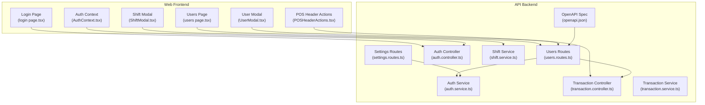
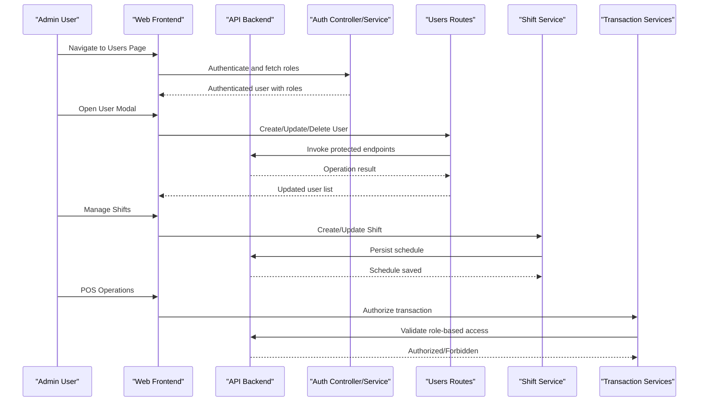
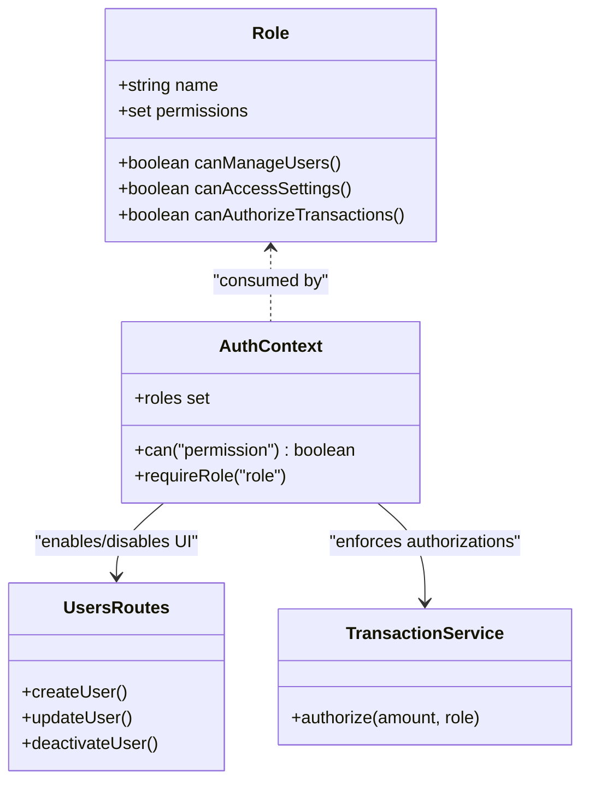
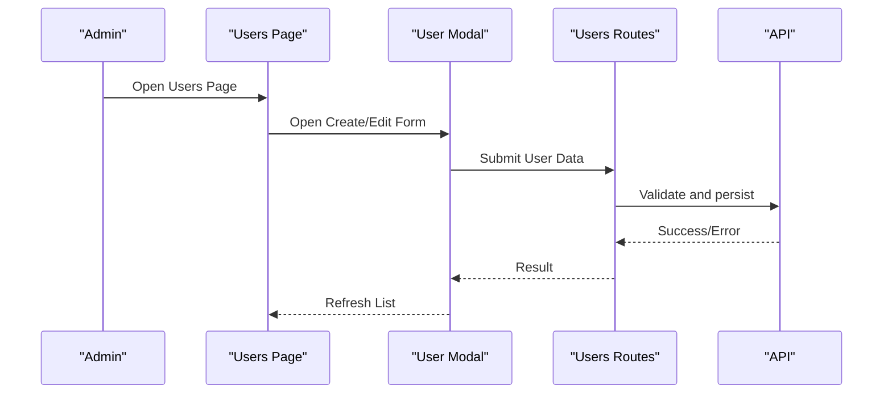
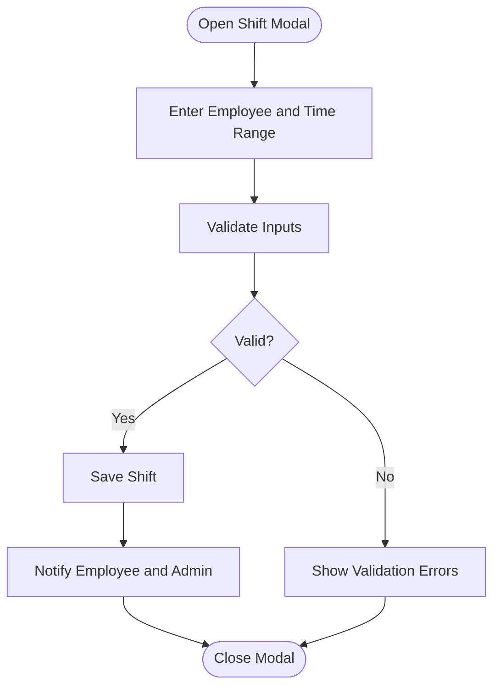
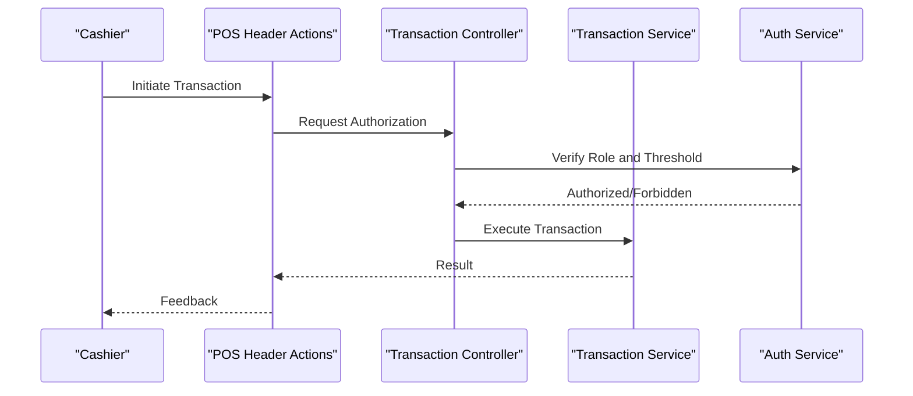
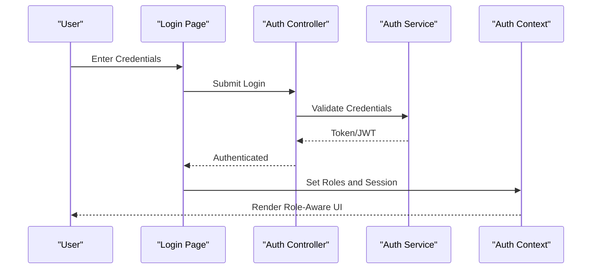
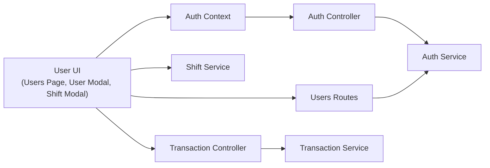

# User Administration

<cite>
**Referenced Files in This Document**
- [users.routes.ts](file://apps/api/src/routes/users.routes.ts)
- [auth.controller.ts](file://apps/api/src/controllers/auth.controller.ts)
- [auth.service.ts](file://apps/api/src/services/auth.service.ts)
- [shift.service.ts](file://apps/api/src/services/shift.service.ts)
- [UserModal.tsx](file://apps/web/src/components/users/UserModal.tsx)
- [AuthContext.tsx](file://apps/web/src/contexts/AuthContext.tsx)
- [login page.tsx](file://apps/web/src/app/auth/login/page.tsx)
- [users page.tsx](file://apps/web/src/app/users/page.tsx)
- [ShiftModal.tsx](file://apps/web/src/components/pos/ShiftModal.tsx)
- [POSHeaderActions.tsx](file://apps/web/src/components/pos/POSHeaderActions.tsx)
- [transaction.controller.ts](file://apps/api/src/controllers/transaction.controller.ts)
- [transaction.service.ts](file://apps/api/src/services/transaction.service.ts)
- [settings.routes.ts](file://apps/api/src/routes/settings.routes.ts)
- [settings routes.ts](file://apps/api/src/routes/settings.routes.ts)
- [openapi.json](file://apps/api/public/openapi.json)
</cite>

## Table of Contents
1. [Introduction](#introduction)
2. [Project Structure](#project-structure)
3. [Core Components](#core-components)
4. [Architecture Overview](#architecture-overview)
5. [Detailed Component Analysis](#detailed-component-analysis)
6. [Dependency Analysis](#dependency-analysis)
7. [Performance Considerations](#performance-considerations)
8. [Troubleshooting Guide](#troubleshooting-guide)
9. [Conclusion](#conclusion)
10. [Appendices](#appendices)

## Introduction
This document provides comprehensive user administration guidance for the ARHAT POS user management system. It covers account lifecycle operations (create, update, deactivate), role and permission model, scheduling and shift tracking, onboarding procedures, UI workflows, activity monitoring, audit capabilities, session management, POS integration, and user lifecycle management. The goal is to enable administrators to confidently manage team members, configure access levels, and maintain secure operations aligned with role-based feature access.

## Project Structure
User administration spans both the frontend Next.js application and the backend API server. The frontend exposes user management pages and modals, while the backend provides authentication, authorization, user CRUD endpoints, and shift-related services. The API also integrates with POS transaction services and settings routes to enforce role-based access to sensitive operations.

**Diagram sources**
- [users page.tsx](file://apps/web/src/app/users/page.tsx)
- [UserModal.tsx](file://apps/web/src/components/users/UserModal.tsx)
- [login page.tsx](file://apps/web/src/app/auth/login/page.tsx)
- [AuthContext.tsx](file://apps/web/src/contexts/AuthContext.tsx)
- [ShiftModal.tsx](file://apps/web/src/components/pos/ShiftModal.tsx)
- [POSHeaderActions.tsx](file://apps/web/src/components/pos/POSHeaderActions.tsx)
- [users.routes.ts](file://apps/api/src/routes/users.routes.ts)
- [auth.controller.ts](file://apps/api/src/controllers/auth.controller.ts)
- [auth.service.ts](file://apps/api/src/services/auth.service.ts)
- [shift.service.ts](file://apps/api/src/services/shift.service.ts)
- [transaction.controller.ts](file://apps/api/src/controllers/transaction.controller.ts)
- [transaction.service.ts](file://apps/api/src/services/transaction.service.ts)
- [settings.routes.ts](file://apps/api/src/routes/settings.routes.ts)
- [openapi.json](file://apps/api/public/openapi.json)

**Section sources**
- [users page.tsx](file://apps/web/src/app/users/page.tsx)
- [users.routes.ts](file://apps/api/src/routes/users.routes.ts)

## Core Components
- User Management UI
  - Users page for listing and managing team members.
  - User modal for creating, editing, and deactivating user accounts.
- Authentication and Authorization
  - Login page and authentication controller/service for session management.
  - Auth context for client-side role-aware rendering and navigation.
- Scheduling and Shift Tracking
  - Shift modal and shift service for shift creation, updates, and time-based access.
- POS Integration
  - POS header actions integrate with transaction services to enforce role-based authorizations.
- Settings and Permissions
  - Settings routes expose configuration endpoints; permissions gate sensitive operations.

Key implementation touchpoints:
- User CRUD endpoints via users routes.
- Role-aware UI rendering via AuthContext.
- Shift lifecycle via shift service and modal.
- Transaction authorizations via transaction controller/service.

**Section sources**
- [UserModal.tsx](file://apps/web/src/components/users/UserModal.tsx)
- [AuthContext.tsx](file://apps/web/src/contexts/AuthContext.tsx)
- [shift.service.ts](file://apps/api/src/services/shift.service.ts)
- [transaction.controller.ts](file://apps/api/src/controllers/transaction.controller.ts)
- [transaction.service.ts](file://apps/api/src/services/transaction.service.ts)

## Architecture Overview
The user administration architecture separates concerns between frontend UI and backend services. The frontend authenticates users, renders role-aware views, and invokes backend APIs. The backend enforces authorization policies, manages user records, and coordinates with POS services for role-based operations.

**Diagram sources**
- [users page.tsx](file://apps/web/src/app/users/page.tsx)
- [UserModal.tsx](file://apps/web/src/components/users/UserModal.tsx)
- [login page.tsx](file://apps/web/src/app/auth/login/page.tsx)
- [auth.controller.ts](file://apps/api/src/controllers/auth.controller.ts)
- [auth.service.ts](file://apps/api/src/services/auth.service.ts)
- [users.routes.ts](file://apps/api/src/routes/users.routes.ts)
- [shift.service.ts](file://apps/api/src/services/shift.service.ts)
- [transaction.controller.ts](file://apps/api/src/controllers/transaction.controller.ts)
- [transaction.service.ts](file://apps/api/src/services/transaction.service.ts)

## Detailed Component Analysis

### Role and Permission Model
Roles define access levels and feature visibility:
- Super Admin: Full system control, including user management, settings, and POS authorizations.
- Owner: Administrative privileges with restrictions compared to Super Admin.
- Manager: Team oversight and operational controls, limited access to sensitive settings.
- Cashier: POS operations with transaction authorizations constrained by role.

Access enforcement occurs at:
- Frontend via AuthContext for UI rendering and navigation.
- Backend via route guards and service-level checks.

**Diagram sources**
- [AuthContext.tsx](file://apps/web/src/contexts/AuthContext.tsx)
- [users.routes.ts](file://apps/api/src/routes/users.routes.ts)
- [transaction.service.ts](file://apps/api/src/services/transaction.service.ts)

**Section sources**
- [AuthContext.tsx](file://apps/web/src/contexts/AuthContext.tsx)
- [users.routes.ts](file://apps/api/src/routes/users.routes.ts)
- [transaction.service.ts](file://apps/api/src/services/transaction.service.ts)

### User Management Interface
- Users page lists team members with action buttons for editing and deactivation.
- User modal supports:
  - Creating new users with profile details.
  - Updating existing profiles and roles.
  - Deactivating accounts to revoke access.
- Backend endpoints handle persistence and validation.

**Diagram sources**
- [users page.tsx](file://apps/web/src/app/users/page.tsx)
- [UserModal.tsx](file://apps/web/src/components/users/UserModal.tsx)
- [users.routes.ts](file://apps/api/src/routes/users.routes.ts)

**Section sources**
- [users page.tsx](file://apps/web/src/app/users/page.tsx)
- [UserModal.tsx](file://apps/web/src/components/users/UserModal.tsx)
- [users.routes.ts](file://apps/api/src/routes/users.routes.ts)

### Employee Scheduling and Shift Tracking
- Shift modal enables scheduling employees for specific time slots.
- Shift service manages shift creation, updates, and time-based access enforcement.
- Time-based access restricts POS operations during unauthorized periods.

**Diagram sources**
- [ShiftModal.tsx](file://apps/web/src/components/pos/ShiftModal.tsx)
- [shift.service.ts](file://apps/api/src/services/shift.service.ts)

**Section sources**
- [ShiftModal.tsx](file://apps/web/src/components/pos/ShiftModal.tsx)
- [shift.service.ts](file://apps/api/src/services/shift.service.ts)

### POS Integration and Transaction Authorizations
- POS header actions trigger transaction authorizations.
- Transaction controller/service validates role-based permissions before allowing operations.
- Role gates ensure only authorized users can approve transactions above thresholds.

**Diagram sources**
- [POSHeaderActions.tsx](file://apps/web/src/components/pos/POSHeaderActions.tsx)
- [transaction.controller.ts](file://apps/api/src/controllers/transaction.controller.ts)
- [transaction.service.ts](file://apps/api/src/services/transaction.service.ts)
- [auth.service.ts](file://apps/api/src/services/auth.service.ts)

**Section sources**
- [POSHeaderActions.tsx](file://apps/web/src/components/pos/POSHeaderActions.tsx)
- [transaction.controller.ts](file://apps/api/src/controllers/transaction.controller.ts)
- [transaction.service.ts](file://apps/api/src/services/transaction.service.ts)
- [auth.service.ts](file://apps/api/src/services/auth.service.ts)

### Session Management and Authentication
- Login page authenticates users and establishes sessions.
- Auth controller/service handles credentials and token issuance.
- Auth context provides role-aware UI and guards navigation.

**Diagram sources**
- [login page.tsx](file://apps/web/src/app/auth/login/page.tsx)
- [auth.controller.ts](file://apps/api/src/controllers/auth.controller.ts)
- [auth.service.ts](file://apps/api/src/services/auth.service.ts)
- [AuthContext.tsx](file://apps/web/src/contexts/AuthContext.tsx)

**Section sources**
- [login page.tsx](file://apps/web/src/app/auth/login/page.tsx)
- [auth.controller.ts](file://apps/api/src/controllers/auth.controller.ts)
- [auth.service.ts](file://apps/api/src/services/auth.service.ts)
- [AuthContext.tsx](file://apps/web/src/contexts/AuthContext.tsx)

### Settings and Permissions Configuration
- Settings routes expose configuration endpoints.
- Permissions gate access to sensitive settings, ensuring only authorized roles can modify system parameters.

**Section sources**
- [settings.routes.ts](file://apps/api/src/routes/settings.routes.ts)
- [settings routes.ts](file://apps/api/src/routes/settings.routes.ts)

### Audit Logs and Activity Monitoring
- The API’s OpenAPI specification documents endpoints and their access levels, enabling audit trails for user management and POS operations.
- Administrators can review API activity and endpoint usage to monitor compliance.

**Section sources**
- [openapi.json](file://apps/api/public/openapi.json)

## Dependency Analysis
User administration depends on:
- Frontend UI components for user CRUD and scheduling.
- Backend routes and services for persistence and authorization.
- Auth service for session and role enforcement.
- Transaction services for POS authorizations.

**Diagram sources**
- [users page.tsx](file://apps/web/src/app/users/page.tsx)
- [UserModal.tsx](file://apps/web/src/components/users/UserModal.tsx)
- [ShiftModal.tsx](file://apps/web/src/components/pos/ShiftModal.tsx)
- [AuthContext.tsx](file://apps/web/src/contexts/AuthContext.tsx)
- [users.routes.ts](file://apps/api/src/routes/users.routes.ts)
- [auth.controller.ts](file://apps/api/src/controllers/auth.controller.ts)
- [auth.service.ts](file://apps/api/src/services/auth.service.ts)
- [shift.service.ts](file://apps/api/src/services/shift.service.ts)
- [transaction.controller.ts](file://apps/api/src/controllers/transaction.controller.ts)
- [transaction.service.ts](file://apps/api/src/services/transaction.service.ts)

**Section sources**
- [users.page.tsx](file://apps/web/src/app/users/page.tsx)
- [users.routes.ts](file://apps/api/src/routes/users.routes.ts)
- [auth.service.ts](file://apps/api/src/services/auth.service.ts)
- [shift.service.ts](file://apps/api/src/services/shift.service.ts)
- [transaction.service.ts](file://apps/api/src/services/transaction.service.ts)

## Performance Considerations
- Minimize unnecessary re-renders in the Users page and modals by leveraging efficient state updates.
- Cache frequently accessed user lists and roles in the Auth context to reduce API calls.
- Batch user updates and avoid redundant validations to improve responsiveness.
- Optimize shift queries to prevent overlapping schedules and reduce database load.

## Troubleshooting Guide
Common issues and resolutions:
- Authentication failures: Verify login credentials and token validity; check Auth controller/service logs.
- Authorization errors: Confirm user roles and permissions; ensure settings routes are gated appropriately.
- Shift conflicts: Validate time ranges and overlapping schedules via Shift service.
- Transaction denials: Review role thresholds and POS authorization logic.
- UI not reflecting permissions: Refresh Auth context and confirm role propagation.

**Section sources**
- [auth.controller.ts](file://apps/api/src/controllers/auth.controller.ts)
- [auth.service.ts](file://apps/api/src/services/auth.service.ts)
- [shift.service.ts](file://apps/api/src/services/shift.service.ts)
- [transaction.controller.ts](file://apps/api/src/controllers/transaction.controller.ts)
- [transaction.service.ts](file://apps/api/src/services/transaction.service.ts)

## Conclusion
ARHAT POS provides a robust user administration framework combining role-based access control, scheduling, and POS integration. Administrators can efficiently manage user lifecycles, configure permissions, track shifts, and enforce transaction authorizations. By following the documented workflows and leveraging the provided UI and backend services, teams can maintain secure and compliant operations.

## Appendices
- Onboarding checklist: Create initial Super Admin, assign roles, configure shifts, and test POS authorizations.
- Training workflow: Assign roles, demonstrate UI features, and validate access controls.
- Access revocation: Deactivate user accounts and remove sensitive roles; audit logs for verification.
- Lifecycle management: Regular reviews of roles, shifts, and permissions to align with organizational changes.